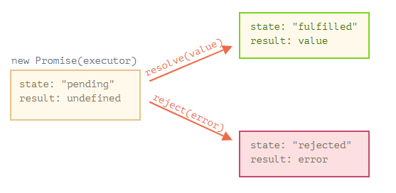
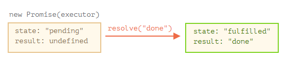
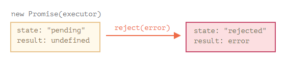
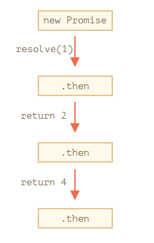
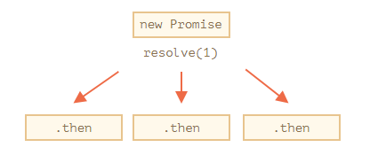
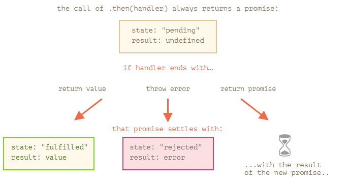
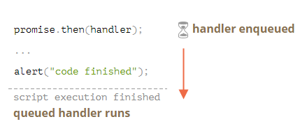

# Promise，async/await

## 11.1 简介:回调 

(理解回调callback,以及回调地狱)

JavaScript 主机（host）环境提供了许多函数，这些函数允许我们计划 **异步** 行为（action）。换句话说，我们现在开始执行的行为，但它们会在稍后完成。

例如，`setTimeout` 函数就是一个这样的函数。

1. 定义某函数,带有callback函数参数

```js
function loadScript(src, callback) {
  let script = document.createElement('script');
  script.src = src;

  script.onload = () => callback(script);

  document.head.append(script);
}
```

2. 调用该函数,调用callback,就是回调结果

```js
function loadScript(src, callback) {
  let script = document.createElement('script');
  script.src = src;
  script.onload = () => callback(script);
  document.head.append(script);
}
// 这里的箭头函数就是 callback
loadScript('https://cdnjs.cloudflare.com/ajax/libs/lodash.js/3.2.0/lodash.js', script => {
  alert(`Cool, the script ${script.src} is loaded`);
  alert( _ ); // 所加载的脚本中声明的函数
});
```

这被称为“基于回调”的异步编程风格。异步执行某项功能的函数应该提供一个 `callback` 参数用于在相应事件完成时调用。（译注：上面这个例子中的相应事件是指脚本加载）

### 在回调中回调

我们如何依次加载两个脚本：第一个，然后是第二个？

自然的解决方案是将第二个 `loadScript` 调用放入回调中

```javascript
loadScript('/my/script.js', function(script) {

  loadScript('/my/script2.js', function(script) {

    loadScript('/my/script3.js', function(script) {
      // ...加载完所有脚本后继续
    });

  })

});
```

因此，每一个新行为（action）都在回调内部。这对于几个行为来说还好，但对于许多行为来说就不好了，所以我们很快就会看到其他变体。

### 处理 Error

在上述示例中，我们并没有考虑出现 error 的情况。如果脚本加载失败怎么办？我们的回调应该能够对此作出反应。

这是 `loadScript` 的改进版本，可以跟踪加载错误：

```javascript
function loadScript(src, callback) {
  let script = document.createElement('script');
  script.src = src;

  script.onload = () => callback(null, script);
  script.onerror = () => callback(new Error(`Script load error for ${src}`));

  document.head.append(script);
}
```

加载成功时，它会调用 `callback(null, script)`，否则调用 `callback(error)`。(第一个为是error参数,成功的时候为null)

用法：

```javascript
loadScript('/my/script.js', function(error, script) {
  if (error) {
    // 处理 error
  } else {
    // 脚本加载成功
  }
});
```

再次强调，我们在 `loadScript` 中所使用的方案其实很普遍。它被称为“Error 优先回调（error-first callback）”风格。

约定是：

1. `callback` 的第一个参数是为 error 而保留的。一旦出现 error，`callback(err)` 就会被调用。
2. 第二个参数（和下一个参数，如果需要的话）用于成功的结果。此时 `callback(null, result1, result2…)` 就会被调用。

因此，单一的 `callback` 函数可以同时具有报告 error 和传递返回结果的作用。

### 厄运金字塔(回调地狱)

如果调用嵌套的增加，代码层次变得更深，维护难度也随之增加，尤其是我们使用的是可能包含了很多循环和条件语句的真实代码.

有时这些被称为“回调地狱”或“厄运金字塔”。

嵌套调用的“金字塔”随着每个异步行为会向右增长。很快它就失控了。

所以这种编码方式不是很好。

## 11.2 promise

这是我们在编程中经常遇到的事儿与真实生活的类比：

1. “生产者代码（producing code）”会做一些事儿，并且会需要一些时间。例如，通过网络加载数据的代码。它就像一位“歌手”。
2. “消费者代码（consuming code）”想要在“生产者代码”完成工作的第一时间就能获得其工作成果。许多函数可能都需要这个结果。这些就是“粉丝”。
3. **Promise** 是将“生产者代码”和“消费者代码”连接在一起的一个特殊的 JavaScript 对象。用我们的类比来说：这就是就像是“订阅列表”。“生产者代码”花费它所需的任意长度时间来产出所承诺的结果，而 “promise” 将在它（译注：指的是“生产者代码”，也就是下文所说的 executor）准备好时，将结果向所有订阅了的代码开放。

### 理解promise

**Promise 对象的构造器**（constructor）语法如下：

```javascript
let promise = new Promise(function(resolve, reject) {
  // executor（生产者代码，“歌手”）
});
```

传递给 `new Promise` 的函数被称为 **executor**。当 `new Promise` 被创建，executor 会自动运行。它包含最终应产出结果的生产者代码。按照上面的类比：executor 就是“歌手”。

它的参数 `resolve` 和 `reject` 是由 JavaScript 自身提供的回调。我们的代码仅在 executor 的内部。

当 executor 获得了结果，无论是早还是晚都没关系，它应该调用以下回调之一：

- `resolve(value)` — 如果任务成功完成并带有结果 `value`。
- `reject(error)` — 如果出现了 error，`error` 即为 error 对象。

所以总结一下就是：executor 会自动运行并尝试执行一项工作。尝试结束后，如果成功则调用 `resolve`，如果出现 error 则调用 `reject`。

由 `new Promise` 构造器返回的 `promise` 对象具有以下内部属性：

- `state` — 最初是 `"pending"`，然后在 `resolve` 被调用时变为 `"fulfilled"`，或者在 `reject` 被调用时变为 `"rejected"`。
- `result` — 最初是 `undefined`，然后在 `resolve(value)` 被调用时变为 `value`，或者在 `reject(error)`被调用时变为 `error`。

Q&A:

1. promise对象中state属性有哪些?

   pending,fulfilled rejected

2. promise对象中result属性有哪些?

   undefined,value/error

所以，executor 最终将 `promise` 移至以下状态之一：



- 调用resolve函数回调

  ```javascript
  let promise = new Promise(function(resolve, reject) {
    // 当 promise 被构造完成时，自动执行此函数
  
    // 1 秒后发出工作已经被完成的信号，并带有结果 "done"
    setTimeout(() => resolve("done"), 1000);
  });
  ```

  通过运行上面的代码，我们可以看到两件事儿：

  1. executor 被自动且立即调用（通过 `new Promise`）。

  2. executor 接受两个参数：`resolve` 和 `reject`。这些函数由 JavaScipt 引擎预先定义，因此我们不需要创建它们。我们只需要在准备好（译注：指的是 executor 准备好）时调用其中之一即可。

     经过 1 秒的“处理”后，executor 调用 `resolve("done")` 来产生结果。这将改变 `promise` 对象的状态：

  

- 调用reject函数回调

  ```javascript
  let promise = new Promise(function(resolve, reject) {
    // 1 秒后发出工作已经被完成的信号，并带有 error
    setTimeout(() => reject(new Error("Whoops!")), 1000);
  });
  ```

  对 `reject(...)` 的调用将 promise 对象的状态移至 `"rejected"`：

  	

  总而言之，executor 应该执行一项工作（通常是需要花费一些时间的事儿），然后调用 `resolve` 或 `reject` 来改变对应的 promise 对象的状态。

  与最初的 “pending” promise 相反，一个 resolved 或 rejected 的 promise 都会被称为 “settled”。

**这儿只能有一个结果或一个 error**

(executor生产者代码只能调用一个resolve或一个reject,再有其他的resolve/reject都会被忽略)

(resolve/reject 只接受一个参数)

executor 只能调用一个 `resolve` 或一个 `reject`。任何状态的更改都是最终的。

所有其他的再对 `resolve` 和 `reject` 的调用都会被忽略：

```javascript
let promise = new Promise(function(resolve, reject) {
  resolve("done");

  reject(new Error("…")); // 被忽略
  setTimeout(() => resolve("…")); // 被忽略
});
```

这儿的宗旨是，一个被 executor 完成的工作只能有一个结果或一个 error。

并且，`resolve/reject` 只需要一个参数（或不包含任何参数），并且将忽略额外的参数。

**以 `Error` 对象 reject**

如果什么东西出了问题， executor 应该调用 `reject`。这可以使用任何类型的参数来完成（就像 `resolve` 一样）。但是建议使用 `Error` 对象（或继承自 `Error` 的对象）。这样做的理由很快就会显而易见。

**`state` 和 `result` 都是内部的**

Promise 对象的 `state` 和 `result` 属性都是内部的。我们无法直接访问它们。但我们可以对它们使用 `.then`/`.catch`/`.finally` 方法。我们在下面对这些方法进行了描述。

### 消费者：then，catch，finally

Promise 对象充当的是 executor（“生产者代码”或“歌手”）和消费函数（“粉丝”）之间的连接，后者将接收结果或 error。可以通过使用 `.then`、`.catch` 和 `.finally` 方法为消费函数进行注册。

**then**

最重要最基础的一个就是 `.then`。

语法如下：

```javascript
promise.then(
  function(result) { /* handle a successful result */ },
  function(error) { /* handle an error */ }
);
```

(then接收的是两个函数参数,第一个函数是promise 成功后运行.这个函数的参数 就是resolve的结果)

(第二个函数是promise 失败后运行,这个函数的参数就是 reject的结果error.两个运行一个)

`.then` 的第一个参数是一个函数，该函数将在 promise resolved 后运行并接收结果。

`.then` 的第二个参数也是一个函数，该函数将在 promise rejected 后运行并接收 error。

例如，以下是对成功 resolved 的 promise 做出的反应：

```javascript
let promise = new Promise(function(resolve, reject) {
  setTimeout(() => resolve("done!"), 1000);
});

// resolve 运行 .then 中的第一个函数
promise.then(
  result => alert(result), // 1 秒后显示 "done!"
  error => alert(error) // 不运行
);
```

第一个函数被运行了。

在 reject 的情况下，运行第二个：

```javascript
let promise = new Promise(function(resolve, reject) {
  setTimeout(() => reject(new Error("Whoops!")), 1000);
});

// reject 运行 .then 中的第二个函数
promise.then(
  result => alert(result), // 不运行
  error => alert(error) // 1 秒后显示 "Error: Whoops!"
);
```

如果我们只对成功完成的情况感兴趣，那么我们可以只为 `.then` 提供一个函数参数：

```javascript
let promise = new Promise(resolve => {
  setTimeout(() => resolve("done!"), 1000);
});

promise.then(alert); // 1 秒后显示 "done!"
```

**catch**

就是then执行reject运行结果的函数

```javascript
let promise = new Promise((resolve, reject) => {
  setTimeout(() => reject(new Error("Whoops!")), 1000);
});

// .catch(f) 与 promise.then(null, f) 一样
promise.catch(alert); // 1 秒后显示 "Error: Whoops!"
```

`.catch(f)` 调用是 `.then(null, f)` 的完全的模拟，它只是一个简写形式。

**finally**

(用在state属性为settled状态时运行)

就像常规 `try {...} catch {...}` 中的 `finally` 子句一样，promise 中也有 `finally`。

`.finally(f)` 调用与 `.then(f, f)` 类似，在某种意义上，`f` 总是在 promise 被 settled 时运行：即 promise 被 resolve 或 reject。

`finally` 是执行清理（cleanup）的很好的处理程序（handler），例如无论结果如何，都停止使用不再需要的加载指示符（indicator）。

像这样：

```javascript
new Promise((resolve, reject) => {
  /* 做一些需要时间的事儿，然后调用 resolve/reject */
})
  // 在 promise 被 settled 时运行，无论成功与否
  .finally(() => stop loading indicator)
  .then(result => show result, err => show error)
```

(finally不处理结果,then/catch是在finally后)

(不管promise最后的状态，在执行完then或catch指定的回调函数以后，都会执行finally方法指定的回调函数。)

(在做移动app开发的时候，需要每次发送请求，都会有‘菊花’提示，请求发送完毕，就需要关闭loading提示框，不然界面就无法被点击。但是请求有的是成功、有的失败、有的超时，为了不影响整个系统的正常使用，就需要强制关闭提示框，正好利用promise的finally来关闭提示框)

不过，它并不是 `then(f,f)` 的别名。它们之间有几个重要的区别：

1. `finally` 处理程序（handler）没有参数。在 `finally` 中，我们不知道 promise 是否成功。没关系，因为我们的任务通常是执行“常规”的定稿程序（finalizing procedures）。

2. `finally` 处理程序将结果和 error 传递给下一个处理程序。

   例如，在这儿结果被从 `finally` 传递给了 `then`：

   ```javascript
   new Promise((resolve, reject) => {
     setTimeout(() => resolve("result"), 2000)
   })
     .finally(() => alert("Promise ready"))
     .then(result => alert(result)); // <-- .then 对结果进行处理
   ```

   在这儿，promise 中有一个 error，这个 error 被从 `finally` 传递给了 `catch`：

   ```javascript
   new Promise((resolve, reject) => {
     throw new Error("error");
   })
     .finally(() => alert("Promise ready"))
     .catch(err => alert(err));  // <-- .catch 对 error 对象进行处理
   ```

   这非常方便，因为 `finally` 并不是意味着要处理 promise 的结果。所以它将结果传递了下去。

   在下一章中，我们将详细讨论 promise 链以及处理程序（handler）之间的结果传递。

3. 最后，但并非最不重要的一点是，`.finally(f)` 是比 `.then(f, f)` 更为方便的语法：无需重复函数 `f`。

### promise和回调

我们立刻就能发现 promise 相较于基于回调的模式的一些好处：

| Promises                                                     | Callbacks                                                    |
| :----------------------------------------------------------- | :----------------------------------------------------------- |
| Promises 允许我们按照自然顺序进行编码。首先，我们运行 `loadScript` 和 `.then` 来处理结果。 | 在调用 `loadScript(script, callback)` 时，在我们处理的地方（disposal）必须有一个 `callback` 函数。换句话说，在调用 `loadScript` **之前**，我们必须知道如何处理结果。 |
| 我们可以根据需要，在 promise 上多次调用 `.then`。每次调用，我们都会在“订阅列表”中添加一个新的“分析”，一个新的订阅函数。在下一章将对此内容进行详细介绍：[Promise 链](https://zh.javascript.info/promise-chaining)。 | 只能有一个回调。                                             |

## 11.3 Promise 链

我们有一系列的异步任务要一个接一个地执行 — 例如，加载脚本。我们如何写出更好的代码呢？

###  promise 链

它看起来就像这样：

```javascript
new Promise(function(resolve, reject) {

  setTimeout(() => resolve(1), 1000); // (*)

}).then(function(result) { // (**)

  alert(result); // 1
  return result * 2;

}).then(function(result) { // (***)

  alert(result); // 2
  return result * 2;

}).then(function(result) {

  alert(result); // 4
  return result * 2;

});
```

它的理念是将 result 通过 `.then` 处理程序（handler）链进行传递。

运行流程如下：

1. 初始 promise 在 1 秒后进行 resolve `(*)`，
2. 然后 `.then` 处理程序（handler）被调用 `(**)`。
3. **它返回的值**被传入下一个 `.then` 处理程序（handler）`(***)`
4. ……依此类推。

随着 result 在处理程序（handler）链中传递，我们可以看到一系列的 `alert` 调用：`1` → `2` → `4`。



之所以这么运行，是因为对 `promise.then` 的调用会返回了一个 promise，所以我们可以在其之上调用下一个 `.then`。

当处理程序（handler）返回一个值时，它将成为该 promise 的 result，所以将使用它调用下一个 `.then`。

**新手常犯的一个经典错误：从技术上讲，我们也可以将多个 .then 添加到一个 promise 上。但这并不是 promise 链（chaining）。**

(上面的例子是promise链,一层接一层 then后面.但是下面的不是promise链,它只是对promise结果有多个处理程序事件)

例如：

```javascript
let promise = new Promise(function(resolve, reject) {
  setTimeout(() => resolve(1), 1000);
});

promise.then(function(result) {
  alert(result); // 1
  return result * 2;
});

promise.then(function(result) {
  alert(result); // 1
  return result * 2;
});

promise.then(function(result) {
  alert(result); // 1
  return result * 2;
});
```

我们在这里所做的只是一个 promise 的几个处理程序（handler）。他们**不会相互传递 result**；相反，它们之间彼此独立运行处理任务。

这里它的一张示意图（你可以将其与上面的链式调用做一下比较）：



在同一个 promise 上的所有 `.then` 获得的结果都相同 — 该 promise 的结果。所以，在上面的代码中，所有 `alert` 都显示相同的内容：`1`。

实际上我们极少遇到一个 promise 需要多处理程序（handler）的情况。使用链式调用的频率更高。

### 返回 promise

`.then(handler)` 中所使用的处理程序（handler）可以创建并**返回一个 promise**。

在这种情况下，其他的处理程序（handler）将等待它 settled 后再获得其结果（result）。

例如：

(上面promise链是返回一个值,这个then 是创建并返回一个promise,更像实际应用的用法)

```javascript
new Promise(function(resolve, reject) {

  setTimeout(() => resolve(1), 1000);

}).then(function(result) {

  alert(result); // 1

  return new Promise((resolve, reject) => { // (*)
    setTimeout(() => resolve(result * 2), 1000);
  });

}).then(function(result) { // (**)

  alert(result); // 2

  return new Promise((resolve, reject) => {
    setTimeout(() => resolve(result * 2), 1000);
  });

}).then(function(result) {

  alert(result); // 4

});
```

这里第一个 `.then` 显示 `1` 并在 `(*)` 行返回 `new Promise(…)`。1 秒后它会进行 resolve，然后 result（`resolve` 的参数，在这里它是 `result*2`）被传递给第二个 `.then` 的处理程序（handler）。这个处理程序（handler）位于 `(**)` 行，它显示 `2`，并执行相同的动作（action）。

所以输出与前面的示例相同：1 → 2 → 4，但是现在在每次 `alert` 调用之间会有 1 秒钟的延迟。

返回 promise 使我们能够构建异步行为链。

### 总结

如果 `.then`（或 `catch/finally` 都可以）处理程序（handler）返回一个 promise，那么链的其余部分将会等待，直到它状态变为 settled。当它被 settled 后，其 result（或 error）将被进一步传递下去。

这是一个完整的流程图：



## 11.4 使用 promise 进行错误处理

Promise 链在错误（error）处理中十分强大。当一个 promise 被 reject 时，控制权将移交至最近的 rejection 处理程序（handler）。这在实际开发中非常方便。

例如，下面代码中所 `fetch` 的 URL 是错的（没有这个网站），`.catch` 对这个 error 进行了处理：

```javascript
fetch('https://no-such-server.blabla') // rejects
  .then(response => response.json())
  .catch(err => alert(err)) // TypeError: failed to fetch（这里的文字可能有所不同）
```

正如你所看到的，`.catch` 不必是立即的。它可能在一个或多个 `.then` 之后出现。

### 隐式 try…catch

Promise 的执行者（executor）和 promise 的处理程序（handler）周围有一个“隐式的 `try..catch`”。如果发生异常，它（译注：指异常）就会被捕获，并被视为 rejection 进行处理。

例如，下面这段代码：

```javascript
new Promise((resolve, reject) => {
  throw new Error("Whoops!");
}).catch(alert); // Error: Whoops!
```

……与下面这段代码工作上完全相同：

```javascript
new Promise((resolve, reject) => {
  reject(new Error("Whoops!"));
}).catch(alert); // Error: Whoops!
```

在 executor 周围的“隐式 `try..catch`”自动捕获了 error，并将其变为 rejected promise。

这不仅仅发生在 executor 函数中，同样也发生在其 handler 中。如果我们在 `.then` 处理程序（handler）中 `throw`，这意味着 promise 被 rejected，因此控制权移交至最近的 error 处理程序（handler）。

### 未处理的 rejection

当一个 error 没有被处理会发生什么？例如，我们忘了在链的尾端附加 `.catch`，像这样：

```javascript
new Promise(function() {
  noSuchFunction(); // 这里出现 error（没有这个函数）
})
  .then(() => {
    // 一个或多个成功的 promise 处理程序（handler）
  }); // 尾端没有 .catch！
```

如果出现 error，promise 的状态将变为 “rejected”，然后执行应该跳转至最近的 rejection 处理程序（handler）。但是上面这个例子中并没有这样的处理程序（handler）。因此 error 会“卡住（stuck）”。没有代码来处理它。

在实际开发中，就像代码中常规的未处理的 error 一样，这意味着某些东西出了问题。

当发生一个常规的错误（error）并且未被 `try..catch` 捕获时会发生什么？脚本死了，并在控制台（console）中留下了一个信息。对于在 promise 中未被处理的 rejection，也会发生类似的事儿。

JavaScript 引擎会跟踪此类 rejection，在这种情况下会生成一个全局的 error。如果你运行上面这个代码，你可以在控制台（console）中看到。

### 总结

- `.catch` 处理 promise 中的各种 error：在 `reject()` 调用中的，或者在处理程序（handler）中抛出的（thrown）error。
- 我们应该将 `.catch` 准确地放到我们想要处理 error，并知道如何处理这些 error 的地方。处理程序应该分析 error（可以自定义 error 类来帮助分析）并再次抛出未知的 error（可能它们是编程错误）。
- 如果没有办法从 error 中恢复的话，不使用 `.catch` 也可以。
- 在任何情况下我们都应该有 `unhandledrejection` 事件处理程序（用于浏览器，以及其他环境的模拟），以跟踪未处理的 error 并告知用户（可能还有我们的服务器）有关信息，以使我们的应用程序永远不会“死掉”。

## 11.5 Promise API

在 `Promise` 类中，有 5 种静态方法。我们在这里简单介绍下它们的使用场景。

### Promise.all

假设我们希望并行执行多个 promise，并等待所有 promise 都准备就绪。

例如，并行下载几个 URL，并等到所有内容都下载完毕后再对它们进行处理。

这就是 `Promise.all` 的用途。

语法：

```javascript
let promise = Promise.all([...promises...]);
```

`Promise.all` 接受一个 promise 数组作为参数（从技术上讲，它可以是任何可迭代的，但通常是一个数组）并返回一个新的 promise。

当所有给定的 promise 都被 settled 时，新的 promise 才会 resolve，并且其结果数组将成为新的 promise 的结果。

(只有promise数组中所有的promise是settled状态后,新的promise才会执行,返回的resolve结果就是 每一个promise的resolve结果)

例如，下面的 `Promise.all` 在 3 秒之后被 settled，然后它的结果就是一个 `[1, 2, 3]` 数组：

```javascript
Promise.all([
  new Promise(resolve => setTimeout(() => resolve(1), 3000)), // 1
  new Promise(resolve => setTimeout(() => resolve(2), 2000)), // 2
  new Promise(resolve => setTimeout(() => resolve(3), 1000))  // 3
]).then(alert); // 1,2,3 当上面这些 promise 准备好时：每个 promise 都贡献了数组中的一个元素
```

请注意，结果数组中元素的顺序与其在源 promise 中的顺序相同。即使第一个 promise 花费了最长的时间才 resolve，但它仍是结果数组中的第一个。

一个常见的技巧是，将一个**任务数据数组**映射（map）到一个 **promise 数组**，然后将其包装到 `Promise.all`。

例如，如果我们有一个存储 URL 的数组，我们可以像这样 fetch 它们：

```javascript
let urls = [
  'https://api.github.com/users/iliakan',
  'https://api.github.com/users/remy',
  'https://api.github.com/users/jeresig'
];

// 将每个 url 映射（map）到 fetch 的 promise 中
let requests = urls.map(url => fetch(url));

// Promise.all 等待所有任务都 resolved
Promise.all(requests)
  .then(responses => responses.forEach(
    response => alert(`${response.url}: ${response.status}`)
  ));
```

**如果任意一个 promise 被 reject，由 Promise.all 返回的 promise 就会立即 reject，并且带有的就是这个 error。**

(有点&&与的味道,只要有reject 就立刻返回reject)

例如：

```javascript
Promise.all([
  new Promise((resolve, reject) => setTimeout(() => resolve(1), 1000)),
  new Promise((resolve, reject) => setTimeout(() => reject(new Error("Whoops!")), 2000)),
  new Promise((resolve, reject) => setTimeout(() => resolve(3), 3000))
]).catch(alert); // Error: Whoops!
```

这里的第二个 promise 在两秒后 reject。这立即导致了 `Promise.all` 的 reject，因此 `.catch` 执行了：被 reject 的 error 成为了整个 `Promise.all` 的结果。

**如果出现 error，其他 promise 将被忽略**

如果其中一个 promise 被 reject，`Promise.all` 就会立即被 reject，完全忽略列表中其他的 promise。它们的结果也被忽略。

**`Promise.all(iterable)` 允许在 `iterable` 中使用 non-promise 的“常规”值**

(promise.all的数组参数 可以不是promise对象)

通常，`Promise.all(...)` 接受可迭代对象（iterable）的 promise（大多数情况下是数组）。但是，如果这些对象中的**任意一个都不是 promise**，那么它将被“按原样”传递给结果数组。

例如，这里的结果是 `[1, 2, 3]`：

```javascript
Promise.all([
  new Promise((resolve, reject) => {
    setTimeout(() => resolve(1), 1000)
  }),
  2,
  3
]).then(alert); // 1, 2, 3
```

所以我们可以在方便的地方将准备好的值传递给 `Promise.all`。

### Promise.allSettled

(如果任意一个promise reject的话,promise.all 整个就会reject,而promise.allSettled就会把所有结果存下来,包括resolve和reject)

如果任意的 promise reject，则 `Promise.all` 整个将会 reject。当我们需要 **所有** 结果都成功时，它对这种“全有或全无”的情况很有用：

```javascript
Promise.all([
  fetch('/template.html'),
  fetch('/style.css'),
  fetch('/data.json')
]).then(render); // render 方法需要所有 fetch 的数据
```

`Promise.allSettled` 等待所有的 promise 都被 settle，无论结果如何。结果数组具有：

- `{status:"fulfilled", value:result}` 对于成功的响应，
- `{status:"rejected", reason:error}` 对于 error。

```javascript
[
  {status: 'fulfilled', value: ...response...},
  {status: 'fulfilled', value: ...response...},
  {status: 'rejected', reason: ...error object...}
]
```

所以，对于每个 promise，我们都得到了其状态（status）和 `value/reason`。

### Promise.race

(promise.race是 获得 promises数组中第一个得到结果的 promise)

与 `Promise.all` 类似，但只等待第一个 settled 的 promise 并获取其结果（或 error）。

语法：

```javascript
let promise = Promise.race(iterable);
```

例如，这里的结果将是 `1`：

```javascript
Promise.race([
  new Promise((resolve, reject) => setTimeout(() => resolve(1), 1000)),
  new Promise((resolve, reject) => setTimeout(() => reject(new Error("Whoops!")), 2000)),
  new Promise((resolve, reject) => setTimeout(() => resolve(3), 3000))
]).then(alert); // 1
```

这里第一个 promise 最快，所以它变成了结果。第一个 settled 的 promise “赢得了比赛”之后，所有进一步的 result/error 都会被忽略。

### Promise.resolve/reject

这个在现代代码中用async/await 代替了

### 总结

`Promise` 类有 5 种静态方法：

1. `Promise.all(promises)` —— 等待所有 promise 都 resolve 时，返回存放它们结果的数组。如果给定的任意一个 promise 为 reject，那么它就会变成 `Promise.all` 的 error，所有其他 promise 的结果都会被忽略。
2. `Promise.allSettled(promises)`（ES2020 新增方法）—— 等待所有 promise 都 settle 时，并以包含以下内容的对象数组的形式返回它们的结果：
   - `status`: `"fulfilled"` 或 `"rejected"`
   - `value`（如果 fulfilled）或 `reason`（如果 rejected）。
3. `Promise.race(promises)` —— 等待第一个 settle 的 promise，并将其 result/error 作为结果。
4. `Promise.resolve(value)` —— 使用给定 value 创建一个 resolved 的 promise。
5. `Promise.reject(error)` —— 使用给定 error 创建一个 rejected 的 promise。

这五个方法中，`Promise.all` 可能是在实战中使用最多的。

## 11.6 Promisification

“Promisification” 是用于一个简单转换的一个长单词。它指将一个接受回调的函数转换为一个返回 promise 的函数。

由于许多函数和库都是基于回调的，因此，在实际开发中经常会需要进行这种转换。因为使用 promise 更加方便，所以将基于回调的函数和库 promisify 是有意义的。（译注：promisify 即指 promise 化）


Promisification 是一种很好的方法，特别是在你使用 `async/await` 的时候（请看下一章），但不是回调的完全替代。

请记住，一个 promise 可能只有一个结果，但从技术上讲，一个回调可能被调用很多次。

因此，promisification 仅适用于调用一次回调的函数。进一步的调用将被忽略。

## 11.7 微任务（Microtask）

Promise 的处理程序（handlers）`.then`、`.catch` 和 `.finally` 都是**异步**的。

即便一个 promise 立即被 resolve，`.then`、`.catch` 和 `.finally` **下面** 的代码也会在这些处理程序（handler）之前被执行。

示例代码如下：

```javascript
let promise = Promise.resolve();

promise.then(() => alert("promise done!"));

alert("code finished"); // 这个 alert 先显示
```

如果你运行它，你会首先看到 `code finished`，然后才是 `promise done`。

这很奇怪，因为这个 promise 肯定是一开始就完成的。

为什么 `.then` 会在之后才被触发？这是怎么回事？

### 微任务队列（Microtask queue）

异步任务需要适当的管理。为此，ECMA 标准规定了一个内部队列 `PromiseJobs`，通常被称为“微任务队列（microtask queue）”（ES8 术语）

如 规范 中所述：

- 队列（queue）是先进先出的：首先进入队列的任务会首先运行。
- 只有在 JavaScript 引擎中没有其它任务在运行时，才开始执行任务队列中的任务。

或者，简单地说，当一个 promise 准备就绪时，它的 `.then/catch/finally` 处理程序（handler）就会被放入队列中：但是它们不会立即被执行。当 JavaScript 引擎执行完当前的代码，它会从队列中获取任务并执行它。

这就是为什么在上面那个示例中 “code finished” 会先显示。



Promise 的处理程序（handler）总是会经过这个内部队列。

如果有一个包含多个 `.then/catch/finally` 的链，那么它们中的每一个都是异步执行的。也就是说，它会首先进入队列，然后在当前代码执行完成并且先前排队的处理程序（handler）都完成时才会被执行。

(js引擎中代码执行后,队列前面的执行完后,才会执行这个链)

**如果执行顺序对我们很重要该怎么办？我们怎么才能让 code finished 在 promise done 之后运行呢？**

很简单，只需要像下面这样使用 `.then` 将其放入队列：

```javascript
Promise.resolve()
  .then(() => alert("promise done!"))
  .then(() => alert("code finished"));
```

现在代码就是按照预期执行的。

### 总结

Promise 处理始终是异步的，因为所有 promise 行为都会通过内部的 “promise jobs” 队列，也被称为“微任务队列”（ES8 术语）。

因此，`.then/catch/finally` 处理程序（handler）总是在当前代码完成后才会被调用。

如果我们需要确保一段代码在 `.then/catch/finally` 之后被执行，我们可以将它添加到链式调用的 `.then`中。

在大多数 JavaScript 引擎中（包括浏览器和 Node.js），微任务（microtask）的概念与“事件循环（event loop）”和“宏任务（macrotasks）”紧密相关。由于这些概念跟 promise 没有直接关系，所以我们将在本教程另外一部分的 [事件循环：微任务和宏任务](https://zh.javascript.info/event-loop) 一章中对它们进行介绍。

## 11.8 Async/await

Async/await 是以更舒适的方式使用 promise 的一种特殊语法，同时它也非常易于理解和使用。

### Async function

(以async 开头的函数,返回的是一个promise)

让我们以 `async` 这个关键字开始。它可以被放置在一个函数前面，如下所示：

```javascript
async function f() {
  return 1;
}
```

在函数前面的 “async” 这个单词表达了一个简单的事情：即这个函数总是**返回一个 promise**。其他值将自动被包装在一个 resolved 的 promise 中。

例如，下面这个函数返回一个结果为 `1` 的 resolved promise，让我们测试一下：

```javascript
async function f() {
  return 1;
}

f().then(alert); // 1
```

……我们也可以显式地返回一个 promise，结果是一样的：

```javascript
async function f() {
  return Promise.resolve(1);
}

f().then(alert); // 1
```

所以说，`async` 确保了函数返回一个 promise，也会将非 promise 的值包装进去。很简单，对吧？但不仅仅这些。还有另外一个叫 `await` 的关键词，它只在 `async` 函数内工作，也非常酷。

### Await

语法如下：

```javascript
// 只在 async 函数内工作
let value = await promise;
```

关键字 `await` 让 JavaScript 引擎等待直到 promise 完成（settle）并**返回结果**。

这里的例子就是一个 1 秒后 resolve 的 promise：

```javascript
async function f() {

  let promise = new Promise((resolve, reject) => {
    setTimeout(() => resolve("done!"), 1000)
  });

  let result = await promise; // 等待，直到 promise resolve (*)

  alert(result); // "done!"
}

f();
```

这个函数在执行的时候，“暂停”在了 `(*)` 那一行，并在 promise settle 时，拿到 `result` 作为结果继续往下执行。所以上面这段代码在一秒后显示 “done!”。

让我们强调一下：`await` 字面的意思就是让 JavaScript 引擎等待直到 promise settle，然后以 **promise 的结果**继续执行。这个行为不会耗费任何 CPU 资源，因为引擎可以同时处理其他任务：执行其他脚本，处理事件等。

相比于 `promise.then`，它只是获取 promise 的结果的一个更优雅的语法，同时也更易于读写。

**不能在普通函数中使用 `await`**

如果我们尝试在非 async 函数中使用 `await` 的话，就会报语法错误：

```javascript
function f() {
  let promise = Promise.resolve(1);
  let result = await promise; // Syntax error
}
```

如果函数前面没有 `async` 关键字，我们就会得到一个语法错误。就像前面说的，`await` 只在 `async 函数` 中有效。

### Error 处理

如果一个 promise 正常 resolve，`await promise` 返回的就是其结果。但是如果 promise 被 **reject**，**它将 throw 这个 error**，就像在这一行有一个 `throw` 语句那样。

这个代码：

```javascript
async function f() {
  await Promise.reject(new Error("Whoops!"));
}
```

……和下面是一样的：

```javascript
async function f() {
  throw new Error("Whoops!");
}
```

在真实开发中，promise 可能需要一点时间后才 reject。在这种情况下，在 `await` 抛出（throw）一个 error 之前会有一个**延时**。

我们可以用 `try..catch` 来捕获上面提到的那个 error，与常规的 `throw` 使用的是一样的方式：

```javascript
async function f() {

  try {
    let response = await fetch('http://no-such-url');
  } catch(err) {
    alert(err); // TypeError: failed to fetch
  }
}

f();
```

如果我们没有 `try..catch`，那么由异步函数 `f()` 的调用生成的 promise 将变为 rejected。我们可以在函数调用后面添加 `.catch` 来处理这个 error：

```javascript
async function f() {
  let response = await fetch('http://no-such-url');
}

// f() 变成了一个 rejected 的 promise
f().catch(alert); // TypeError: failed to fetch // (*)
```

**`async/await` 和 `promise.then/catch`**

当我们使用 `async/await` 时，几乎就不会用到 `.then` 了，因为 `await` 为我们处理了等待。并且我们使用常规的 `try..catch` 而不是 `.catch`。这通常（但不总是）更加方便。

但是当我们在代码的顶层时，也就是在所有 `async` 函数之外，我们在语法上就不能使用 `await` 了，所以这时候通常的做法是添加 `.then/catch` 来处理最终的结果（result）或掉出来的（falling-through）error，例如像上面那个例子中的 `(*)` 行那样。

**`async/await` 可以和 `Promise.all` 一起使用**

当我们需要同时等待多个 promise 时，我们可以用 `Promise.all` 把它们包装起来，然后使用 `await`：

```javascript
// 等待结果数组
let results = await Promise.all([
  fetch(url1),
  fetch(url2),
  ...
]);
```

如果出现 error，也会正常传递，从失败了的 promise 传到 `Promise.all`，然后变成我们能通过使用 `try..catch` 在调用周围捕获到的异常（exception）。

### 总结

函数前面的关键字 `async` 有两个作用：

1. 让这个函数总是返回一个 promise。
2. 允许在该函数内使用 `await`。

Promise 前的关键字 `await` 使 JavaScript 引擎等待该 promise settle，然后：

1. 如果有 error，就会抛出异常 — 就像那里调用了 `throw error` 一样。
2. 否则，就返回结果。

这两个关键字一起提供了一个很好的用来编写异步代码的框架，这种代码易于阅读也易于编写。

有了 `async/await` 之后，我们就几乎不需要使用 `promise.then/catch`，但是不要忘了它们是基于 promise 的，因为有些时候（例如在最外层作用域）我们不得不使用这些方法。并且，当我们需要同时等待需要任务时，`Promise.all` 是很好用的。

