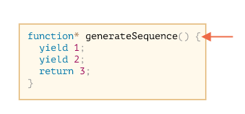
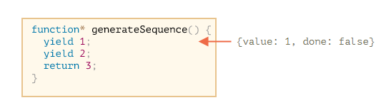
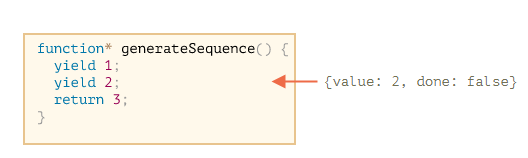
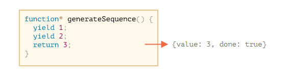

# Generator，高级 iteration

## 12.1 Generator

generator（生成器）是ES6标准引入的新的数据类型。一个generator看上去像一个函数，但可以返回多次。

常规函数只会返回一个单一值（或者不返回任何值）。

而 Generator 可以按需一个接一个地返回（“yield”）多个值。它们可与 [iterable](https://zh.javascript.info/iterable) 完美配合使用，从而可以轻松地创建数据流。

### Generator 函数

要创建一个 generator，我们需要一个特殊的语法结构：`function*`，即所谓的 “generator function”。

它看起来像这样：

```javascript
function* generateSequence() {
  yield 1;
  yield 2;
  return 3;
}
```

Generator 函数与常规函数的行为不同。在此类函数被调用时，它不会运行其代码。而是返回一个被称为 “generator object” 的特殊对象，来管理执行流程。

我们来看一个例子：

```javascript
function* generateSequence() {
  yield 1;
  yield 2;
  return 3;
}

// "generator function" 创建了一个 "generator object"
let generator = generateSequence();
alert(generator); // [object Generator]
```

到目前为止，上面这段代码中的 **函数体** 代码还没有开始执行：



一个 generator 的主要方法就是 `next()`。当被调用时（译注：指 `next()` 方法），它会恢复上图所示的运行，执行直到最近的 `yield <value>` 语句（`value` 可以被省略，默认为 `undefined`）。然后函数执行暂停，并将产出的（yielded）值返回到外部代码。

(next()方法有点像小鞭,打一下,运行代码到yield,然后产出一个结果,然后就不动了,函数执行暂停了)

`next()` 的结果始终是一个具有两个属性的**对象**：

- `value`: 产出的（yielded）的值。
- `done`: 如果 generator 函数已执行完成则为 `true`，否则为 `false`。

例如，我们可以创建一个 generator 并获取其第一个产出的（yielded）值：

```javascript
function* generateSequence() {
  yield 1;
  yield 2;
  return 3;
}

let generator = generateSequence();

let one = generator.next();

alert(JSON.stringify(one)); // {value: 1, done: false}
```

截至目前，我们只获得了第一个值，现在函数执行处在第二行：



让我们再次调用 `generator.next()`。代码恢复执行并返回下一个 `yield` 的值：

```JavaScript
let two = generator.next();

alert(JSON.stringify(two)); // {value: 2, done: false}
```



如果我们第三次调用 `generator.next()`，代码将会执行到 `return` 语句，此时就完成这个函数的执行：

```javascript
let three = generator.next();

alert(JSON.stringify(three)); // {value: 3, done: true}
```



现在 generator 执行完成。我们通过 `done:true` 可以看出来这一点，并且将 `value:3` 处理为最终结果。

再对 `generator.next()` 进行新的调用不再有任何意义。如果我们这样做，它将返回相同的对象：`{done: true}`。

**`function* f(…)` 或 `function *f(…)`？**

这两种语法都是对的。

但是通常更倾向于第一种语法，因为星号 `*` 表示它是一个 generator 函数，它描述的是函数种类而不是名称，因此 `*` 应该和 `function` 关键字紧贴一起。

### Generator 是可迭代的

当你看到 `next()` 方法，或许你已经猜到了 generator 是 [可迭代（iterable）](https://zh.javascript.info/iterable)的。（译注：`next()` 是 iterator 的必要方法）

我们可以使用 `for..of` 循环遍历它所有的值：

```javascript
function* generateSequence() {
  yield 1;
  yield 2;
  return 3;
}

let generator = generateSequence();

for(let value of generator) {
  alert(value); // 1，然后是 2
}
```

`for..of` 写法是不是看起来比 `.next().value` 优雅多了？

……但是请注意：上面这个例子会先显示 `1`，然后是 `2`，然后就没了。它不会显示 `3`！

这是因为当 `done: true` 时，`for..of` 循环会忽略最后一个 `value`。因此，如果我们想要通过 `for..of` 循环显示所有的结果，我们必须使用 `yield` 返回它们：

```javascript
function* generateSequence() {
  yield 1;
  yield 2;
  yield 3;
}

let generator = generateSequence();

for(let value of generator) {
  alert(value); // 1，然后是 2，然后是 3
}
```

因为 **generator 是可迭代**的，我们可以使用 iterator 的所有相关功能，例如：spread 语法 `...`：

```javascript
function* generateSequence() {
  yield 1;
  yield 2;
  yield 3;
}

let sequence = [0, ...generateSequence()]; // 函数调用,有小括号()

alert(sequence); // 0, 1, 2, 3
```

### 总结

- Generator 是通过 generator 函数 `function* f(…) {…}` 创建的。
- 在 generator（仅在）内部，存在 `yield` 操作。
- 外部代码和 generator 可能会通过 `next/yield` 调用交换结果。

在现代 JavaScript 中，generator 很少被使用。但有时它们会派上用场，因为函数在执行过程中与调用代码交换数据的能力是非常独特的。而且，当然，它们非常适合创建可迭代对象。