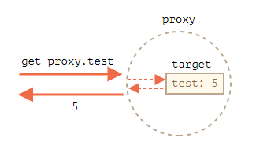

# 杂项

## 14.1 Proxy 和 Reflect

一个 `Proxy` 对象包装另一个对象并拦截诸如读取/写入属性和其他操作，可以选择自行处理它们，或者透明地允许该对象处理它们。

(proxy和装饰者在代码上90%的相似,但是他们的目的不同)

代理模式: 增加访问的条件,强调的是访问限制

装饰器模式:为了解决继承过于庞大的问题,只是在函数上增加功能,修改函数的入口处.强调的是代码的拓展

### Proxy

语法：

```javascript
let proxy = new Proxy(target, handler)
```

- `target` — 是要包装的对象，可以是任何东西，包括函数。
- `handler` — 代理配置：带有“陷阱”（“traps”，即拦截操作的方法）的对象。比如 `get` 陷阱用于读取 `target`的属性，`set` 陷阱用于写入 `target` 的属性，等等。

对 `proxy` 进行操作，如果在 `handler` 中存在相应的陷阱，则它将运行，并且 Proxy 有机会对其进行处理，否则将直接对 target 进行处理。

首先，让我们创建一个没有任何陷阱的代理（proxy）：

```javascript
let target = {};
let proxy = new Proxy(target, {}); // 空的 handler 对象

proxy.test = 5; // 写入 proxy 对象 (1)
alert(target.test); // 5，test 属性出现在了 target 中！

alert(proxy.test); // 5，我们也可以从 proxy 对象读取它 (2)

for(let key in proxy) alert(key); // test，迭代也正常工作 (3)
```

由于没有陷阱，所有对 `proxy` 的操作都直接转发给了 `target`。

1. 写入操作 `proxy.test=` 会将值写入 `target`。
2. 读取操作 `proxy.test` 会从 `target` 返回对应的值。
3. 迭代 `proxy` 会从 `target` 返回对应的值。

我们可以看到，没有任何陷阱，`proxy` 是一个 `target` 的透明包装器（wrapper）.



`Proxy` 是一种特殊的“奇异对象（exotic object）”。它没有自己的属性。如果 `handler` 为空，则透明地将操作转发给 `target`。