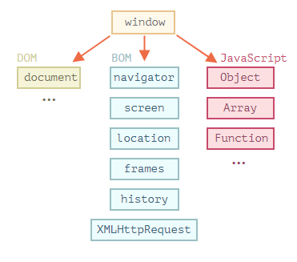

# 浏览器：文档，事件，接口

学习如何管理浏览器页面：添加元素，操作元素的大小和位置，动态创建接口并与访问者互动

## 1. Document

### 1.1 浏览器环境，规格

JavaScript 语言最初是为 Web 浏览器创建的。此后，它已经发展成为一种具有多种用途和平台的语言。

平台可以是一个浏览器，一个 Web 服务器，或其他 **主机（host）**，甚至可以是一个“智能”咖啡机，如果它能运行 JavaScript 的话。它们每个都提供了特定于平台的功能。JavaScript 规范将其称为 **主机环境**。

主机环境提供了自己的对象和语言核心以外的函数。Web 浏览器提供了一种控制网页的方法。Node.JS 提供了服务器端功能，等等。

下面是 JavaScript 在浏览器中运行时的鸟瞰示意图：


有一个叫做 `window` 的“根”对象。它有两个角色：

1. 首先，它是 JavaScript 代码的全局对象，如 全局对象一章所述。
2. 其次，它代表“浏览器窗口”，并提供了控制它的方法。

#### 文档对象模型（DOM）

（DOM是对象，对象名是document）

文档对象模型（Document Object Model），简称 DOM，将所有页面内容表示为可以修改的对象。

`document` 对象是页面的主要“入口点”。我们可以使用它来更改或创建页面上的任何内容。

例如：

```javascript
// 将背景颜色修改为红色
document.body.style.background = "red";

// 在 1 秒后将其修改回来
setTimeout(() => document.body.style.background = "", 1000);
```

在这里，我们使用了 `document.body.style`，但还有很多很多其他的东西。规范中有属性和方法的详细描述：[DOM Living Standard](https://dom.spec.whatwg.org/)。

**DOM 不仅仅用于浏览器**

DOM 规范解释了文档的结构，并提供了操作文档的对象。有的非浏览器设备也使用 DOM。

例如，下载 HTML 文件并对其进行处理的服务器端脚本也可以使用 DOM。但他们可能仅支持部分规范中的内容。

#### 浏览器对象模型（BOM）

（BOM是多个对象，这些对象的作用是处理文档之外的所有内容）

浏览器对象模型（Browser Object Model），简称 BOM，表示由浏览器（主机环境）提供的用于处理文档（document）之外的所有内容的其他对象。

例如：

- [navigator](https://developer.mozilla.org/zh/docs/Web/API/Window/navigator) 对象提供了有关浏览器和操作系统的背景信息。navigator 有许多属性，但是最广为人知的两个属性是：`navigator.userAgent` — 关于当前浏览器，`navigator.platform` — 关于平台（可以帮助区分 Windows/Linux/Mac 等）。
- [location](https://developer.mozilla.org/zh/docs/Web/API/Window/navigator) 对象允许我们读取当前 URL，并且可以将浏览器重定向到新的 URL。

这是我们可以如何使用 `location` 对象的方法：

```javascript
alert(location.href); // 显示当前 URL
if (confirm("Go to Wikipedia?")) {
  location.href = "https://wikipedia.org"; // 将浏览器重定向到另一个 URL
}
```

函数 `alert/confirm/prompt` 也是 BOM 的一部分：它们与文档（document）没有直接关系，但它代表了与用户通信的纯浏览器方法。

#### 总结

说到标准，我们有：

- DOM 规范

  描述文档的结构、操作和事件，详见 [https://dom.spec.whatwg.org](https://dom.spec.whatwg.org/)。

- CSSOM 规范

  描述样式表和样式规则，对它们进行的操作，以及它们与文档的绑定，详见 https://www.w3.org/TR/cssom-1/。

- HTML 规范

  描述 HTML 语言（例如标签）以及 BOM（浏览器对象模型）— 各种浏览器函数：`setTimeout`，`alert`，`location` 等，详见 [https://html.spec.whatwg.org](https://html.spec.whatwg.org/)。它采用了 DOM 规范，并使用了许多其他属性和方法对其进行了扩展。

### 1.2 DOM树

HTML 文档的主干是**标签**（tag）。

根据文档对象模型（DOM），每个 HTML 标签都是一个对象。嵌套的标签是闭合标签的“子标签（children）”。标签内的文本也是一个对象。

所有这些对象都可以通过 JavaScript 来访问，我们可以使用它们来修改页面。

例如，`document.body` 是表示 `body` 标签的对象。

#### DOM 的例子

让我们从下面这个简单的文档（document）开始：

```html
<!DOCTYPE HTML>
<html>
<head>
  <title>About elk</title>
</head>
<body>
  The truth about elk.
</body>
</html>
```

DOM 将 HTML 表示为标签的树形结构。它看起来如下所示：

<svg width="690" height="320"><g transform="translate(20,30)"><path class="link" d="M7,0L7,30L40.333333333333336,30" style="fill: none; stroke: rgb(190, 195, 199); stroke-width: 1px;"></path><path class="link" d="M7,0L7,180L40.333333333333336,180" style="fill: none; stroke: rgb(190, 195, 199); stroke-width: 1px;"></path><path class="link" d="M7,0L7,210L40.333333333333336,210" style="fill: none; stroke: rgb(190, 195, 199); stroke-width: 1px;"></path><path class="link" d="M40.333333333333336,30L40.333333333333336,60L73.66666666666667,60" style="fill: none; stroke: rgb(190, 195, 199); stroke-width: 1px;"></path><path class="link" d="M40.333333333333336,30L40.333333333333336,90L73.66666666666667,90" style="fill: none; stroke: rgb(190, 195, 199); stroke-width: 1px;"></path><path class="link" d="M40.333333333333336,30L40.333333333333336,150L73.66666666666667,150" style="fill: none; stroke: rgb(190, 195, 199); stroke-width: 1px;"></path><path class="link" d="M73.66666666666667,90L73.66666666666667,120L107,120" style="fill: none; stroke: rgb(190, 195, 199); stroke-width: 1px;"></path><path class="link" d="M40.333333333333336,210L40.333333333333336,240L73.66666666666667,240" style="fill: none; stroke: rgb(190, 195, 199); stroke-width: 1px;"></path><g class="node" transform="translate(0,0)" style="opacity: 1;"><rect y="-12.5" x="-5" rx="4" ry="4" height="25" width="250" style="fill: rgb(206, 224, 244); cursor: pointer;"></rect><text dy="4.5" dx="3.5" style="fill: black; pointer-events: none;">▾ </text><text dy="4.5" dx="16.5" style="font: 14px Consolas, &quot;Lucida Console&quot;, Menlo, Monaco, monospace; fill: rgb(51, 51, 51); pointer-events: none;">HTML</text></g><g class="node" transform="translate(33.33333206176758,30)" style="opacity: 1;"><rect y="-12.5" x="-5" rx="4" ry="4" height="25" width="250" style="fill: rgb(206, 224, 244); cursor: pointer;"></rect><text dy="4.5" dx="3.5" style="fill: black; pointer-events: none;">▾ </text><text dy="4.5" dx="16.5" style="font: 14px Consolas, &quot;Lucida Console&quot;, Menlo, Monaco, monospace; fill: rgb(51, 51, 51); pointer-events: none;">HEAD</text></g><g class="node" transform="translate(66.66666412353516,60)" style="opacity: 1;"><rect y="-12.5" x="-5" rx="4" ry="4" height="25" width="250" style="fill: rgb(255, 222, 153); cursor: pointer;"></rect><text dy="4.5" dx="3.5" style="fill: black; pointer-events: none;"></text><text dy="4.5" dx="5.5" style="font: 14px Consolas, &quot;Lucida Console&quot;, Menlo, Monaco, monospace; fill: rgb(51, 51, 51); pointer-events: none;">#text ↵␣␣␣␣</text></g><g class="node" transform="translate(66.66666412353516,90)" style="opacity: 1;"><rect y="-12.5" x="-5" rx="4" ry="4" height="25" width="250" style="fill: rgb(206, 224, 244); cursor: pointer;"></rect><text dy="4.5" dx="3.5" style="fill: black; pointer-events: none;">▾ </text><text dy="4.5" dx="16.5" style="font: 14px Consolas, &quot;Lucida Console&quot;, Menlo, Monaco, monospace; fill: rgb(51, 51, 51); pointer-events: none;">TITLE</text></g><g class="node" transform="translate(100,120)" style="opacity: 1;"><rect y="-12.5" x="-5" rx="4" ry="4" height="25" width="250" style="fill: rgb(255, 222, 153); cursor: pointer;"></rect><text dy="4.5" dx="3.5" style="fill: black; pointer-events: none;"></text><text dy="4.5" dx="5.5" style="font: 14px Consolas, &quot;Lucida Console&quot;, Menlo, Monaco, monospace; fill: rgb(51, 51, 51); pointer-events: none;">#text About elk</text></g><g class="node" transform="translate(66.66666412353516,150)" style="opacity: 1;"><rect y="-12.5" x="-5" rx="4" ry="4" height="25" width="250" style="fill: rgb(255, 222, 153); cursor: pointer;"></rect><text dy="4.5" dx="3.5" style="fill: black; pointer-events: none;"></text><text dy="4.5" dx="5.5" style="font: 14px Consolas, &quot;Lucida Console&quot;, Menlo, Monaco, monospace; fill: rgb(51, 51, 51); pointer-events: none;">#text ↵␣␣</text></g><g class="node" transform="translate(33.33333206176758,180)" style="opacity: 1;"><rect y="-12.5" x="-5" rx="4" ry="4" height="25" width="250" style="fill: rgb(255, 222, 153); cursor: pointer;"></rect><text dy="4.5" dx="3.5" style="fill: black; pointer-events: none;"></text><text dy="4.5" dx="5.5" style="font: 14px Consolas, &quot;Lucida Console&quot;, Menlo, Monaco, monospace; fill: rgb(51, 51, 51); pointer-events: none;">#text ↵␣␣</text></g><g class="node" transform="translate(33.33333206176758,210)" style="opacity: 1;"><rect y="-12.5" x="-5" rx="4" ry="4" height="25" width="250" style="fill: rgb(206, 224, 244); cursor: pointer;"></rect><text dy="4.5" dx="3.5" style="fill: black; pointer-events: none;">▾ </text><text dy="4.5" dx="16.5" style="font: 14px Consolas, &quot;Lucida Console&quot;, Menlo, Monaco, monospace; fill: rgb(51, 51, 51); pointer-events: none;">BODY</text></g><g class="node" transform="translate(66.66666412353516,240)" style="opacity: 1;"><rect y="-12.5" x="-5" rx="4" ry="4" height="25" width="250" style="fill: rgb(255, 222, 153); cursor: pointer;"></rect><text dy="4.5" dx="3.5" style="fill: black; pointer-events: none;"></text><text dy="4.5" dx="5.5" style="font: 14px Consolas, &quot;Lucida Console&quot;, Menlo, Monaco, monospace; fill: rgb(51, 51, 51); pointer-events: none;">#text 
  The truth about elk.</text></g></g></svg>

(文本节点是DOM树的叶子)

每个树的节点都是一个对象。

标签被称为 **元素节点**（或者仅仅是元素），并形成了树状结构：HTML 在根节点 ，head和 body 是其子项，等。

元素内的文本形成 **文本节点**，被标记为 `＃text`。一个文本节点只包含一个字符串。它没有子项，并且总是树的叶子。

例如，`title` 标签里面有文本 `"About elk"`。

请注意文本节点中的特殊字符：

- 换行符：`↵`（在 JavaScript 中为 `\n`）
- 空格：`␣`

空格和换行符都是完全有效的字符，就像字母和数字。它们形成文本节点并成为 DOM 的一部分。所以，例如，在上面的示例中，`` 标签中的 `` 标签前面包含了一些空格，并且该文本变成了一个 `#text` 节点（它只包含一个换行符和一些空格）。

只有两个顶级排除项：

1. 由于历史原因，head 之前的空格和换行符均被忽略。
2. 如果我们在 `/body` 之后放置一些东西，那么它会被自动移动到 `body` 内，并处于 `body` 中的最下方，因为 HTML 规范要求所有内容必须位于 `` 内。所以 `` 之后不能有空格。

在其他情况下，一切都很简单 — 如果文档中有空格（就像任何字符一样），那么它们将成为 DOM 中的文本节点，而如果我们删除它们，则不会有任何空格。

#### 自动修正

如果浏览器遇到格式不正确的 HTML，它会在形成 DOM 时自动更正它。

在生成 DOM 时，浏览器会自动处理文档中的错误，关闭标签等。

**表格永远有** \<**tbody**\>

表格是一个有趣的“特殊的例子”。按照 DOM 规范，它们必须具有 ，但 HTML 文本却（官方的）忽略了它。然后浏览器在创建 DOM 时，自动地创建了 。

对于 HTML：

```markup
<table id="table"><tr><td>1</td></tr></table>
```

DOM 结构会变成


看到了吗？ 出现了。你应该记住这一点，以免在使用表格时，对这种情况感到惊讶。

#### 其他节点类型

除了元素和文本节点外，还有一些其他的节点类型。

新的树节点类型 — *comment node*，被标记为 `#comment`

**HTML 中的所有内容，甚至注释，都会成为 DOM 的一部分。**

一共有 [12 种节点类型](https://dom.spec.whatwg.org/#node)。实际上，我们通常用到的是其中的 4 种：

1. `document` — DOM 的“入口点”。
2. 元素节点 — HTML 标签，树构建块。
3. 文本节点 — 包含文本。
4. 注释 — 有时我们可以将一些信息放入其中，它不会显示，但 JS 可以从 DOM 中读取它。

#### 总结

HTML/XML 文档在浏览器内均被表示为 DOM 树。

- 标签（tag）成为元素节点，并形成文档结构。
- 文本（text）成为文本节点。
- ……等，HTML 中的所有东西在 DOM 中都有它的位置，甚至对注释也是如此。

我们可以使用开发者工具来检查（inspect）DOM 并手动修改它。

### 1.3 遍历DOM

DOM 让我们可以对元素和它们中的内容做任何事，但是首先我们需要获取到对应的 DOM 对象。

对 DOM 的所有操作都是以 `document` 对象开始。它是 DOM 的主“入口点”。从它我们可以访问任何节点。

这里是一张描述对象间链接的图片，通过这些链接我们可以在 DOM 节点之间移动。

（这个DOM节点包括文本 节点，注释节点，元素节点等）


#### 在最顶层：documentElement 和 body

对于&lt;html&gt; 和&lt;head&gt;\<body\> document有直接的访问的属性

最顶层的树节点可以直接作为`document`的属性来使用：

- `<html>` = `document.documentElement`
- `<body> ` = `document.body`
- `<head>` = `document.head`

#### 子节点：childNodes，firstChild，lastChild

- **子节点（或者叫作子）** — 对应的是**直系的子元素**。换句话说，它们被完全嵌套在给定的元素中。例如，`<head>` 和 `<body>` 就是 `<html>` 元素的子元素。
- **子孙元素** — 嵌套在给定元素中的**所有元素**，包括子元素，以及子元素的子元素等。

**`childNodes` 集合列出了所有子节点，包括文本节点。**

**`firstChild` 和 `lastChild` 属性是访问第一个和最后一个子元素的快捷方式。**

它们只是简写。如果元素存在子节点，那么下面的脚本运行结果将是 true：

```javascript
elem.childNodes[0] === elem.firstChild
elem.childNodes[elem.childNodes.length - 1] === elem.lastChild
```

这里还有一个特别的函数 `elem.hasChildNodes()` 用于检查节点是否有子节点。

**DOM 集合**

正如我们看到的那样，`childNodes` 看起来就像一个数组。但实际上它并不是一个数组，而是一个 **集合** — 一个类数组的可迭代对象。

这个性质会导致两个重要的结果：

1. 我们可以使用 `for..of` 来迭代它：

```javascript
for (let node of document.body.childNodes) {
  alert(node); // 显示集合中的所有节点
}
```

这是因为集合是可迭代的（提供了所需要的 `Symbol.iterator` 属性）。

2. 无法使用数组的方法，因为它不是一个数组：

```javascript
alert(document.body.childNodes.filter); // undefined（这里没有 filter 方法！）
```

**DOM 集合是只读的**

DOM 集合，甚至可以说本章中列出的 **所有** 导航（navigation）属性都是只读的。

我们不能通过类似 `childNodes[i] = ...` 的操作来替换一个子节点。

修改子节点需要使用其它方法。我们将会在下一章中看到它们。

**DOM 集合是实时的**

除小部分例外，几乎所有的 DOM 集合都是 **实时** 的。换句话说，它们反映了 DOM 的当前状态。

如果我们保留一个对 `elem.childNodes` 的引用，然后向 DOM 中添加/移除节点，那么这些节点的更新会自动出现在集合中。

**不要使用 `for..in` 来遍历集合**

可以使用 `for..of` 对集合进行迭代。但有时候人们会尝试使用 `for..in` 来迭代集合。

请不要这么做。`for..in` 循环遍历的是所有可枚举的（enumerable）属性。集合还有一些“额外的”很少被用到的属性，通常这些属性也是我们不期望得到的

#### 兄弟节点和父节点

**兄弟节点（Sibling）** 是指有同一个父节点的节点。

下一个兄弟节点在 `nextSibling` 属性中，上一个是在 `previousSibling` 属性中。

可以通过 `parentNode` 来访问父节点。

例如：

```javascript
// <body> 的父节点是 <html>
alert( document.body.parentNode === document.documentElement ); // true

// <head> 的后一个是 <body>
alert( document.head.nextSibling ); // HTMLBodyElement

// <body> 的前一个是 <head>
alert( document.body.previousSibling ); // HTMLHeadElement
```

#### 纯元素导航

(原来的图是所有的节点的DOM，这个是只有元素，不包含文本节点，注释节点等)

但是对于很多任务来说，我们并不想要文本节点或注释节点。我们希望操纵的是代表标签的和形成页面结构的元素节点。

所以，让我们看看更多只考虑 **元素节点** 的导航链接（navigation link）：


这些链接和我们在上面提到过的类似，只是在词中间加了 `Element`：

- `children` — 仅那些作为元素节点的子代的节点。
- `firstElementChild`，`lastElementChild` — 第一个和最后一个子元素。
- `previousElementSibling`，`nextElementSibling` — 兄弟元素。
- `parentElement` — 父元素。

**为什么是 `parentElement`? 父节点可以不是一个元素吗？**

`parentElement` 属性返回的是“元素类型”的父节点，而 `parentNode` 返回的是“任何类型”的父节点。这些属性通常来说是一样的：它们都是用于获取父节点。

唯一的例外就是 `document.documentElement`：

```javascript
alert( document.documentElement.parentNode ); // document
alert( document.documentElement.parentElement ); // null
```

#### 总结

给定一个 DOM 节点，我们可以使用导航（navigation）属性访问其直接的邻居。

这些属性主要分为两组：

- 对于所有节点：`parentNode`，`childNodes`，`firstChild`，`lastChild`，`previousSibling`，`nextSibling`。
- 仅对于元素节点：`parentElement`，`children`，`firstElementChild`，`lastElementChild`，`previousElementSibling`，`nextElementSibling`。

某些类型的 DOM 元素，例如 table，提供了用于访问其内容的其他属性和集合。

### 1.4 搜索：getElement，querySelector

(用来搜索DOM树中的节点，来做一些操作)

#### document.getElementById 或者只使用 id

如果一个元素有 `id` 特性（attribute），那我们就可以使用 `document.getElementById(id)` 方法获取该元素，无论它在哪里。

例如：

```html
<div id="elem">
  <div id="elem-content">Element</div>
</div>

<script>
  // 获取该元素
  let elem = document.getElementById('elem');

  // 将该元素背景改为红色
  elem.style.background = 'red';
</script>
```

**请不要使用以 id 命名的全局变量来访问元素**

在本教程中，我们只会在元素来源非常明显时，为了简洁起见，才会使用 `id` 直接引用对应的元素。

在实际开发中，`document.getElementById` 是首选方法。

**`id` 必须是唯一的**

`id` 必须是唯一的。在文档中，只能有一个元素带有给定的 `id`。

如果有多个元素都带有同一个 `id`，那么使用它的方法的行为是不可预测的，例如 `document.getElementById` 可能会随机返回其中一个元素。因此，请遵守规则，保持 `id` 的唯一性。

**只有 `document.getElementById`，没有 `anyElem.getElementById`**

`getElementById` 方法只能被在 `document` 对象上调用。它会在整个文档中查找给定的 `id`。

#### querySelectorAll

（这个是通过选择器来选择节点）

到目前为止，最通用的方法是 `elem.querySelectorAll(css)`，它返回 `elem` 中与给定 CSS 选择器匹配的所有元素。

在这里，我们查找所有为最后一个子元素的 `` 元素：

```HTML
<ul>
  <li>The</li>
  <li>test</li>
</ul>
<ul>
  <li>has</li>
  <li>passed</li>
</ul>
<script>
  let elements = document.querySelectorAll('ul > li:last-child');

  for (let elem of elements) {
    alert(elem.innerHTML); // "test", "passed"
  }
</script>
```

这个方法确实功能强大，因为可以使用任何 CSS 选择器。

**也可以使用伪类**

CSS 选择器的伪类，例如 `:hover` 和 `:active` 也都是被支持的。例如，`document.querySelectorAll(':hover')` 将会返回鼠标指针现在已经结束的元素的集合（按嵌套顺序：从最外层 `<html>` 到嵌套最多的元素）。

#### querySelector

`elem.querySelector(css)` 调用会返回给定 CSS 选择器的**第一个元素**。

换句话说，结果与 `elem.querySelectorAll(css)[0]` 相同，但是后者会查找 **所有** 元素，并从中选取一个，而 `elem.querySelector` 只会查找一个。因此它在速度上更快，并且写起来更短。

#### matches

之前的方法是搜索 DOM。

[elem.matches(css)](http://dom.spec.whatwg.org/#dom-element-matches) 不会查找任何内容，它只会检查 `elem` 是否与给定的 CSS 选择器匹配。它返回 `true` 或 `false`。

当我们遍历元素（例如数组或其他内容）并试图过滤那些我们感兴趣的元素时，这个方法会很有用。

#### closest

元素的祖先（ancestor）是：父级，父级的父级，它的父级等。祖先们一起组成了从元素到顶端的父级链。

`elem.closest(css)` 方法会查找与 CSS 选择器匹配的**最近的祖先**。`elem` 自己也会被搜索。

换句话说，方法 `closest` 在元素中得到了提升，并检查每个父级。如果它与选择器匹配，则停止搜索并返回该祖先。

#### getElementsBy*

(这些方法成为历史了，用的更多是选择器查看)

还有其他通过标签，类等查找节点的方法。

如今，它们大多已经成为了历史，因为 `querySelector` 功能更强大，写起来更短。

因此，这里我们介绍它们只是为了完整起见，而你仍然可以在就脚本中找到这些方法。

- `elem.getElementsByTagName(tag)` 查找具有给定标签的元素，并返回它们的集合。`tag` 参数也可以是对于“任何标签”的星号 `"*"`。
- `elem.getElementsByClassName(className)` 返回具有给定CSS类的元素。
- `document.getElementsByName(name)` 返回在文档范围内具有给定 `name` 特性的元素。很少使用。

**不要忘记字母 `"s"`！**

新手开发者有时会忘记字符 `"s"`。也就是说，他们会调用 `getElementByTagName` 而不是 `getElement**s**ByTagName`。

`getElementById` 中没有字母 `"s"`，是因为它只返回单个元素。但是 `getElementsByTagName` 返回的是元素的集合，所以里面有 `"s"`。

**它返回的是一个集合，不是一个元素！**

新手的另一个普遍的错误是写：

```javascript
// 行不通
document.getElementsByTagName('input').value = 5;
```

这是行不通的，因为它需要的是一个 input 的 **集合**，并将值赋（assign）给它，而不是赋值给其中的一个元素。

我们应该遍历集合或通过对应的索引来获取元素，然后赋值，如下所示：

```javascript
// 应该可以运行（如果有 input）
document.getElementsByTagName('input')[0].value = 5;
```

#### 总结

有 6 种主要的方法，可以在 DOM 中搜素节点：

| Method                   | Searches by... | Can call on an element? | Live? |
| ------------------------ | -------------- | ----------------------- | ----- |
| `querySelector`          | CSS-selector   | ✔                       | -     |
| `querySelectorAll`       | CSS-selector   | ✔                       | -     |
| `getElementById`         | `id`           | -                       | -     |
| `getElementsByName`      | `name`         | -                       | ✔     |
| `getElementsByTagName`   | tag or `'*'`   | ✔                       | ✔     |
| `getElementsByClassName` | class          | ✔                       | ✔     |

目前为止，最常用的是 `querySelector` 和 `querySelectorAll`，但是 `getElementBy*` 可能会偶尔有用，或者可以在旧脚本中找到。

此外：

- `elem.matches(css)` 用于检查 `elem` 与给定的 CSS 选择器是否匹配。
- `elem.closest(css)` 用于查找与给定 CSS 选择器相匹配的最近的祖先。`elem` 本身也会被检查。

让我们在这里提一下另一种用来检查子级与父级之间关系的方法，因为它有时很有用：

- 如果 `elemB` 在 `elemA` 内（`elemA` 的后代）或者 `elemA==elemB`，`elemA.contains(elemB)` 将返回 true。

### 1.5 节点属性: type, tag 和 content

#### DOM 节点类

(从前面直到,DOM节点有12类,但常用的就是 元素节点,文本节点,注释节点.元素节点 相对应有 相关属性)

不同的 DOM 节点可能有不同的属性。例如，标签 `<a>` 相对应的元素节点具有链接相关的（link-related）属性，标签 `<input>` 相对应的元素节点具有与输入相关的属性，等。文本节点与元素节点不同。但是所有这些标签对应的 DOM 节点之间也存在共有的属性和方法，因为所有类型的 DOM 节点都形成了一个单一层次的结构（single hierarchy）。

每个 DOM 节点都属于相应的内建类。

层次结构（hierarchy）的根节点是 [EventTarget](https://dom.spec.whatwg.org/#eventtarget)，[Node](http://dom.spec.whatwg.org/#interface-node) 继承自它，其他 DOM 节点继承自 Node。

下图做了进一步说明：


  类如下所示：

- EventTarget — 是根的“抽象（abstract）”类。该类的对象从未被创建。它作为一个基础，以便让所有 DOM 节点都支持所谓的“事件（event）”，我们会在之后学习它。
- Node — 也是一个“抽象”类，充当 DOM 节点的基础。它提供了树的核心功能：parentNode，nextSibling，childNodes 等（它们都是 getter）。Node 类的对象从未被创建。但是有一些继承自它的具体的节点类，例如：文本节点的 Text，元素节点的 Element，以及更多异域（exotic）类，例如注释节点的 Comment。
- Element — 是 DOM 元素的基本类。它提供了元素级的导航（navigation），例如 nextElementSibling，children，以及像 getElementsByTagName 和 querySelector 这样的搜索方法。浏览器中不仅有 HTML，还会有 XML 和 SVG。Element 类充当更多特定类的基本类：SVGElement，XMLElement 和 HTMLElement。
- HTMLElement — 最终是所有 HTML 元素的基本类。各种 HTML 元素均继承自它：
  - HTMLInputElement — \<input\> 元素的类，
  - HTMLBodyElement —\<body\> 元素的类，
  - HTMLAnchorElement —\<a\> 元素的类，
    ……等，每个标签都有自己的类，这些类可以提供特定的属性和方法。

因此，给定节点的全部属性和方法都是继承的结果。

#### “nodeType” 属性

(可以获得节点的类型)

`nodeType` 属性提供了另一种“过时的”用来获取 **DOM 节点类型**的方法。

它有一个数值型值（numeric value）：

- 对于元素节点 `elem.nodeType == 1`，
- 对于文本节点 `elem.nodeType == 3`，
- 对于 document 对象 `elem.nodeType == 9`，
- 在 规范中还有一些其他值。

例如：

```html
<body>
  <script>
  let elem = document.body;

  // 让我们检查一下它是什么？
  alert(elem.nodeType); // 1 => element

  // 第一个子节点是
  alert(elem.firstChild.nodeType); // 3 => text

  // 对于 document 对象，类型是 9
  alert( document.nodeType ); // 9
  </script>
</body>
```

在现代脚本中，我们可以使用 `instanceof` 和其他基于类的检查方法来查看节点类型，但有时 `nodeType` 可能更简单。我们只能读取 `nodeType` 而不能修改它。

#### 标签：nodeName 和 tagName

给定一个 DOM 节点，我们可以从 `nodeName` 或者 `tagName` 属性中读取它的标签名：

例如：

```javascript
alert( document.body.nodeName ); // BODY  (注意是大写)
alert( document.body.tagName ); // BODY
```

tagName 和 nodeName 之间有什么不同吗？

当然，差异就体现在它们的名字上，但确实有些微妙。

- `tagName` 属性仅适用于 `Element` 节点。
- `nodeName` 是为任意 `Node` 定义的：
  - 对于元素，它的意义与 `tagName` 相同。
  - 对于其他节点类型（text，comment 等），它拥有一个对应节点类型的字符串。

换句话说，`tagName` 仅受元素节点支持（因为它起源于 `Element` 类），而 `nodeName` 则可以说明其他节点类型。

**标签名称始终是大写的，除非是在 XML 模式下**

浏览器有两种处理文档（document）的模式：HTML 和 XML。通常，HTML 模式用于网页。只有在浏览器接收到带有 header `Content-Type: application/xml+xhtml` 的 XML-document 时，XML 模式才会被启用。

在 HTML 模式下，`tagName/nodeName` 始终是大写的：它是 `BODY`，而不是 `<body>` 或 `<BoDy>`。

在 XML 模式中，大小写保持为“原样”。如今，XML 模式很少被使用。

#### innerHTML：内容

**innerHTML** 属性允许将元素中的 HTML 获取为字符串形式。

我们也可以修改它。因此，它是更改页面最有效的方法之一。

下面这个示例显示了 `document.body` 中的内容，然后将其完全替换：

(注意是内容,不包含两边的标签.不包含body,outerHTML是包含body的)

```html
<body>
  <p>A paragraph</p>
  <div>A div</div>

  <script>
    alert( document.body.innerHTML ); // 读取当前内容
    document.body.innerHTML = 'The new BODY!'; // 替换它
  </script>

</body>
```

**小心：“innerHTML+=” 会进行完全重写**

换句话说，`innerHTML+=` 做了以下工作：

1. 移除旧的内容。
2. 然后写入新的 `innerHTML`（新旧结合）。

**因为内容已“归零”并从头开始重写，因此所有的图片和其他资源都将重写加载。**

#### outerHTML：元素的完整 HTML

`outerHTML` 属性包含了元素的完整 HTML。就像 `innerHTML` 加上元素本身一样。

- outerHTML 和 innerHTML 区别 参考文章:<https://www.cnblogs.com/hy96/p/11402072.html>

**注意：与 innerHTML 不同，写入 outerHTML 不会改变元素。而是在 DOM 中替换它。**

考虑下面这个示例：

```html
<div>Hello, world!</div>

<script>
  let div = document.querySelector('div');

  // 使用 <p>...</p> 替换 div.outerHTML
  div.outerHTML = '<p>A new element</p>'; // (*)

  // 蛤！'div' 还是原来那样！
  alert(div.outerHTML); // <div>Hello, world!</div> (**)
</script>
```

在 `(*)` 行，我们使用 `<p>A new element</p>` 替换 `div`。在外部文档（DOM）中我们可以看到的是新内容而不是 `<div>`。但是正如我们在 `(**)` 行所看到的，旧的 `div` 变量并没有被改变。

`outerHTML` 赋值不会修改 DOM 元素（在这个例子中是被 ‘div’ 引用的对象），而是将其从 DOM 中删除并在其位置插入新的 HTML。

所以，在 `div.outerHTML=...` 中发生的事情是：

- `div` 被从文档（document）中移除。
- 另一个 HTML 片段 `<p>A new element</p>` 被插入到其位置上。
- `div` 仍拥有其旧的值。新的 HTML 没有被赋值给任何变量。

在这儿很容易出错：修改 `div.outerHTML` 然后继续使用 `div`，就好像它包含的是新内容一样。但事实并非如此。这样的东西对于 `innerHTML` 是正确的，但是对于 `outerHTML` 却不正确。

我们可以向 `elem.outerHTML` 写入内容，但是要记住，它不会改变我们所写的元素（‘elem’）。而是将新的 HTML 放在其位置上。我们可以通过查询 DOM 来获取对新元素的引用。

#### nodeValue/data：文本节点内容

(元素节点的话,可以用innerHTML获得元素节点的内容.其他节点可以用nodeValue/data获得)

`innerHTML` 属性仅对元素节点有效。

其他节点类型，例如文本节点，具有它们的对应项：`nodeValue` 和 `data` 属性。这两者在实际使用中几乎相同，只有细微规范上的差异。因此，我们将使用 `data`，因为它更短。

读取文本节点和注释节点的内容的示例：

```html
<body>
  Hello
  <!-- Comment -->
  <script>
    let text = document.body.firstChild;
    alert(text.data); // Hello

    let comment = text.nextSibling;
    alert(comment.data); // Comment
  </script>
</body>
```

#### textContent：纯文本

`textContent` 提供了对元素内的 **文本** 的访问权限：仅文本，去掉所有 `<tags>`。

例如：

```html
<div id="news">
  <h1>Headline!</h1>
  <p>Martians attack people!</p>
</div>

<script>
  // Headline! Martians attack people!
  alert(news.textContent);
</script>
```

正如我们所看到，只返回文本，就像所有 `<tags>` 都被剪掉了一样，但实际上其中的文本仍然存在。

在实际开发中，用到这样的文本读取的场景非常少。

**写入 textContent 要有用得多，因为它允许以“安全方式”写入文本。**

假设我们有一个用户输入的任意字符串，我们希望将其显示出来。

- 使用 `innerHTML`，我们将其“作为 HTML”插入，带有所有 **HTML 标签**。
- 使用 `textContent`，我们将其“作为文本”插入，所有符号（symbol）均按字面意义处理。

#### “hidden” 属性

“hidden” 特性（attribute）和 DOM 属性（property）指定元素是否可见。

我们可以在 HTML 中使用它，或者使用 JavaScript 进行赋值，如下所示：

```html
<div>Both divs below are hidden</div>

<div hidden>With the attribute "hidden"</div>

<div id="elem">JavaScript assigned the property "hidden"</div>

<script>
  elem.hidden = true;
</script>
```

从技术上来说，`hidden` 与 `style="display:none"` 做的是相同的事。但 `hidden` 写法更简洁。

#### 更多属性

DOM 元素还有其他属性，特别是那些依赖于 class 的属性：

- `value` — `<input>`，`<select>` 和 `<textarea>`（`HTMLInputElement`，`HTMLSelectElement`……）的 value。
- `href` — `<a href="...">`（`HTMLAnchorElement`）的 href。
- `id` — 所有元素（`HTMLElement`）的 “id” 特性（attribute）的值。
- ……以及更多其他内容……

#### 总结

每个 DOM 节点都属于一个特定的类。这些类形成层次结构（hierarchy）。完整的属性和方法集是继承的结果。

主要的 DOM 节点属性有：

- `nodeType`

  我们可以使用它来查看节点是文本节点还是元素节点。它具有一个数值型值（numeric value）：`1` 表示元素，`3`表示文本节点，其他一些则代表其他节点类型。只读。

- `nodeName/tagName`

  用于元素名，标签名（除了 XML 模式，都要大写）。对于非元素节点，`nodeName` 描述了它是什么。只读。

- `innerHTML`

  元素的 HTML 内容。可以被修改。

- `outerHTML`

  元素的完整 HTML。对 `elem.outerHTML` 的写入操作不会触及 `elem` 本身。而是在外部上下文中将其替换为新的 HTML。

- `nodeValue/data`

  非元素节点（文本、注释）的内容。两者几乎一样，我们通常使用 `data`。可以被修改。

- `textContent`

  元素内的文本：HTML 减去所有 `<tags>`。写入文本会将文本放入元素内，所有特殊字符和标签均被视为文本。可以安全地插入用户生成的文本，并防止不必要的 HTML 插入。

- `hidden`

  当被设置为 `true` 时，执行与 CSS `display:none` 相同的事。

DOM 节点还具有其他属性，具体有哪些属性则取决于它们的类。例如，`<input>` 元素（`HTMLInputElement`）支持 `value`，`type`，而 `<a>` 元素（`HTMLAnchorElement`）则支持 `href` 等。大多数标准 HTML 特性（attribute）都具有相应的 DOM 属性。

然而，但是 HTML 特性（attribute）和 DOM 属性（property）并不总是相同的
### 1.6 特性和属性（Attributes and properties）

当浏览器加载页面时，它会“读取”（或者称之为：“解析”）HTML 并从中生成 DOM 对象。对于元素节点，大多数标准的 HTML 特性（attributes）会自动变成 DOM 对象的属性（properties）。（译注：attribute 和 property 两词意思相近，为作区分，全文将 attribute 译为“特性”，property 译为“属性”，请读者注意区分。）

例如，如果标签是 `<body id="page">`，那么 DOM 对象就会有 `body.id="page"`。

但特性—属性映射并不是一一对应的！在本章，我们将带领你一起分清楚这两个概念，了解如何使用它们，了解它们何时相同何时不同。

（特性是html中的，属性是dom对象的）

#### DOM 属性

DOM属性可以增删改查

- 增加属性

  - 创建普通属性

    例如，让我们在 `document.body` 中创建一个新的属性：

    ```javascript
    document.body.myData = {
      name: 'Caesar',
      title: 'Imperator'
    };
    
    alert(document.body.myData.title); // Imperator
    ```

  - 创建方法属性

    我们也可以像下面这样添加一个方法：

    ```javascript
    document.body.sayTagName = function() {
      alert(this.tagName);
    };
    
    document.body.sayTagName(); // BODY（这个方法中的 "this" 的值是 document.body）
    ```

- 修改属性

  我们还可以修改内建属性的原型，例如修改 `Element.prototype` 为所有元素添加一个新方法：

  ```javascript
  Element.prototype.sayHi = function() {
    alert(`Hello, I'm ${this.tagName}`);
  };
  
  document.documentElement.sayHi(); // Hello, I'm HTML
  document.body.sayHi(); // Hello, I'm BODY
  ```

所以，DOM 属性和方法的行为就像常规的 Javascript 对象一样：

**DOM属性有以下几个特征:**

- 它们可以有很多值。
- 它们是大小写敏感的（要写成 `elem.nodeType`，而不是 `elem.NoDeTyPe`）。

#### HTML 特性

在 HTML 中，标签可能拥有特性（attributes）。当浏览器解析 HTML 文本，并根据标签创建 DOM 对象时，浏览器会辨别 **标准的** 特性并以此创建 DOM 属性。

所以，当一个元素有 `id` 或其他 **标准的** 特性，那么就会生成对应的 DOM 属性。但是非 **标准的** 特性则不会。

例如

```html
<body id="test" something="non-standard">
  <script>
    alert(document.body.id); // test
    // 非标准的特性没有获得对应的属性
    alert(document.body.something); // undefined
  </script>
</body>
```

请注意，一个元素的标准的特性对于另一个元素可能是未知的。例如 `"type"` 是 `<input>` 的一个标准的特性（[HTMLInputElement](https://html.spec.whatwg.org/#htmlinputelement)），但对于 `<body>`（[HTMLBodyElement](https://html.spec.whatwg.org/#htmlbodyelement)）来说则不是。规范中对相应元素类的标准的属性进行了详细的描述。

当然。所有特性都可以通过使用以下方法进行访问：

- `elem.hasAttribute(name)` — 检查特性是否存在。
- `elem.getAttribute(name)` — 获取这个特性值。
- `elem.setAttribute(name, value)` — 设置这个特性值。
- `elem.removeAttribute(name)` — 移除这个特性。

这些方法操作的实际上是 HTML 中的内容。

我们也可以使用 `elem.attributes` 读取所有特性：属于内建 [Attr](https://dom.spec.whatwg.org/#attr) 类的对象的集合，具有 `name` 和 `value` 属性。

**HTML 特性有以下几个特征：**

- 它们的名字是大小写不敏感的（`id` 与 `ID` 相同）。
- 它们的值总是字符串类型的。

#### 属性—特性同步

当一个标准的特性被改变，对应的属性也会自动更新，（除了几个特例）反之亦然。

在下面这个示例中，`id` 被修改为特性，我们可以看到对应的属性也发生了变化。然后反过来也是同样的效果：

```html
<input>

<script>
  let input = document.querySelector('input');

  // 特性 => 属性
  input.setAttribute('id', 'id');
  alert(input.id); // id（被更新了）

  // 属性 => 特性
  input.id = 'newId';
  alert(input.getAttribute('id')); // newId（被更新了）
</script>
```

但这里也有些例外，例如 `input.value` 只能从特性同步到属性，反过来则不行：

```html
<input>

<script>
  let input = document.querySelector('input');

  // 特性 => 属性
  input.setAttribute('value', 'text');
  alert(input.value); // text

  // 这个操作无效，属性 => 特性
  input.value = 'newValue';
  alert(input.getAttribute('value')); // text（没有被更新！）
</script>
```

在上面这个例子中：

- 改变特性值 `value` 会更新属性。
- 但是属性的更改不会影响特性。

这个“功能”在实际中会派上用场，因为用户行为可能会导致 `value` 的更改，然后在这些操作之后，如果我们想从 HTML 中恢复“原始”值，那么该值就在特性中。

#### DOM 属性是多类型的

(DOM属性key不仅仅是字符串,也是可以多类型的)

DOM 属性不总是字符串类型的。例如，`input.checked` 属性（对于 checkbox 的）是布尔型的。

```html
<input id="input" type="checkbox" checked> checkbox

<script>
  alert(input.getAttribute('checked')); // 特性值是：空字符串
  alert(input.checked); // 属性值是：true
</script>
```

尽管大多数 DOM 属性都是字符串类型的。

有一种非常少见的情况，即使一个 DOM 属性是字符串类型的，但它可能和 HTML 特性也是不同的。例如，`href`DOM 属性一直是一个 **完整的** URL，即使该特性包含一个相对路径或者包含一个 `#hash`。

这里有一个例子：

```html
<a id="a" href="#hello">link</a>
<script>
  // 特性
  alert(a.getAttribute('href')); // #hello

  // 属性
  alert(a.href ); // http://site.com/page#hello 形式的完整 URL
</script>
```

如果我们需要 `href` 特性的值，或者其他与 HTML 中所写的完全相同的特性，则可以使用 `getAttribute`。

#### 非标准的特性，dataset

**所有以 “data-” 开头的特性均被保留供程序员使用。它们可在 dataset 属性中使用。**	

例如，如果一个 `elem` 有一个名为 `"data-about"` 的特性，那么可以通过 `elem.dataset.about` 取到它。

像这样：

```html
<body data-about="Elephants">
<script>
  alert(document.body.dataset.about); // Elephants
</script>
```

使用 `data-*` 特性是一种合法且安全的传递自定义数据的方式。

请注意，我们不仅可以读取数据，还可以修改数据属性（data-attributes）。然后 CSS 会更新相应的视图：在上面这个例子中的最后一行 `(*)` 将颜色更改为了蓝色。

#### 总结

- 特性（attribute）— 写在 HTML 中的内容。
- 属性（property）— DOM 对象中的内容。

简略的对比：

|      | 属性                                   | 特性                         |
| :--- | :------------------------------------- | :--------------------------- |
| 类型 | 任何值，标准的属性具有规范中描述的类型 | 字符串                       |
| 名字 | 名字（name）是大小写敏感的             | 名字（name）是大小写不敏感的 |

操作特性的方法：

- `elem.hasAttribute(name)` — 检查是否存在这个特性。
- `elem.getAttribute(name)` — 获取这个特性值。
- `elem.setAttribute(name, value)` — 设置这个特性值。
- `elem.removeAttribute(name)` — 移除这个特性。
- `elem.attributes` — 所有特性的集合。

在大多数情况下，最好使用 DOM 属性。仅当 DOM 属性无法满足开发需求，并且我们真的需要特性时，才使用特性，例如：

- 我们需要一个非标准的特性。但是如果它以 `data-` 开头，那么我们应该使用 `dataset`。
- 我们想要读取 HTML 中“所写的”值。对应的 DOM 属性可能不同，例如 `href` 属性一直是一个 **完整的** URL，但是我们想要的是“原始的”值。

### 1.7 修改文档（document）

DOM 修改是创建“实时”页面的关键。

在这里，我们将会看到如何“即时”创建新元素并修改现有页面内容。

#### 创建一个元素

要创建 DOM 节点，这里有两种方法：

- `document.createElement(tag)`

  用给定的标签创建一个新 **元素节点（element node）**：

  ```js
  let div = document.createElement('div');
  ```

- `document.createTextNode(text)`

  用给定的文本创建一个 **文本节点**：

  ```js
  let textNode = document.createTextNode('Here I am');
  ```

**创建一条消息**

创建信息div元素包含三步:

```javascript
// 1.创建ｄｉｖ元素
let div = document.createElement('div');

// 2. 设置它的类名class为alert
div.className = "alert";

// 3. 填充 内容
div.innerHTML = "<strong>Hi there!</strong> You've read an important message.";
```

我们已经创建了该元素。但到目前为止，它还只是在一个名为 `div` 的变量中，尚未在页面中。所以我们无法在页面上看到它。

#### 插入方法

为了让 `div` 显示出来，我们需要将其插入到 `document` 中的某处。

对此有一个特殊的方法 `append`：`document.body.append(div)`。

这是完整代码：

```html
<style>
.alert {
  padding: 15px;
  border: 1px solid #d6e9c6;
  border-radius: 4px;
  color: #3c763d;
  background-color: #dff0d8;
}
</style>

<script>
  let div = document.createElement('div');
  div.className = "alert";
  div.innerHTML = "<strong>Hi there!</strong> You've read an important message.";

  document.body.append(div);
</script>
```

插入节点有不同的方法:

- `node.append(...nodes or strings)` — 在 `node` **末尾** 插入节点或字符串，
- `node.prepend(...nodes or strings)` — 在 `node` **开头** 插入节点或字符串，
- `node.before(...nodes or strings)` — 在 `node` **前面** 插入节点或字符串，
- `node.after(...nodes or strings)` — 在 `node` **后面** 插入节点或字符串，
- `node.replaceWith(...nodes or strings)` — 将 `node` 替换为给定的节点或字符串。

#### insertAdjacentHTML/Text/Element

为此，我们可以使用另一个非常通用的方法：`elem.insertAdjacentHTML(where, html)`。

该方法的第一个参数是代码字（code word），指定相对于 `elem` 的插入位置。必须为以下之一：

- `"beforebegin"` — 将 `html` 插入到 `elem` 前插入，
- `"afterbegin"` — 将 `html` 插入到 `elem` 开头，
- `"beforeend"` — 将 `html` 插入到 `elem` 末尾，
- `"afterend"` — 将 `html` 插入到 `elem` 后。

第二个参数是 HTML 字符串，该字符串会被“作为 HTML” 插入。

例如：

```html
<div id="div"></div>
<script>
  div.insertAdjacentHTML('beforebegin', '<p>Hello</p>');
  div.insertAdjacentHTML('afterend', '<p>Bye</p>');
</script>
```

……将导致：

```HTML
<p>Hello</p>
<div id="div"></div>
<p>Bye</p>
```

这就是我们可以在页面上附加任意 HTML 的方式。

这是插入变体的示意图：


我们很容易就会注意到这张图片和上一张图片的相似之处。插入点实际上是相同的，但此方法插入的是 HTML。

这个方法有两个兄弟：

- `elem.insertAdjacentText(where, text)` — 语法一样，但是将 `text` 字符串“作为文本”插入而不是作为 HTML，
- `elem.insertAdjacentElement(where, elem)` — 语法一样，但是插入的是一个元素。

它们的存在主要是为了使语法“统一”。实际上，大多数时候只使用 `insertAdjacentHTML`。因为对于元素和文本，我们有 `append/prepend/before/after` 方法 — 它们也可以用于插入节点/文本片段，但写起来更短。

#### 节点移除

想要移除一个节点，可以使用 `node.remove()`。

让我们的消息在一秒后消失：

```html
<style>
.alert {
  padding: 15px;
  border: 1px solid #d6e9c6;
  border-radius: 4px;
  color: #3c763d;
  background-color: #dff0d8;
}
</style>

<script>
  let div = document.createElement('div');
  div.className = "alert";
  div.innerHTML = "<strong>Hi there!</strong> You've read an important message.";

  document.body.append(div);
  setTimeout(() => div.remove(), 1000);
</script>
```

请注意：如果我们要将一个元素 **移动** 到另一个地方，则无需将其从原来的位置中删除。

**所有插入方法都会自动从旧位置删除该节点。**

请注意：如果我们要将一个元素 **移动** 到另一个地方，则无需将其从原来的位置中删除。

**所有插入方法都会自动从旧位置删除该节点。**

例如，让我们进行元素交换：

```html
<div id="first">First</div>
<div id="second">Second</div>
<script>
  // 无需调用 remove
  second.after(first); // 获取 #second，并在其后面插入 #first
</script>
```

#### 克隆节点：cloneNode

如何再插入一条类似的消息？

我们可以创建一个函数，并将代码放在其中。但是另一种方法是 **克隆** 现有的 `div`，并修改其中的文本（如果需要）。

当我们有一个很大的元素时，克隆的方式可能更快更简单。

调用 `elem.cloneNode(true)` 来创建元素的一个**“深”克隆** — 具有**所有特性（attribute）和子元素**。如果我们调用 `elem.cloneNode(false)`，那克隆就不包括子元素。

一个拷贝消息的示例：

```html
<style>
.alert {
  padding: 15px;
  border: 1px solid #d6e9c6;
  border-radius: 4px;
  color: #3c763d;
  background-color: #dff0d8;
}
</style>

<div class="alert" id="div">
  <strong>Hi there!</strong> You've read an important message.
</div>

<script>
  let div2 = div.cloneNode(true); // 克隆消息
  div2.querySelector('strong').innerHTML = 'Bye there!'; // 修改克隆

  div.after(div2); // 在已有的 div 后显示克隆
</script>
**Hi there!** You've read an important message.

**Bye there!** You've read an important message.
```

#### DocumentFragment

`DocumentFragment` 是一个特殊的 DOM 节点，用作来传递节点列表的包装器（wrapper）。

我们可以向其附加其他节点，但是当我们将其插入某个位置时，则会插入其内容。

我们之所以提到 `DocumentFragment`，主要是因为它上面有一些概念，例如 [template](https://zh.javascript.info/template-element) 元素，我们将在以后讨论。

#### 聊一聊 “document.write”

还有一个非常古老的向网页添加内容的方法：`document.write`。

语法如下：

```html
<p>Somewhere in the page...</p>
<script>
  document.write('<b>Hello from JS</b>');
</script>
<p>The end</p>
Somewhere in the page...

Hello from JS
The end
```

调用 `document.write(html)` 意味着将 `html` “就地马上”写入页面。`html` 字符串可以是动态生成的，所以它很灵活。我们可以使用 JavaScript 创建一个完整的页面并对其进行写入。

这个方法来自于没有 DOM，没有标准的上古时期……。但这个方法依被保留了下来，因为还有脚本在使用它。

由于以下重要的限制，在现代脚本中我们很少看到它：

**document.write 调用只在页面加载时工作。**而且是原地写入页面,注意script标签的顺序

如果我们稍后调用它，则现有文档内容将被擦除。

例如：

```html
<p>After one second the contents of this page will be replaced...</p>
<script>
  // 1 秒后调用 document.write
  // 这时页面已经加载完成，所以它会擦除现有内容
  setTimeout(() => document.write('<b>...By this.</b>'), 1000);
</script>
After one second the contents of this page will be replaced... //先显示这个
...By this. // 过段时间就会删掉之前内容,显示这个
```

因此，在某种程度上讲，它在“加载完成”阶段是不可用的，这与我们上面介绍的其他 DOM 方法不同。

这是它的缺陷。

还有一个好处。从技术上讲，当在浏览器正在读取（“解析”）传入的 HTML 时调用 `document.write` 方法来写入一些东西，浏览器会像它本来就在 HTML 文本中那样使用它。

所以它运行起来出奇的快，因为它 **不涉及 DOM 修改**。它直接写入到页面文本中，而此时 DOM 尚未构建。

因此，如果我们需要向 HTML 动态地添加大量文本，并且我们正处于页面加载阶段，并且速度很重要，那么它可能会有帮助。但实际上，这些要求很少同时出现。我们可以在脚本中看到此方法，通常是因为这些脚本很旧

#### 总结

- 创建新节点的方法：

  - `document.createElement(tag)` — 用给定的标签创建一个元素节点，
  - `document.createTextNode(value)` — 创建一个文本节点（很少使用），
  - `elem.cloneNode(deep)` — 克隆元素，如果 `deep==true` 则与其后代一起克隆。

- 插入和移除节点的方法：

  - `node.append(...nodes or strings)` — 在 `node` 末尾插入，
  - `node.prepend(...nodes or strings)` — 在 `node` 开头插入，
  - `node.before(...nodes or strings)` — 在 `node` 之前插入，
  - `node.after(...nodes or strings)` — 在 `node` 之后插入，
  - `node.replaceWith(...nodes or strings)` — 替换 `node`。
  - `node.remove()` — 移除 `node`。

  文本字符串被“作为文本”插入。

- 这里还有“旧式”的方法：

  - `parent.appendChild(node)`
  - `parent.insertBefore(node, nextSibling)`
  - `parent.removeChild(node)`
  - `parent.replaceChild(newElem, node)`

  这些方法都返回 `node`。

- 在 `html` 中给定一些 HTML，`elem.insertAdjacentHTML(where, html)` 会根据 `where` 的值来插入它：

  - `"beforebegin"` — 将 `html` 插入到 `elem` 前面，
  - `"afterbegin"` — 将 `html` 插入到 `elem` 的开头，
  - `"beforeend"` — 将 `html` 插入到 `elem` 的末尾，
  - `"afterend"` — 将 `html` 插入到 `elem` 后面。

另外，还有类似的方法，`elem.insertAdjacentText` 和 `elem.insertAdjacentElement`，它们会插入文本字符串和元素，但很少使用。

- 要在页面加载完成之前将 HTML 附加到页面：

  - `document.write(html)`

  页面加载完成后，这样的调用将会擦除文档。多见于旧脚本。

### 1.8 样式和类

通常有两种设置元素样式的方式：

1. 在 CSS 中创建一个类，并添加它：`<div class="...">`
2. 将属性直接写入 `style`：`<div style="...">`。

JavaScript 既可以修改类，也可以修改 `style` 属性。

相较于将样式写入 `style` 属性，我们应该首选通过 CSS 类的方式来添加样式。仅当类“无法处理”时，才应选择使用 `style` 属性的方式。

#### className 和 classList

(因为对于js来说,class是类名,是**保留字**,所以不能作为属性.用className和classList替代)

因此，对于类，引入了看起来类似的属性 `"className"`：`elem.className` 对应于 `"class"` 特性（attribute）。

- **className**

  例如：

  ```html
  <body class="main page">
    <script>
      alert(document.body.className); // main page
    </script>
  </body>
  ```

  如果我们对 `elem.className` 进行赋值，它将替换类中的整个字符串。有时，这正是我们所需要的，但通常我们希望添加/删除单个类。

- **classList**

  `elem.classList`。

  `elem.classList` 是一个特殊的对象，它具有 `add/remove/toggle` 单个类的方法。

  例如：

  ```html
  <body class="main page">
    <script>
      // 添加一个 class
      document.body.classList.add('article');
  
      alert(document.body.className); // main page article
    </script>
  </body>
  ```

  因此，我们既可以使用 `className` 对完整的类字符串进行操作，也可以使用使用 `classList` 对单个类进行操作。我们选择什么取决于我们的需求。

  `classList` 的方法：

  - `elem.classList.add/remove(class)` — 添加/移除类。
  - `elem.classList.toggle(class)` — 如果类不存在就添加类，存在就移除它。
  - `elem.classList.contains(class)` — 检查给定类，返回 `true/false`。

  此外，`classList` 是**可迭代**的，因此，我们可以像下面这样列出所有类：

  ```html
  <body class="main page">
    <script>
      for (let name of document.body.classList) {
        alert(name); // main，然后是 page
      }
    </script>
  </body>
  ```

#### 元素样式

`elem.style` 属性是一个对象，它对应于 `"style"` 特性（attribute）中所写的内容。`elem.style.width="100px"` 的效果等价于我们在 `style` 特性中有一个 `width:100px` 字符串。

对于多词（multi-word）属性，使用驼峰式 camelCase：

```javascript
background-color  => elem.style.backgroundColor
z-index           => elem.style.zIndex
border-left-width => elem.style.borderLeftWidth
```

例如：

```javascript
document.body.style.backgroundColor = prompt('background color?', 'green');
```

#### 重置样式属性

有时我们想要分配一个样式属性，稍后移除它。

例如，为了隐藏一个元素，我们可以设置 `elem.style.display = "none"`。

然后，稍后我们可能想要移除 `style.display`，就像它没有被设置一样。这里不应该使用 `delete elem.style.display`，而应该使用 `elem.style.display = ""` 将其赋值为空。

```javascript
// 如果我们运行这段代码，<body> 将会闪烁
document.body.style.display = "none"; // 隐藏

setTimeout(() => document.body.style.display = "", 1000); // 恢复正常
```

如果我们将 `display` 设置为空字符串，那么浏览器通常会应用 CSS 类以及内置样式，就好像根本没有这样的 `style` 属性一样。

**用** `style.cssText` **进行完全的重写**。

通常，我们使用 `style.*` 来对各个样式属性进行赋值。我们不能像这样的 `div.style="color: red; width: 100px"` 设置完整的属性，因为 `div.style` 是一个对象，并且它是只读的。

想要以字符串的形式设置完整的样式，可以使用特殊属性 `style.cssText`：

```html
<div id="div">Button</div>

<script>
  // 我们可以在这里设置特殊的样式标记，例如 "important"
  div.style.cssText=`color: red !important;
    background-color: yellow;
    width: 100px;
    text-align: center;
  `;

  alert(div.style.cssText);
</script>
```

我们**很少使用**这个属性，因为这样的赋值会删除所有现有样式：它不是进行添加，而是**替换它们**。有时可能会删除所需的内容。但是，当我们知道我们不会删除现有样式时，可以安全地将其用于新元素。

可以通过设置一个特性（attribute）来实现同样的效果：`div.setAttribute('style', 'color: red...')`。

#### 注意单位

不要忘记将 CSS 单位添加到值上。

例如，我们不应该将 `elem.style.top` 设置为 `10`，而应将其设置为 `10px`。否则设置会无效：

#### 计算样式：getComputedStyle

修改样式很简单。但是如何 **读取** 样式呢？

例如，我们想知道元素的 size，margins 和 color。应该怎么获取？

**style 属性仅对 "style" 特性（attribute）值起作用，而没有任何 CSS 级联（cascade）。**

因此我们无法使用 `elem.style` 读取来自 CSS 类的任何内容。

例如，这里的 `style` 看不到 margin：

```html
<head>
  <style> body { color: red; margin: 5px } </style>
</head>
<body>

  The red text
  <script>
    alert(document.body.style.color); // 空的
    alert(document.body.style.marginTop); // 空的
  </script>
</body>
```

……但如果我们需要，例如，将 margin 增加 20px 呢？那么我们需要 margin 的当前值。

对于这个需求，这里有另一种方法：`getComputedStyle`。

语法如下：

```javascript
getComputedStyle(element, [pseudo])
```

- element

  需要被读取样式值的元素。

- pseudo

  伪元素（如果需要），例如 `::before`。空字符串或无参数则意味着元素本身。

结果是一个具有样式属性的对象，像 `elem.style`，但现在对于所有的 CSS 类来说都是如此。

例如：

```html
<head>
  <style> body { color: red; margin: 5px } </style>
</head>
<body>

  <script>
    let computedStyle = getComputedStyle(document.body);

    // 现在我们可以读取它的 margin 和 color 了

    alert( computedStyle.marginTop ); // 5px
    alert( computedStyle.color ); // rgb(255, 0, 0)
  </script>

</body>
```

**计算值和解析值**

在 [CSS](https://drafts.csswg.org/cssom/#resolved-values) 中有两个概念：

1. **计算 (computed)** 样式值是所有 CSS 规则和 CSS 继承都应用后的值，这是 CSS 级联（cascade）的结果。它看起来像 `height:1em` 或 `font-size:125%`。
2. **解析 (resolved)** 样式值是最终应用于元素的样式值值。诸如 `1em` 或 `125%` 这样的值是相对的。浏览器将使用计算（computed）值，并使所有单位均为固定的，且为绝对单位，例如：`height:20px` 或 `font-size:16px`。对于几何属性，解析（resolved）值可能具有浮点，例如：`width:50.5px`。

很久以前，创建了 `getComputedStyle` 来获取计算（computed）值，但事实证明，解析（resolved）值要方便得多，标准也因此发生了变化。

所以，现在 `getComputedStyle` 实际上返回的是属性的解析值（resolved）。

**`getComputedStyle` 需要完整的属性名**

我们应该总是使用我们想要的确切的属性，例如 `paddingLeft`、`marginTop` 或 `borderTopWidth`。否则，就不能保证正确的结果。

#### 总结

要管理 class，有两个 DOM 属性：

- `className` — 字符串值，可以很好地管理整个类的集合。
- `classList` — 具有 `add/remove/toggle/contains` 方法的对象，可以很好地支持单个类。

要改变样式：

- `style` 属性是具有驼峰（camelCased）样式的对象。对其进行读取和修改与修改 `"style"` 特性（attribute）中的各个属性具有相同的效果。要了解如何应用 `important` 和其他特殊内容 — 在 [MDN](https://developer.mozilla.org/zh/docs/Web/API/CSSStyleDeclaration) 中有一个方法列表。
- `style.cssText` 属性对应于整个 `"style"` 特性（attribute），即完整的样式字符串。

要读取已解析的（resolved）样式（对于所有类，在应用所有 CSS 并计算最终值之后）：

- `getComputedStyle(elem, [pseudo])` 返回与 `style` 对象类似的，且包含了所有类的对象。只读。

### 1.9 元素大小和滚动 

（主要讲在dom中，盒子模型有哪些，以及各种长宽的定义，鼠标事件会用到）

它有边框（border），内边距（padding）和滚动（scrolling）等全套功能。但没有外边距（margin），因为它们不是元素本身的一部分，并且它们没什么特殊的属性。

#### 示例元素

```html
<div id="example">
  ...Text...
</div>
<style>
  #example {
    width: 300px;
    height: 200px;
    border: 25px solid #E8C48F;
    padding: 20px;
    overflow: auto;
  }
</style>
```


图上的content width为 284px ,是因为滚动条占据了16px,16+284 = 300px

#### 几何

这是带有几何属性的整体图片：


(clienTop就是边框距离 ,offsetHeigh就是它的完整大小（包括边框） )

- offsetWidth 是内容宽度 + 滚动条 +两边的边框宽度

- offsetHeight = 内容高度 +滚动条 +两边的边框宽度

- clientWidth = 内容宽度 + padding（不包括滚动条）

- clientHeight = 内容高度 + padding

- scrollHeight = 整个滚动条下来的页面高度

  

- offsetTop = 距离父元素的 顶部距离

- offsetLeft = 距离父元素的 左边距离

- clientTop= 距离本身元素的最外层边框的 顶部距离

- clientLeft = 距离本身元素的最外层边框的 左边距离

- scrollTop =  内容的顶部距滑动的顶部距离。相当于滑动了多少高度


#### offsetParent，offsetLeft/Top

(offsetParent是最接近的祖先，他有定位)

这些属性很少使用，但它们仍然是“最外面”的几何属性，所以我们将从它们开始。

`offsetParent` 是最接近的祖先（ancestor），在浏览器渲染期间，它被用于计算坐标。

最近的祖先为下列之一：

1. CSS 定位的（`position` 为 `absolute`，`relative` 或 `fixed`），
2. 或 `td`，`th`，`table`，
3. 或 `body`。

属性 `offsetLeft/offsetTop` 提供相对于 `offsetParent` 左上角的 x/y 坐标。

示例：

在下面这个例子中，内部的 `div` 有 `main` 作为 `offsetParent`，并且 `offsetLeft/offsetTop` 让它从左上角位移（`180`）：

```html
<main style="position: relative" id="main">
  <article>
    <div id="example" style="position: absolute; left: 180px; top: 180px">...</div>
  </article>
</main>
<script>
  alert(example.offsetParent.id); // main
  alert(example.offsetLeft); // 180（注意：这是一个数字，不是字符串 "180px"）
  alert(example.offsetTop); // 180
</script>
```


有以下几种情况下，`offsetParent` 的值为 `null`：

1. 对于未显示的元素（`display:none` 或者不在文档中）。
2. 对于 `body` 与 `html`。
3. 对于带有 `position:fixed` 的元素。

#### offsetWidth/Height

现在，让我们继续关注元素本身。

这两个属性是最简单的。它们提供了元素的“外部” width/height。或者，换句话说，它的完整大小（包括边框）。


对于我们的示例元素：

- `offsetWidth = 390` — 外部宽度（width），可以计算为内部 CSS-width（`300px`）加上 padding（`2 * 20px`）和 border（`2 * 25px`）。
- `offsetHeight = 290` — 外部高度（height）。

#### clientTop/Left

在元素内部，我们有边框（border）。

为了测量它们，可以使用 `clientTop` 和 `clientLeft`。

在我们的例子中：

- `clientLeft = 25` — 左边框宽度
- `clientTop = 25` — 上边框宽度


……但准确地说 — 这些属性不是边框的 width/height，而是内侧与外侧的相对坐标。

有什么区别？

当文档从右到左显示（操作系统为阿拉伯语或希伯来语）时，影响就显现出来了。此时滚动条不在右边，而是在左边，此时 `clientLeft` 则包含了滚动条的宽度。

在这种情况下，`clientLeft` 的值将不是 `25`，而是加上滚动条的宽度 `25 + 16 = 41`。


#### clientWidth/Height

这些属性提供了元素边框内区域的大小。

它们包括了 “content width” 和 “padding”，但不包括滚动条宽度（scrollbar）


#### scrollWidth/Height

这些属性就像 `clientWidth/clientHeight`，但它们还包括滚动出（隐藏）的部分：	


在上图中：

- `scrollHeight = 723` — 是内容区域的完整内部高度，包括滚动出的部分。
- `scrollWidth = 324` — 是完整的内部宽度，这里我们没有水平滚动，因此它等于 `clientWidth`。

我们可以使用这些属性将元素展开（expand）到整个 width/height。

像这样：

```javascript
// 将元素展开（expand）到完整的内容高度
element.style.height = `${element.scrollHeight}px`;
```

#### scrollLeft/scrollTop

属性 `scrollLeft/scrollTop` 是元素的隐藏、滚动部分的 width/height。

换句话说，`scrollTop` 就是“已经滚动了多少”。

在下图中，我们可以看到带有垂直滚动块的 `scrollHeight` 和 `scrollTop`。


**`scrollLeft/scrollTop` 是可修改的**

大多数几何属性是只读的，但是 `scrollLeft/scrollTop` 是可修改的，并且浏览器会滚动该元素。

如果你点击下面的元素，则会执行代码 `elem.scrollTop += 10`。这使得元素内容向下滚动 `10px`。

将 `scrollTop` 设置为 `0` 或一个大的值，例如 `1e9`，将会使元素滚动到顶部/底部。

#### 不要从 CSS 中获取 width/height

我们可以使用 `getComputedStyle` 来读取 CSS-width 和 height。

有两个原因会导致getComputeStyle的css-width和height不准

- css可能会使用box-sizing属性，或者内联inline元素无法定义宽高，它们的宽高是auto
- 滚动条的存在，会让css-width减少

#### 总结

元素具有以下几何属性：

- `offsetParent` — 是最接近的 CSS 定位的祖先，或者是 `td`，`th`，`table`，`body`。
- `offsetLeft/offsetTop` — 是相对于 `offsetParent` 的左上角边缘的坐标。
- `offsetWidth/offsetHeight` — 元素的“外部” width/height，边框（border）尺寸计算在内。
- `clientLeft/clientTop` — 从元素左上角外角到左上角内角的距离。对于从左到右显示内容的操作系统来说，它们始终是左侧/顶部 border 的宽度。而对于从右到左显示内容的操作系统来说，垂直滚动条在左边，所以 `clientLeft` 也包括滚动条的宽度。
- `clientWidth/clientHeight` — 内容的 width/height，包括 padding，但不包括滚动条（scrollbar）。
- `scrollWidth/scrollHeight` — 内容的 width/height，就像 `clientWidth/clientHeight` 一样，但还包括元素的滚动出的不可见的部分。
- `scrollLeft/scrollTop` — 从元素的左上角开始，滚动出元素的上半部分的 width/height。

除了 `scrollLeft/scrollTop` 外，所有属性都是只读的。如果我们修改 `scrollLeft/scrollTop`，浏览器会滚动对应的元素。

### 1.10 Window 大小和滚动

我们如何找到浏览器窗口（window）的宽度和高度呢？我们如何获得文档（document）的包括滚动部分在内的完整宽度和高度呢？我们如何使用 JavaScript 滚动页面？

对于大多数此类请求，我们可以使用与 `html` 标签相对应的根文档元素 `document.documentElement`。但是还有很多其他方法，这些方法和特性非常重要，值得我们考虑。

#### 窗口的 width/height

为了获取窗口（window）的宽度和高度，我们可以使用 `document.documentElement` 的 `clientWidth/clientHeight`：


（clientWidth 和clientHeight是不包括右边上下和下边左右的滚动条的，可以用window.innerWidth方法包括滚动条）

**不是 `window.innerWidth/Height`**

浏览器也支持 `window.innerWidth/innerHeight` 属性。它们看起来像我们想要的。那为什么不使用它们呢？

如果这里存在一个**滚动条**，并且滚动条占用了一些空间，那么 `clientWidth/clientHeight` 会提供没有滚动条（减去它）的 width/height。换句话说，它们返回的是可用于内容的文档的可见部分的 width/height。

……而 `window.innerWidth/innerHeight` 包括了滚动条。

如果这里有一个滚动条，它占用了一些空间，那么这两行代码会显示不同的值：

```javascript
alert( window.innerWidth ); // 整个窗口的宽度
alert( document.documentElement.clientWidth ); // 减去滚动条宽度后的窗口宽度
```

在大多数情况下，我们需要 **可用** 的窗口宽度：以绘制或放置某些东西。也就是说：在滚动条内（如果有）。所以我们应该使用 `documentElement.clientHeight/Width`。

**`DOCTYPE` 很重要**

请注意：当 HTML 中没有 `!DOCTYPE HTML` 时，顶层级（top-level）几何属性的工作方式可能就会有所不同。可能会出现一些稀奇古怪的情况。文档声明

在现代 HTML 中，我们始终都应该写 `DOCTYPE`。

#### 文档的 width/height

从理论上讲，由于根文档元素是 `document.documentElement`，并且它包围了所有内容，因此我们可以通过使用 `documentElement.scrollWidth/scrollHeight` 来测量文档的完整大小。

但是在该元素上，对于整个文档，这些属性均无法正常工作。在 Chrome/Safari/Opera 中，如果没有滚动条，`documentElement.scrollHeight` 甚至可能小于 `documentElement.clientHeight`！听起来像胡话，很奇怪，对吧？

为了**可靠地获得完整的文档高度**，我们应该采用以下**这些属性的最大值**：

```javascript
let scrollHeight = Math.max(
  document.body.scrollHeight, document.documentElement.scrollHeight,
  document.body.offsetHeight, document.documentElement.offsetHeight,
  document.body.clientHeight, document.documentElement.clientHeight
);

alert('Full document height, with scrolled out part: ' + scrollHeight);
```

#### 获得当前滚动

**DOM 元素**的当前滚动状态在 `elem.scrollLeft/scrollTop` 中。

对于**文档滚动**，在大多数浏览器中，我们可以使用 `document.documentElement.scrollLeft/Top`，但在较旧的基于 WebKit 的浏览器中则不行，例如在 Safari（bug [5991](https://bugs.webkit.org/show_bug.cgi?id=5991)）中，我们应该使用 `document.body` 而不是 `document.documentElement`。

幸运的是，我们根本不必记住这些特性，因为滚动在 `window.pageXOffset/pageYOffset` 中可用：

```javascript
alert('Current scroll from the top: ' + window.pageYOffset);
alert('Current scroll from the left: ' + window.pageXOffset);
```

这些属性是只读的。

#### 滚动：scrollTo，scrollBy，scrollIntoView

**重要：**

必须在 **DOM 完全构建好**之后才能通过 JavaScript **滚动页面**

例如，如果我们尝试从 `head` 中的脚本滚动页面，它将无法正常工作。

可以通过更改 `scrollTop/scrollLeft` 来滚动常规元素。

我们可以使用 `document.documentElement.scrollTop/Left` 对页面进行相同的操作（Safari 除外，而应该使用 `document.body.scrollTop/Left` 代替）。

或者，有一个更简单的通用解决方案：使用特殊方法 [window.scrollBy(x,y)](https://developer.mozilla.org/zh/docs/Web/API/Window/scrollBy) 和 [window.scrollTo(pageX,pageY)](https://developer.mozilla.org/zh/docs/Web/API/Window/scrollTo)。

- 方法 `scrollBy(x,y)` 将页面滚动至 **相对于当前位置的 `(x, y)` 位置**。例如，`scrollBy(0,10)` 会将页面向下滚动 `10px`。

- 方法 `scrollTo(pageX,pageY)` 将页面滚动至 **绝对坐标**，使得可见部分的左上角具有相对于文档左上角的坐标 `(pageX, pageY)`。就像设置了 `scrollLeft/scrollTop` 一样。

  要滚动到最开始，我们可以使用 `scrollTo(0,0)`。

#### scrollIntoView

为了完整起见，让我们再介绍一种方法：elem.scrollIntoView(top)]。

对 `elem.scrollIntoView(top)` 的调用将滚动页面以使 `elem` 可见。它有一个参数：

- 如果 `top=true`（默认值），页面滚动，使 `elem` 出现在窗口顶部。元素的上边缘与窗口顶部对齐。
- 如果 `top=false`，页面滚动，使 `elem` 出现在窗口底部。元素的底部边缘与窗口底部对齐。

#### 禁止滚动

有时候我们需要使文档“不可滚动”。例如，当我们需要用一条需要立即引起注意的大消息来覆盖文档时，我们希望访问者与该消息而不是与文档进行交互。

要使文档不可滚动，只需要设置 `document.body.style.overflow = "hidden"`。该页面将冻结在其当前滚动上。

我们还可以使用相同的技术来“冻结”其他元素的滚动，而不仅仅是 `document.body`。

这个方法的缺点是会使滚动条消失。如果滚动条占用了一些空间，它原本占用的空间就会空出来，那么内容就会“跳”进去以填充它。

这看起来有点奇怪，但是我们可以对比冻结前后的 `clientWidth`，如果它增加了（滚动条消失后），那么我们可以在 `document.body` 中滚动条原来的位置处通过添加 `padding`，来替代滚动条，这样这个问题就解决了。保持了滚动条冻结前后文档内容宽度相同。

#### 总结

几何：

- 文档可见部分的 width/height（内容区域的 width/height）：`document.documentElement.clientWidth/Height`

- 整个文档的 width/height，其中包括滚动出去的部分：

  ```javascript
  let scrollHeight = Math.max(
    document.body.scrollHeight, document.documentElement.scrollHeight,
    document.body.offsetHeight, document.documentElement.offsetHeight,
    document.body.clientHeight, document.documentElement.clientHeight
  );
  ```

滚动：

- 读取当前的滚动：`window.pageYOffset/pageXOffset`。
- 更改当前的滚动：
  - `window.scrollTo(pageX,pageY)` — 绝对坐标，
  - `window.scrollBy(x,y)` — 相对当前位置进行滚动，
  - `elem.scrollIntoView(top)` — 滚动以使 `elem` 可见（`elem` 与窗口的顶部/底部对齐）。

### 1.11 坐标

要移动页面的元素，我们应该先熟悉坐标。

大多数 JavaScript 方法处理的是以下两种坐标系中的一个：

（当页面不滚动的时候，窗口和文档的坐标是相同的。页面滚动后，文档坐标包含被隐藏的部分）

- **相对于窗口** — 类似于 `position:fixed`，从窗口的顶部/左侧边缘计算得出。

  我们将这些坐标表示为 `clientX/clientY`，当我们研究事件属性时，就会明白为什么使用这种名称来表示坐标。

- **相对于文档** — 与文档根（document root）中的 `position:absolute` 类似，从文档的顶部/左侧边缘计算得出。

  我们将它们表示为 `pageX/pageY`。

当页面滚动到最开始时，此时窗口的左上角恰好是文档的左上角，它们的坐标彼此相等。但是，在文档移动之后，元素的窗口相对坐标会发生变化，因为元素在窗口中移动，而元素在文档中的相对坐标保持不变。

在下图中，我们在文档中取一点，并演示了它滚动之前（左）和之后（右）的坐标：


当文档滚动了：

- `pageY` — 元素在文档中的相对坐标保持不变，从文档顶部（现在已滚动出去）开始计算。
- `clientY` — 窗口相对坐标确实发生了变化（箭头变短了），因为同一个点越来越靠近窗口顶部。

#### 元素坐标：getBoundingClientRect

方法 `elem.getBoundingClientRect()` 返回**最小矩形的窗口坐标**，该矩形将 `elem` 作为内建 [DOMRect](https://www.w3.org/TR/geometry-1/#domrect) 类的对象。（返回的坐标xy都是正数）

主要的 `DOMRect` 属性：

- `x/y` — 矩形原点相对于**窗口**的 X/Y 坐标，
- `width/height` — **矩形**的 width/height（可以为负）。

此外，还有派生（derived）属性：

- `top/bottom` — 顶部/底部矩形边缘的 Y 坐标，
- `left/right` — 左/右矩形边缘的 X 坐标。

下面这张是 `elem.getBoundingClientRect()` 的输出的示意图：


正如你所看到的，`x/y` 和 `width/height` 对矩形进行了完整的描述。可以很容易地从它们计算出派生（derived）属性：

- `left = x`
- `top = y`
- `right = x + width`
- `bottom = y + height`

请注意：

- 坐标可能是小数，例如 `10.5`。这是正常的，浏览器内部使用小数进行计算。在设置 `style.left/top` 时，我们不是必须对它们进行舍入。
- 坐标可能是负数。例如滚动页面，使 `elem` 现在位于窗口的上方，则 `elem.getBoundingClientRect().top`为负数。

**坐标的 right/bottom 与 CSS position 属性不同**

相对于窗口（window）的坐标和 CSS `position:fixed` 之间有明显的相似之处。

但是在 CSS 定位中，`right` 属性表示距**右边缘的距离**，而 `bottom` 属性表示距**下边缘的距离**。

如果我们再看一下上面的图片，我们可以看到在 JavaScript 中并非如此。窗口的所有坐标都从**左上角开始计数**，包括这些坐标。

#### elementFromPoint(x, y)

对 `document.elementFromPoint(x, y)` 的调用会返回在窗口坐标 `(x, y)` 处嵌套最多（the most nested）的元素。

语法如下：

```javascript
let elem = document.elementFromPoint(x, y);
```

例如，下面的代码会高亮显示并输出现在位于窗口中间的元素的标签：

```javascript
let centerX = document.documentElement.clientWidth / 2;
let centerY = document.documentElement.clientHeight / 2;

let elem = document.elementFromPoint(centerX, centerY);

elem.style.background = "red";
alert(elem.tagName);
```

因为它使用的是窗口坐标，所以元素可能会因当前滚动位置而有所不同。

#### 用于 “fixed” 定位

为了显示元素附近的东西，我们可以使用 `getBoundingClientRect` 来获取其坐标，然后使用 CSS `position` 以及 `left/top`（或 `right/bottom`）。

#### 文档坐标

文档相对坐标从**文档的左上角**开始计算，而不是窗口。

在 CSS 中，窗口坐标对应于 `position:fixed`，而文档坐标与顶部的 `position:absolute` 类似。

我们可以使用 `position:absolute` 和 `top/left` 来把某些内容放到文档中的某个位置，以便在页面滚动时，元素仍能保留在该位置。但是我们首先需要正确的坐标。

这里没有标准方法来获取元素的文档坐标。但是写起来很容易。

这两个坐标系统通过以下公式相连接：

- `pageY` = `clientY` + 文档的垂直滚动出的部分的高度。
- `pageX` = `clientX` + 文档的水平滚动出的部分的宽度。

#### 总结

页面上的任何点都有坐标：

1. 相对于窗口的坐标 — `elem.getBoundingClientRect()`。
2. 相对于文档的坐标 — `elem.getBoundingClientRect()` 加上当前页面滚动。

窗口坐标非常适合和 `position:fixed` 一起使用，文档坐标非常适合和 `position:absolute` 一起使用。

这两个坐标系统各有利弊。有时我们需要其中一个或另一个，就像 CSS `position` 的 `absolute` 和 `fixed` 一样。

## 2. 事件简介

浏览器事件、事件属性和处理模式简介。

### 2.1 浏览器事件简介

**事件** 是某事发生的信号。所有的 DOM 节点都生成这样的信号（但事件不仅限于 DOM）。

这是最有用的 **DOM 事件**的列表，你可以浏览一下：

**鼠标事件：**

- `click` —— 当鼠标点击一个元素时（触摸屏设备会在点击时生成）。
- `contextmenu` —— 当鼠标右键点击一个元素时。
- `mouseover` / `mouseout` —— 当鼠标指针移入/离开一个元素时。
- `mousedown` / `mouseup` —— 当在元素上按下/释放鼠标按钮时。
- `mousemove` —— 当鼠标移动时。

**键盘事件**：

- `keydown` and `keyup` – when a keyboard key is pressed and released.

**表单（form）元素事件**：

- `submit` —— 当访问者提交了一个 `` 时。
- `focus` —— 当访问者聚焦于一个元素时，例如聚焦于一个 ``。

**Document 事件**：

- `DOMContentLoaded` —— 当 HTML 的加载和处理均完成，DOM 被完全构建完成时。

**CSS 事件**：

- `transitionend` —— 当一个 CSS 动画完成时。

还有很多其他事件。我们将在下一章中详细介绍具体事件。

#### 事件处理程器

（为了使用事件，需要一个事件处理器，就像onclick="getWidth"，这个getWidth函数）

(有两种方法定义事件，1.在HTML中，2.在js中，获取元素，定义事件)

为了对事件作出响应，我们可以分配一个 **处理程序（handler）**—— 一个在事件发生时运行的函数。

处理程序是在发生用户行为（action）时运行 JavaScript 代码的一种方式。

有几种分配处理程序的方法。让我们来看看，从最简单的开始。

**HTML 特性**（比如click事件）

处理程序可以设置在 HTML 中名为 `on` 的特性（attribute）中。

例如，要为一个 `input` 分配一个 `click` 处理程序，我们可以使用 `onclick`，像这样：

```html
<input value="Click me" onclick="alert('Click!')" type="button">
```

在鼠标点击时，`onclick` 中的代码就会运行。

请注意，在 `onclick` 中，我们使用单引号，因为特性本身使用的是双引号。如果我们忘记了代码是在特性中的，而使用了双引号，像这样：`onclick="alert("Click!")"`，那么它就无法正确运行。

HTML 特性不是编写大量代码的好位置，因此我们最好创建一个 JavaScript 函数，然后在 HTML 特性中调用这个函数。

在这里点击会运行 `countRabbits()`：

```html
<script>
  function countRabbits() {
    for(let i=1; i<=3; i++) {
      alert("Rabbit number " + i);
    }
  }
</script>

<input type="button" onclick="countRabbits()" value="Count rabbits!">
```

我们知道，HTML 特性名是大小写不敏感的，所以 `ONCLICK` 和 `onClick` 以及 `onCLICK` 都一样可以运行。但是特性通常是小写的：`onclick`。

**DOM 属性**

我们可以使用 DOM 属性（property）`on` 来分配处理程序。

例如 `elem.onclick`：

```html
<input id="elem" type="button" value="Click me">
<script>
  elem.onclick = function() {
    alert('Thank you');
  };
</script>
```

#### 访问元素：this

处理程序中的 `this` 的值是**对应的元素**。就是处理程序所在的那个元素。

下面这行代码中的 `button` 使用 `this.innerHTML` 来显示它的内容：

```html
<button onclick="alert(this.innerHTML)">Click me</button> // click me
```

#### 可能出现的错误

在js中定义一个函数，赋给事件的时候，不要加（）

```js
function sayThanks() {
  alert('Thanks!');
}
// 正确
button.onclick = sayThanks;

// 错误
button.onclick = sayThanks(); // 这是获得sayThanks结果
```

在HTML中可以加（）

```html
<input type="button" id="button" onclick="sayThanks()">
```

这个区别很容易解释。当浏览器读取 HTML 特性（attribute）时，浏览器将会使用 **特性中的内容** 创建一个处理程序。

所以，标记（markup）会生成下面这个属性：

```javascript
button.onclick = function() {
  sayThanks(); // <-- 特性（attribute）中的内容变到了这里
};
```

#### addEventListener

(为了对一个事件进行多个处理程序，可以用addEventListener增加处理程序，例如点击事件，只能执行一个函数)

上述分配处理程序的方式的根本问题是 —— 我们不能为**一个事件**分配**多个处理程序**。

假设，在我们点击了一个按钮时，我们代码中的一部分想要高亮显示这个按钮，另一部分则想要显示一条消息。

我们想为此事件分配两个处理程序。但是，新的 DOM 属性将覆盖现有的 DOM 属性：

```html
input.onclick = function() { alert(1); }
// ...
input.onclick = function() { alert(2); } // 替换了前一个处理程序
```

使用特殊方法 `addEventListener` 和 `removeEventListener` 来管理处理程序的替代方法。

添加处理程序的语法：

```javascript
element.addEventListener(event, handler[, options]);
```

**event**: 事件名，例如：`"click"`。

**handler**: 处理程序。

**options** :

具有以下属性的附加可选对象：

- `once`：如果为 `true`，那么会在被触发后自动删除监听器。
- `capture`：事件处理的阶段，我们稍后将在 [冒泡和捕获](https://zh.javascript.info/bubbling-and-capturing) 一章中介绍。由于历史原因，`options` 也可以是 `false/true`，它与 `{capture: false/true}` 相同。
- `passive`：如果为 `true`，那么处理程序将不会调用 `preventDefault()`，我们稍后将在 [浏览器默认行为](https://zh.javascript.info/default-browser-action) 一章中介绍。

要移除处理程序，可以使用 `removeEventListener`：

```javascript
element.removeEventListener(event, handler[, options]);
```

多次调用 `addEventListener` 允许添加多个处理程序，如下所示：

```html
<input id="elem" type="button" value="Click me"/>

<script>
  function handler1() {
    alert('Thanks!');
  };

  function handler2() {
    alert('Thanks again!');
  }

  elem.onclick = () => alert("Hello");
  elem.addEventListener("click", handler1); // Thanks!
  elem.addEventListener("click", handler2); // Thanks again!
</script>
```

#### 事件对象

当事件发生时，浏览器会创建一个 **`event` 对象**，将详细信息放入其中，并将其作为参数传递给处理程序。

`event` 对象的一些属性：

- `event.type`

  事件类型，这里是 `"click"`。

- `event.currentTarget`

  处理事件的元素。这与 `this` 相同，除非处理程序是一个箭头函数，或者它的 `this` 被绑定到了其他东西上，之后我们就可以从 `event.currentTarget` 获取元素了。

- `event.clientX / event.clientY`

  指针事件（pointer event）的指针的窗口相对坐标。

还有很多属性。其中很多都取决于事件类型：键盘事件具有一组属性，指针事件具有另一组属性，

#### 对象处理程序：handleEvent

(addEventListener第二个参数 不仅可以是函数，还可以是对象。)

我们不仅可以分配函数，还可以使用 `addEventListener` 将**一个对象**分配为**事件处理程序**。当事件发生时，就会调用该对象的 `handleEvent` 方法。

例如：

```html
<button id="elem">Click me</button>

<script>
  let obj = {
    handleEvent(event) {
      alert(event.type + " at " + event.currentTarget);
    }
  };

  elem.addEventListener('click', obj);
</script>
```

正如我们所看到的，当 `addEventListener` 接收一个对象作为处理程序时，在事件发生时，它就会调用 `obj.handleEvent(event)` 来处理事件。

我们也可以对此使用一个类：

```html
<button id="elem">Click me</button>

<script>
  class Menu {
    handleEvent(event) {
      switch(event.type) {
        case 'mousedown':
          elem.innerHTML = "Mouse button pressed";
          break;
        case 'mouseup':
          elem.innerHTML += "...and released.";
          break;
      }
    }
  }

  let menu = new Menu();
  elem.addEventListener('mousedown', menu);
  elem.addEventListener('mouseup', menu);
</script>
```

这里，同一个对象处理两个事件。请注意，我们需要使用 `addEventListener` 来显示设置事件，以指明要监听的事件。这里的 `menu` 对象只监听 `mousedown` 和 `mouseup`，而没有任何其他类型的事件。

#### 总结

这里有 3 种分配事件处理程序的方式：

1. HTML 特性（attribute）：`onclick="..."`。
2. DOM 属性（property）：`elem.onclick = function`。
3. 方法（method）：`elem.addEventListener(event, handler[, phase])` 用于添加，`removeEventListener` 用于移除。

HTML 特性很少使用，因为 HTML 标签中的 JavaScript 看起来有些奇怪且陌生。而且也不能在里面写太多代码。

DOM 属性用起来还可以，但我们无法为特定事件分配多个处理程序。在许多场景中，这种限制并不严重。

最后一种方式是最灵活的，但也是写起来最长的。有少数事件只能使用这种方式。例如 `transtionend` 和 `DOMContentLoaded`（上文中讲到了）。`addEventListener` 也支持对象作为事件处理程序。在这种情况下，如果发生事件，则会调用 `handleEvent` 方法。

无论你如何分类处理程序 —— 它都会将获得一个事件对象作为第一个参数。该对象包含有关所发生事件的详细信息。

### 2.2 冒泡和捕获

让我们从一个示例开始。

处理程序（handler）被分配给了 `div`，但是如果你点击任何嵌套的标签（例如 `em` 或 `code`），该处理程序也会运行：

```html
<div onclick="alert('The handler!')">
  <em>If you click on <code>EM</code>, the handler on <code>DIV</code> runs.</em>
</div>
```

  运行结果：*If you click on `EM`, the handler on `DIV` runs.*
这是不是有点奇怪？如果实际上点击的是 \<em\>，为什么在 \<div\> 上的处理程序会运行？

#### 冒泡

冒泡（bubbling）原理很简单。（往上冒泡）

**当一个事件发生在一个元素上，它会首先运行在该元素上的处理程序，然后运行其父元素上的处理程序，然后一直向上到其他祖先上的处理程序。**

假设我们有 3 层嵌套 `FORM > DIV > P`，它们各自拥有一个处理程序：

```html
<style>
  body * {
    margin: 10px;
    border: 1px solid blue;
  }
</style>

<form onclick="alert('form')">FORM
  <div onclick="alert('div')">DIV
    <p onclick="alert('p')">P</p>
  </div>
</form>
```

点击内部的 `p` 会首先运行 `onclick`：

1. 在该 `p` 上的。
2. 然后是外部 `div` 上的。
3. 然后是外部 `form` 上的。
4. 以此类推，直到最后的 `document` 对象。


因此，如果我们点击 `p`，那么我们将看到 3 个 alert：`p` → `div` → `form`。

这个过程被称为“冒泡（bubbling）”，因为事件从内部元素“冒泡”到所有父级，就像在水里的气泡一样。

**几乎** **所有事件都会冒泡。**

这句话中的关键词是“几乎”。

例如，`focus` 事件不会冒泡。同样，我们以后还会遇到其他例子。但这仍然是例外，而不是规则，大多数事件的确都是冒泡的。

#### event.target

父元素上的处理程序始终可以获取事件实际发生位置的详细信息。

**引发事件的那个嵌套层级最深的元素被称为目标元素,可以通过 `event.target` 访问。**

注意与 `this`（=`event.currentTarget`）之间的区别：

- `event.target` —— 是引发事件的“目标”元素，它在冒泡过程中不会发生变化。
- `this` —— 是“当前”元素，其中有一个当前正在运行的处理程序。(当前运行元素，在冒泡过程会变)

例如，如果我们有一个处理程序 `form.onclick`，那么它可以“捕获”**表单内的所有点击**。无论点击发生在哪里，它都会冒泡到 `form` 并运行处理程序。

在 `form.onclick` 处理程序中：

- `this`（=`event.currentTarget`）是 `form` 元素，因为处理程序在它上面运行。
- `event.target` 是表单中实际被点击的元素。

#### 停止冒泡

冒泡事件从目标元素开始向上冒泡。通常，它会一直上升到 `html`，然后再到 `document` 对象，有些事件甚至会到达 `window`，它们会调用路径上所有的处理程序。

但是任意**处理程序**都可以决定事件已经被完全处理，并停止冒泡。

用于停止冒泡的方法是 `event.stopPropagation()`。 **Propagation**:传播

例如，如果你点击 `button`，这里的 `body.onclick` 不会工作：

```html
<body onclick="alert(`the bubbling doesn't reach here`)">
  <button onclick="event.stopPropagation()">Click me</button>
</body>
```

**event.stopImmediatePropagation()**

如果一个元素在一个事件上有多个处理程序，即使其中一个停止冒泡，其他处理程序仍会执行。

换句话说，`event.stopPropagation()` 停止向上移动，但是当前元素上的其他处理程序都会继续运行。

有一个 `event.stopImmediatePropagation()` 方法，可以用于停止冒泡，并阻止当前元素上的处理程序运行。使用该方法之后，其他处理程序就不会被执行。

**不要在没有需要的情况下停止冒泡！**

冒泡很方便。不要在没有真实需求时阻止它：除非是显而易见的，并且在架构上经过深思熟虑的。

有时 `event.stopPropagation()` 会产生隐藏的陷阱，以后可能会成为问题。

#### 捕获

（很少用）

事件处理的另一个阶段被称为“捕获（capturing）”。它很少被用在实际开发中，但有时是有用的。

DOM 事件标准描述了**事件传播**的 3 个阶段：

1. 捕获阶段（Capturing phase）—— 事件（从 Window）向下走近元素。
2. 目标阶段（Target phase）—— 事件到达目标元素。
3. 冒泡阶段（Bubbling phase）—— 事件从元素上开始冒泡。

下面是在表格中点击 `td` 的图片，摘自规范：


也就是说：点击 `td`，事件首先通过祖先链向下到达元素（捕获阶段），然后到达目标（目标阶段），最后上升（冒泡阶段），在途中调用处理程序。

**之前，我们只讨论了冒泡，因为捕获阶段很少被使用。通常我们看不到它。**

#### 总结

当一个事件发生时 —— 发生该事件的**嵌套最深**的元素被标记为“**目标元素**”（`event.target`）。

- 然后，事件从文档根节点向下移动到 `event.target`，并在途中调用分配了 `addEventListener(..., true)` 的处理程序（`true` 是 `{capture: true}` 的一个简写形式）。
- 然后，在目标元素自身上调用处理程序。
- 然后，事件从 `event.target` 向上移动到根，调用使用 `on<event>` 和没有第三个参数的，或者第三个参数为 `false/{capture:false}` 的 `addEventListener` 分配的处理程序。

每个处理程序都可以访问 `event` 对象的属性：

- `event.target` —— 引发事件的层级最深的元素。
- `event.currentTarget`（=`this`）—— 处理事件的当前元素（具有处理程序的元素）
- `event.eventPhase` —— 当前阶段（capturing=1，target=2，bubbling=3）。

任何事件处理程序都可以通过调用 `event.stopPropagation()` 来停止事件，但不建议这样做，因为我们不确定是否确实不需要冒泡上来的事件，也许是用于完全不同的事情。

捕获阶段很少使用，通常我们会在冒泡时处理事件。这背后有一个逻辑。

### 2.3 事件委托

捕获和冒泡允许我们实现一种被称为 **事件委托** 的强大的事件处理模式。

这个想法是，如果我们有许多以**类似方式**处理的元素，那么就不必为每个元素分配一个处理程序 —— 而是将单个**处理程序**放在它们的**共同祖先**上。

例如 每一个td单个表格元素点击事件 处理程序都是相同的，放在table上一起处理

```js
table.onclick = function(event) {
  let td = event.target.closest('td'); // (1)

  if (!td) return; // (2)

  if (!table.contains(td)) return; // (3)

  highlight(td); // (4)
};
```

解释：

1. `elem.closest(selector)` 方法返回与 `selector` 匹配的最近的祖先。在我们的例子中，我们从源元素开始向上寻找 `td`。
2. 如果 `event.target` 不在任何 `td` 中，那么调用将立即返回，因为这里没有什么事儿可做。
3. 对于嵌套的表格，`event.target` 可能是一个 `td`，但位于当前表格之外。因此我们需要检查它是否是 **我们的表格中的** `td`。
4. 如果是的话，就高亮显示它。

最终，我们得到了一个快速、高效的用于高亮显示的代码，该代码与表格中的 `td` 的数量无关。

#### 委托示例：标记中的行为

(事件委托 的 示例)

例如，我们想要编写一个有“保存”、“加载”和“搜索”等按钮的菜单。并且，这里有一个具有 `save`、`load` 和 `search` 等方法的对象。如何匹配它们？

第一个想法可能是为每个按钮分配一个单独的处理程序。但是有一个更优雅的解决方案。我们可以为整个菜单添加一个处理程序，并为具有方法调用的按钮添加 `data-action` 特性（attribute）：

```html
<button data-action="save">Click to Save</button>
```

处理程序读取特性（attribute）并执行该方法。工作示例如下：

```html
<div id="menu">
  <button data-action="save">Save</button>
  <button data-action="load">Load</button>
  <button data-action="search">Search</button>
</div>

<script>
  class Menu {
    constructor(elem) {
      this._elem = elem;
      elem.onclick = this.onClick.bind(this); // (*)
    }

    save() {
      alert('saving');
    }

    load() {
      alert('loading');
    }

    search() {
      alert('searching');
    }

    onClick(event) {
      let action = event.target.dataset.action;
      if (action) {
        this[action]();
      }
    };
  }

  new Menu(menu);
</script>
```

请注意，`this.onClick` 在 `(*)` 行中被绑定到了 `this`。这很重要，因为否则内部的 `this` 将引用 DOM 元素（`elem`），而不是 `Menu` 对象，那样的话，`this[action]` 将不是我们所需要的。

那么，这里的委托给我们带来了什么好处？

- 我们不需要编写代码来为每个按钮分配一个处理程序。只需要创建一个方法并将其放入标记（markup）中即可。
- HTML 结构非常灵活，我们可以随时添加/移除按钮。

我们也可以使用 `.action-save`，`.action-load` 类，但 `data-action` 特性（attribute）在语义上更好。我们也可以在 CSS 规则中使用它。

#### “行为”模式

我们还可以使用事件委托将“行为（behavior）”以 **声明方式** 添加到具有特殊特性（attribute）和类的元素中。

行为模式分为两个部分：

1. 我们将自定义特性添加到描述其行为的元素。
2. 用文档范围级的处理程序追踪事件，如果事件发生在具有特定特性的元素上 —— 则执行行为（action）。

#### 总结

事件委托真的很酷！这是 DOM 事件最有用的模式之一。

它通常用于为许多相似的元素添加相同的处理，但不仅限于此。

算法：

1. 在容器（container）上放一个处理程序。
2. 在处理程序中 —— 检查源元素 `event.target`。
3. 如果事件发生在我们感兴趣的元素内，那么处理该事件。

好处：

- 简化初始化并节省内存：无需添加许多处理程序。
- 更少的代码：添加或移除元素时，无需添加/移除处理程序。
- DOM 修改 ：我们可以使用 `innerHTML` 等，来批量添加/移除元素。

事件委托也有**其局限性**：

- 首先，事件必须冒泡。而有些事件不会冒泡。此外，低级别的处理程序不应该使用 `event.stopPropagation()`。
- 其次，委托可能会增加 CPU 负载，因为容器级别的处理程序会对容器中任意位置的事件做出反应，而不管我们是否对该事件感兴趣。但是，通常负载可以忽略不计，所以我们不考虑它。

### 2.4 浏览器默认行为

许多事件会自动触发浏览器执行某些行为。

例如：

- 点击一个链接 —— 触发导航（navigation）到该 URL。
- 点击表单的提交按钮 —— 触发提交到服务器的行为。
- 在文本上按下鼠标按钮并移动 —— 选中文本。

如果我们使用 JavaScript 处理一个事件，那么我们通常不希望发生相应的浏览器行为。而是想要实现其他行为进行替代。

#### 阻止浏览器行为

有两种方式来告诉浏览器我们不希望它执行默认行为：

- 主流的方式是使用 `event` 对象。有一个 `event.preventDefault()` 方法。
- 如果处理程序是使用 `on<event>`（而不是 `addEventListener`）分配的，那返回 `false` 也同样有效。

在下面这个示例中，点击链接不会触发导航（navigation），浏览器不会执行任何操作：

```html
<a href="/" onclick="return false">Click here</a>
or
<a href="/" onclick="event.preventDefault()">here</a>
```

**从处理程序返回** `false` **是一个例外**

事件处理程序返回的值通常会被忽略。

唯一的例外是从使用 `on` 分配的处理程序中返回的 `return false`。 (只有点击事件on可以return false)

在所有其他情况下，`return` 值都会被忽略。并且，返回 `true` 没有意义。

一般菜单不用button 用a，因为可以右键打开新链接。

#### 处理程序选项 “passive”

`addEventListener` 的可选项 `passive: true` 向浏览器发出信号，表明处理程序将不会调用 `preventDefault()`。

为什么需要这样做？

移动设备上会发生一些事件，例如 `touchmove`（当用户在屏幕上移动手指时），默认情况下会导致滚动，但是可以使用处理程序的 `preventDefault()` 来阻止滚动。

因此，当浏览器检测到此类事件时，它必须首先处理所有处理程序，然后如果没有任何地方调用 `preventDefault`，则页面可以继续滚动。但这可能会导致 UI 中不必要的延迟和“抖动”。

`passive: true` 选项告诉浏览器，处理程序不会取消滚动。然后浏览器立即滚动页面以提供最大程度的流畅体验，并通过某种方式处理事件。

对于某些浏览器（Firefox，Chrome），默认情况下，`touchstart` 和 `touchmove` 事件的 `passive` 为 `true`。

#### event.defaultPrevented

（这就是第一个的，阻止浏览器默认行为）

如果默认行为被阻止，那么 `event.defaultPrevented` 属性为 `true`，否则为 `false`。

**event.stopPropagation() 和 event.preventDefault()**

正如我们所看到的，`event.stopPropagation()` 和 `event.preventDefault()`（也被认为是 `return false`）是两个不同的东西。它们之间毫无关联。

（event.defaultPrevented是属性，表示true/false,event.preventDefault()是一个函数，可以调用）

#### 总结

有很多默认的浏览器行为：

- `mousedown` —— 开始选择（移动鼠标进行选择）。
- 在 `input type="checkbox" ` 上的 `click` —— 选中/取消选中的 `input`。
- `keydown` —— 按下一个按键会导致将字符添加到字段，或者触发其他行为。
- `contextmenu` —— 事件发生在鼠标右键单击时，触发的行为是显示浏览器上下文菜单。
- ……还有更多……

如果我们只想通过 JavaScript 来处理事件，那么所有默认行为都是可以被阻止的。

想要阻止默认行为 —— 可以使用 `event.preventDefault()` 或 `return false`。第二个方法只适用于通过 `on` 分配的处理程序。

`addEventListener` 的 `passive: true` 选项告诉浏览器该行为不会被阻止。这对于某些移动端的事件（像 `touchstart` 和 `touchmove`）很有用，用以告诉浏览器在滚动之前不应等待所有处理程序完成。

如果默认行为被阻止，`event.defaultPrevented` 的值会变成 `true`，否则为 `false`。

### 2.5 创建自定义事件

我们不仅可以分配事件处理程序，还可以从 JavaScript 生成事件。 	

#### 事件构造器

内建事件类形成一个层次结构（hierarchy），类似于 DOM 元素类。根是内建的 [Event](http://www.w3.org/TR/dom/#event) 类。

我们可以像这样创建 `Event` 对象：

```javascript
let event = new Event(type[, options]);
```

参数：

- **type** —— 事件类型，可以是像这样 `"click"` 的字符串，或者我们自己的像这样 `"my-event"` 的参数。

- **options** —— 具有两个可选属性的对象：

  - `bubbles: true/false` —— 如果为 `true`，那么事件会冒泡。
  - `cancelable: true/false` —— 如果为 `true`，那么“默认行为”就会被阻止。稍后我们会看到对于自定义事件，它意味着什么。

  默认情况下，以上两者都为 false：`{bubbles: false, cancelable: false}`。

#### dispatchEvent

事件对象被创建后，我们应该使用 `elem.dispatchEvent(event)` 调用在元素上“运行”它。

然后，处理程序会对它做出反应，就好像它是一个常规的浏览器事件一样。如果事件是用 `bubbles` 标志创建的，那么它会冒泡。

在下面这个示例中，`click` 事件是用 JavaScript 初始化创建的。处理程序工作方式和点击按钮的方式相同：

```html
<button id="elem" onclick="alert('Click!');">Autoclick</button>

<script>
  let event = new Event("click");
  elem.dispatchEvent(event);
</script>
```

#### 冒泡示例

我们可以创建一个名为 `"hello"` 的冒泡事件，并在 `document` 上捕获它。

我们需要做的就是将 `bubbles` 设置为 `true`：

```html
<h1 id="elem">Hello from the script!</h1>

<script>
  // 在 document 上捕获...
  document.addEventListener("hello", function(event) { // (1)
    alert("Hello from " + event.target.tagName); // Hello from H1
  });

  // ...在 elem 上 dispatch！
  let event = new Event("hello", {bubbles: true}); // (2)
  elem.dispatchEvent(event);

  // 在 document 上的处理程序将被激活，并显示消息。

</script>
```

注意：

1. 我们应该对我们的自定义事件使用 `addEventListener`，因为 `on<event>` 仅存在于内建事件中，`document.onhello` 则无法运行。
2. 必须设置 `bubbles:true`，否则事件不会向上冒泡。

#### MouseEvent，KeyboardEvent 及其他

这是一个摘自于 UI 事件规范 的一个简短的 UI 事件类列表：

- `UIEvent`
- `FocusEvent`
- `MouseEvent`
- `WheelEvent`
- `KeyboardEvent`
- …

如果我们想要创建这样的事件，我们应该使用它们而不是 `new Event`。例如，`new MouseEvent("click")`。

正确的构造器允许为该类型的事件指定标准属性。

就像鼠标事件的 `clientX/clientY` 一样：

```javascript
let event = new MouseEvent("click", {
  bubbles: true,
  cancelable: true,
  clientX: 100,
  clientY: 100
});

alert(event.clientX); // 100
```

请注意：通用的 `Event` 构造器不允许这样做。	

#### 事件中的事件是同步的

通常事件是在队列中处理的。也就是说：如果浏览器正在处理 `onclick`，这时发生了一个新的事件，例如鼠标移动了，那么它会被排入队列，相应的 `mousemove` 处理程序将在 `onclick` 事件处理完成后被调用。

我们可以将 `dispatchEvent`（或另一个触发事件的调用）放在 `onclick` 末尾，或者最好将其包装到零延迟的 `setTimeout` 中：

```html
<button id="menu">Menu (click me)</button>

<script>
  menu.onclick = function() {
    alert(1);

    setTimeout(() => menu.dispatchEvent(new CustomEvent("menu-open", {
      bubbles: true
    })));

    alert(2);
  };

  document.addEventListener('menu-open', () => alert('nested'));
</script>
```

现在，`dispatchEvent` 在当前代码执行完成之后异步运行，包括 `mouse.onclick`，因此，事件处理程序是完全独立的。

输出顺序变成：1 → 2 → nested。

#### 总结

要从代码生成一个事件，我们首先需要创建一个事件对象。

通用的 `Event(name, options)` 构造器接受任意事件名称和具有两个属性的 `options` 对象：

- 如果事件应该冒泡，则 `bubbles: true`。
- 如果 `event.preventDefault()` 应该有效，则 `cancelable: true`。

其他像 `MouseEvent` 和 `KeyboardEvent` 这样的原生事件的构造器，都接受特定于该事件类型的属性。例如，鼠标事件的 `clientX`。

对于自定义事件，我们应该使用 `CustomEvent` 构造器。它有一个名为 `detail` 的附加选项，我们应该将事件特定的数据分配给它。然后，所有处理程序可以以 `event.detail` 的形式来访问它。

尽管技术上有可能生成像 `click` 或 `keydown` 这样的浏览器事件，但我们还是应谨慎使用。

