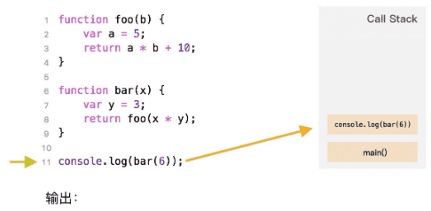

# js补充

## 闭包

开发者通常应该都知道“闭包”这个通用的编程术语。

[闭包](https://en.wikipedia.org/wiki/Closure_(computer_programming)) 是指内部函数总是可以访问其所在的外部函数中声明的变量和参数，即使在其外部函数被返回（寿命终结）了之后。在某些编程语言中，这是不可能的，或者应该以特殊的方式编写函数来实现。但是如上所述，在 JavaScript 中，所有函数都是天生闭包的（只有一个例外，将在 ["new Function" 语法](https://zh.javascript.info/new-function) 中讲到）。

也就是说：JavaScript 中的函数会自动通过隐藏的 `[[Environment]]` 属性记住创建它们的位置，所以它们都可以访问外部变量。

在面试时，前端开发者通常会被问到“**什么是闭包**？”,从三方面回答

1. 闭包的定义
2. 解释为什么JavaScript的所有函数都是闭包,词法环境
3. 可能的关于[[Environment]] 属性和词法环境原理的技术细节

- 闭包是指内部函数能访问到其所在的外部函数中的参数和变量

- 所有的JavaScript函数都是闭包的,因为函数在创建时,会有个隐藏的environment属性,该属性保存了 对创建该函数的词法环境的引用.也就是说,函数会通过environment属性记住创建它们的位置.在函数调用时,会创建一个新的词法环境,包含该函数的内部变量和参数,它的外部词法环境的引用是获取于该函数的 environment属性.因此所有的函数都可以访问到**外部变量**.所以说所有的JavaScript的函数都是闭包

  (能引用外部变量,就是闭包函数)

## this,call/apply/bind

### 参考文章

- 函数调用的方式和this的丢失:<https://www.jianshu.com/p/a3af18991e82>
  - 写的很清楚,普通函数,构造函数,方法,call/apply
- call/apply/bind的区别:<https://www.cnblogs.com/starry-skys/p/11901677.html>
  - call和apply是理解调用该函数,bind是返回一个新函数,需要额外调用
  - call携带的参数是列表,可以用spread语句,可迭代的对象
  - apply携带的参数 是类数组对象

###  函数调用以及this指向

**函数的几种调用方式以及他们的this指向**

1. 普通函数调用  内部的`this` 指向全局对象 window(浏览器是window)
2. 构造函数调用  内部的`this ` 指向新创建的对象
3. 对象的方法调用 内部的`this`指向调用的对象本身
4. 通过call 或者 apply 方式调用(函数上下文), `this` 指向的是当前的上下文对象

**普通函数的调用**

```js
// 1.普通函数的this 指向全局
function getThis(){
  console.log(this);
}
getThis() //Object [global] {..} (node环境)
```

**对象方法调用**

```js
// 2.对象方法的this
let obj = {
  name:"lily",
  sayHi(){
    console.log(this.name);
  }
}
// 2.1 调用对象里的方法
obj.sayHi(); //lily
// 2.2 将方法赋给函数,sayhello就是普通函数,这就会导致this的丢失
let sayhello = obj.sayHi;
sayhello(); //undefined(name是undefined)
```

**`this` 的丢失:**

注意,当把对象方法 赋给 一个值后,类似于函数表达式,这个时候就丢失this了,再调用,就相当于调用的是全局对象

```js
// 2.3 对象方法的使用方法
var obj = {
  foo: function () { 
    console.log(this.bar) 
  },
  bar: 1
};

var foo = obj.foo;
var bar = 2;

obj.foo() // 1
foo() // 2 (node环境下是undefined,浏览器中是2)
```


**构造函数调用**

```js
// 3.构造函数的this
function GetThis(name,age){
  this.name = name;
  this.age = age
  console.log("构造函数",this); 
}

let newGetThis = new GetThis('lily',13);
console.log(newGetThis);//GetThis { name: 'lily', age: 13 }
let test1= new GetThis('Ming',11);
console.log(test1);//GetThis { name: 'Ming', age: 11 }

/**这是构造函数的打印结果
 * 每个对象的构造函数在new的时候就把this指向了新对象 
构造函数 GetThis { name: 'lily', age: 13 }
GetThis { name: 'lily', age: 13 }
构造函数 GetThis { name: 'Ming', age: 11 }
GetThis { name: 'Ming', age: 11 }
*/
```

**call/apply/bind**

```js
// 1 普通函数 call 上下文环境
function testThis(){
  console.log(this.name);
}
let user = {
  name:"lily"
}
testThis.call(user);//lily

// 2.普通函数 bind 绑定环境
function testThis(){
  console.log(this.name);
}
let user = {
  name:"lily"
}
let newFunc = testThis.bind(user);//返回的是一个新函数
newFunc();//lily
```

### this的指向

在函数执行时，this 总是指向调用该函数的对象。要判断 this 的指向，其实就是判断 this 所在的函数属于谁。

遇到this,一定要记得这句: **函数执行时,this总是指向调用该函数的对象** (即: 判断this所在的函数属于谁)

1. 函数有所属对象,则指向所属对象 . 就是对象中的方法
2. 函数没有所属对象,则指向全局对象(window或global). 就是 普通函数
3. 使用构造器new一个对象时,this就指向新对象. 就是构造函数
4. apply, call, bind 改变了 this 的指向

除了上述四种外,还有原型继承,箭头函数也会有this指向

箭头函数没有this,它是借用外部词法环境中的this

## 全局对象

### 参考文章

- JavaScript关于全局对象: <https://www.cnblogs.com/echo-dauntless/p/9737451.html>

### 理解全局对象

全局对象(global object)在javascript中有着重要的用途：全局对象的属性是全局定义的符号。什么意思呢？意思就是全局对象预定义了全局的属性、函数、对象、构造函数以便你开发使用。

比如说：

1.全局属性：比如undefined、Infinity以及NaN。
2.全局对象：比如Math、JSON和Number
3.全局函数：比如isNaN()、isFinite()、parseInt()和eval()等。
4.全局构造器(constructor)，也即全局类。比如Date()、RegExp()、String()、Object()和Array()等。

js运行时内置了一个Global对象

这个Global对象跟运行环境有关。在浏览器运行环境中。Global就是window对象。
在nodejs中。Global对象是global对象。

当你在浏览器环境中，直接使用一个未经定义的变量，
例如foo=123;那么foo这个变量自动声明为全局变量。变量引用自动挂载到了Global对象，即window对象上。

全局对象提供可在任何地方使用的变量和函数,在浏览器中,是window,nodejs中是global

### **全局变量**

任何函数之外声明的变量,都被称为 **全局** 变量

全局变量在任意函数都是可见的(除非被局部变量覆盖)

减少全局变量的使用是一种很好的做法,现代的代码几乎甚至没有全局变量.大多数变量存在于它们的函数中.

### 问题

- 问题一 : 函数声明的时候,创建它的词法环境是全局对象吗.
  - 要看在哪个作用域,如果是全局作用域,就是的
  - 函数声明的初始化会被立即完成,当创建了一个词法环境时,函数声明会立即变为即用型函数

## 事件循环: 微任务和宏任务

### 参考文章

**js 宏任务和微任务**: <https://www.cnblogs.com/wangziye/p/9566454.html>

**JS浏览器事件循环机制**: <https://www.cnblogs.com/yqx0605xi/p/9267827.html>

**阮一峰事件循环 **:  <http://www.ruanyifeng.com/blog/2014/10/event-loop.html>

**Stack的三种含义**(调用栈) :  <http://www.ruanyifeng.com/blog/2013/11/stack.html>

**解答宏任务和微任务都是异步任务问题**: <https://segmentfault.com/q/1010000022131555>

**javascript宏任务和微任务** (代码说明) <https://www.cnblogs.com/fangdongdemao/p/10262209.html>

**js执行上下文和执行栈**: <https://www.cnblogs.com/yuanzhiguo/p/10626352.html>

 **js同步和异步** : <https://www.cnblogs.com/zhaoyanhaoBlog/p/11296223.html>

**聊聊--宏任务和微任务、同步和异步**(解释了这四个之间的关系)  <https://www.jianshu.com/p/0652db9cfb46>

**异步任务和回调函数的问题**: <https://segmentfault.com/q/1010000015041227/a-1020000015042819>

### 问题

- 宏任务是不是异步任务?
  - --已解决,不是,它是队列
  - 执行顺序：同步 -> 异步 -> 宏任务 -> 微任务

- 事件循环的范围在哪?
  - -- 已解决, 看宏任务和微任务的图就能明白
  - 当一次宏任务和一次微任务执行完后,就是一次事件循环.
  - 事件循环就是在两个之间来回来,这两个东西就是宏任务和微任务
- 事件循环为什么都是宏任务?不用区分 是异步任务还是同步任务吗?
  - --已解决, 事件循环不仅是宏任务,还有微任务
  - 事件循环和js的运行机制的关系是:主线程从"任务队列"中读取事件，这个过程是循环不断的，所以整个的这种运行机制又称为Event Loop（事件循环）。
  - 执行顺序：同步 -> 异步 -> 宏任务 -> 微任务
- 调用栈运行机制是什么?为什么要用栈 先进后出的特点
  - --已解决,这边就是上下文,词法环境 形成栈. 当调用一个函数时,就会放到调用栈中
- 异步任务注册回调函数,回调函数包含什么?放在哪?
  - --已解决,执行异步任务,就是执行它的回调函数.每个异步任务一定有回调函数
  - 主线程在执行异步任务时,先发起调用,然后把它挂起,等他有返回值了放到任务队列里, 等待主线程调用回调函数获取返回值

### JavaScript 引擎是单线程

JavaScript语言的一大特点就是单线程，也就是说，同一个时间只能做一件事。那么，为什么JavaScript不能有多个线程呢？这样能提高效率啊。

JavaScript的单线程，与它的用途有关。作为浏览器脚本语言，JavaScript的主要用途是与用户互动，以及操作DOM。这决定了它只能是单线程，否则会带来很复杂的同步问题。比如，假定JavaScript同时有两个线程，一个线程在某个DOM节点上添加内容，另一个线程删除了这个节点，这时浏览器应该以哪个线程为准？

所以，为了避免复杂性，从一诞生，JavaScript就是单线程，这已经成了这门语言的核心特征，将来也不会改变。

### 任务队列

**我们把需要执行的代码看成一个个任务，把任务分成两种，同步任务(sknchronous)，异步任务(asynchronous)。**

注意：需要执行的代码都是任务！

单线程就意味着，所有任务需要排队，前一个任务结束，才会执行后一个任务。如果前一个任务耗时很长，后一个任务就不得不一直等着。

所有任务可以分成两种，一种是**同步任务**（synchronous），另一种是**异步任务**（asynchronous）。同步任务指的是，在主线程上排队执行的任务，只有前一个任务执行完毕，才能执行后一个任务；异步任务指的是，不进入主线程、而进入"任务队列"（task queue）的任务，只有"任务队列"通知主线程，某个异步任务可以执行了，该任务才会进入主线程执行。

具体来说，异步执行的运行机制如下。（同步执行也是如此，因为它可以被视为没有异步任务的异步执行。）

（1）所有同步任务都在主线程上执行，形成一个[执行栈](http://www.ruanyifeng.com/blog/2013/11/stack.html)（execution context stack）。

（2）主线程之外，还存在一个"任务队列"（task queue）。只要异步任务有了运行结果，就在"任务队列"之中放置一个事件。

（3）一旦"执行栈"中的所有同步任务执行完毕，系统就会读取"任务队列"，看看里面有哪些事件。那些对应的异步任务，于是结束等待状态，进入执行栈，开始执行。

（4）主线程不断重复上面的第三步。

只要主线程空了，就会去读取"任务队列"，这就是JavaScript的运行机制。这个过程会不断重复。


### 事件和回调函数

**事件** 是某事发生的信号。所有的 DOM 节点都生成这样的信号（但事件不仅限于 DOM）。

例如 鼠标事件,点击事件,键盘事件...

"任务队列"是一个事件的队列（也可以理解成消息的队列），IO设备完成一项任务，就在"任务队列"中添加一个事件，表示相关的异步任务可以进入"执行栈"了。主线程读取"任务队列"，就是读取里面有哪些事件。

**异步任务则会在异步有了结果后将注册的回调函数添加到任务队列(消息队列)中**

所谓"回调函数"（callback），就是**那些会被主线程挂起来的代码**。异步任务必须指定回调函数，当主线程开始执行异步任务，就是执行对应的回调函数。

"任务队列"是一个先进先出的数据结构，排在前面的事件，优先被主线程读取。主线程的读取过程基本上是自动的，只要执行栈一清空，"任务队列"上第一位的事件就自动进入主线程。

### JavaScript 事件循环机制

JavaScript 事件循环机制分为浏览器和 Node 事件循环机制，两者的实现技术不一样，浏览器 Event Loop 是 HTML 中定义的规范，Node Event Loop 是由 libuv 库实现。这里主要讲的是浏览器部分。

主线程从"任务队列"中读取事件，这个过程是循环不断的，所以整个的这种运行机制又称为Event Loop（事件循环）。

### 同步任务和异步任务

Javascript语言将任务的执行模式分成两种：同步（Synchronous）和异步（Asynchronous）。

"同步模式"就是上一段的模式，后一个任务等待前一个任务结束，然后再执行，程序的执行顺序与任务的排列顺序是一致的、同步的；

"异步模式"则完全不同，每一个任务有一个或多个回调函数（callback），前一个任务结束后，不是执行后一个任务，而是执行回调函数，后一个任务则是不等前一个任务结束就执行，所以程序的执行顺序与任务的排列顺序是不一致的、异步的。

区别： 会不会阻塞当前程序运行

什么时候需要异步：

（1）需要等待的时候，等待过程不能卡在这吧

（2）等待过程不像alert一样阻塞程序运行

（3）等待的情况都要异步

使用异步的场景：

（1）定时任务，setTimeout，setInterval

（2）网络请求： ajax请求，动态加载

（3）事件绑定，点击等交互事件

### 宏任务和微任务

```shell
微任务 promise  process.nextTick          
宏任务 setTimeout  setInterval  I/O  script
同一次事件循环中  微任务永远在宏任务之前执行
```

注意: 宏任务 ≠ 异步任务 ，它也包含了script脚本

setTimeout是单线程，类似异步，但不是异步。它有回调函数

JS的异步也是有一个机制的，就是会分为宏任务和微任务。宏任务和微任务会放到不同的event queue中，先将所有的宏任务放到一个event queue，再将微任务放到一个event queue中。执行完宏任务之后，就会先从微任务中取这个回调函数执行。

```
可以理解为宏任务和微任务都是 任务队列, 只是用来存放东西的队列
主线程可以执行代码,渲染UI之类的
主线程空闲的时候就会轮询看看宏任务队列有没有要执行的任务,没有就过,有就取出来执行
宏任务执行完后就会去看看 微任务队列,没有就过, 有就取出来执行
```


### 宏任务和微任务-代码说明

```js
setTimeout(() => {
    //执行后 回调一个宏事件
    console.log('内层宏事件3')
}, 0)
console.log('外层宏事件1');

new Promise((resolve) => {
    console.log('外层宏事件2');
    resolve()
}).then(() => {
    console.log('微事件1');
}).then(()=>{
    console.log('微事件2')
})
```


```
外层宏事件1
外层宏事件2
微事件1
微事件2
内层宏事件3
```

• 首先浏览器执行js进入第一个宏任务进入主线程, 遇到 **setTimeout**  分发到宏任务Event Queue中

• 遇到 **console.log()** 直接执行 输出 外层宏事件1

• 遇到 Promise， new Promise 直接执行 输出 外层宏事件2

• 执行then 被分发到微任务Event Queue中

•第一轮宏任务执行结束，开始执行微任务 打印 '微事件1' '微事件2'

•第一轮微任务执行完毕，执行第二轮宏事件，打印setTimeout里面内容'内层宏事件3'

js执行机制

```js
// 主线程直接执行
console.log("1");
// 丢到宏任务队列中
setTimeout(() => {
  console.log("2");
  process.nextTick(function(){
    console.log("3");
  })
  new Promise(function(resolve){
    console.log("4");
    resolve();
  }).then(function(){
    console.log("5");
  })
});
// 微任务1
process.nextTick(function(){
  console.log("6");
})
// 主线程直接执行
new Promise(function(resolve){
  console.log("7");
  resolve();
}).then(function(){
  // 微任务2
  console.log("8");
})

// 丢到宏任务队列中
setTimeout(function(){
  console.log("9");
  process.nextTick(function(){
    console.log("10");
  })
  new Promise(function(resolve){
    console.log("11");
    resolve();
  }).then(function(){
    // 微任务3
    console.log("12");
  })
})
```

执行结果

```
1
7
6
8
2
4
3
5
9
11
10
12
```

- 首先浏览器执行js进入第一个宏任务进入主线程,直接打印 console.log("1")
- 遇到 **setTimeout** 分发到宏任务 Event Queue中
- 遇到 process.nextTick 丢到微任务Event Queue中
- 遇到promise,new Promise 直接执行,输出 console.log("7")
- 执行then  被分发到微任务 Event Queue中
- 第一轮宏任务执行完毕,开始执行微任务 ,打印6,8
- 第一轮微任务执行完毕,开始第二轮宏任务,执行 setTimeout
- 先执行主线程宏任务,再执行微任务,打印2,4,3,5
- 在执行第二个setTimeout,同理打印9,11,10,12
- 整段代码,共进行了**三次事件循环**,完整的输出为:1,7,6,8,2,4,3,5,9,11,10,12

### 执行栈

**Stack的三种含义**

**含义一：数据结构**

stack的第一种含义是一组数据的存放方式，特点为LIFO，即后进先出（Last in, first out）。

**含义二：代码运行方式**

stack的第二种含义是"调用栈"（call stack）(执行栈)，表示函数或子例程像堆积木一样存放，以实现层层调用。

这三次调用像积木一样堆起来，就叫做"调用栈"。程序运行的时候，总是先完成最上层的调用，然后将它的值返回到下一层调用，直至完成整个调用栈，返回最后的结果。

**含义三：内存区域**

stack的第三种含义是存放数据的一种内存区域。程序运行的时候，需要内存空间存放数据。一般来说，系统会划分出两种不同的内存空间：一种叫做stack（栈），另一种叫做heap（堆）。

它们的主要区别是：stack是有结构的，每个区块按照一定次序存放，可以明确知道每个区块的大小；heap是没有结构的，数据可以任意存放。因此，stack的寻址速度要快于heap。


JavaScript 引擎创建了执行栈来管理执行上下文，可以把执行栈认为成一个储存函数调用的栈结构，遵循先进后出的原则。



从上面代码执行，我们大概可以得出以下几点

- JavaScript引擎是单线程执行，所有代码都是排队执行。
- 一开始执行的是全局代码，首先创建全局的执行上下文，然后将该执行上下文压入执行栈中。
- 每当执行一个函数，就会创建该函数的执行上下文，然后将其压入执行栈的顶部，函数执行完成后，执行上下文从底部退出，等待垃圾回收。
- 游览器js总是访问执行栈顶层的执行上下文。
- 全局上下文只有唯一的一个，它在浏览器关闭时出栈

 