JavaScript 编程语言

## 1. 简介

### 1.1 JavaScript简介

#### JavaScript的定义

- JavaScript最初的目的是为了“赋予网页生命”
- 这种编程语言我们称之为 **脚本**，它们可以写在HTML中，在页面加载的时候会自动执行
- 脚本作为纯文本存在和执行，它们不需要特殊的准备或编译即可运行

#### JavaScript执行

JavaScript可以在浏览器内执行，也可以在服务端执行，甚至还能在任意搭载了JavaScript引擎的设备中都可以执行

浏览器中嵌入了JavaScript引擎，有时也称作JavaScript虚拟机

不同的引擎有不同的“代号”，例如“

- V8 ——Chrome和Opera中的JavaScript引擎
- SpiderMonkey——Firefox中的JavaScript引擎
- 还有一些其他的引擎

## 2.JavaScript基础知识

### 2.3 现代模式，"use strict"

长久以来，JavaScript 不断向前发展且并未带来任何兼容性问题。新的特性被加入，旧的功能也没有改变。

这么做有利于兼容旧代码，但缺点是 JavaScript 创造者的任何错误或不完善的决定也将永远被保留在 JavaScript 语言中。

这种情况一直持续到 2009 年 ECMAScript 5 (ES5) 的出现。**ES5 规范增加了新的语言特性并且修改了一些已经存在的特性。为了保证旧的功能能够使用，大部分的修改是默认不生效的。你需要一个特殊的指令 —— `"use strict"` 来明确地激活这些特性。**

就是ES5修改了一些存在的特性，为了保证旧功能正常使用，默认是不生效这些修改过的特性的，为了让这个特性生效，可以使用“use strict”来激活这些特性

**确保 “use strict” 出现在最顶部**

请确保 `"use strict"` 出现在脚本的最顶部，否则严格模式可能无法启用。

这里的严格模式就没有被启用：

```javascript
alert("some code");
// 下面的 "use strict" 会被忽略，必须在最顶部。

"use strict";

// 严格模式没有被激活
```

只有注释可以出现在 `"use strict"` 的上面。

### 2.4  变量

#### 2.4.1  变量命名：

JavaScript 的变量命名有两个限制：

1. 变量名称必须仅包含字母，数字，符号 `$` 和 `_`。
2. 首字符必须非数字。

如果命名包括多个单词，通常采用驼峰式命名法（[camelCase](https://en.wikipedia.org/wiki/CamelCase)）。也就是，单词一个接一个，除了第一个单词，其他的每个单词都以大写字母开头：`myVeryLongName`。

美元符号 `'$'` 和下划线 `'_'` 也可以用于变量命名。它们是正常的符号，就跟字母一样，没有任何特殊的含义。

下面的命名是有效的：

```javascript
let $ = 1; // 使用 "$" 声明一个变量
let _ = 2; // 现在用 "_" 声明一个变量

alert($ + _); // 3
```

下面的变量命名不正确：

```javascript
let 1a; // 不能以数字开始

let my-name; // 连字符 '-' 不允许用于变量命名
```

#### 2.4.2 区分大小写

命名为 `apple` 和 `AppLE` 的变量是不同的两个变量。

#### 2.4.3 常量

声明一个常数（不变）变量，可以使用 `const` 而非 `let`：

```javascript
const myBirthday = '18.04.1982';
```

使用 `const` 声明的变量称为“常量”。它们不能被修改，如果你尝试修改就会发现报错：

```javascript
const myBirthday = '18.04.1982';

myBirthday = '01.01.2001'; // 错误，不能对常量重新赋值
```

当程序员能确定这个变量永远不会改变的时候，就可以使用 `const` 来确保这种行为，并且清楚地向别人传递这一事实。

#### 2.4.4 大写形式的常数

一个普遍的做法是将**常量用作别名**，以便记住那些在执行之前就已知的难以记住的值。

使用大写字母和下划线来命名这些常量。

例如，让我们以所谓的“web”（十六进制）格式为颜色声明常量：

```javascript
const COLOR_RED = "#F00";
const COLOR_GREEN = "#0F0";
const COLOR_BLUE = "#00F";
const COLOR_ORANGE = "#FF7F00";

// ……当我们需要选择一个颜色
let color = COLOR_ORANGE;
alert(color); // #FF7F00
```

> 什么时候该为常量使用大写命名，什么时候进行常规命名？让我们弄清楚一点。

作为一个“常数”，意味着值永远不变。但是有些常量在执行之前就已知了（比如红色的十六进制值），还有些在执行期间被“计算”出来，但初始赋值之后就不会改变。

例如：

```javascript
const pageLoadTime = /* 网页加载所需的时间 */;
```

`pageLoadTime` 的值在页面加载之前是未知的，所以采用常规命名。但是它仍然是个常量，因为赋值之后不会改变。

### 2.5  数据类型

JavaScript 中的值都具有特定的类型。例如，字符串或数字。

在 JavaScript 中有 8 种基本的数据类型（译注：7 种原始类型和 1 种引用类型）。

1. Number
2. BigInt(还需要兼容)
3. String
4. Boolean
5. null
6. undefined
7. typeof

#### String类型

在 JavaScript 中，有三种包含字符串的方式。

1. 双引号：`"Hello"`.
2. 单引号：`'Hello'`.
3. 反引号：``Hello``.

双引号和单引号都是“简单”引用，在 JavaScript 中两者几乎没有什么差别。

反引号是 **功能扩展** 引号。它们允许我们通过将**变量**和**表达式**包装在 `${…}` 中，来将它们嵌入到字符串中。例如：

```javascript
let name = "John";

// 嵌入一个变量
alert( `Hello, ${name}!` ); // Hello, John!

// 嵌入一个表达式
alert( `the result is ${1 + 2}` ); // the result is 3
```

`${…}` 内的表达式会被计算，计算结果会成为字符串的一部分。可以在 `${…}` 内放置任何东西：诸如名为 `name`的变量，或者诸如 `1 + 2` 的算数表达式，或者其他一些更复杂的。

#### "undefined"值

特殊值 `undefined` 和 `null` 一样自成类型。

`undefined` 的含义是 `未被赋值`。

> 如果一个变量已被声明，但未被赋值，那么它的值就是 `undefined`

从技术上讲，可以显式地将 `undefined` 赋值给变量：……但是不建议这样做。通常，使用 `null` 将一个“空”或者“未知”的值写入变量中，而 `undefined` 则保留作为未进行初始化的事物的默认初始值。

#### 总结

JavaScript 中有八种基本的数据类型（译注：前七种为基本数据类型，也称为原始类型，而 `object` 为复杂数据类型）。

- `number` 用于任何类型的数字：整数或浮点数，在 ±253 范围内的整数。
- `bigint` 用于任意长度的整数。
- `string` 用于字符串：一个字符串可以包含 0 个或多个字符，所以没有单独的单字符类型。
- `boolean` 用于 `true` 和 `false`。
- `null` 用于未知的值 —— 只有一个 `null` 值的独立类型。
- `undefined` 用于未定义的值 —— 只有一个 `undefined` 值的独立类型。
- `symbol` 用于唯一的标识符。
- `object` 用于更复杂的数据结构。

我们可以通过 `typeof` 运算符查看存储在变量中的数据类型。

- 两种形式：`typeof x` 或者 `typeof(x)`。
- 以字符串的形式返回类型名称，例如 `"string"`。
- `typeof null` 会返回 `"object"` —— 这是 JavaScript 编程语言的一个错误，实际上它并不是一个 `object`。

### 2.6  交互：alert，prompt和confirm

由于我们将使用浏览器作为我们的演示环境，让我们看几个与用户交互的函数：`alert`，`prompt` 和`confirm`。

#### prompt

`prompt` 函数接收两个参数：

```javascript
result = prompt(title, [default]);
```

浏览器会显示一个带有文本消息的模态窗口，还有 input 框和确定/取消按钮。

- `title`

  显示给用户的文本

- `default`

  可选的第二个参数，指定 input 框的初始值。

#### confirm

语法：

```javascript
result = confirm(question);
```

`confirm` 函数显示一个带有 `question` 以及确定和取消两个按钮的模态窗口。

点击确定返回 `true`，点击取消返回 `false`。

#### 总结

我们学习了与用户交互的 3 个浏览器的特定函数：

- `alert`

  显示信息。

- `prompt`

  显示信息要求用户输入文本。点击确定返回文本，点击取消或按下 Esc 键返回 `null`。

- `confirm`

  显示信息等待用户点击确定或取消。点击确定返回 `true`，点击取消或按下 Esc 键返回 `false`。

### 2.7  类型转换

#### 总结

有三种常用的类型转换：转换为 string 类型、转换为 number 类型和转换为 boolean 类型。

**字符串转换** —— 转换发生在输出内容的时候，也可以通过 `String(value)` 进行显式转换。原始类型值的 string 类型转换通常是很明显的。

**数字型转换** —— 转换发生在进行算术操作时，也可以通过 `Number(value)` 进行显式转换。

数字型转换遵循以下规则：

| 值             | 变成……                                                       |
| :------------- | :----------------------------------------------------------- |
| `undefined`    | `NaN`                                                        |
| `null`         | `0`                                                          |
| `true / false` | `1 / 0`                                                      |
| `string`       | “按原样读取”字符串，两端的空白会被忽略。空字符串变成 `0`。转换出错则输出 `NaN`。 |

**布尔型转换** —— 转换发生在进行逻辑操作时，也可以通过 `Boolean(value)` 进行显式转换。

布尔型转换遵循以下规则：

| 值                                    | 变成……  |
| :------------------------------------ | :------ |
| `0`, `null`, `undefined`, `NaN`, `""` | `false` |
| 其他值                                | `true`  |

上述的大多数规则都容易理解和记忆。人们通常会犯错误的值得注意的例子有以下几个：

- 对 `undefined` 进行数字型转换时，输出结果为 `NaN`，而非 `0`。
- 对 `"0"` 和只有空格的字符串（比如：`" "`）进行布尔型转换时，输出结果为 `true`。

### 2.8  基础运算符，数学

#### 术语：“一元运算符”，“二元运算符”，“运算元”

- 运算元：运算符应用的对象。a+b 中 a和b都是运算元
- 一元运算符：如果一个运算符对应的只有一个运算元。a++ 就是一元运算符
- 二元运算符：如果一个运算符拥有两个运算元。a+b 就是二元运算符

#### 取余 %

取余运算符是 `%`，尽管它看起来很像百分数，但实际并无关联。

`a % b` 的结果是 `a` 整除 `b` 的 [余数](https://zh.wikipedia.org/zh-hans/余数))。

#### 求幂 **

求幂运算 `a ** b` 是 `a` 乘以自身 `b` 次。

```javascript
alert( 2 ** 2 ); // 4  (2 * 2，自乘 2 次)
alert( 2 ** 4 ); // 16 (2 * 2 * 2 * 2，自乘 4 次)
```

#### 二元运算符 +

通常，加号 `+` 用于求和。

但是如果加号 `+` 被应用于字符串，它将合并（连接）各个字符串：

```javascript
alert(2 + 2 + '1' ); // "41"，不是 "221"
```

在这里，运算符是按顺序工作。第一个 `+` 将两个数字相加，所以返回 `4`，然后下一个 `+` 将字符串 `1` 加入其中，所以就是 `4 + '1' = 41`。

二元 `+` 是唯一一个以这种方式支持字符串的运算符。其他算术运算符只对数字起作用，并且总是将其运算元转换为数字。

#### 一元运算符+

一元运算符加号，或者说，加号 `+` 应用于单个值，对数字没有任何作用。

但是如果**运算元不是数字**，加号 `+` 则会将**其转化为数字**。

它的效果和 `Number(...)` 相同，但是更加简短。

```javascript
let apples = "2";
let oranges = "3";

alert( apples + oranges ); // "23"，二元运算符加号合并字符串
alert( +apples + +oranges ); // 5，在二元运算符加号起作用之前，所有的值都被转化为了数字
```

### 2.9  值的比较

#### 总结

- 比较运算符始终**返回布尔值。**
- **字符串**的比较，会按照**“词典”**顺序逐字符地比较大小。
- 当对**不同类型**的值进行比较时，它们会**先被转化为数字**（不包括严格相等检查）再进行比较。
- 在**非严格相等** `==` 下，`null` 和 `undefined` 相等且各自不等于任何其他的值。
- 在使用 `>` 或 `<` 进行比较时，需要注意变量可能为 `null/undefined` 的情况。比较好的方法是单独检查变量是否等于 `null/undefined`。

### 2.11  逻辑运算符

#### 或运算寻找第一个真值

或运算符 `||` 做了如下的事情：

- 从左到右依次计算操作数。
- 处理每一个操作数时，都将其转化为布尔值。如果结果是 `true`，就停止计算，返回这个操作数的初始值。
- 如果所有的操作数都被计算过（也就是，转换结果都是 `false`），则返回最后一个操作数。

返回的值是操作数的初始形式，不会做布尔转换。

也就是，一个或运算 `"||"` 的链，将返回**第一个真值**，如果**不存在真值**，就返回该链的**最后一个值**。

#### 多个或运算衍生的用法

1. **获取变量列表或者表达式的第一个真值。**

2. **短路求值（Short-circuit evaluation）。**

   `||` 对其参数进行处理，直到达到第一个真值，然后立即返回该值，而无需处理其他参数。

   如果操作数不仅仅是一个值，而是一个有副作用的表达式，例如变量赋值或函数调用，那么这一特性的重要性就变得显而易见了。

   ```javascript
   true || alert("not printed");
   false || alert("printed");
   ```

   在第一行中，或运算符 `||` 在遇到 `true` 时立即停止运算，所以 `alert` 没有运行。

   有时，人们利用这个特性，只在左侧的条件为假时才执行命令。

#### 与操作寻找第一个假值

与运算 `&&` 做了如下的事：

- 从左到右依次计算操作数。
- 将处理每一个操作数时，都将其转化为布尔值。如果结果是 `false`，就停止计算，并返回这个操作数的初始值。
- 如果所有的操作数都被计算过（也就是，转换结果都是 `true`），则返回最后一个操作数。

换句话说，与运算符返回**第一个假值**，如果没有假值就返回**最后一个值**。

上面的规则和或运算很像。区别就是与运算返回第一个假值而或操作返回第一个真值。

> **与运算 `&&` 在或运算符 `||` 之前执行**

与运算 `&&` 的优先级比或运算 `||` 要高。

所以代码 `a && b || c && d` 完全跟 `&&` 表达式加了括号一样：`(a && b) || (c && d)`。

> **不要用 || 或 && 来取代 `if`**

有时候，有人会用与运算符 `&&` 来“简化 `if`”

```javascript
let x = 1;

(x > 0) && alert( 'Greater than zero!' );
```

虽然使用 `&&` 写出的变体看起来更短，但 `if` 更明显，并且往往更具可读性。因此，我们建议根据每个语法结构的用途来使用：如果我们想要 `if`，就使用 `if`；如果我们想要逻辑与，就使用 `&&`。

#### !（非）

感叹符号 `!` 表示布尔非运算。

运算符接受一个参数，并按如下运作：

1. 将**操作数转化为布尔类型**：`true/false`。
2. 返回相反的值。

```javascript
alert( !0 ); // true
```

非运算符 `!` 的优先级在所有逻辑运算符里面最高，所以它总是在 `&&` 和 `||` 前执行。

### 2.13 循环：while和for

**循环** 是一种重复运行同一代码的方法。

#### 跳出循环

通常条件为假时，循环会终止。

但我们随时都可以使用 `break` 指令**强制退出**。

只要在循环里条件不符合的，break了，就立刻跳出，不执行该循环体了

#### 继续下一次迭代

`continue` 指令是 `break` 的“轻量版”。它不会停掉整个循环。而是**停止当前这一次迭代**，并强制启动新一轮循环（如果条件允许的话）。

如果我们完成了当前的迭代，并且希望继续执行下一次迭代，我们就可以使用它。

continue是这次条件不符合了，下面代码不执行，跳出循环体，但是会再进行循环，如果符合循环条件的话。跟break不同，break是跳出循环体，不会再进行循环

#### break/continue 标签

`break/continue` 支持循环前的标签。标签是 `break/continue` 跳出嵌套循环以转到外部的唯一方法。

**标签** 是在循环之前带有冒号的标识符：

```javascript
labelName: for (...) {
  ...
}
```

`break <labelName>` 语句跳出循环至标签处：

```javascript
// outer是标签名
outer: for (let i = 0; i < 3; i++) {

  for (let j = 0; j < 3; j++) {

    let input = prompt(`Value at coords (${i},${j})`, '');

    // 如果是空字符串或被取消，则中断并跳出这两个循环。
    if (!input) break outer; // (*)

    // 用得到的值做些事……
  }
}
alert('Done!');
```

上述代码中，`break outer` 向上寻找名为 `outer` 的标签并跳出当前循环。

因此，控制权直接从 `(*)` 转至 `alert('Done!')`。

### 2.15 函数

#### 函数声明

`function` 关键字首先出现，然后是 **函数名**，然后是括号之间的 **参数** 列表（用逗号分隔，在上述示例中为空），最后是花括号之间的代码（即“函数体”）。

```javascript
function name(parameters) {
  ...body...
}
```

我们的新函数可以通过名称调用：`showMessage()`。

#### 局部变量

在函数中声明的变量只在该函数内部可见。

#### 外部变量

函数也可以访问外部变量，例如：

```javascript
                                                let userName = 'John';

function showMessage() {
  let message = 'Hello, ' + userName;
  alert(message);
}

showMessage(); // Hello, John
```

函数对外部变量拥有全部的访问权限。函数也可以修改外部变量。

只有在**没有局部变量**的情况下**才会使用外部变量**。

如果在函数内部声明了同名变量，那么函数会 **遮蔽** 外部变量。

局部变量 > 外部变量

#### 返回值

函数可以将一个值返回到调用代码中作为结果。

return 的是一个结果，可以是一个值

指令 `return` 可以在函数的任意位置。当执行到达时，函数停止，并将值返回给调用代码

执行return语句后，就直接跳出函数，不再执行下面代码

#### 函数命名

函数就是**行为**（action）。所以它们的名字通常是动词。它应该简短且尽可能准确地描述函数的作用。这样读代码的人就能清楚地知道这个函数的功能。

一种普遍的做法是用动词前缀来开始一个函数，这个前缀模糊地描述了这个行为。团队内部必须就前缀的含义达成一致。

例如，以 `"show"` 开头的函数通常会显示某些内容。

函数以 XX 开始……

- `"get…"` —— 返回一个值，
- `"calc…"` —— 计算某些内容，
- `"create…"` —— 创建某些内容，
- `"check…"` —— 检查某些内容并返回 boolean 值，等。

函数应该简短且只有一个功能。如果这个函数功能复杂，那么把该函数拆分成几个小的函数是值得的。

一个单独的函数不仅更容易测试和调试 —— 它的存在本身就是一个很好的注释！

### 2.16  函数表达式

#### 函数表达式有分号

注意：函数表达式结尾有一个分号 `;`，而函数声明没有：

```javascript
  function sayHi() {
  // ...
}

let sayHi = function() {
  // ...
};
```

- 在代码块的结尾不需要加分号 `;`，像 `if { ... }`，`for { }`，`function f { }` 等语法结构后面都不用加。
- 函数表达式是在语句内部的：`let sayHi = ...;`，作为一个值。它不是代码块而是一个赋值语句。不管值是什么，都建议在语句末尾添加分号 `;`。所以这里的分号与函数表达式本身没有任何关系，它只是用于终止语句。

#### 函数表达式和函数声明的区别

1. 两者最大的区别就是 调用函数 位置

函数声明未定义之前就可以被调用，而函数表达式得等到代码执行到那一行（该函数）后，才可以调用该函数

更细微的差别是，JavaScript 引擎会在 **什么时候** 创建函数。

**函数表达式是在代码执行到达时被创建，并且仅从那一刻起可用。**

**在函数声明被定义之前，它就可以被调用。**

原因：这是内部算法的原故。当 JavaScript **准备** 运行脚本时，首先会在脚本中寻找全局函数声明，并创建这些函数。我们可以将其视为“初始化阶段”。

在处理完所有函数声明后，代码才被执行。所以运行时能够使用这些函数。

也就是说js会先处理所有的函数声明再执行代码

2. 函数声明的另外一个特殊的功能是它们的块级作用域。

**严格模式下，当一个函数声明在一个代码块内时，它在该代码块内的任何位置都是可见的。但在代码块外不可见。**代码块就是{}

而使用函数表达式，现在代码块{}外面声明变量，然后在{}中定义函数，这样在代码块的外面就可以调用该函数

```javascript
let fn,age=19;
if(age>18){
    fn = function(){
        age + =1;
        console.log(age);
    };
}
fn(); //可以调用代码块里的函数
```

#### 选择函数声明or表达式?

一般来说，用函数声明。因为函数声明可读性好，而且在任何地方可以调用

除非，由于某种原因而导致函数声明不能使用，就用函数表达式

#### 总结

- **函数是值**。它们可以在代码的任何地方被分配，复制或声明。
- 如果函数在主代码流中被声明为单独的语句，则称为“函数声明”。
- 如果该函数是作为表达式的一部分创建的，则称其“函数表达式”。
- 在执行代码块之前，内部算法会先处理函数声明。所以函数声明在其被声明的代码块内的任何位置都是可见的。
- 函数表达式在执行流程到达时创建。

在大多数情况下，当我们需要声明一个函数时，最好使用函数声明，因为函数在被声明之前也是可见的。这使我们在代码组织方面更具灵活性，通常也会使得代码可读性更高。

所以，仅当函数声明不适合对应的任务时，才应使用函数表达式。

### 2.17 箭头函数，基础知识

#### 单行的箭头函数

箭头函数格式：

```javascript
let func = (arg1, arg2, ...argN) => expression
```

创建了一个函数 `func`，它接受参数 `arg1..argN`，然后使用参数对右侧的 `expression` 求值并返回其结果。

- 如果我们只有一个参数，还可以省略掉参数外的圆括号，使代码更短。

```javascript
let double = n => n * 2;
alert( double(3) ); // 6
```

- 如果没有参数，括号将是空的（但括号应该保留）：

```javascript
let sayHi = () => alert("Hello!");

sayHi(); 
```

- 箭头函数可以像函数表达式一样使用。

#### 多行的箭头函数

用花括号括起来。然后使用一个普通的 `return` 将需要返回的值进行返回。

```javascript
let sum = (a, b) => {  // 花括号表示开始一个多行函数
  let result = a + b;
  return result; // 如果我们使用了花括号，那么我们需要一个显式的 “return”
};

alert( sum(1, 2) ); // 3
```

#### 总结

对于**一行代码**的函数来说，箭头函数是相当方便的。它具体有两种：

1. 不带花括号：`(...args) => expression` — 右侧是一个表达式：函数计算表达式并返回其结果。
2. 带花括号：`(...args) => { body }` — 花括号允许我们在函数中编写多个语句，但是我们需要显式地 `return` 来返回一些内容。

## 3. 代码质量

### 3.5 使用Mocha进行自动化测试

虽然还没看懂,但是知道是省事的东西

每次写完函数后,不用每次运行看控制台的结果了

这个会自动测试

### 3.6 Polyfill

虽然还没看懂,但知道是跟babel有关的

把es6转成 es5这样,或者样式格式?

## 4. Object（对象）：基础知识

### 4.1 对象

#### 1. 定义对象

通过使用带有可选 **属性列表** 的花括号 `{…}` 来创建对象。一个属性就是一个键值对（“key: value”），

其中键（`key`）是一个**字符串**（也叫做属性名），

​		值（`value`）可以是任何值。可以是字符串，数字，null，undefined,布尔类型或其他

#### 2. 创建对象

我们可以用下面两种语法中的任一种来创建一个空的对象（“空柜子”）：

```javascript
let user = new Object(); // “构造函数” 的语法
let user = {};  // “字面量” 的语法
```

通常，我们用花括号。这种方式我们叫做**字面量**。

#### 3. 对象的增删改查

前面定义过一个user的对象

- 增加对象属性

  ```javascript
  user.name = "lily";  // 直接点增加
  ```

- 删除对象属性

  ```javascript
  delete user.age;
  ```

- 修改对象属性

  ```javascript
  user.name = "linda"; //修改name的值
  ```

- 查看对象属性

  ```javascript
  let name = user.name;
  console.log(name);
  ```

```javascript
let user = {
    age: 18,
    height: 1.88,
};
// 增加属性
user.name = "lily";
// 删除属性
delete user.age;
// 修改属性
user.name = "linda";	
// 查看属性
let height = user.height

console.log(user, height) //{ height: 1.88, name: 'linda' } 1.88
```

- 允许多字词语作为属性名，但必须给他们加上引号

  ```javascript
  let user = {
      "two words":"hello word",
  }
  ```

- 列表中的最后一个属性应以逗号结尾：

  ```
  let user = {
  	name:"lily",
  	age:30,
  }
  ```

  这叫做尾随（trailing）或悬挂（hanging）逗号。这样便于我们添加、删除和移动属性，因为所有的行都是相似的。

#### 4. const声明的对象可以修改

> 这个面试过！会问为什么可以修改

请注意：用 `const` 声明的对象 **能** 被修改。

```javascript
const user = {
  name: "John"
};

user.name = "Pete"; // 修改name属性

console.log(user.name); // Pete
```

因为对象数据是存储在堆空间的，在栈空间的只是指向 堆空间 的指针，是不变的，所以const  没有改变，一直都是地址。因此可以修改对象的属性

内存分为 

- 栈空间：基本数据类型，函数调用栈
- 堆空间：引用数据类型

#### 5. 对象方括号访问

一般都是`user.name` 点的方式访问属性值，但如果属性名为多个词语，需要用方括号[]来访问：`user["two woeds"]`

请注意方括号中的**字符串要放在引号中**，单引号或双引号都可以。

- 访问属性名

  方括号提供了一种可以通过任意表达式来获取属性名的方法 —— 跟语义上的字符串不同 —— 比如像类似于下面的变量：

  ```javascript
  let key = "name";
  user[key] = lily;
  ```

  在这里，变量 `key` 可以是程序运行时**计算得到**的，也可以是根据**用户的输入得到**的。然后我们可以用它来访问属性。这给了我们很大的灵活性。

- 计算属性

  当创建一个对象时，我们可以在对象字面量中使用方括号。这叫做 **计算属性**。

  ```javascript
  let username = "name";
  let user = {
      [username]:"lily",
  };
  console.log(user) // { name: 'lily' }
  ```

  方括号比点符号更强大。它允许任何属性名和变量

  属性名是已知且简单的时候，就使用点符号。如果我们需要一些更复杂的内容，那么就用方括号。

#### 6. 属性存在性测试，“in”操作符

想查看一个 对象中是否存在某个属性时，可以使用in

语法是：

```javascript
"key" in object
```

例如：

```javascript
let user = { name: "John", age: 30 };

console.log( "age" in user ); // true，user.age 存在
console.log( "blabla" in user ); // false，user.blabla 不存在。
```

请注意，`in` 的左边必须是 **属性名**。通常是一个带引号的字符串。

如果不带引号，会认为是变量，所以一定要带引号，成为一个字符串

#### 7. 遍历“for…in”循环

遍历对象也可以用for..in方法，更快获得所有的键

为了遍历一个对象的所有键（key），可以使用一个特殊形式的循环：`for..in`。

语法：

```javascript
for (key in object) {
  // 对此对象属性中的每个键执行的代码
}
```

例如，让我们列出 `user` 所有的属性：

```javascript
let user = {
    name: "lily",
    age: 18,
    height: 1.88
};

for (let key in user) {
    console.log(key); // name,age,height
    console.log(user[key]); //18,height,1.88
}
```

#### 8. 总结

对象是具有一些特殊特性的关联数组。

它们存储属性（键值对），其中：

- 属性的键必须是字符串或者 symbol（通常是字符串）。
- 值可以是任何类型。

我们可以用下面的方法访问属性：

- 点符号: `obj.property`。
- 方括号 `obj["property"]`，方括号允许从变量中获取键，例如 `obj[varWithKey]`。

其他操作：

- 删除属性：`delete obj.prop`。
- 检查是否存在给定键的属性：`"key" in obj`。
- 遍历对象：`for(let key in obj)` 循环。

我们在这一章学习的叫做“普通对象（plain object）”，或者就叫对象。

JavaScript 中还有很多其他类型的对象：

- `Array` 用于存储有序数据集合，
- `Date` 用于存储时间日期，
- `Error` 用于存储错误信息。
- ……等等。

它们有着各自特别的特性，我们将在后面学习到。有时候大家会说“Array 类型”或“Date 类型”，但其实它们并不是自身所属的类型，而是属于一个对象类型即 “object”。它们以不同的方式对 “object” 做了一些扩展。

### 4.2   对象拷贝，引用

#### 1. 对象和基本类型拷贝区别

对象和基本类型的拷贝是不同的。对象是拷贝的对该对象引用的地址，基本类型是整体赋值。

对象与原始类型其中一个基本的区别是：对象“通过引用的形式”被存储和拷贝。

原始类型值：字符串，数字，布尔值 —— 被“作为整体”赋值/拷贝。

#### 2.克隆与合并， Object.assign 

**浅拷贝只复制指向某个对象的指针，而不复制对象本身，新旧对象还是共享同一块内存。但深拷贝会另外创造一个一模一样的对象，新对象跟原对象不共享内存，修改新对象不会改到原对象**。

**浅拷贝**：复制的是地址：

```javascript
let user = {
    name:"lily",
    age:18
};
let buser = user;
console.log(buser); //{ name: 'lily', age: 18 } 
```

如果想复制对象本身，而不是引用地址，两种方式

- 方法一：循环原对象，然后每个赋值给 新对象

  ```javascript
  let user = {
      name: "lily",
      age: 18
  };
  let clone = {};
  for (let key in user) {
      clone[key] = user[key]
  }
  console.log(clone); //{ name: 'lily', age: 18 }
  ```

- 方法二：利用 Object.assign方法，这是js自带的方法 

  语法是：

  ```javascript
  Object.assign(target, [src1, src2, src3...])
  ```

  - 参数

    `target` 目标对象 

    `src1，src2..` 源对象   可以有多个源对象

  - 返回值

    目标对象

  ```javascript
  // 1. 只赋值一个对象
  let user = {
      name: "lily",
      age: 18
  };
  let clone = {};
  Object.assign(clone, user)
  console.log(clone); //{ name: 'lily', age: 18 }
  // 2.赋值多个对象
  let user1 = {
      name: "lily",
      age: 18
  };
  let user2 = {
      height: 1.88,
      hobbies: "sing"
  };
  let clone = {};
  Object.assign(clone, user1, user2)
  console.log(clone); //{ name: 'lily', age: 18, height: 1.88, hobbies: 'sing' }
  ```

  注意：如果被拷贝的属性的属性名已经存在，那么它会被覆盖

#### 3. 深层克隆

深层克隆的意思是：对象里的属性值也是对象的时候，也要完全拷贝过去，而不是拷贝引用地址

这是标准的深拷贝，需要调用递归方法或者不自己造轮子，使用现成的实现，例如 JavaScript 库 [lodash](https://lodash.com/) 中的 [_.cloneDeep(obj)](https://lodash.com/docs#cloneDeep)。

#### 4. 总结

对象通过引用被赋值和拷贝。换句话说，一个变量存储的不是“对象的值”，而是一个对值的“引用”（内存地址）。因此，拷贝此类变量或将其作为函数参数传递时，所拷贝的是引用，而不是对象本身。

所有通过被拷贝的引用的操作（如添加、删除属性）都作用在同一个对象上。

为了创建“真正的拷贝”（一个克隆），我们可以使用 `Object.assign` 来做所谓的“浅拷贝”（嵌套对象被通过引用进行拷贝）或者使用“深拷贝”函数，例如 [_.cloneDeep(obj)](https://lodash.com/docs#cloneDeep)。

- 当对象里的只有一层对象的时候，这时候 `Object.assign` 是深拷贝。如果对象中的键值是对象时，这时候是浅拷贝

### 4.3  垃圾回收

#### 可达性

JavaScript中主要的内存管理概念就是  **可达性**

意思是：“可达”值 是那些以某些方式可访问 或 可用的值。它们一定是存储在内存中的

- 两种类型：一种是根，一种是根的引用，（根的引用）的引用，各种扩展引用，但一定要和根搭接，不然 成为无法到达的岛屿

可达性 就是有用到的

1. 固有的可达值的基本集合，这些值不能被释放

   - 当前函数的局部变量和参数
   - 嵌套调用时，当前调用链上（作用域链？）上所有函数的变量与参数
   - 全局变量
   - （还有一些内部的）

   这些值被称作 “根”，意思是一定不能被释放，它们只有发出的箭头，没有进入的箭头

2. 如果说一个值可以通过引用 或者引用链 从根访问 任何其他值，则认为该值是可达的

   比方说：如果全局变量中有一个对象，并且该对象有一个属性引用了另一个对象，则该对象被认为是可达的，而且它引用的内容也是可达的

注意点：

- 对外引用不重要，只有传入引用才可以使对象可达。也就是说除了根，其他引用必须有进入的箭头，光出去箭头不重要

  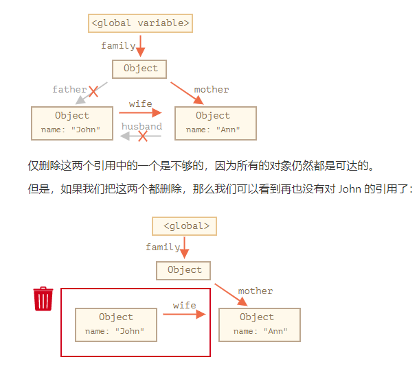

- 如果几个对象相互引用，但是外部没有对其任意对象的引用，这些对象也可能是不可达的，并从内存中删除

#### 内部算法

垃圾回收的基本算法被称为：“mark-and-sweep”。

定期执行以下“垃圾回收”步骤：

- 垃圾收集器找到所有的根，并标记它们；

- 然后它遍历并标记来自它们的所有引用。

- 然后它遍历标记的对象 并标记 **他们的** 引用。所有被遍历到的对象都会被记住，以免将来再次遍历到同一个对象

- ……如此操作，直到所有可达的（从根部）引用都被访问到

- 没有被标记的对象都会被删除

  如图所示，凡是根的向外引用，以及 根的引用的引用 都被标记了

  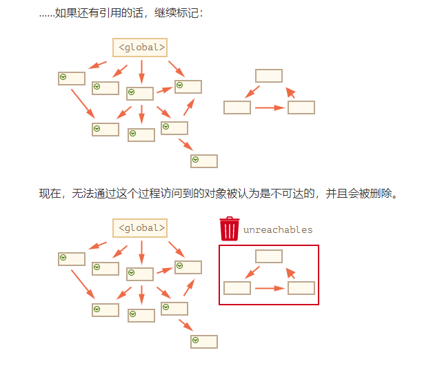

#### 总结

- 垃圾回收是自动完成的，我们不能强制执行或是阻止执行
- 当对象是可达状态时，它一定是存在于内存中的
- 被引用与可访问（从一个根）不同：一组相互连接的对象可能整体都不可达

### 4.4 对象方法，“this”

#### 方法的定义：

作为对象属性的函数被称为 **方法**。 对象中的函数称为方法，例如下面的sayHi方法

```javascript
let user = {
  name:"lily"
  sayHi: function() {
    alert("Hello");
  }
};
```

对象字面量中，省略function和冒号

在对象字面量中，有一种更短的（声明）方法的语法：

```javascript
// 这些对象作用一样

user = {
  sayHi: function() {
    alert("Hello");
  }
};

// 方法简写看起来更好，对吧？
let user = {
  sayHi() { // 与 "sayHi: function()" 一样
    alert("Hello");
  }
};
```

#### 方法中的“this”

通常，对象方法需要访问对象中存储的信息才能完成其工作。

**为了访问该对象，方法中可以使用`this`关键字**

`this`的值就是在点之前的这个对象，即调用该方法的对象。

```javascript
let user = {
  name: "John",
  age: 30,
  
  sayHi() {
    // "this" 指的是“当前的对象”
    alert(this.name);
  }
};

user.sayHi(); // John
```

一般调用当前对象的存储信息时，都用`this`，不用对象的名字，例如`user.name`。这样做，是为了函数能在不同对象中都能调用

#### "this"不受限制

`this`可以用于任何函数

`this`的值是在代码运行时计算出来的，它取决于代码上下文

例如：这里相同的函数被分配给两个不同的对象，在调用中有着不同的`this`值

规则很简单：如果`obj.f()`被调用了，则`this`在`f`函数调用期间是`obj`。所以在上面的例子`this`先是`user`,之后是`admin`

- **在没有对象的情况下调用：`this == undefined**`

  一般来说，this只会在对象的方法里调用。因为this要调用属性例如name，如果不是对象的方法，只是单纯的函数调用，严格模式下`this ==undefined` ，非严格模式下,`this`将会是全局对象

  ```javascript
  function sayHi() {
    alert(this);
  }
  
  sayHi(); // undefined
  ```

  在这种情况下，严格模式下的 `this` 值为 `undefined`。如果我们尝试访问 `this.name`，将会报错。

  在非严格模式的情况下，`this` 将会是 **全局对象**（浏览器中的 `window`，我们稍后会在 [全局对象](https://zh.javascript.info/global-object) 一章中学习它）。这是一个历史行为，`"use strict"` 已经将其修复了。

  通常这种调用是程序出错了。如果在一个函数内部有 `this`，那么通常意味着它是在对象上下文环境中被调用的。

- **解除** `this` **绑定的后果**

  在JavaScript中，`this`是"自由"的，它的值是在调用时计算出来的，它的值并不取决于方法声明的位置，而是取决于在"点符号前"的是什么对象

  在运行时对`this` 求值的这个概念有缺点也有优点，一方面，**函数可以被重用于不同的对象**。另一方面，更大的灵活性造成了更大的出错的可能

#### 箭头函数没有自己的"this"

箭头函数有点特别，虽然它是函数，但它没有`this`。如果在这样的函数引用`this`，`this`值取决于外部"正常的"函数

举个例子：这里的`arrow()` 使用的`this`来自于外部的`user.sayHi()` 方法：

```javascript
let user = {
  firstName: "Ilya",
  sayHi() {
    let arrow = () => alert(this.firstName);
    arrow();
  }
};

user.sayHi(); // Ilya
```

#### 总结

- 存储在对象属性中的函数被称为"方法"
- 方法允许对象进行像`object.doSomething()` 这样的操作
- 方法可以将对象引用为`this`

`this` 的值是在程序运行时得到的

- 一个函数在声明时，可能就使用了`this` ,但是这个`this` 只有在函数被调用时才会有值。
- 可以在对象之间复制函数。
- 以“方法”的语法调用函数时：`object.method()`,调用过程中的`this`值是`object`

注意：箭头函数没有`this`，在箭头函数内部访问到的`this`都是从外部获取的

### 4.5  构造器和操作符"new"

常规的`{...}` 语法允许创建一个对象，但是我们经常需要创建许多类似的对象，例如多个用户或菜单。这可以使用构造函数和`new` 操作符来实现

常规对象和构造器的区别：当你想有多个对象的时候，你复制多个对象，但是你只复制了指针。而构造器它虽然是一个对象，但是你`new`一个构造器后，会在堆空间划分一块空间给对象。

#### 构造函数

构造函数在技术上是常规函数，不过有两个约定：

1. 它们的命名以大写字母开头。
2. 它们只能有`new` 操作符来执行。不能直接像普通函数调用

例如：

```javascript
function User(name) {
  this.name = name;
  this.isAdmin = false;
}

let user = new User("Jack");

alert(user.name); // Jack
alert(user.isAdmin); // false
```

当一个函数被使用`new`操作符执行时，它按照一下步骤：

1. 一个新的空对象被创建并分配给`this`
2. 函数体执行，通常它会修改`this`，为其添加新的属性
3. 返回`this`的值

就像下面的`new User(..)`后做的类似事情

```javascript
function User(name){
  // 第一步：隐式创建空对象并分配给this
  // this = {}; 
  
  // 第二步：修改this，为其添加新的属性
  this.name = name;
  this.isAdmin = false;
  
  // 第三步：返回this的值，隐式返回
  // return this;
}
```

创建多个用户时，可以调用`new User("Ann")`,`new User("Alice")`等，比每次都使用字面量创建的要短得多，而且更容易阅读

> 这就是构造器的主要目的——实现可重用的对象创建代码

注意：从技术来说，任何函数都可以作为构造器，即：任何函数都可以通过`new`来运行，它会执行上面的算法。只不过“首字母大写”是一个共同的约定，已明确表示一个函数将被使用`new` 来运行

#### 构造函数的 return

一个普通的函数都有return，但是构造函数最好不明写return，因为它们的任务是将所有必要的东西写入`this`，并自动转换成结果，隐式返回`return this`

但如果有的话，根据下面的规则返回

- 如果`return` 返回的是一个对象，则返回到这个对象，而不是`this`;
- 如果`return` 返回的是一个原始类型，例如string字符串，number数字，Boolean布尔类型等等，则忽略

换句话说，带有对象的`return`返回该对象，在所有其他情况下返回`this`

通常构造器没有`return`语句，return返回一个对象是特殊行为

**省略括号**

如果`new`一个函数没有参数，则可以省略`new`后的括号

```javascript
let user = new User； //没有参数
// 等同于
let user = new User();
```

但是省略括号不是好风格，最好不要省略，虽然规范允许使用这个语法。普通函数一定 要括号来调用，即使没有参数`getTotal()`

#### 总结

- 构造函数，或简称构造器，就是常规函数，但大家对于构造器有个共同的约定，就是其命名首字母要大写
- 构造函数只能使用`new`来调用，这样的调用意味着在开始时创建了空的`this`,并在最后返回填充了值的`this`

我们可以使用构造函数来创建多个类似的对象

JavaScript为许多内置的对象提供了构造函数，比如日期`Date`,集合`set` 等待

### 4.6  可选链  "?."

#### 介绍可选链

可选链就是判断前面是否存在，就算不存在，也不会报错。是用于嵌套对象

类似于之前的`user && user.address && user.address.street`,只有`user`和`user.address`都为true后，才执行`user.address.street`的命令，现在是`user?.address?.street`

可选链`?.`是一种访问嵌套对象属性的放错误方法。即使中间的属性不存在，也不会出现错误

如果可选链`?.`前面的部分是`undefined`或者`null`,它就会停止运算并返回`undefined`

`?.` 语法使其**前面的值**成为**可选值**，但不会对后面的起作用

例如`user?.` 只允许`user` 为`null/undefined`,只判断前面的

#### 注意点

**不要过度使用可选链**

我们应该只将`?.`使用在一些东西可以不存在的地方，如果`user`必须存在，就不要用`?.`

 **`?.`前的变量必须已声明**

如果未声明变量`user`，那么`user?.anything`会触发一个错误：

```javascript
// ReferenceError:user is not defined
user?.address;
```

`?.`前的变量必须已通过`let/const/var user`进行声明。可选链只适用于已声明的变量

#### 其他情况：?.(),?.[]

可选链`?.` 不是一个运算符，而是一个特殊的语法结构，它还可以和函数和方括号一起使用。

例如,将`?.()` 用于调用一个可能不存在的函数

```javascript
let user1 = {
  admin(){
    console.log("hello word");
  }
}
let user2 ={};
user1.admin?.(); //hello word
user2.adnmin?.();
```

在这个两行代码中，我们首先使用点符号`.` 来获取`admin` 属性，因为用户对象一定存在，因此可以安全地读取它。

然后`?.()` 会检查它左边的部分；如果admin函数存在，就调用它，不存在，就运算停止，没有错误如user2

如果想使用方括号`[]` 而不是点符号`.` 来访问属性，语法`?.[]` 也可以使用。允许从一个可能不存在的对象上安全地读取属性

```javascript
let user1 = {
  firstName: "John"
};

let user2 = null; // 假设，我们不能授权此用户

let key = "firstName";

alert( user1?.[key] ); // John
alert( user2?.[key] ); // undefined

alert( user1?.[key]?.something?.not?.existing); // undefined
```

此外，还可以将`?.` 跟`delete` 一起使用

```javascript
delete user?.name; //如果user存在，则删除user.name
```

**可以使用`?.` 来安全读取或删除，但不能写入**

可选链`?.` 不能用在赋值语句的左侧

```javascript
// 下面这段代码的想法是 要写入 user.name,如果user存在的话
user?.name = "john" ; //error,不起作用
```

#### 总结

可选链`?.` 语法有三种形式

1. `obj?.prop` —— 如果`obj` 存在则返回 `obj.prop`,否则返回`undefined`
2. `obj?.[prop]`——如果`obj`存在则返回`obj[prop]`，否则返回`undefined`
3. `obj?.method()` ——如果`obj` 存在则调用`obj.method()`，否则返回`undefined`

`?.` 检查左边部分是否为`null/undefined` ,如果不是则继续运算

`?.` 链使我们能够安全地访问嵌套属性

### 4.7 Symbol 类型（ 不懂）

不是很懂,只知道是ES6加的基本类型,是表示唯一标识符,java里也有

但不知道怎么用

#### 总结

`Symbol`是唯一标识符的基本类型

Symbol是使用带有可选描述（name）的`Symbol()`调用创建的

Symbol总是不同的值，即使它们有相同的名字。如果我们希望同名的Symbol相等，那么我们应该使用全局注册表示：`Symbol.for(key)` 返回（如果需要的话则创建） 一个以`key`作为名字的全局Symbol。使用`Symbol.for` 多次调用`key` 相同的Symbol时，返回的就是同一个Symbol

Symbol有两个主要的使用场景：

1. "隐藏"对象属性。如果我们想要向"属于"另一个脚本或者库的对象添加一个属性，我们可以创建一个Symbol并使用它作为属性的值。Symbol属性不会出现在`for..in`中，因此它不会意外地被与其他属性一起处理。并且，它不会被直接访问，因为另一个脚本没有我们的symbol。因此，该属性将受到保护，防止被意外使用或重写
2. JavaScript使用了许多系统Symbol，这些Symbol可以作为`Symbol.*`访问。我们可以使用它们来改变一些内置行为

### 4.8  对象 —— 原始值转换 （不懂）

无语，为什么要把高贵的对象转换成原始值。 

`JSON.parse(JSON.stringify(onj))` 实现深拷贝。利用JSON.stringify将js对象序列化（JSON字符串），再使用JSON.parse来反序列化（还原）js对象。

#### 总结

对象到原始值的转化，是由许多期望以原始值作为值的内建函数和运算符自动调用的

这里有三种类型（hint）：

- `string` 对于`alert`和其他字符串的操作
- `number` 对于数学运算
- `default` 少数运算符

规范明确描述了哪个运算符使用哪个hint。很少有运算符"不知道期望什么"并使用`default` hint。通常对于内建对象，`default` hint的处理方式与`number`相同，因此在实践中，最后两个hint常常合并在一起

转换算法是：

1. 调用`obj[Symbol.toPrimitive](hint)`如果这个方法存在
2. 否则，如果hint是`string`
   1. 尝试`obj.toString()`和`obj.valueOf()`，无论哪个存在
3. 否则，如果hint是`number`或者`default`
   1. 尝试`obj.valueOf()`和`obj.toString()`，无论哪个存在

在实践中，为了便于进行日志转换或调试，对于所有能够返回一种"可读性好"的对象的表达形式的转换，只实现以`obj.toString()`作为全能转换的方法就够了

## 5. 数据类型

### 5.1 原始类型的方法

> 其实就是对于基本类型,像number,string等类型,有方法调用.
>
> 一般都是对象里有定义方法,然后用点`.`调用方法.这边是基本类型也可以用`.`调用方法

JavaScript允许我们**像使用对象**一样**使用原始类型**(字符串,数字等). JavaScript还提供了这样的调用方法.这里主要讲调用的工作原理

来看看**原始类型**和**对象**之间的关键**区别**

一个原始值:

- 是原始类型中的一种值
- 在JavaScript中有7中原始类型:`string`, `number`, `bigint`, `boolean`, `symbol`, `null`, `undefined`

一个对象:

- 能够存储多个值作为属性
- 可以使用大括号`{}`创建对象,例如: `{name:"john",age:30}` .JavaScript中还有其他种类的对象,例如**函数就是对象**

#### 当做对象的原始类型

为了能像对象一样调用原始类型,JavaScript给出的解决方案(**原始类型能调用方法的工作原理**):

- 原始类型仍然是原始的.与预期相同,提供单个值
- JavaScript允许访问字符串,数字,布尔值和symbol 的**方法和属性**
- 为了使它们起作用,创建了提供额外功能的特殊"对象包装器",使用后即可被销毁

"对象包装器"对于每种原始类型都是不同的,它们被称为`String` ,`Number`, `Boolean`, `Symbol`.(注意:这里的首字母大写)因此,它们提供了不同的方法

例如:得到字符串的大小:str.length 属性. 大写化字符串: str.toUpperCase() 方法

**null/undefined没有任何方法**

​	它们没有对应的"对象包装器",也没有提供任何的方法

#### 总结

- 除`null` 和`undefined` 以外的原始类型都提供了许多有用的方法
- 从形式上讲,这些方法通过**临时对象**工作,但JavaScript引擎可以很好地调整,已在内部对其优化,因此调用它们并不需要太高的成本

### 5.2 数字类型(number)

主要介绍了数字的方法,例如`math`, `parseInt`, `toString`等

#### 编写数字的方法

- 通过在数字后附加"e",并制定零的数量来缩短数字:

  ```javascript
  let a = 1e3; // a=1000(3个零)
  ```

- 十六进制,二进制和八进制数字

  - 十六进制写法:`0x`+数字
  - 二进制写法: `0b`+数字
  - 八进制写法: `0o`+数字

  ```javascript
  let a = 0xff;       // 255,十六进制的255
  let b = 0b11111111; // 255,二进制形式的255,8个1
  let c = 0o377;      //255,十进制形式的255
  ```

#### toString(base)

方法`num.toString(base)`返回的是给定`base`进制数字系统中`num`的字符串表示形式

`base` 的范围可以是 `2 `到 `36 `,默认是 `10`

常见的base取值

- **base = 16** 用于十六进制颜色,字符编码等,数字可以是 `0..9`或`A..F`
- **base = 2** 主要用于调试按位操作,数字可以是`0` 和`1`
- **base = 36** 是最大进制,数字可以是 `0..9`或 `A..Z ` 

```javascript
let num = 255;
console.log(num.toString(16)); // ff
console.log(num.toString(2)); // 11111111 (8个1)
```

**使用两个点来调用一个方法**

`1234..toString(2)` 中的**两个点**是 **正确的**.如果我们想直接在一个数字上调用一个方法,比如上面例子的`toString()`方法,那么我们需要在它后面放置两个点`..`

因为如果放置一个点,会被认为是小数部分.放置两个点,JavaScript就知道小数部分为空,现在使用该方法

也可以写成 `(1234).toString(2)`

#### 数字舍入方法

`Math.floor`  向下舍入: `3.1`变成`3`, `-1.1`变成`-2`

`Math.ceil`    向上舍入: `3.1`变成` 4` ,`-1.1`变成`-1`

`Math.round`  四舍五入: `3.1`变成 `3`, `3.6` 变成`4`

`Math.trunc` 移除小数点的所有内容而没有舍入: `3.1`变成`3`, `-1.1` 变成`-1`

**数字舍入到小数点后`n`位:**

1. 乘除法

   如要把数字舍入到小数点后两位,可以先乘以100,再舍入,再除回

   ```javascript
   let num = 1.23456;
   console.log(Math.floor(num*100)/100); // 1.23456 -> 123.456 -> 123 -> 1.23
   ```

2. 使用函数`toFixed(n)`,将数字舍入到小数点`n`位,并以**字符串形式**返回结果.注意是字符串结果

   ```javascript
   let num = 12.34;
   console.log(num.toFixed(1)); // "12.3"
   ```

   `toFixed(n) `是四舍五入

   `toFixed(n)`的结果是一个**字符串,**如果小数部分比所需的短,则在结尾添加零

   ```javascript
   let num = 12.34;
   console.log(num.toFixed(5)); // "12.34000"
   ```

   将字符串转成数字: 使用一元加号 或者 `Number()`调用.  `+ num.toFixed(5)`。

#### 检测数字类型
`isFinite` 和 `isNaN`

- isNaN 将其参数转换成数字,然后测试它是否为: `NaN`

  ```javascript
  console.log(isNaN(NaN));  // true
  console.log(isNaN("str")); // true
  ```

- isFinite(value) 将其参数转换成数字,如果是常规数字,则返回`true`

  ```javascript
  alert(isFinite("15")); //true
  alert(isFinite("str")); //false
  ```

#### parseInt和parseFloat

使用加号`+`或`Number()`的数字转换是严格的.如果一个值不完全是一个数字,就会失败:

```javascript
alert(+"100px"); //NaN
```

所以当我们需要从字符串中读取数字,直到无法读取为止,使用`parseInt` 返回一个整数,而`parseFloat`返回一个浮点数

```javascript
alert(parseInt("100px")); //100
alert(parseInt("a123")); // NaN,第一个符号停止了读取
```

`parseInt(str,radix)` radix是可选参数,表示数字系统的基数

```javascript
alert(parseInt('0xff',16)); // 255  以16进制读字符串
alert(parseInt('ff',16)); // 255  没有0x 仍然有效
```

#### 其他内置Math函数

- `Math.random()` 返回一个从0到1的随机数(不包括1)
- `Math.max(a,b,c)` / `Math.min(a,b,c)` 从任意数量的参数中返回最大/最小值
- `Math.pow(n,power)` 返回`n` 的给定(power)次幂

#### 总结

要写很多零的数字:
- 将`"e"` 和 0的数量附加到数字后,就像:`123e6`与`123`后面6个0相同
- `"e"`后面的负数 将使数字除以 1 后面接着给定数量的零的数字.例如: `123e-6` 表示`0.000123`

对于不同的数字系统

- 可以直接在十六进制(0x),八进制(0o),二进制(0b)系统中写入数字
- `parseInt(str,base)`将字符串`str` 解析为在给定的`base` 数字系统中的整数
- `num.toString(base)` 将数字转换为在给定的 `base` 数字系统中的字符串

要将`12pt` 和 `100px` 之类的值转换为数字:

- 使用`parseInt/parseFloat` 进行"软"转换,它会从字符串中读取数字,然后返回在发送error前可以读取到的值

小数:

- 使用`Math.floor` , `Math.ceil`, `Math.trunc` , `Math.round` 或 `num.toFixed(precision)`进行舍入
- 请确保记住 使用小数 时 会损失精度

### 5.3 字符串（string）

####  字符串长度

`length`属性表示字符串长度

`length` 是一个属性。`str.length` 是一个数字属性，而不是函数。后面不需要添加括号

#### 访问字符

要获取在`pos`位置的一个字符，可以使用方括号`[pos]`或者调用` str.charAt(pos)` 方法.第一个字符从**零位置**开始.

```javascript
let str = "hello";

// 第一个字符
alert( str[0] ); // h
alert( str.charAt(0) ); // h

// 最后一个字符
alert( str[str.length-1] ); //o
```

方括号取数有点像数组, 根据下标取值

`[pos]`和`str.charAt(pos)`的区别: 如果没有找到字符,`[]`返回`undefined` 而 `charAt` 返回一个空字符串

**遍历字符串**

使用`for..of`遍历字符串

```javascript
for(let char of "hello"){
  alert(char); // h,e,l,l,o 
}
```

#### 字符串是不可改变的

字符串不能被修改,如果想要修改字符串,就新建一个字符串

```javascript
let str = "hi";

str = 'H' + str[1]; //替换字符串

alert( str ); //hi
```

#### 改变大小写

`toLowerCase()`  所有字符串变小写

`toUpperCase()`  所有字符串变大写

```JavaScript
alert( "hello".toUpperCase() ); // HELLO
alert( "HELLO".toLowerCase() ); // hello
```

要想是某个字符变小写/大写

```javascript
alert( 'Hello'[0].toLowerCase() );// h
```

#### 查找字符串

在字符串中查找子字符串

1. **str.indexOf**

   方法: `str.indexOf(substr,pos)`

   它从给定位置`pos`开始,在`str`中查找`substr`.如果没有找到,则返回`-1`,否则返回匹配成功的位置

   ```javascript
   let str = "hello word";
   
   alert( str.indexOf('o',2)) //4 表示从第2个位置开始找
   ```

   如果想找到一个字符出现在字符串中的所有位置,可以用循环

   ```javascript
   let str = "google google";
   let target = "g";
   
   let pos = -1;
   let arr = [];
   while((pos = str.indexOf(target,pos+1)) != -1){
     arr.push(pos);
   }
   console.log(pos);// [ 0, 3, 7, 10 ]
   ```

2. **str.lastIndexOf**

   `str.lastIndexOf(substr,pos)`

   和indexOf()类似,只不过它是从字符串的末尾开始搜索到开头

3. **按位(bitwise) NOT技巧**

   不会,过

4. **includes, startsWith, endsWith**

   `str.includes(substr,pos)` 查看某字符是否在字符串中,返回true/false. 可以用作比较**两个字符串重复**

   ```javascript
let str1 = "hello google";
   let str2 = "hello word";
   let arr = []
   for (let char of str2) {
       let resBoolean = str1.includes(char); // 查看str2中的字符是否在str1中
       if (resBoolean) {
           arr.push(char) // 在str1 中,放到数组中
       }
   }
   console.log(arr.length,arr); // 7 [ 'h', 'e', 'l', 'l', 'o', ' ', 'o' ] 两个字符串一共有7个重复字符
   ```
   
   `str.startsWith(substr)`  查看字符串是否 以substr 开头 ,返回true/false
   
   `str.endsWith(substr)`  查看字符串是否 以substr 结尾,返回 true/false

#### 获取子字符串

JavaScript中有三种获取字符串的方法: `substring`, `substr`,`slice`

- ` str.slice(start,end)` 返回字符串从 `start` 到(但不包括)`end`的部分.如果没有`end`,会默认到末尾

  `start/end`可以是负数,它们的意思是 **起始位置**从 **字符串结尾计算**

- `str.substring(start,end)` 返回字符串在`start `和 `end`**之间**的部分,和slice一样
- `str.substr(start,length)` 返回字符串从`start` 开始的给定`length` 的部分

| 方法                    | 选择方式……                                            | 负值参数            |
| :---------------------- | :---------------------------------------------------- | :------------------ |
| `slice(start, end)`     | 从 `start` 到 `end`（不含 `end`）                     | 允许                |
| `substring(start, end)` | `start` 与 `end` 之间（包括 `start`，但不包括 `end`） | 负值代表 `0`        |
| `substr(start, length)` | 从 `start` 开始获取长为 `length` 的字符串             | 允许 `start` 为负数 |

#### 总结

- 有 3 种类型的引号. 反引号允许字符串跨越多行并可以使用`${..}`在字符串嵌入表达式
- JavaScript中的字符串使用的是 UTF-16 编码
- 我们可以使用像 `\n` 这样的特殊字符或通过使用 `\u..`来操作它们的 Unicode进行字符插入
- 获取字符时,使用`[]`
- 获取子字符串, 使用 `slice`或`substring`
- 字符串的大/小写转换,使用:`toLowerCase/toUpperCase`
- 查找子字符串时,使用 `indexOf` 或 `includes/startsWith/endsWith`进行简单检查
- 根据语言比较字符串时使用`localeCompare` .否则将按字符代码进行比较

还有几种有用的字符串方法

- `str.trim()`   删除字符串前后的空格
- `str.repeat(n)`  重复字符串`n` 次

### 5.4 数组

#### 声明

创建一个空数组有两种语法:

```javascript
let arr = new Array();
let arr = [];
```

第二种方式更常用,可以在[]里添加初始元素:

```javascript
let fruits = ["Apple","orange","bannana"];
```

数组元素从**0**开始编号

**数组的增删改查**

1. 获取元素

   我们可以通过方括号中的数字获取元素:

   ```javascript
   alert(fruits[2]); // bannana
   ```

2. 修改元素

   ```javascript
   fruits[2] = "pear"; //现在变成["Apple","orange","pear"]
   ```

3. 增加元素

   ```javascript
   fruits[3] = "beach"; //现在变成["Apple","orange","pear","beach"]
   ```

4. 删除元素

   ```javascript
   splice方法/slice方法
   ```

**​以逗号结尾​**

数组就像对象一样,可以以 **逗号**结尾:

```javascript
let fruits = [
  "apple",
  "orange",
]
```

因为每一行都是相似的,所以这种以"逗号结尾"的方式使得 插入/移除项变得更加简单.

#### pop/push,shift/unshift方法

- pop/push 是栈的 **后进先出** 特性 在末端操作

- shift/unshift 是队列  **先进先出** 特性 在首端操作
- JavaScript中的数组 既可以用作队列,也可以用作栈,它们允许你 从首端/末端 来添加/删除元素
- 这在计算机科学中,允许这样的操作 的数据结构被称为 **双端队列(deque)**

push/unshift 可以一次添加多个元素

```javascript
fruits.push("1","2");
fruits.unshift("1","2");
```

#### 性能

`pop/push`方法运行比较快 ,`shift/unshift`方法运行比较慢

因为shift/unshift 从首端删除/增加数据后,后面的数据也要往前移/往后移,所以会慢

#### 循环

数组的循环有三种:

- `for()`,常用的

- `for...of` 遍历数组,获得是元素值

  ```javascript
  let arr = ["aa","bb","cc"];
  
  //遍历数组元素
  for(let num of arr){
    alert(num); 
  }
  ```

- `for..in` 遍历数组,获得是下标值

  但是不推荐使用,因为for..in 是**对象**的方法,只不过数组是特殊的对象,也可以用

  for..in 循环会遍历所有属性,不仅是数字属性,也会遍历 非数字的属性和方法.这些是我们不需要的.for..in会把它们遍历出来,会导致问题

  for..in 只适合普通对象, 用于数组,速度也会慢到10-100倍

#### length

当我们修改数组的时候,`length`属性会自动更新.准确地来说,它实际上不是数组元素的个数 ,而是 **最大的数字索引值加一**

```javascript
let arr = [];
arr[233] = "11"; 
alert(arr.length);//234; 直接创建了234个空间的数组
```

`length`属性是 **可写** 的

如果我们减少length,数组就会被阶段

```javascript
let arr = [1,2,3,4,5];

arr.length = 2; // 截断到只剩 2 个 元素
alert(arr); // [1,2]
```

清空数组的最简单方法:`arr.length = 0 `

#### toString

数组也有自己的`toString` 方法的实现,会返回以 逗号 隔开的 元素列表

`String(arr)` 或者直接加 数字

例如

```javascript
let arr =  [1,2,3];
alert(String(arr) === '1,2,3'); // true
```

直接加数字:

```javascript
alert( [] + 1); //"1"
alert( [1] + 1); // "11"
alert( [1,2] + 1);// "1,21"
```

数组没有`Symbol.toPrimitive`,也没有`valueOf` .它们只能执行 `toString` 进行转换,所以 `[]` 就变成了 一个空字符串,`[1]` 变成了 `"1"`, `[1,2]` 变成了`"1,2"`

当`"+"` 运算符把一些项加到字符串后面时,加号后面的项也会被转为字符串. 这也是最简单的转换字符串方法

```javascript
let a = 1;
let b = a + ""; //"1"
```

#### 总结

数组是一种特殊的对象,适用于存储和管理有序的数据项

- 声明

  ```js
  // 方括号(常见用法)
  let arr = [item1,item2..];
  //new Array(极其少见)
  let arr = new Array(item1,item2..);
  ```

  调用`new Array(number)`会创建一个给定长度的数组,但不含有任何项

- `length`属性是数组的长度,准确地说,它是数组的最后一个数字索引值加一,它是由数组方法 自动调整

- 如果我们手动缩短`length` 那么数组就会被截断

我们可以通过下列操作以 双端队列 的方法 来使用数组

- `push(...items)` 在末端添加 `items` 项。
- `pop()` 从末端移除并返回该元素。
- `shift()` 从首端移除并返回该元素。
- `unshift(...items)` 从首端添加 `items` 项。

遍历数组的元素:

- `for (let i=0; i<arr.length; i++)` — 运行得最快，可兼容旧版本浏览器。
- `for (let item of arr)` — 现代语法，只能访问 items。
- `for (let i in arr)` — 永远不要用这个。

### 5.5 数组方法

#### 添加/移除数组元素

- **arr.splice(str)**

  arr.splice(str)方法可以说是处理数组的瑞士军刀。它可以做所有事情：添加，删除和插入元素。

  语法是：

  ```javascript
  arr.splice(index[, deleteCount, elem1, ..., elemN])
  ```

  从 `index` 开始：删除 `deleteCount` 个元素并在当前位置插入 `elem1, ..., elemN`。最后**返回已删除元素的数组。**

  ```javascript
  //删除
  let arr = ["I", "study", "JavaScript"];
  arr.splice(1, 1); // 从索引 1 开始删除 1 个元素
  alert( arr ); // ["I", "JavaScript"]
  //删除替换
  let arr = ["I", "study", "JavaScript", "right", "now"];
  arr.splice(0, 3, "Let's", "dance");
  alert( arr ) // now ["Let's", "dance", "right", "now"]
  ```

  在这里我们可以看到 `splice` **返回了已删除元素的数组**：

  ```javascript
  let arr = ["I", "study", "JavaScript", "right", "now"];
  
  // 删除前两个元素
  let removed = arr.splice(0, 2);
  
  alert( removed ); // "I", "study" <-- 被从数组中删除了的元素
  ```

  我们可以将 `deleteCount` 设置为 `0`，`splice` 方法就能够插入元素而不用删除任何元素：

  **允许负向索引**

  在这里和其他数组方法中，负向索引都是被允许的。它们从数组末尾计算位置

- **slice**

  语法是：

  ```javascript
  arr.slice([start], [end])
  ```

  **它会返回一个新数组**，将所有从索引 `start` 到 `end`（不包括 `end`）的数组项复制到一个新的数组。`start` 和 `end` 都可以是负数，在这种情况下，从末尾计算索引。

  > 它和字符串的 `str.slice` 方法有点像，就是把子字符串替换成子数组。

- **concat**

  arr.concat**创建一个新数组**，其中包含来自于其他数组和其他项的值。

  语法：

  ```javascript
  arr.concat(arg1, arg2...)
  ```

  它接受任意数量的参数 —— 数组或值都可以。

  结果是一个包含来自于 `arr`，然后是 `arg1`，`arg2` 的元素的新数组。

  如果参数 `argN` 是一个**数组**，那么其中的**所有元素都会被复制**。否则，将复制参数本身。

  如果**类似数组的对象**具有 `Symbol.isConcatSpreadable` 属性，那么它就会被 `concat` 当作一个数组来处理：此对象中的元素将被添加：

  ```javascript
  let arr = [1, 2];
  
  let arrayLike = {
    0: "something",
    1: "else",
    [Symbol.isConcatSpreadable]: true,
    length: 2
  };
  
  alert( arr.concat(arrayLike) ); // 1,2,something,else
  ```

#### 遍历：forEach

arr.forEach方法允许为数组的每个元素都运行一个函数。

语法：

```javascript
arr.forEach(function(item, index, array) {
  // ... do something with item
});
```

该函数的结果（如果它有返回）会被抛弃和忽略。

用法:

```javascript
let arr = [11,12,21,22];
let sum = 0;
arr.forEach(item => sum += item);
console.log(sum);
```

#### 在数组中搜索

- **indexOf/lastIndexOf 和 includes**

  arr.indexOf、arr.lastIndexOf和 arr.includes方法与**字符串**操作具有**相同的语法**，并且作用基本上也与字符串的方法相同，只不过这里是对数组元素而不是字符进行操作：

  - `arr.indexOf(item, from)` 从索引 `from` 开始搜索 `item`，如果找到则返回索引，否则返回 `-1`。
  - `arr.lastIndexOf(item, from)` —— 和上面相同，只是从右向左搜索。
  - `arr.includes(item, from)` —— 从索引 `from` 开始搜索 `item`，如果找到则返回 `true`（译注：如果没找到，则返回 `false`）。

  如果我们想检查是否包含某个元素，并且不想知道确切的索引，那么 `arr.includes` 是首选。

- **find 和 findIndex**

  找到具有特定条件的对象:arr.find()

  语法如下：

  ```javascript
  let result = arr.find(function(item, index, array) {
    // 如果返回 true，则返回 item 并停止迭代
    // 对于 falsy 则返回 undefined
  });
  ```

  依次对数组中的每个元素调用该函数：

  - `item` 是元素。
  - `index` 是它的索引。
  - `array` 是数组本身。

  如果它返回 `true`，则搜索停止，并返回 `item`。如果没有搜索到，则返回 `undefined`。**返回元素本身**

  例如，我们有一个存储用户的数组，每个用户都有 `id` 和 `name` 字段。让我们找到 `id == 1` 的那个用户：

  ```javascript
  let users = [
    {id: 1, name: "John"},
    {id: 2, name: "Pete"},
    {id: 3, name: "Mary"}
  ];
  
  let user = users.find(item => item.id == 1);
  
  alert(user.name); // John
  ```

  注意在这个例子中，我们传给了 `find` 一个单参数函数 `item => item.id == 1`。这很典型，并且 `find` 方法的其他参数很少使用。

  arr.findIndex方法（与 `arr.find` 方法）基本上是一样的，但它**返回找到元素的索引**，而不是元素本身。并且在未找到任何内容时返回 `-1`。

- **filter**

  `find` 方法搜索的是使函数返回 `true` 的第一个（单个）元素。

   `filter` 返回的是所有匹配元素组成的数组：

  ```javascript
  let results = arr.filter(function(item, index, array) {
    // 如果 true item 被 push 到 results，迭代继续
    // 如果什么都没找到，则返回空数组
  });
  ```

  例如：

  ```javascript
  let users = [
    {id: 1, name: "John"},
    {id: 2, name: "Pete"},
    {id: 3, name: "Mary"}
  ];
  
  // 返回前两个用户的数组
  let someUsers = users.filter(item => item.id < 3);
  
  alert(someUsers.length); // 2
  ```

#### 转换数组

- **map**

  arr.map方法是最有用和经常使用的方法之一。

  它对数组的每个元素都调用函数，**并返回结果数组**。

  语法：

  ```javascript
  let result = arr.map(function(item, index, array) {
    // 返回新值而不是当前元素
  })
  ```

  例如，在这里我们将每个元素转换为它的字符串长度：

  ```javascript
  let lengths = ["Bilbo", "Gandalf", "Nazgul"].map(item => item.length);
  alert(lengths); // 5,7,6
  ```

- **sort(fn)**

  arr.sort方法对数组进行 **原位（in-place）** 排序，更改元素的顺序。(译注：原位是指在此数组内，而非生成一个新数组。)

  它还返回排序后的数组，但是返回值通常会被忽略，因为修改了 `arr` 本身。**修改原数组**

  **这些元素默认情况下被按字符串进行排序。**对于字符串，按照词典顺序进行排序

  `arr.sort(fn)` 方法实现了通用的排序算法.它将遍历数组，使用提供的函数比较其元素并对其重新排序，我们所需要的就是提供执行比较的函数 `fn`。

  **比较函数可以返回任何数字**

  实际上，比较函数只需要返回一个正数表示“大于”，一个负数表示“小于”。**正数a,b交换,负数不交换**

  通过这个原理我们可以编写更短的函数：

  ```javascript
  let arr = [ 1, 2, 15 ];
  
  arr.sort(function(a, b) { return a - b; });
  
  alert(arr);  // 1, 2, 15
  ```

  这里使用箭头函数会更加简洁：

  ```javascript
  arr.sort( (a, b) => a - b );
  ```

- **reverse**

  arr.reverse方法用于颠倒 `arr` 中元素的顺序。

  例如：

  ```javascript
  let arr = [1, 2, 3, 4, 5];
  arr.reverse();
  
  alert( arr ); // 5,4,3,2,1
  ```

  它也会返回颠倒后的数组 `arr`。 **修改原数组**

- **split 和 join**

  str.split(delim)方法可以做到。它通过给定的分隔符 `delim` 将字符串分割成一个数组。**字符串转数组**

  arr.join(glue) 与 `split` 相反。它会在它们之间创建一串由 `glue` 粘合的 `arr` 项。**数组转字符串**

  ```javascript
  // 字符串转数组
  let str = "test";
  alert( str.split('') ); // t,e,s,t
  // 数组转字符串
  let arr = ['Bilbo', 'Gandalf', 'Nazgul'];
  let str = arr.join(';'); // 使用分号 ; 将数组粘合成字符串
  alert( str ); // Bilbo;Gandalf;Nazgul
  ```

- **reduce/reduceRight**

  当我们需要**遍历一个数组**时 —— 我们可以使用 `forEach`，`for` 或 `for..of`。

  当我们需要**遍历并返回每个元素的数据**时 —— 我们可以使用 `map`。

  [arr.reduce](https://developer.mozilla.org/zh/docs/Web/JavaScript/Reference/Global_Objects/Array/reduce) 方法和 [arr.reduceRight](https://developer.mozilla.org/zh/docs/Web/JavaScript/Reference/Global_Objects/Array/reduceRight) 方法和上面的种类差不多，但稍微复杂一点。它们用于根据数组计算单个值。

  语法是：
  
  ```javascript
  let value = arr.reduce(function(accumulator, item, index, array) {
    // ...
}, [initial]);
  ```

  该函数一个接一个地应用于所有数组元素，并将其结果“搬运（carry on）”到下一个调用。

  参数：
  
  - `accumulator` —— 是上一个函数调用的结果，第一次等于 `initial`（如果提供了 `initial` 的话）。
  - `item` —— 当前的数组元素。
  - `index` —— 当前索引。
  - `arr` —— 数组本身。
  
  应用函数时，上一个函数调用的结果将作为第一个参数传递给下一个函数。
  
  因此，第一个参数本质上是累加器，用于存储所有先前执行的组合结果。最后，它成为 `reduce` 的结果。
  
  在这里，我们通过一行代码得到一个数组的总和：
  
  ```javascript
  let arr = [1, 2, 3, 4, 5];
  
  let result = arr.reduce((sum, current) => sum + current, 0);
  alert(result); // 15
  ```


  reduceRight和reduce方法的功能一样，只是**遍历为从右到左**。

#### Array.isArray

数组是基于对象的，不构成单独的语言类型。

所以 `typeof` 不能帮助从数组中区分出普通对象.但是数组经常被使用，因此有一种特殊的方法用于判断：`Array.isArray(value)`。如果 `value` 是一个数组，则返回 `true`；否则返回 `false`。

  ```js
alert(Array.isArray({})); // false
alert(Array.isArray([])); // true
  ```

#### 总结

数组方法备忘单：

- 添加/删除元素：
  - `push(...items)` —— 向尾端添加元素，
  - `pop()` —— 从尾端提取一个元素，
  - `shift()` —— 从首端提取一个元素，
  - `unshift(...items)` —— 向首端添加元素，
  - `splice(pos, deleteCount, ...items)` —— 从 `index` 开始删除 `deleteCount` 个元素，并在当前位置插入 `items`。
  - `slice(start, end)` —— 创建一个新数组，将从位置 `start` 到位置 `end`（但不包括 `end`）的元素复制进去。
  - `concat(...items)` —— 返回一个新数组：复制当前数组的所有元素，并向其中添加 `items`。如果 `items` 中的任意一项是一个数组，那么就取其元素。
- 搜索元素：
  - `indexOf/lastIndexOf(item, pos)` —— 从位置 `pos` 开始搜索 `item`，搜索到则返回该项的索引，否则返回 `-1`。
  - `includes(value)` —— 如果数组有 `value`，则返回 `true`，否则返回 `false`。
  - `find/filter(func)` —— 通过 `func` 过滤元素，返回使 `func` 返回 `true` 的第一个值/所有值。
  - `findIndex` 和 `find` 类似，但返回索引而不是值。
- 遍历元素：
  - `forEach(func)` —— 对每个元素都调用 `func`，不返回任何内容。
- 转换数组：
  - `map(func)` —— 根据对每个元素调用 `func` 的结果创建一个新数组。
  - `sort(func)` —— 对数组进行原位（in-place）排序，然后返回它。
  - `reverse()` —— 原位（in-place）反转数组，然后返回它。
  - `split/join` —— 将字符串转换为数组并返回。
  - `reduce(func, initial)` —— 通过对每个元素调用 `func` 计算数组上的单个值，并在调用之间传递中间结果。
- 其他：
  - `Array.isArray(arr)` 检查 `arr` 是否是一个数组。

请注意，`sort`，`reverse` 和 `splice` 方法修改的是数组本身。

这些是最常用的方法，它们覆盖 99％ 的用例。但是还有其他几个：

- `arr.some(fn)/arr.every(fn)`检查数组。

  与 `map` 类似，对数组的每个元素调用函数 `fn`。如果任何/所有结果为 `true`，则返回 `true`，否则返回 `false`。

- `arr.fill(value, start, end)`—— 从索引 `start` 到 `end`，用重复的 `value` 填充数组。

- `arr.copyWithin(target, start, end)`—— 将从位置 `start` 到 `end` 的所有元素复制到 **自身** 的 `target` 位置（覆盖现有元素）。

### 5.6 Iterable object（可迭代对象）(不太懂)

**可迭代（Iterable）** 对象是数组的泛化。这个概念是说任何对象都可以被定制为可在 `for..of` 循环中使用的对象。

数组是可迭代的。但不仅仅是数组。很多其他内建对象也都是可迭代的。例如字符串也是可迭代的

#### 可迭代（iterable）和类数组（array-like）

- **Iterable** 如上所述，是实现了 `Symbol.iterator` 方法的对象。
  - 人话就是:能用for .. of 的 都是迭代的
- **Array-like** 是有索引和 `length` 属性的对象，所以它们看起来很像数组。

例如，字符串即是可迭代的（`for..of` 对它们有效），又是类数组的（它们有数值索引和 `length` 属性）。

下面这个对象则是类数组的

```javascript
let arrayLike = { // 有索引和 length 属性 => 类数组对象
  0: "Hello",
  1: "World",
  length: 2
};
```

可迭代对象和类数组对象通常都 **不是数组**，它们没有 `push` 和 `pop` 等方法。

#### Array.from

可以让 类数组 /可迭代  转换为 数组 

有一个全局方法 [Array.from](https://developer.mozilla.org/zh/docs/Web/JavaScript/Reference/Global_Objects/Array/from) 可以接受一个可迭代或类数组的值，并从中获取一个“真正的”数组。然后我们就可以对其调用数组方法了。

`Array.from` 的完整语法允许我们提供一个可选的“映射（mapping）”函数：

```javascript
Array.from(obj[, mapFn, thisArg])
```

可选的第二个参数 `mapFn` 可以是一个函数，该函数会在对象中的元素被添加到数组前，被应用于每个元素，此外 `thisArg` 允许我们为该函数设置 `this`。

现在我们用 `Array.from` 将一个字符串转换为单个字符的数组：

```javascript
let str = '𝒳😂';

// 将 str 拆分为字符数组
let chars = Array.from(str);

alert(chars[0]); // 𝒳
alert(chars[1]); // 😂
alert(chars.length); // 2
```

与 `str.split` 方法不同，它依赖于字符串的可迭代特性。

#### 总结

有索引属性和 `length` 属性的对象被称为 **类数组对象**。这种对象可能还具有其他属性和方法，但是没有数组的内建方法。

`Array.from(obj[, mapFn, thisArg])` 将可迭代对象或类数组对象 `obj` 转化为真正的数组 `Array`，然后我们就可以对它应用数组的方法。可选参数 `mapFn` 和 `thisArg` 允许我们将函数应用到每个元素。

### 5.7 Map and Set（映射和集合）

我们已经了解了以下复杂的数据结构：

- 存储带键的数据（keyed）集合的对象。
- 存储有序集合的数组。

但这还不足以应对现实情况。这就是为什么存在 `Map` 和 `Set`。

#### Map

Map是一个带键的数据项的集合，就像一个 `Object` 一样。 但是它们最大的差别是 `Map` 允许任何类型的键key

对象的key 是字符串,而map的key 可以是字符串 也可以是 数字等

它的方法和属性如下：

- `new Map()` —— 创建 map。
- `map.set(key, value)` —— 根据键存储值。
- `map.get(key)` —— 根据键来返回值，如果 `map` 中不存在对应的 `key`，则返回 `undefined`。
- `map.has(key)` —— 如果 `key` 存在则返回 `true`，否则返回 `false`。
- `map.delete(key)` —— 删除指定键的值。
- `map.clear()` —— 清空 map。
- `map.size` —— 返回当前元素个数。

map访问数据不是像字符串一样用[],而是用get方法 .map.get(key)

`map[key]` **不是使用** `Map` **的正确方式 **  我们应该使用 `map` 方法：`set` 和 `get` 等。

**Map 还可以使用对象作为键。**使用对象作为键是 `Map` 最值得注意和重要的功能之一。

```js
let john = { name: "John" };

// 存储每个用户的来访次数
let visitsCountMap = new Map();

// john 是 Map 中的键
visitsCountMap.set(john, 123);

alert( visitsCountMap.get(john) ); // 123
```

>  **`Map` 是怎么比较键的？**

`Map` 使用 SameValueZero 算法来比较键是否相等。它和严格等于 `===` 差不多，但区别是 `NaN` 被看成是等于 `NaN`。所以 `NaN` 也可以被用作键。

这个算法不能被改变或者自定义。

> **链式调用**

每一次 `map.set` 调用都会返回 map 本身，所以我们可以进行“链式”调用：

```javascript
map.set('1', 'str1')
  .set(1, 'num1')
  .set(true, 'bool1');
```

跟数组不一样,数组的push和unshift都是返回数组的长度.map是返回map本身

#### Map 迭代

如果要在 `map` 里使用循环，可以使用以下三个方法：

- `map.keys()` —— 遍历并返回所有的键（returns an iterable for keys），
- `map.values()` —— 遍历并返回所有的值（returns an iterable for values），
- `map.entries()` —— 遍历并返回所有的实体（returns an iterable for entries）`[key, value]`，`for..of` 在默认情况下使用的就是这个。

例如：

```javascript
let recipeMap = new Map([
  ['cucumber', 500],
  ['tomatoes', 350],
  ['onion',    50]
]);

// 遍历所有的键（vegetables）
for (let vegetable of recipeMap.keys()) {
  alert(vegetable); // cucumber, tomatoes, onion
}

// 遍历所有的值（amounts）
for (let amount of recipeMap.values()) {
  alert(amount); // 500, 350, 50
}

// 遍历所有的实体 [key, value]
for (let entry of recipeMap) { // 与 recipeMap.entries() 相同
  alert(entry); // cucumber,500 (and so on)
}
```

>  **使用插入顺序**

迭代的顺序与插入值的顺序相同。与普通的 `Object` 不同，`Map` **保留了此顺序**。

除此之外，`Map` 有内置的 `forEach` 方法，与 `Array` 类似：

```javascript
// 对每个键值对 (key, value) 运行 forEach 函数
recipeMap.forEach( (value, key, map) => {
  alert(`${key}: ${value}`); // cucumber: 500 etc
});
```

#### map和对象互换

- 对象转map: `Object.entries(obj)`

  如果我们想从一个已有的普通对象（plain object）来创建一个 `Map`，那么我们可以使用内建方法  Object.entries(obj),该返回对象的键/值对数组，该数组格式完全按照 `Map` 所需的格式。

  所以可以像下面这样从一个对象创建一个 Map：

  ```javascript
  let obj = {
    name: "John",
    age: 30
  };
  
  let map = new Map(Object.entries(obj));
  
  alert( map.get('name') ); // John
  ```

  这里，`Object.entries` 返回键/值对数组：`[ ["name","John"], ["age", 30] ]`。这就是 `Map` 所需要的格式。

- map转对象:`Object.fromEntries`

  `Object.fromEntries` 方法的作用是相反的：给定一个具有 `[key, value]` 键值对的数组，它会根据给定数组创建一个对象：

  ```javascript
  let prices = Object.fromEntries([
    ['banana', 1],
    ['orange', 2],
    ['meat', 4]
  ]);
  
  // 现在 prices = { banana: 1, orange: 2, meat: 4 }
  
  alert(prices.orange); // 2
  ```

  我们可以使用 `Object.fromEntries` 从 `Map` 得到一个普通对象（plain object）。

#### Set

`Set` 是一个特殊的类型集合 —— “值的集合”（没有键），它的每一个值只能出现一次。

set没有取的方法

它的主要方法如下：

- `new Set(iterable)` —— 创建一个 `set`，如果提供了一个 `iterable` 对象（**通常是数组**），将会从数组里面复制值到 `set` 中。
- `set.add(value)` —— 添加一个值，返回 set 本身
- `set.delete(value)` —— 删除值，如果 `value` 在这个方法调用的时候存在则返回 `true` ，否则返回 `false`。
- `set.has(value)` —— 如果 `value` 在 set 中，返回 `true`，否则返回 `false`。
- `set.clear()` —— 清空 set。
- `set.size` —— 返回元素个数。

它的主要特点是，重复使用同一个值调用 `set.add(value)` 并不会发生什么改变。这就是 `Set` 里面的每一个值只出现一次的原因。

####  Set 迭代（iteration）

我们可以使用 `for..of` 或 `forEach` 来遍历 Set：

```javascript
let set = new Set(["oranges", "apples", "bananas"]);

for (let value of set) alert(value);

// 与 forEach 相同：
set.forEach((value, valueAgain, set) => {
  alert(value);
});
```

#### 总结

`Map` —— 是一个带键的数据项的集合。

方法和属性如下：

- `new Map([iterable])` —— 创建 map，可选择带有 `[key,value]` 对的 `iterable`（例如数组）来进行初始化。
- `map.set(key, value)` —— 根据键存储值。
- `map.get(key)` —— 根据键来返回值，如果 `map` 中不存在对应的 `key`，则返回 `undefined`。
- `map.has(key)` —— 如果 `key` 存在则返回 `true`，否则返回 `false`。
- `map.delete(key)` —— 删除指定键的值。
- `map.clear()` —— 清空 map 。
- `map.size` —— 返回当前元素个数。

与普通对象 `Object` 的不同点：

- 任何键、对象都可以作为键。
- 有其他的便捷方法，如 `size` 属性。

`Set` —— 是一组唯一值的集合。

方法和属性：

- `new Set([iterable])` —— 创建 set，可选择带有 `iterable`（例如数组）来进行初始化。
- `set.add(value)` —— 添加一个值（如果 `value` 存在则不做任何修改），返回 set 本身。
- `set.delete(value)` —— 删除值，如果 `value` 在这个方法调用的时候存在则返回 `true` ，否则返回 `false`。
- `set.has(value)` —— 如果 `value` 在 set 中，返回 `true`，否则返回 `false`。
- `set.clear()` —— 清空 set。
- `set.size` —— 元素的个数。

在 `Map` 和 `Set` 中迭代总是按照值插入的顺序进行的，所以我们不能说这些集合是无序的，但是我们不能对元素进行重新排序，也不能直接按其编号来获取元素。

### 5.9 Object.keys，values，entries

map遍历方法有`map.keys()`,`map.values()` `map.entries()` 方法

同样的,对象Object也有相同的方法,但是和map的不太一样

对于普通对象，下列这些方法是可用的：

- Object.keys(obj )—— 返回一个包含该对象所有的键的数组。
- Object.values(obj)—— 返回一个包含该对象所有的值的数组。
- Object.entries(obj)—— 返回一个包含该对象所有 [key, value] 键值对的数组。

|          | Map          | Object                                  |
| :------- | :----------- | --------------------------------------- |
| 调用语法 | `map.keys()` | `Object.keys(obj)`，而不是 `obj.keys()` |
| 返回值   | 可迭代项     | “真正的”数组                            |

第一个区别是，对于对象我们使用的调用语法是 `Object.keys(obj)`，而不是 `obj.keys()`。

为什么会这样？主要原因是灵活性。请记住，在 JavaScript 中，对象是所有复杂结构的基础。因此，我们可能有一个自己创建的对象，比如 `data`，并实现了它自己的 `data.values()` 方法。同时，我们依然可以对它调用 `Object.values(data)` 方法。

第二个区别是 `Object.*` 方法返回的是“真正的”数组对象，而不只是一个可迭代项。这主要是历史原因。

举个例子：

```javascript
let user = {
  name: "John",
  age: 30
};
```

- `Object.keys(user) = ["name", "age"]`
- `Object.values(user) = ["John", 30]`
- `Object.entries(user) = [ ["name","John"], ["age",30] ]`

#### 转换对象

对象缺少数组存在的许多方法，例如 `map` 和 `filter` 等。

> 对象 -> 数组 -> 对象

如果我们想应用它们，那么我们可以使用 `Object.entries`，然后使用 `Object.fromEntries`：

1. 使用 `Object.entries(obj)` 从 `obj` 获取由键/值对组成的数组。
2. 对该数组使用数组方法，例如 `map`。
3. 对结果数组使用 `Object.fromEntries(array)` 方法，将结果转回成对象。

例如，我们有一个带有价格的对象，并想将它们加倍：

```javascript
let prices = {
  banana: 1,
  orange: 2,
  meat: 4,
};

let doublePrices = Object.fromEntries(
  // 转换为数组，之后使用 map 方法，然后通过 fromEntries 再转回到对象
  Object.entries(prices).map(([key, value]) => [key, value * 2])
);

alert(doublePrices.meat); // 8
```

### 5.10 解构赋值

**解构赋值** 是一种特殊的语法，它使我们可以将数组或对象“拆包”为到一系列变量中，因为有时候使用变量更加方便。解构操作对那些具有很多参数和默认值等的函数也很奏效。

#### 数组解构

下面是一个将数组解构到变量中的例子：

```javascript
// 我们有一个存放了名字和姓氏的数组
let arr = ["Ilya", "Kantor"]

// 解构赋值
// sets firstName = arr[0]
// and surname = arr[1]
let [firstName, surname] = arr;

alert(firstName); // Ilya
alert(surname);  // Kantor
```

当与 `split` 函数（或其他返回值是数组的函数）结合使用时，看起来就更优雅了：

```javascript
let [firstName, surname] = "Ilya Kantor".split(' ');
```

> **“解构”并不意味着“破坏”**

这种语法叫做“解构赋值”，因为它通过将结构中的各元素复制到变量中来达到“解构”的目的。但数组本身是没有被修改的。

> **忽略使用逗号的元素**

数组中不想要的元素也可以通过添加额外的逗号来把它丢弃：

```javascript
// 不需要第二个元素
let [firstName, , title] = ["Julius", "Caesar", "Consul", "of the Roman Republic"];

alert( title ); // Consul
```

在上面的代码中，数组的第二个元素被跳过了，第三个元素被赋值给了 `title` 变量，数组中剩下的元素也都被跳过了（因为在这没有对应给它们的变量）。

> **等号右侧可以是任何可迭代对象**

实际上，我们可以将其与任何可迭代对象一起使用，而不仅限于数组：

```javascript
let [a, b, c] = "abc"; // ["a", "b", "c"]
let [one, two, three] = new Set([1, 2, 3]);
```

> **赋值给等号左侧的任何内容**

我们可以在等号左侧使用任何“可以被赋值的”东西。

例如，一个对象的属性：

```javascript
let user = {};
[user.name, user.surname] = "Ilya Kantor".split(' ');

alert(user.name); // Ilya
```

> **与 .entries() 方法进行循环操作**

我们可以将 .entries() 方法与解构语法一同使用，来遍历一个对象的“键—值”对：

```javascript
let user = {
  name: "John",
  age: 30
};

// 循环遍历键—值对  
// Object.entries(user)是数组[[],[]]格式
for (let [key, value] of Object.entries(user)) {
  alert(`${key}:${value}`); // name:John, then age:30
}
```

> **交换变量值的技巧**

再也不用temp作为中间值交换了

一个用于交换变量值的典型技巧：

```javascript
let guest = "Jane";
let admin = "Pete";

// 交换值：让 guest=Pete, admin=Jane
[guest, admin] = [admin, guest];

console.log(guest,admin); // Pete Jane（成功交换！）

```

##### 剩余的'...'

如果我们不只是要获得第一个值，还要将后续的所有元素都收集起来 — 我们可以使用三个点 `"..."` 来再加一个参数来接收“剩余的”元素：

```javascript
let [name1, name2, ...rest] = ["Julius", "Caesar", "Consul", "of the Roman Republic"];

alert(name1); // Julius
alert(name2); // Caesar

// 请注意，`rest` 的类型是数组
alert(rest[0]); // Consul
alert(rest[1]); // of the Roman Republic
alert(rest.length); // 2
```

`rest` 的值就是数组中**剩下的元素组成**的**数组**。不一定要使用变量名 `rest`，我们也可以使用其他的变量名，只要确保它前面有三个点，并且在解构赋值的最后一个参数位置上就行了。

##### 默认值

如果赋值语句中，变量的数量多于数组中实际元素的数量，赋值不会报错。未赋值的变量被认为是 `undefined`：

```javascript
let [firstName, surname] = [];

alert(firstName); // undefined
alert(surname); // undefined
```

如果我们想要一个“默认”值给未赋值的变量，我们可以使用 `=` 来提供：

```javascript
// 默认值
let [name = "Guest", surname = "Anonymous"] = ["Julius"];

alert(name);    // Julius（来自数组的值）
alert(surname); // Anonymous（默认值被使用了）
```

#### 对象解构

解构赋值同样适用于对象。

左边的值 是 要和 对象中的键值 相同. 而且左边的顺序可以随便,只要右边有就行

基本语法是：

```javascript
let {var1, var2} = {var1:…, var2:…}
```

在等号右侧有一个已经存在的对象，我们想把它拆开到变量中。等号左侧包含了对象**相应属性**的一个“模式（pattern）”。在简单的情况下，等号左侧的就是 `{...}` 中的变量名列表。

如果我们想把一个属性赋值给另一个名字的变量，比如把 `options.width` 属性赋值给变量 `w`，那么我们可以使用**冒号**来指定：

```javascript
let options = {
  title: "Menu",
  width: 100,
  height: 200
};

// { sourceProperty: targetVariable }
let {width: w, height: h, title} = options;

// width -> w
// height -> h
// title -> title

alert(title);  // Menu
alert(w);      // 100
alert(h);      // 200
```

冒号表示“什么值：赋值给谁”。上面的例子中，属性 `width` 被赋值给了 `w`，属性 `height` 被赋值给了 `h`，属性 `title` 被赋值给了同名变量。

我们还可以将冒号和等号结合起来：

```javascript
let options = {
  title: "Menu"
};

let {width: w = 100, height: h = 200, title} = options;

alert(title);  // Menu
alert(w);      // 100
alert(h);      // 200
```

##### 剩余模式(pattern) "..."

如果对象拥有的属性数量比我们提供的变量数量还多，该怎么办？我们可以只取其中的某一些属性，然后把“剩余的”赋值到其他地方吗？

我们可以使用剩余模式（pattern），就像我们对数组那样看起来就像这样：

```javascript
let options = {
  title: "Menu",
  height: 200,
  width: 100
};

// title = 名为 title 的属性
// rest = 存有剩余属性的对象
let {title, ...rest} = options;

// 现在 title="Menu", rest={height: 200, width: 100}
alert(rest.height);  // 200
alert(rest.width);   // 100
```

#### 嵌套解构

如果一个对象或数组**嵌套了其他的对象和数组**，我们可以在等号左侧使用更复杂的模式（pattern）来提取更深层的数据。

在下面的代码中，`options` 的属性 `size` 是另一个对象，属性 `items` 是另一个数组。赋值语句中等号左侧的模式（pattern）具有相同的结构以从中提取值：

```javascript
let options = {
  size: {
    width: 100,
    height: 200
  },
  items: ["Cake", "Donut"],
  extra: true
};

// 为了清晰起见，解构赋值语句被写成多行的形式
let {
  size: { // 把 size 赋值到这里
    width,
    height
  },
  items: [item1, item2], // 把 items 赋值到这里
  title = "Menu" // 在对象中不存在（使用默认值）
} = options;

alert(title);  // Menu
alert(width);  // 100
alert(height); // 200
alert(item1);  // Cake
alert(item2);  // Donut
```

#### 智能函数参数

有时，一个函数有很多参数，其中大部分的参数都是可选的。对用户界面来说更是如此。想象一个创建菜单的函数。它可能具有宽度参数，高度参数，标题参数和项目列表等。

我们可以把**所有参数**当作一个**对象**来传递，然后函数马上把这个对象解构成多个变量：

```javascript
// 我们传递一个对象给函数
let options = {
  title: "My menu",
  items: ["Item1", "Item2"]
};

// ……然后函数马上把对象展开成变量
// 形参 是一个 对象
function showMenu({title = "Untitled", width = 200, height = 100, items = []}) {
  // title, items – 提取于 options，
  // width, height – 使用默认值
  alert( `${title} ${width} ${height}` ); // My Menu 200 100
  alert( items ); // Item1, Item2
}

showMenu(options); // 实参是 options 这个对象
```

#### 总结

- 解构赋值可以立即将一个对象或数组映射到多个变量上。

- 解构对象的完整语法：

  ```javascript
  let {prop : varName = default, ...rest} = object
  ```

  这表示属性 `prop` 会被赋值给变量 `varName`，如果没有这个属性的话，就会使用默认值 `default`。

  没有对应映射的对象属性会被复制到 `rest` 对象。

- 解构数组的完整语法：

  ```javascript
  let [item1 = default, item2, ...rest] = array
  ```

  数组的第一个元素被赋值给 `item1`，第二个元素被赋值给 `item2`，剩下的所有元素被复制到另一个数组 `rest`。

- 从嵌套数组/对象中提取数据也是可以的，此时等号左侧必须和等号右侧有相同的结构。

### 5.11 日期和时间

新的**内建对象**：日期（Date）。该对象存储日期和时间，并提供了日期/时间的管理方法。

#### 创建

创建一个新的 `Date` 对象，只需要调用 `new Date()`，在调用时可以带有下面这些参数之一：

- `new Date()`

  不带参数 —— 创建一个表示当前日期和时间的 `Date` 对象：

  ```js
  let now = new Date();
  alert( now ); // 显示当前的日期/时间
  ```

  **new Date(milliseconds)**  milliseconds是整数参数,被称为**时间戳.**它是自 1970-01-01 00:00:00 以来经过的毫秒数

  这是一种日期的轻量级数字表示形式。我们通常使用 `new Date(timestamp)` 通过时间戳来创建日期，并可以使用 `date.getTime()` 将现有的 `Date` 对象转化为时间戳
  
  **new Date(datestring)**
  
  如果只有一个参数，并且是**字符串**，那么它会被自动解析。该算法与 `Date.parse` 所使用的算法相同
  
  **new Date(year, month, date, hours, minutes, seconds, ms)**
  
  使用当前时区中的给定组件创建日期。只有前两个参数是必须的。
  
  - `year` 必须是四位数：`2013` 是合法的，`98` 是不合法的。
  - `month` 计数从 `0`（一月）开始，到 `11`（十二月）结束。
  - `date` 是当月的具体某一天，如果缺失，则为默认值 `1`。
  - 如果 `hours/minutes/seconds/ms` 缺失，则均为默认值 `0`。
  
  例如：
  
  ```javascript
  new Date(2011, 0, 1, 0, 0, 0, 0); // 1 Jan 2011, 00:00:00
  new Date(2011, 0, 1); // 同样，时分秒等均为默认值 0
  ```

#### 访问日期组件

从 `Date` 对象中访问年、月等信息有多种方式：

- **getFullYear()**

  获取年份（4 位数）

- **getMonth()**

  获取月份，**从 0 到 11**。

- **getDate()**

  获取当月的具体日期，从 1 到 31，这个方法名称可能看起来有些令人疑惑。

- **getHours()**，**getMinutes()**，**getSeconds()**，**getMilliseconds()**

  获取相应的时间组件。

- **getDay()**

  获取一周中的第几天，从 `0`（星期日）到 `6`（星期六）。第一天始终是星期日，在某些国家可能不是这样的习惯，但是这不能被改变。

- **getTime()**

  返回日期的**时间戳** —— 从 1970-1-1 00:00:00 UTC+0 开始到现在所经过的毫秒数。

- **getTimezoneOffset()**

  返回 UTC 与本地时区之间的时差，以分钟为单位：

  ```javascript
  // 如果你在时区 UTC-1，输出 60
  // 如果你在时区 UTC+3，输出 -180
  alert( new Date().getTimezoneOffset() );
  ```

#### 设置日期组件

下列方法可以设置日期/时间组件：

- **setFullYear(year, [month], [date])**
- **setMonth(month, [date])**
- **setDate(date)**
- **setHours(hour, [min], [sec], [ms])**
- **setMinutes(min, [sec], [ms])**
- **setSeconds(sec, [ms])**
- **setMilliseconds(ms)**
- **setTime(milliseconds)**（使用自 1970-01-01 00:00:00 UTC+0 以来的毫秒数来设置整个日期）

我们可以看到，有些方法可以一次性设置多个组件，比如 `setHours`。未提及的组件不会被修改。

举个例子：

```javascript
let today = new Date();

today.setHours(0);
alert(today); // 日期依然是今天，但是小时数被改为了 0

today.setHours(0, 0, 0, 0);
alert(today); // 日期依然是今天，时间为 00:00:00。
```

#### 日期转化为数字，日期差值

当 `Date` 对象被转化为数字时，得到的是对应的时间戳，与使用 `date.getTime()` 的结果相同：

```javascript
let date = new Date();
alert(+date); // 以毫秒为单位的数值，与使用 date.getTime() 的结果相同
```

有一个重要的副作用：日期可以相减，相减的结果是以毫秒为单位时间差。

#### Date.now()

如果我们仅仅想要测量时间间隔，我们不需要 `Date` 对象。

有一个特殊的方法 `Date.now()`，它会返回当前的时间戳。

它相当于 `new Date().getTime()`，但它不会创建中间的 `Date` 对象。因此它更快，而且不会对垃圾处理造成额外的压力。

这种方法很多时候因为方便，又或是因性能方面的考虑而被采用，例如使用 JavaScript 编写游戏或其他的特殊应用场景。

因此这样做可能会更好：

```javascript
let start = Date.now(); // 从 1 Jan 1970 至今的时间戳

// do the job
for (let i = 0; i < 100000; i++) {
  let doSomething = i * i * i;
}

let end = Date.now(); // 完成

alert( `The loop took ${end - start} ms` ); // 相减的是时间戳，而不是日期
```

#### Date.parse(str)

**Date.parse(str)**方法可以从一个**字符串**中读取日期。

字符串的格式应该为：`YYYY-MM-DDTHH:mm:ss.sssZ`，其中：

- `YYYY-MM-DD` —— 日期：年-月-日。
- 字符 `"T"` 是一个分隔符。
- `HH:mm:ss.sss` —— 时间：小时，分钟，秒，毫秒。
- 可选字符 `'Z'` 为 `+-hh:mm` 格式的时区。单个字符 `Z` 代表 UTC+0 时区。

简短形式也是可以的，比如 `YYYY-MM-DD` 或 `YYYY-MM`，甚至可以是 `YYYY`。

`Date.parse(str)` 调用会解析给定格式的字符串，并返回时间戳（自 1970-01-01 00:00:00 起所经过的毫秒数）。如果给定字符串的格式不正确，则返回 `NaN`。

举个例子：

```javascript
let ms = Date.parse('2012-01-26T13:51:50.417-07:00');

alert(ms); // 1327611110417  (时间戳)
```

#### 总结

- 在 JavaScript 中，日期和时间使用 [Date](https://developer.mozilla.org/zh/docs/Web/JavaScript/Reference/Global_Objects/Date) 对象来表示。我们不能只创建日期，或者只创建时间，`Date` 对象总是同时创建两者。
- 月份从 0 开始计数（对，一月是 0）。
- 一周中的某一天 `getDay()` 同样从 0 开始计算（0 代表星期日）。
- 当设置了超出范围的组件时，`Date` 会进行自我校准。这一点对于日/月/小时的加减很有用。
- 日期可以相减，得到的是以毫秒表示的两者的差值。因为当 `Date` 被转换为数字时，`Date` 对象会被转换为时间戳。
- 使用 `Date.now()` 可以更快地获取当前时间的时间戳。

### 5.12 JSON方法,toJSON

假设我们有一个复杂的对象，我们希望将其转换为字符串，以通过网络发送，或者只是为了在日志中输出它。

#### JSON.stringify

JSON（JavaScript Object Notation）是表示值和对象的通用格式。在 [RFC 4627](http://tools.ietf.org/html/rfc4627) 标准中有对其的描述。最初它是为 JavaScript 而创建的，但许多其他编程语言也有用于处理它的库。因此，当客户端使用 JavaScript 而服务器端是使用 Ruby/PHP/Java 等语言编写的时，使用 JSON 可以很容易地进行数据交换。

JavaScript 提供了如下方法：

- `JSON.stringify` 将对象转换为 JSON。
- `JSON.parse` 将 JSON 转换回对象。

方法 `JSON.stringify(student)` 接收对象并将其转换为字符串。

得到的 `json` 字符串是一个被称为 **JSON 编码（JSON-encoded）** 或 **序列化（serialized）** 或 **字符串化（stringified）** 或 **编组化（marshalled）** 的对象。我们现在已经准备好通过有线发送它或将其放入普通数据存储。

请注意，JSON 编码的对象与对象字面量有几个重要的区别：

- 字符串使用**双引号**。JSON 中没有单引号或反引号。所以 `'John'` 被转换为 `"John"`。
- 对象**属性名称**也是**双引号**的。这是强制性的。所以 `age:30` 被转换成 `"age":30`。

`JSON.stringify` 也可以应用于**原始（primitive）数据类型**。

JSON 支持以下数据类型：

- Objects `{ ... }`
- Arrays `[ ... ]`
- Primitives：
  - strings，
  - numbers，
  - boolean values `true/false`，
  - `null`。

JSON 是语言无关的纯数据规范，因此一些特定于 JavaScript 的对象属性会被 `JSON.stringify` 跳过。

即：

- 函数属性（方法）。
- Symbol 类型的属性。
- 存储 `undefined` 的属性。

#### 排除和转换：replacer

`JSON.stringify` 的完整语法是：

```javascript
let json = JSON.stringify(value[, replacer, space])
```

- value

  要编码的值。

- replacer

  要编码的属性数组或映射函数 `function(key, value)`。

- space

  用于格式化的空格数量

大部分情况，`JSON.stringify` 仅与第一个参数一起使用。但是，如果我们需要微调替换过程，比如过滤掉循环引用，我们可以使用 `JSON.stringify` 的第二个参数。

#### 格式化：space

`JSON.stringify(value, replacer, spaces)` 的第三个参数是用于优化格式的空格数量。

以前，所有字符串化的对象都没有缩进和额外的空格。如果我们想通过网络发送一个对象，那就没什么问题。`space` 参数专门用于调整出更美观的输出。

这里的 `space = 2` 告诉 JavaScript 在多行中显示嵌套的对象，对象内部缩紧 2 个空格：

```javascript
let user = {
  name: "John",
  age: 25,
  roles: {
    isAdmin: false,
    isEditor: true
  }
};

alert(JSON.stringify(user, null, 2));
/* 两个空格的缩进：
{
  "name": "John",
  "age": 25,
  "roles": {
    "isAdmin": false,
    "isEditor": true
  }
}
*/

/* 对于 JSON.stringify(user, null, 4) 的结果会有更多缩进：
{
    "name": "John",
    "age": 25,
    "roles": {
        "isAdmin": false,
        "isEditor": true
    }
}
*/
```

`spaces` 参数仅用于日志记录和美化输出。

#### 自定义 “toJSON”

像 `toString` 进行字符串转换，对象也可以提供 `toJSON` 方法来进行 JSON 转换。如果可用，`JSON.stringify` 会自动调用它。

现在让我们为对象 `room` 添加一个自定义的 `toJSON`：

```javascript
let room = {
  number: 23,
  toJSON() {
    return this.number;
  }
};

let meetup = {
  title: "Conference",
  room
};

alert( JSON.stringify(room) ); // 23

alert( JSON.stringify(meetup) );
/*
  {
    "title":"Conference",
    "room": 23
  }
*/
```

正如我们所看到的，`toJSON` 既可以用于直接调用 `JSON.stringify(room)` 也可以用于当 `room` 嵌套在另一个编码对象中时。

#### JSON.parse

要解码 JSON 字符串，我们需要另一个方法 **JSON.parse**

语法：

```javascript
let value = JSON.parse(str, [reviver]);
```

- str

  要解析的 JSON 字符串。

- reviver

  可选的函数 function(key,value)，该函数将为每个 `(key, value)` 对调用，并可以对值进行转换。

例如：

```javascript
// 字符串化数组
let numbers = "[0, 1, 2, 3]";

numbers = JSON.parse(numbers);

alert( numbers[1] ); // 1
```

对于嵌套对象：

```javascript
let userData = '{ "name": "John", "age": 35, "isAdmin": false, "friends": [0,1,2,3] }';

let user = JSON.parse(userData);

alert( user.friends[1] ); // 1
```

#### 总结

- JSON 是一种数据格式，具有自己的独立标准和大多数编程语言的库。
- JSON 支持 object，array，string，number，boolean 和 `null`。
- JavaScript 提供序列化（serialize）成 JSON 的方法 JSON.stringify和解析 JSON 的方法 JSON.parse
- 这两种方法都支持用于智能读/写的转换函数。
- 如果一个对象具有 `toJSON`，那么它会被 `JSON.stringify` 调用。

## 6. 函数进阶内容

### 6.1 递归和堆栈

当一个函数解决一个任务时，在解决的过程中它可以调用很多其它函数。在部分情况下，函数会调用 **自身**。这就是所谓的 **递归**。

最大的嵌套调用次数（包括首次）被称为 **递归深度**。

递归和回溯的区别是,回溯会做选择,撤销选择

#### 执行上下文和堆栈

有关正在运行的函数的执行过程的相关信息被存储在其 **执行上下文** 中。

[执行上下文](https://tc39.github.io/ecma262/#sec-execution-contexts) 是一个内部数据结构，它包含有关函数执行时的详细细节：当前控制流所在的位置，当前的变量，`this` 的值（此处我们不使用它），以及其它的一些内部细节。

一个函数调用仅具有一个与其相关联的执行上下文。

当一个函数进行嵌套调用时，将发生以下的事儿：

- 当前函数被暂停；
- 与它关联的执行上下文被一个叫做 **执行上下文堆栈** 的特殊数据结构保存；
- 执行嵌套调用；
- 嵌套调用结束后，从堆栈中恢复之前的执行上下文，并从停止的位置恢复外部函数。

**任何递归都可以用循环来重写。通常循环变体更有效。**

……但有时重写很难，尤其是函数根据条件使用不同的子调用，然后合并它们的结果，或者分支比较复杂时。而且有些优化可能没有必要，完全不值得。

递归可以使代码更短，更易于理解和维护。并不是每个地方都需要优化，大多数时候我们需要一个好代码，这就是为什么要使用它。

#### 总结

术语：

- **递归** 是编程的一个术语，表示从自身调用函数（译注：也就是自调用）。递归函数可用于以更优雅的方式解决问题。

  当一个函数调用自身时，我们称其为 **递归步骤**。递归的 **基础** 是函数参数使任务简单到该函数不再需要进行进一步调用。

- **递归定义**的数据结构是指可以使用自身来定义的数据结构。

  例如，链表可以被定义为由对象引用一个列表（或 `null`）而组成的数据结构。

  ```javascript
  list = { value, next -> list }
  ```

  像 HTML 元素树或者本章中的 `department` 树等，本质上也是递归：它们有分支，而且分支又可以有其他分支。

  就像我们在示例 `sumSalary` 中看到的那样，可以使用递归函数来遍历它们。

任何递归函数都可以被重写为迭代（译注：也就是循环）形式。有时这是在优化代码时需要做的。但对于大多数任务来说，递归方法足够快，并且容易编写和维护。

### 6.2 Rest参数与 Spread 语法

其实就是  剩余参数 和 分布参数

#### Rest 参数 ...

Rest 参数可以通过使用三个点 `...` 并在后面跟着包含剩余参数的数组名称，来将它们包含在函数定义中。这些点的字面意思是“将**剩余参数**收集到一个**数组**中”。

我们也可以选择获取**第一个参数**作为变量，并将**剩余的参数收集起来**。

下面的例子把前两个参数定义为变量，并把**剩余的参数**收集到 `titles` **数组**中：

```javascript
function showName(firstName, lastName, ...titles) {
  alert( firstName + ' ' + lastName ); // Julius Caesar

  // 剩余的参数被放入 titles 数组中
  // i.e. titles = ["Consul", "Imperator"]
  alert( titles[0] ); // Consul
  alert( titles[1] ); // Imperator
  alert( titles.length ); // 2
}

showName("Julius", "Caesar", "Consul", "Imperator");
```


>  Rest 参数必须放到参数列表的末尾

Rest 参数会收集剩余的所有参数，因此下面这种用法没有意义，并且会导致错误：

```javascript
function f(arg1, ...rest, arg2) { // arg2 在 ...rest 后面？！
  // error
}
```

`...rest` 必须处在最后。

#### “arguments” 变量

这个是以前JavaScript 用来存储函数的所有参数的**类数组,**但是不能做数组的操作,所有要用到数组操作,用rest参数

有一个名为 `arguments` 的特殊的类数组对象，该对象按参数索引包含所有参数。

在过去，JavaScript 中没有 rest 参数，而使用 `arguments` 是获取**函数所有参数**的唯一方法。现在它仍然有效，我们可以在一些老代码里找到它。

但缺点是，尽管 `arguments` 是一个**类数组，也是可迭代对象**，但它终究不是数组。它不支持数组方法，因此我们不能调用 `arguments.map(...)` 等方法。

此外，它始终包含所有参数，我们不能像使用 rest 参数那样只截取入参的一部分。

因此，当我们需要这些功能时，最好使用 rest 参数。

> 箭头函数是没有 `"arguments"`

如果我们在箭头函数中访问 `arguments`，访问到的 `arguments` 并不属于箭头函数，而是属于箭头函数外部的“普通”函数。

举个例子：

```javascript
function f() {
  let showArg = () => alert(arguments[0]);
  showArg();
}

f(1); // 1
```

我们已经知道，箭头函数没有自身的 `this`。现在我们知道了它们也没有特殊的 `arguments` 对象。

#### Spread 语法

**Spread 语法** 它看起来和 rest 参数很像，也使用 `...`，但是二者的用途完全相反。

当在函数调用中使用 `...arr` 时，它会把可迭代对象 `arr` **“展开”到参数列表**中。

以 `Math.max` 为例：

```javascript
let arr = [3, 5, 1];

alert( Math.max(...arr) ); // 5（spread 语法把数组转换为参数列表）
```

用法:

- 传递多个**可迭代对象**

  ```javascript
  let arr1 = [1, -2, 3, 4];
  let arr2 = [8, 3, -8, 1];
  
  alert( Math.max(...arr1, ...arr2) ); // 8
  ```

-  spread 语法与常规值结合使用

  ```js
  let arr1 = [1, -2, 3, 4];
  let arr2 = [8, 3, -8, 1];
  
  alert( Math.max(1, ...arr1, 2, ...arr2, 25) ); // 25
  ```

-  spread 语法来合并数组

  ```js
  let arr = [3, 5, 1];
  let arr2 = [8, 9, 15];
  
  let merged = [0, ...arr, 2, ...arr2];
  
  alert(merged); // 0,3,5,1,2,8,9,15（0，然后是 arr，然后是 2，然后是 arr2）
  ```

在上面的示例中，我们使用数组展示了 spread 语法，其实任何**可迭代对象**都可以。

例如，在这儿我们使用 spread 语法将字符串转换为字符数组：

```javascript
let str = "Hello";

alert( [...str] ); // H,e,l,l,o
```

我们还可以使用 `Array.from` 来实现，因为该方法会将一个**可迭代对象**（如字符串）转换为数组：

```javascript
let str = "Hello";

// Array.from 将可迭代对象转换为数组
alert( Array.from(str) ); // H,e,l,l,o
```

 **Array.from(obj) 和 [...obj] 区别**

- `Array.from` 适用于类数组对象也适用于可迭代对象。
- Spread 语法只适用于**可迭代对象**。

因此，对于将一些“东西”转换为数组的任务，`Array.from` 往往更通用。

#### 获取一个 array/object 的副本

我们可以使用`Object.assign()` 进行数组/对象的拷贝

使用 spread 语法也可以做同样的事情。

```javascript
let arr = [1, 2, 3];
let arrCopy = [...arr]; // 将数组 spread 到参数列表中
                        // 然后将结果放到一个新数组

// 两个数组中的内容相同吗？
alert(JSON.stringify(arr) === JSON.stringify(arrCopy)); // true

// 两个数组相等吗？
alert(arr === arrCopy); // false（它们的引用是不同的）

// 修改我们初始的数组不会修改副本：
arr.push(4);
alert(arr); // 1, 2, 3, 4
alert(arrCopy); // 1, 2, 3
```

并且，也可以通过相同的方式来复制一个对象

这种方式比使用 `let arrCopy = Object.assign([], arr);` 来复制数组，或使用 `let objCopy = Object.assign({}, obj);` 来复制对象写起来要短得多。因此，只要情况允许，我们更喜欢使用它。

#### 总结

当我们在代码中看到 `"..."` 时，它要么是 rest 参数，要么就是 spread 语法。

有一个简单的方法可以区分它们：

- 若 `...` 出现在函数**参数列表的最后**，那么它就是 rest 参数，它会把参数列表中剩余的参数收集到一个数组中。
- 若 `...` 出现在**函数调用**或类似的表达式中，那它就是 spread 语法，它会把**一个数组展开为列表**。

使用场景：

- **Rest 参数**用于创建可接受**任意数量参数**的函数。**形参用到**
- **Spread 语法**用于将数组传递给通常需要含有许多参数的列表的函数。 **实参用到**

它们俩的出现帮助我们轻松地在列表和参数数组之间来回转换。

“旧式”的 `arguments`（类数组且可迭代的对象）也依然能够帮助我们获取函数调用中的所有参数。

### 6.3 闭包

#### 代码块

凡是有`{...}` 的,例如if while for 都被成为代码块

如果在代码块 `{...}` 内用let/const声明了一个变量，那么这个变量只在该代码块内可见。 **块级作用域**

请注意，如果我们使用 `let` 对已存在的变量进行**重复声明**，如果对应的变量没有单独的代码块，则会出现错误

#### 嵌套函数

当一个函数是在另一个函数中创建的时，那么该函数就被称为“嵌套”的。

可以**返回**return**一个嵌套函数**：作为一个新对象的属性或作为结果返回。之后可以在其他地方使用。不论在哪里调用，它仍然可以访问相同的外部变量。

下面的 `makeCounter` 创建了一个 “counter” 函数，该函数在每次调用时返回下一个数字：

```javascript
function makeCounter() {
  let count = 0;

  return function() {
    return count++;
  };
}

let counter = makeCounter();

alert( counter() ); // 0
alert( counter() ); // 1
alert( counter() ); // 2
```

#### 词法环境

为了使内容更清晰，这里将分步骤进行讲解。

**Step 1. 变量**

在 JavaScript 中，每个运行的函数，代码块 `{...}` 以及整个脚本，都有一个被称为 **词法环境（Lexical Environment）** 的内部（隐藏）的关联对象。

词法环境对象由两部分组成：

1. **环境记录（Environment Record）** —— 一个存储所有局部变量作为其属性（包括一些其他信息，例如 `this`的值）的对象。
2. 对 **外部词法环境** 的引用，与外部代码相关联。

一个“变量”只是 **环境记录** 这个特殊的内部对象的一个属性。“获取或修改变量”意味着“获取或修改词法环境的一个属性”。

- **变量**是特殊内部**对象**的**属性**，与当前正在执行的（代码）块/函数/脚本有关。
- 操作变量实际上是操作该对象的属性。

**词法环境是一个规范对象**

“词法环境”是一个规范对象（specification object）：它仅仅是存在于 **编程语言规范**中的“理论上”存在的，用于描述事物如何运作的对象。我们无法在代码中获取该对象并直接对其进行操作。

但 JavaScript 引擎同样可以优化它，比如清除未被使用的变量以节省内存和执行其他内部技巧等，但显性行为应该是和上述的无差。

**Step 2. 函数声明**

一个函数其实也是一个值，就像变量一样。

**不同之处在于函数声明的初始化会被立即完成。**

当创建了一个词法环境（Lexical Environment）时，函数声明会立即变为**即用型函数**（不像 `let` 那样直到声明处才可用）。

这就是为什么我们可以在（函数声明）的定义之前调用函数声明。

例如，这是添加一个函数时全局词法环境的初始状态：

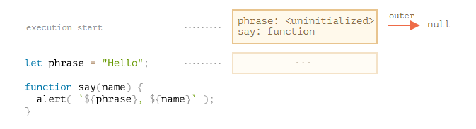

只适用函数说明,函数表达式不适用,函数表达式本质上是变量

**Step 3. 内部和外部的词法环境**

在一个函数运行时，在**调用**刚开始时，会自动创建一个**新的词法环境**以存储这个**调用**的**局部变量**和**参数**。

例如，对于 `say("John")`，它看起来像这样（当前执行位置在箭头标记的那一行上）：

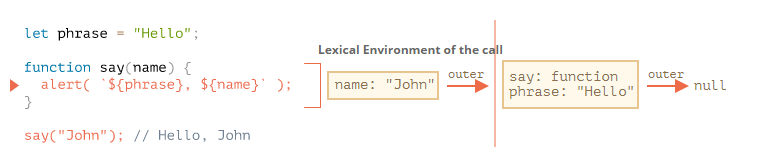

在**这个函数调用期间**，我们**有两个词法环境**：内部一个（用于函数调用）和外部一个（全局）：

- 内部词法环境与 `say` 的当前执行相对应。它具有一个单独的属性：`name`，函数的参数。我们调用的是 `say("John")`，所以 `name` 的值为 `"John"`。
- 外部词法环境是全局词法环境。它具有 `phrase` 变量和函数本身。

内部词法环境引用了 `outer`。

**当代码要访问一个变量时 —— 首先会搜索内部词法环境，然后搜索外部环境，然后搜索更外部的环境，以此类推，直到全局词法环境。**

如果在任何地方都**找不到这个变量**，那么在严格模式下就会报错（在**非严格模式**下，为了向下兼容，给**未定义**的变量赋值会创建一个**全局变量**）。

**❗Step 4. 返回函数**

让我们回到 `makeCounter` 这个例子。

```javascript
function makeCounter() {
  let count = 0;

  return function() {
    return count++;
  };
}

let counter = makeCounter();
```

在每次 `makeCounter()` 调用的开始，都会创建一个新的词法环境对象，以存储该 `makeCounter` 运行时的变量。

这一步 是makeCounter() 调用时的 词法环境

因此，我们有两层嵌套的词法环境，就像上面的示例一样：

<!--注意小三角指的位置 是 定义count 位置-->

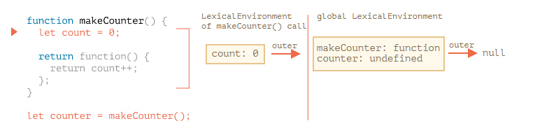

不同的是，在执行 `makeCounter()` 的过程中创建了一个仅占一行的嵌套函数：`return count++`。我们尚未运行它，仅创建了它。

虽然没有运行 return 中的匿名函数，但是创建了函数，就有了它的词法变量

所有的函数在“诞生”时都会记住创建它们的词法环境。从技术上讲，这里没有什么魔法：所有函数都有名为 `[[Environment]]` 的隐藏属性，该属性保存了对创建该函数的词法环境的引用。

<!--注意小三角指的位置 是return 匿名函数-->

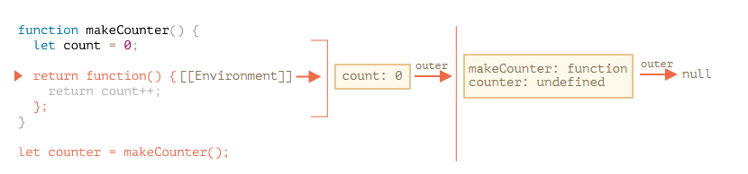
 因此，`counter.[[Environment]]` 有对 `{count: 0}` 词法环境的引用。这就是函数记住它创建于何处的方式，与函数被在哪儿调用无关。`[[Environment]]` 引用在函数创建时被设置并永久保存。

**counter（）调用时的词法环境**

当调用 `counter()` 时，会为该调用创建一个新的词法环境，并且其外部词法环境引用获取于 `counter.[[Environment]]`：

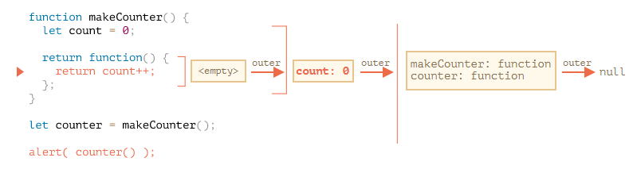

现在，当 `counter()` 中的代码查找 `count` 变量时，它首先搜索自己的词法环境（为空，因为那里没有局部变量），然后是外部 `makeCounter()` 的词法环境，并且在哪里找到就在哪里修改。

**在变量所在的词法环境中更新变量。**

这是执行后的状态：

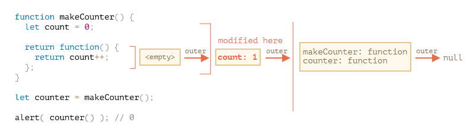

如果我们调用 `counter()` 多次，`count` 变量将在同一位置增加到 `2`，`3` 等。

**闭包**

开发者通常应该都知道“闭包”这个通用的编程术语。

[闭包](https://en.wikipedia.org/wiki/Closure_(computer_programming)) 是指内部函数总是可以访问其所在的外部函数中声明的变量和参数，即使在其外部函数被返回（寿命终结）了之后。在某些编程语言中，这是不可能的，或者应该以特殊的方式编写函数来实现。但是如上所述，在 JavaScript 中，所有函数都是天生闭包的（只有一个例外，将在 ["new Function" 语法](https://zh.javascript.info/new-function) 中讲到）。

也就是说：JavaScript 中的函数会自动通过隐藏的 `[[Environment]]` 属性记住创建它们的位置，所以它们都可以访问外部变量。

在面试时，前端开发者通常会被问到“**什么是闭包**？”,从三方面回答

1. 闭包的定义
2. 解释为什么JavaScript的所有函数都是闭包,词法环境
3. 可能的关于[[Environment]] 属性和词法环境原理的技术细节

- 闭包是指内部函数能访问到其所在的外部函数中的参数和变量
- 所有的JavaScript函数都是闭包的,因为函数在创建时,会有个隐藏的environment属性,该属性保存了 对创建该函数的词法环境的引用.也就是说,函数会通过environment属性记住创建它们的位置.在函数调用时,会创建一个新的词法环境,包含该函数的内部变量和参数,它的外部词法环境的引用是获取于该函数的 environment属性.因此所有的函数都可以访问到外部变量.所以说所有的JavaScript的函数都是闭包

#### 垃圾收集

通常，函数调用完成后，会将词法环境和其中的所有变量从内存中删除。因为现在没有任何对它们的引用了。与 JavaScript 中的任何**其他对象**一样，**词法环境**仅在**可达**时**才会被保留在内存中**。

……但是，如果有一个嵌套函数在函数结束后仍可达，则它具有引用词法环境的 `[[Environment]]` 属性。

这就是闭包的优点之一

- 可以读取函数内部的变量
- 让这些变量的值始终保存在内存中

```js
function f1(){
   var n=999;
   nAdd=function(){n+=1}
   function f2(){
     alert(n);
   }
   return f2;
}
var result=f1();
result(); // 999
nAdd();
result(); // 1000
```

在这段代码中，result实际上就是闭包f2函数。它一共运行了两次，第一次的值是999，第二次的值是1000。这证明了，函数f1中的局部变量n一直保存在内存中，并没有在f1调用后被自动清除。

为什么会这样呢？原因就在于**f1是f2的父函数，而f2被赋给了一个全局变量**，这导致f2始终在内存中，而f2的存在依赖于f1，因此f1也始终在内存中，不会在调用结束后，被垃圾回收机制（garbage collection）回收。

两个关于闭包的经典例子

匿名函数的this指向全局window,但是对于闭包来说,匿名函数的指向就不一定了

```js
var name = "The Window";
var object = {
  name : "My Object",
  getNameFunc : function(){
    return function(){
      return this.name;
    };
  }
};
alert(object.getNameFunc()());  //"The Window"（在非严格模式下）
```

```js
var name = "The Window";
var object = {
  name : "My Object",
  getNameFunc : function(){
    var that = this;
    return function(){
      return that.name;
    };
  }
};
alert(object.getNameFunc()());  //"My Object"（在非严格模式下）
```

解释:以上代码先创建了一个全局变量name，又创建了一个包含name属性的对象。这个对象还包含一个方法——getNameFunc()，它返回一个匿名函数，而匿名函数又返回this.name。由于getNameFunc()返回一个函数，因此调用object.getNameFunc()()就会立即调用它返回的函数，结果就是返回一个字符串。然而，这个例子返回的字符串是"The Window"，即全局name变量的值。为什么匿名函数没有取得其包含作用域（或外部作用域）的this对象呢？

因为每个函数在被调用时都会自动取得两个特殊变量：this和arguments。内部函数在搜索这两个变量时，只会搜索到其活动对象为止，因此永远不可能直接访问外部函数中的这两个变量；不过，把外部作用域中的this对象保存在一个闭包能够访问到的变量里，就可以让闭包访问该对象了，

### 6.5 全局对象

#### 总结

- 全局对象包含应该在任何位置都可见的变量。

  其中包括 JavaScript 的内建方法，例如 “Array” 和环境特定（environment-specific）的值，例如 `window.innerHeight` — 浏览器中的窗口高度。

- 全局对象有一个通用名称 `globalThis`。

  ……但是更常见的是使用“老式”的环境特定（environment-specific）的名字，例如 `window`（浏览器）和 `global`（Node.js）。由于 `globalThis` 是最近的提议，因此在 non-Chromium Edge 中不受支持（但可以进行 polyfills）。

- 仅当值对于我们的项目而言确实是全局的时，才应将其存储在全局对象中。并保持其数量最少。

- 在浏览器中，除非我们使用 [modules](https://zh.javascript.info/modules)，否则使用 `var` 声明的全局函数和变量会成为全局对象的属性。

- 为了使我们的代码面向未来并更易于理解，我们应该使用直接的方式访问全局对象的属性，如 `window.x`。

### 6.6 函数对象,NFE

函数是一个值,它的类型是对象.所以可以调用对象的属性访问.函数被称为 **行为对象**

我们已经知道，在 JavaScript 中，函数就是值。

JavaScript 中的每个值都有一种类型，那么函数是什么类型呢？

在 JavaScript 中，函数就是对象。

一个容易理解的方式是把函数想象成可被调用的“行为对象（action object）”。我们不仅可以调用它们，还能把它们当作对象来处理：增/删属性，按引用传递等。

#### 属性"name"

函数对象包含一些便于使用的属性。

比如，一个函数的名字可以通过属性 “name” 来访问

规范中把这种特性叫做「上下文命名」。如果函数自己没有提供，那么在赋值中，会根据上下文来推测一个.

```js
let sayHi = function() {
  alert("Hi");
};

alert(sayHi.name); // sayHi（有名字！）
```

#### 属性"length"

还有另一个内置属性 “length”，它返回函数入参的个数，比如：

```js
function f1(a) {}
function f2(a, b) {}
function many(a, b, ...more) {}

alert(f1.length); // 1
alert(f2.length); // 2
alert(many.length); // 2  rest剩余参数不在里面
```

#### 命名函数表达式

命名函数表达式（NFE，Named Function Expression），指带有名字的函数表达式的术语。

例如，让我们写一个普通的函数表达式：

```javascript
let sayHi = function(who) {
  alert(`Hello, ${who}`);
};
```

然后给它加一个名字：

```javascript
let sayHi = function func(who) {
  alert(`Hello, ${who}`);
};  // 这个就是命名函数表达式,func
```

首先请注意，它仍然是一个**函数表达式**。在 `function` 后面加一个名字 `"func"` 没有使它成为一个函数声明，因为它仍然是作为赋值表达式中的一部分被创建的。

添加这个名字当然也没有打破任何东西。

函数依然可以通过 `sayHi()` 来调用

关于名字 `func` 有两个特殊的地方，这就是添加它的原因：

1. 它允许函数在内部引用自己。
2. 它在函数外是不可见的。

例如，下面的函数 `sayHi` 会在没有入参 `who` 时，以 `"Guest"` 为入参调用自己：

```javascript
let sayHi = function func(who) {
  if (who) {
    alert(`Hello, ${who}`);
  } else {
    func("Guest"); // 使用 func 再次调用函数自身
  }
};

sayHi(); // Hello, Guest

// 但这不工作：
func(); // Error, func is not defined（在函数外不可见）
```

#### 总结

函数就是对象。

我们介绍了它们的一些属性：

- `name` —— 函数的名字。通常取自函数定义，但如果函数定义时没设定函数名，JavaScript 会尝试通过函数的上下文猜一个函数名（例如把赋值的变量名取为函数名）。
- `length` —— 函数定义时的入参的个数。Rest 参数不参与计数。

如果函数是通过函数表达式的形式被声明的（不是在主代码流里），并且附带了名字，那么它被称为命名函数表达式（Named Function Expression）。这个名字可以用于在该函数内部进行自调用，例如递归调用等。

此外，函数可以带有额外的属性。很多知名的 JavaScript 库都充分利用了这个功能。

### 6.7 "new Function"语法

#### 总结

语法：

```javascript
let func = new Function ([arg1, arg2, ...argN], functionBody);
```

由于历史原因，参数也可以按逗号分隔符的形式给出。

以下三种声明的含义相同：

```javascript
new Function('a', 'b', 'return a + b'); // 基础语法
new Function('a,b', 'return a + b'); // 逗号分隔
new Function('a , b', 'return a + b'); // 逗号和空格分隔
```

使用 `new Function` 创建的函数，它的 `[[Environment]]` 指向全局词法环境，而不是函数所在的外部词法环境。因此，我们不能在 `new Function` 中直接使用外部变量。不过这样是好事，这有助于降低我们代码出错的可能。并且，从代码架构上讲，显式地使用参数传值是一种更好的方法，并且避免了与使用压缩程序而产生冲突的问题。

### 6.8 调度: setTimeout 和 setInterval

有时我们并不想立即执行一个函数，而是等待特定一段时间之后再执行。这就是所谓的“计划调用（scheduling a call）”。

目前有两种方式可以实现：

- `setTimeout` 允许我们将函数推迟到一段时间间隔之后再执行。
- `setInterval` 允许我们重复运行一个函数，从一段时间间隔之后开始运行，之后以该时间间隔连续重复运行该函数。

#### setTimeout

语法：

```javascript
let timerId = setTimeout(func|code, [delay], [arg1], [arg2], ...)
```

参数说明：

- `func|code`

  想要执行的函数或代码字符串。 一般传入的都是函数。由于某些历史原因，支持传入代码字符串，但是不建议这样做。

- `delay`

  执行前的延时，以毫秒为单位（1000 毫秒 = 1 秒），默认值是 0；

- `arg1`，`arg2`…

  要传入被执行函数（或代码字符串）的参数列表（IE9 以下不支持）

带参数的情况：

```javascript
function sayHi(phrase, who) {
  alert( phrase + ', ' + who );
}

setTimeout(sayHi, 1000, "Hello", "John"); // Hello, John
```

如果第一个参数位传入的是**字符串**，JavaScript 会自动为其创建一个函数。

所以这么写也是可以的：

```javascript
setTimeout("alert('Hello')", 1000);
```

但是，不建议使用字符串，我们可以使用箭头函数代替它们，如下所示：

```javascript
setTimeout(() => alert('Hello'), 1000);
```

> **传入一个函数，但不要执行它**

新手开发者有时候会误将一对括号 `()` 加在函数后面：

```javascript
// 错的！
setTimeout(sayHi(), 1000);
```

这样不行，因为 `setTimeout` 期望得到一个对函数的引用。而这里的 `sayHi()` 很明显是在执行函数，所以实际上传入 `setTimeout` 的是 **函数的执行结果**。在这个例子中，`sayHi()` 的执行结果是 `undefined`（也就是说函数没有返回任何结果），所以实际上什么也没有调度。

**用 clearTimeout 来取消调度**

`setTimeout` 在调用时会返回一个“定时器标识符（timer identifier）”，在我们的例子中是 `timerId`，我们可以使用它来取消执行。

取消调度的语法：

```javascript
let timerId = setTimeout(...);
clearTimeout(timerId);
```

#### setInterval

`setInterval` 方法和 `setTimeout` 的语法相同：

```javascript
let timerId = setInterval(func|code, [delay], [arg1], [arg2], ...)
```

所有参数的意义也是相同的。不过与 `setTimeout` 只执行一次不同，`setInterval` 是每间隔给定的时间周期性执行。

想要阻止后续调用，我们需要调用 `clearInterval(timerId)`。

#### 嵌套的 setTimeout

**周期性调度**有两种方式。定时器有两种方式

一种是使用 `setInterval`，另外一种就是**嵌套**的 `setTimeout`，就像这样：

```javascript
/** instead of:
let timerId = setInterval(() => alert('tick'), 2000);
*/

let timerId = setTimeout(function tick() {
  alert('tick');
  timerId = setTimeout(tick, 2000); // (*)
}, 2000);
```

上面这个 `setTimeout` 在当前这一次函数执行完时 `(*)` 立即调度下一次调用。

嵌套的 `setTimeout` 要比 `setInterval` 灵活得多。采用这种方式可以根据当前执行结果来调度下一次调用，因此下一次调用可以与当前这一次不同。

**嵌套的 setTimeout 能够精确地设置两次执行之间的延时，而 setInterval 却不能。**

下面来比较这两个代码片段。第一个使用的是 `setInterval`：

```javascript
let i = 1;
setInterval(function() {
  func(i++);
}, 100);
```

第二个使用的是嵌套的 `setTimeout`：

```javascript
let i = 1;
setTimeout(function run() {
  func(i++);
  setTimeout(run, 100);
}, 100);
```

**使用 setInterval 时，func 函数的实际调用间隔要比代码中设定的时间间隔要短！**	

这也是正常的，因为 `func` 的执行所花费的时间“消耗”了一部分间隔时间。

也可能出现这种情况，就是 `func` 的执行所花费的时间比我们预期的时间更长，并且超出了 100 毫秒。

在这种情况下，JavaScript 引擎会等待 `func` 执行完成，然后检查调度程序，如果时间到了，则 **立即** 再次执行它。

极端情况下，如果函数每次执行时间都超过 `delay` 设置的时间，那么每次调用之间将**完全没有停顿。**(不符合定时器的要求了)

**嵌套的 setTimeout 就能确保延时的固定（这里是 100 毫秒）。**

这是因为下一次调用是在前一次调用完成时再调度的。

当一个函数传入 `setInterval/setTimeout` 时，将为其创建一个内部引用，并保存在调度程序中。这样，即使这个函数没有其他引用，也能防止垃圾回收器（GC）将其回收。

```javascript
// 在调度程序调用这个函数之前，这个函数将一直存在于内存中
setTimeout(function() {...}, 100);
```

> **垃圾回收和 setInterval/setTimeout 回调（callback）**

对于 `setInterval`，传入的函数也是一直存在于内存中，直到 `clearInterval` 被调用。

这里还要提到一个副作用。如果函数引用了外部变量（译注：闭包），那么只要这个函数还存在，外部变量也会随之存在。它们可能比函数本身占用更多的内存。因此，当我们不再需要调度函数时，最好取消它，即使这是个（占用内存）很小的函数。

#### 零延时的 setTimeout

这儿有一种特殊的用法：`setTimeout(func, 0)`，或者仅仅是 `setTimeout(func)`。

这样调度可以让 `func` 尽快执行。但是只有在当前正在执行的脚本执行完成后，调度程序才会调用它。

也就是说，该函数被调度在当前脚本执行完成“之后”立即执行。

例如，下面这段代码会先输出 “Hello”，然后立即输出 “World”：

```javascript
setTimeout(() => alert("World"));

alert("Hello");
```

#### 总结

- `setTimeout(func, delay, ...args)` 和 `setInterval(func, delay, ...args)` 方法允许我们在 `delay` 毫秒之后运行 `func` 一次或以 `delay` 毫秒为时间间隔周期性运行 `func`。
- 要取消函数的执行，我们应该调用 `clearInterval/clearTimeout`，并将 `setInterval/setTimeout` 返回的值作为入参传入。
- 嵌套的 `setTimeout` 比 `setInterval` 用起来更加灵活，允许我们更精确地设置两次执行之间的时间。
- 零延时调度 `setTimeout(func, 0)`（与 `setTimeout(func)` 相同）用来调度需要尽快执行的调用，但是会在当前脚本执行完成后进行调用。
- 浏览器会将 `setTimeout` 或 `setInterval` 的五层或更多层嵌套调用（调用五次之后）的最小延时限制在 4ms。这是历史遗留问题。

请注意，所有的调度方法都不能 **保证** 确切的延时。

例如，浏览器内的计时器可能由于许多原因而变慢：

- CPU 过载。
- 浏览器页签处于后台模式。
- 笔记本电脑用的是电池供电（译注：使用电池供电会以降低性能为代价提升续航）。

所有这些因素，可能会将定时器的最小计时器分辨率（最小延迟）增加到 300ms 甚至 1000ms，具体以浏览器及其设置为准。

### 6.9 装饰者模式和转发,call/apply

#### 装饰者模式

- 装饰者模式的定义
  - 装饰者模式: 在不改变对象自身的基础上,动态地添加功能代码.
  - 根据描述,装饰者显然比继承等方式更灵活,而且不污染原来的代码,代码逻辑松耦合
- 装饰者应用场景
  - 装饰者模式由于松耦合,多用于一开始 对象的功能 不确定的时候 或者 对象的功能经常变动的时候.尤其是在参数检查,参数拦截等场景. 
- 注意：装饰器需要保存函数的运行结果，并且返回。
- 装饰器decorator接受一个参数,也就是我们被装饰的目标方法,处理完扩展的内容以后再返回一个方法,供以后调用,同时**也失去了对原方法对象的访问**. 当我们对某个应用了装饰以后,其实就**改变**了**被装饰方法**的**入口引用**,使其重新指向了装饰器返回的方法的入口点,从而来实现我们对原函数的扩展,修改等操作.参照来源:<https://segmentfault.com/a/1190000014495089>
  - 实际应用:<https://www.cnblogs.com/lvmylife/p/7242347.html>
- 装饰器模式的类型
  - 类的装饰
  - 方法的装饰(对象中的方法/函数)

> 多方面理解,参考来源: <https://www.cnblogs.com/wuguanglin/p/DecoratorPattern.html>

**定义：**动态地给一个对象添加一些额外的职责。就增加功能来说，装饰器模式相比生成子类更为灵活。

**主要解决：**一般的，我们为了扩展一个类经常使用继承方式实现，由于继承为类引入静态特征，并且随着扩展功能的增多，子类会很膨胀。

**何时使用：**在不想增加很多子类的情况下扩展类。

**如何解决：**将具体功能职责划分，同时继承装饰者模式。

**应用实例：** 1、孙悟空有 72 变，当他变成"庙宇"后，他的根本还是一只猴子，但是他又有了庙宇的功能。 2、不论一幅画有没有画框都可以挂在墙上，但是通常都是有画框的，并且实际上是画框被挂在墙上。在挂在墙上之前，画可以被蒙上玻璃，装到框子里；这时画、玻璃和画框形成了一个物体。

**优点：**装饰类和被装饰类可以独立发展，不会相互耦合，装饰模式是继承的一个替代模式，装饰模式可以动态扩展一个实现类的功能。

**缺点：**多层装饰比较复杂。

**使用场景：** 1、扩展一个类的功能。 2、动态增加功能，动态撤销。

**注意事项：**可代替继承。

#### 使用 “func.call” 设定上下文

对于**对象方法的装饰**，需要提供上下文 context

有一个特殊的内置函数方法 func.call(context, …args)，它允许调用一个显式设置 `this` 的函数。

语法如下：

```javascript
func.call(context, arg1, arg2, ...)
```

它运行 `func`，提供的第一个参数作为 `this`，后面的作为参数（arguments）。

context的上下文

1. 简单的，将obj对象作为参数，作为`this`

   因为对象里没有定义这个方法。

   例如，在下面的代码中，我们在不同对象的上下文中调用 `sayHi`：`sayHi.call(user)` 运行 `sayHi` 并提供了 `this=user`，然后下一行设置 `this=admin`：

   ```js
   function sayHi() {
     alert(this.name);
   }
   
   let user = { name: "John" };
   let admin = { name: "Admin" };
   
   // 使用 call 将不同的对象传递为 "this"
   sayHi.call( user ); // John
   sayHi.call( admin ); // Admin
   ```

2. 复杂一点的，直接将this 作为参数

   因为是调用对象里的方法，this的指向是 `.`点之前的对象名

   在我们的例子中，我们可以在包装器中使用 `call` 将上下文传递给原始函数：

   ```javascript
   let worker = {
     someMethod() {
       return 1;
     },
   
     slow(x) {
       alert("Called with " + x);
       return x * this.someMethod(); // (*)
     }
   };
   
   function cachingDecorator(func) {
     let cache = new Map();
     return function(x) {
       if (cache.has(x)) {
         return cache.get(x);
       }
       let result = func.call(this, x); // 现在 "this" 被正确地传递了
       cache.set(x, result);
       return result;
     };
   }
   
   worker.slow = cachingDecorator(worker.slow); // 现在对其进行缓存
   
   alert( worker.slow(2) ); // 工作正常
   alert( worker.slow(2) ); // 工作正常，没有调用原始函数（使用的缓存）
   ```

   现在一切都正常工作了。

   为了让大家理解地更清晰一些，让我们更深入地看看 `this` 是如何被传递的：

   1. 在经过装饰之后，`worker.slow` 现在是包装器 `function (x) { ... }`。
   2. 因此，当 `worker.slow(2)` 执行时，包装器将 `2` 作为参数，并且 `this=worker`（它是点符号 `.` 之前的对象）。
   3. 在包装器内部，假设结果尚未缓存，`func.call(this, x)` 将当前的 `this`（`=worker`）和当前的参数（`=2`）传递给原始方法。

#### 传递多个参数

使用分布参数 spread语句`...`

当然，我们需要传入的不仅是 `x`，还需要传入 `func.call` 的所有参数。让我们回想一下，在 `function()` 中我们可以得到一个包含所有参数的伪数组（pseudo-array）`arguments`，那么 `func.call(this, x)` 应该被替换为 `func.call(this, ...arguments)`。

这个arguments是可迭代对象, 因为**spread语句**只适用于 **可迭代对象** (Array.from使用于可迭代对象,也适用于类数组)

#### func.apply

我们可以使用 `func.apply(this, arguments)` 代替 `func.call(this, ...arguments)`。

内建方法 func.apply 的语法是：

```javascript
func.apply(context, args)
```

它运行 `func` 设置 `this=context`，并使用类数组对象 `args` 作为参数列表（arguments）。

`call` 和 `apply` 之间唯一的语法区别是，`call` 期望一个**参数列表**，而 `apply` 期望一个包含这些参数的类数组对象。

因此，这两个调用几乎是等效的：

```javascript
func.call(context, ...args); // 使用 spread 语法将数组作为列表传递
func.apply(context, args);   // 与使用 call 相同
```

这里只有很小的区别：

- Spread 语法 `...` 允许将 **可迭代对象** `args` 作为列表传递给 `call`。
- `apply` 仅接受 **类数组对象** `args`。

因此，当我们期望可迭代对象时，使用 `call`，当我们期望类数组对象时，使用 `apply`。

对于**即可迭代又是类数组**的对象，例如一个真正的数组，我们使用 `call` 或 `apply` 均可，但是 `apply` 可能会**更快**，因为大多数 JavaScript 引擎在内部对其进行了优化。

将**所有参数连同上下文**一起传递给另一个函数被称为“**呼叫转移**（call forwarding）”。

这是它的最简形式：

```javascript
let wrapper = function() {
  return func.apply(this, arguments);
};
```

当外部代码调用这种包装器 `wrapper` 时，它与原始函数 `func` 的调用是无法区分的。

#### 装饰者和函数属性

就是 装饰者 装饰后,就相当于改变了原函数的入口，所以原来的函数属性 就不能用了

存在一种创建装饰者的方法，该装饰者可保留对函数属性的访问权限，但这需要使用特殊的 `Proxy` 对象来包装函数。

#### 总结

**装饰者** 是一个围绕改变函数行为的包装器。主要工作仍由该函数来完成。

装饰者可以被看作是可以添加到函数的 “features” 或 “aspects”。我们可以添加一个或添加多个。而这一切都无需更改其代码！

为了实现 `cachingDecorator`，我们研究了以下方法：

- func.call(context, arg1, arg2…)—— 用给定的上下文和参数调用 `func`。
- func.apply(context, args) —— 调用 `func` 将 `context` 作为 `this` 和类数组的 `args` 传递给参数列表。

通用的 **呼叫转移（call forwarding）** 通常是使用 `apply` 完成的：

```javascript
let wrapper = function() {
  return original.apply(this, arguments);
};
```

我们也可以看到一个 **方法借用（method borrowing）** 的例子，就是我们从一个对象中获取一个方法，并在另一个对象的上下文中“调用”它。采用数组方法并将它们应用于参数 `arguments` 是很常见的。另一种方法是使用 Rest 参数对象，该对象是一个真正的数组。

在 JavaScript 领域里有很多装饰者（decorators）

### 6.10 函数绑定

**每个函数都有自己的`this` ,如果想让`this` 指向其他对象时,可以进行函数绑定**

当将对象方法作为回调进行传递，例如传递给 `setTimeout`，这儿会存在一个常见的问题：“丢失 `this`”。

**回顾:** 一般用`this ` 是要用对象的其他属性.而`this` 是从上下文生成的

当对象方法 在其他地方调用的时候,它的上下文不是 对象 , 方法里用到this的地方就会报错.因为这时候的this是上下文生成的,没有所对应的 属性.这也是叫 **丢失this**

#### 丢失 “this”

我们已经看到了丢失 `this` 的例子。一旦**方法**被传递到与**对象分开**的某个地方 —— `this` 就丢失。

下面是使用 `setTimeout` 时 `this` 是如何丢失的：

```javascript
let user = {
  firstName: "John",
  sayHi() {
    alert(`Hello, ${this.firstName}!`);
  }
};

setTimeout(user.sayHi, 1000); // Hello, undefined!
```

正如我们所看到的，输出没有像 `this.firstName` 那样显示 “John”，而显示了 `undefined`！

这是因为 `setTimeout` 获取到了函数 `user.sayHi`，但它和对象分离开了。

#### 解决方案 1：包装器

最简单的解决方案是使用一个包装函数：

```javascript
let user = {
  firstName: "John",
  sayHi() {
    alert(`Hello, ${this.firstName}!`);
  }
};

setTimeout(function() {
  user.sayHi(); // Hello, John!
}, 1000);
```

现在它可以正常工作了，因为它从外部词法环境中获取到了 `user`，就可以正常地调用方法了。

**缺点:** 如果在 `setTimeout` 触发之前（有一秒的延迟！）`user` 的值改变了怎么办？那么，突然间，它将调用错误的对象！

#### 解决方案 2：bind

函数提供了一个内建方法 bind，它可以绑定 `this`。

基本的语法是：

```javascript
// 稍后将会有更复杂的语法
let boundFunc = func.bind(context);
```

`func.bind(context)` 的结果是一个特殊的类似于函数的“外来对象（exotic object）”，它可以像函数一样被调用，并且透明地（transparently）将调用传递给 `func` 并设定 `this=context`。

换句话说，`boundFunc` 调用就像绑定了 `this` 的 `func`。

- **函数绑定** 对象

  举个例子，这里的 `funcUser` 将调用传递给了 `func` 同时 `this=user`：

  ```js
  let user = {
    firstName: "John"
  };
  
  function func() {
    alert(this.firstName);
  }
  
  let funcUser = func.bind(user);
  funcUser(); // John
  ```

  这里的 `func.bind(user)` 作为 `func` 的“绑定的（bound）变体”，绑定了 `this=user`。

- **对象方法** 绑定对象

  ```javascript
  let user = {
    firstName: "John",
    sayHi() {
      alert(`Hello, ${this.firstName}!`);
    }
  };
  
  let sayHi = user.sayHi.bind(user); // (*) 绑定user
  
  // 可以在没有对象（译注：与对象分离）的情况下运行它
  sayHi(); // Hello, John!
  
  setTimeout(sayHi, 1000); // Hello, John!
  
  // 即使 user 的值在不到 1 秒内发生了改变
  // sayHi 还是会使用预先绑定（pre-bound）的值
  user = {
    sayHi() { alert("Another user in setTimeout!"); }
  };
  ```

  在 `(*)` 行，我们取了方法 `user.sayHi` 并将其绑定到 `user`。`sayHi` 是一个“绑定后（bound）”的方法，它可以被单独调用，也可以被传递给 `setTimeout` —— 都没关系，函数上下文都会是正确的。

> 便捷方法：bindAll

如果一个对象有很多方法，并且我们都打算将它们都传递出去，那么我们可以在一个循环中完成所有方法的绑定：

```javascript
for (let key in user) {
  if (typeof user[key] == 'function') {
    user[key] = user[key].bind(user);
  }
}
```

#### 偏函数（Partial functions）

感觉有点像  柯里化?  通过bind  绑定参数,然后再调用函数时,可以只传参剩余的参数

我们不仅可以绑定 `this`，还可以绑定参数（arguments）。虽然很少这么做，但有时它可以派上用场。

`bind` 的完整语法如下：

```javascript
let bound = func.bind(context, [arg1], [arg2], ...);
```

它允许将上下文绑定为 `this`，以及绑定函数的起始参数。

例如，我们有一个乘法函数 `mul(a, b)`：

```javascript
function mul(a, b) {
  return a * b;
}
```

让我们使用 `bind` 在该函数基础上创建一个 `double` 函数：

```javascript
function mul(a, b) {
  return a * b;
}

let double = mul.bind(null, 2);

alert( double(3) ); // = mul(2, 3) = 6
alert( double(4) ); // = mul(2, 4) = 8
alert( double(5) ); // = mul(2, 5) = 10
```

对 `mul.bind(null, 2)` 的调用创建了一个新函数 `double`，它将调用传递到 `mul`，将 `null` 绑定为上下文，并将 `2` 绑定为第一个参数。并且，参数（arguments）均被“原样”传递。

#### 总结

方法 `func.bind(context, ...args)` 返回函数 `func` 的“绑定的（bound）变体”，它绑定了上下文 `this` 和第一个参数（如果给定了）。

通常我们应用 `bind` 来绑定对象方法的 `this`，这样我们就可以把它们传递到其他地方使用。例如，传递给 `setTimeout`。

当我们绑定一个现有的函数的某些参数时，绑定后的（不太通用的）函数被称为 **partially applied** 或 **partial**。

当我们不想一遍又一遍地重复相同的参数时，partial 非常有用。就像我们有一个 `send(from, to)` 函数，并且对于我们的任务来说，`from` 应该总是一样的，那么我们就可以搞一个 partial 并使用它。

### 6.11 深入理解箭头函数

JavaScript 的精髓在于创建一个函数并将其传递到某个地方。

在这样的函数中，我们通常不想离开当前上下文。这就是箭头函数的主战场啦。

#### 箭头函数没有 “this”

箭头函数的`this` 是从从外部获取的,它本身无法通过上下文生成自己的`this`

正如我们在 [对象方法，"this"](https://zh.javascript.info/object-methods) 一章中所学到的，箭头函数没有 `this`。如果访问 `this`，则会从**外部获取**。

例如，我们可以使用它在对象方法内部进行迭代：

```javascript
let group = {
  title: "Our Group",
  students: ["John", "Pete", "Alice"],

  showList() {
    this.students.forEach(
      student => alert(this.title + ': ' + student)
    );
  }
};

group.showList();
```

这里 `forEach` 中使用了箭头函数，所以其中的 `this.title` 其实和外部方法 `showList` 的完全一样。那就是：`group.title`。

如果我们使用正常的函数，则会出现错误：

```javascript
let group = {
  title: "Our Group",
  students: ["John", "Pete", "Alice"],

  showList() {
    this.students.forEach(function(student) {
      // Error: Cannot read property 'title' of undefined
      alert(this.title + ': ' + student)
    });
  }
};

group.showList();
```

报错是因为 `forEach` 运行它里面的这个函数，但是**这个函数**的 `this` 为默认值 `this=undefined`，因此就出现了尝试访问 `undefined.title` 的情况。

但箭头函数就没事，因为**它们没有** `this`。

> **不能对箭头函数进行** `new` **操作**

不具有 `this` 自然也就意味着另一个限制：箭头函数不能用作构造器（constructor）。不能用 `new` 调用它们。

> **箭头函数 VS bind**

箭头函数 `=>` 和使用 `.bind(this)` 调用的常规函数之间有细微的差别：

- `.bind(this)` 创建了一个该函数的“绑定版本”。
- 箭头函数 `=>` 没有创建任何绑定。箭头函数只是没有 `this`。`this` 的查找与**常规变量**的**搜索方式**完全相同：在**外部词法环境**中查找。

#### 箭头函数没有 “arguments”

箭头函数也没有 `arguments` 变量.  `arguments`是js中 保存 函数的活动对象 的类数组(也可迭代),

活动对象是指 变量和参数

#### 总结

箭头函数：

- 没有 `this`
- 没有 `arguments`
- 不能使用 `new` 进行调用
- 它们也没有 `super`，但目前我们还没有学到它。我们将在 类继承一章中学习它。

这是因为，箭头函数是针对那些没有自己的“上下文”，但在当前上下文中起作用的短代码的。并且箭头函数确实在这种使用场景中大放异彩。

## 7. 对象属性配置

### 7.1  属性标志和属性描述符

对象可以存储属性。

到目前为止，属性对我们来说只是一个简单的“键值”对。但对象属性实际上是更灵活且更强大的东西。

#### 属性标志

属性除了value，还有其他三个特性：可读性，可迭代性，可配置性

对象属性（properties），除 **`value`** 外，还有三个特殊的**特性**（attributes），也就是所谓的“标志”：

- **`writable`** — 如果为 `true`，则值可以被修改，否则它是只可读的。
- **`enumerable`** — 如果为 `true`，则会被在循环中列出，否则不会被列出。
- **`configurable`** — 如果为 `true`，则此特性可以被删除，这些属性也可以被修改，否则不可以。

我们到现在还没看到它们，是因为它们通常不会出现。当我们用**“常用的方式”**创建一个属性时，它们都为 `true`。但我们也可以随时更改它们。

- ` Object.getOwnPropertyDescriptor` 方法允许查询有关属性的 **完整** 信息。查看标志

  语法是：

  ```javascript
  let descriptor = Object.getOwnPropertyDescriptor(obj, propertyName);
  ```

  - `obj`

    需要从中获取信息的对象。

  - `propertyName`

    属性的名称。

  返回值是一个所谓的“属性描述符”对象：它包含值和所有的标志。

  例如：

  ```javascript
  let user = {
    name: "John"
  };
  
  let descriptor = Object.getOwnPropertyDescriptor(user, 'name');
  
  alert( JSON.stringify(descriptor, null, 2 ) );
  /* 属性描述符：
  {
    "value": "John",
    "writable": true,
    "enumerable": true,
    "configurable": true
  }
  */
  ```

- `Object.defineProperty` 修改标志

  语法是：

  ```javascript
  Object.defineProperty(obj, propertyName, descriptor)
  ```

  - `obj`，`propertyName`

    要应用描述符的对象及其属性。

  - `descriptor`

    要应用的属性描述符对象。

  如果该属性存在，`defineProperty` 会更新其标志。如果该属性不存在，除了value值，其他三个特性都默认为false。

  例如，这里创建了一个属性 `name`，该属性的所有标志都为 `false`：

  ```javascript
  let user = {};
  
  Object.defineProperty(user, "name", {
    value: "John"
  });
  
  let descriptor = Object.getOwnPropertyDescriptor(user, 'name');
  
  alert( JSON.stringify(descriptor, null, 2 ) );
  /*
  {
    "value": "John",
    "writable": false,
    "enumerable": false,
    "configurable": false
  }
   */
  ```

#### 只读

让我们通过更改 `writable` 标志来把 `user.name` 设置为只读（`user.name` 不能被重新赋值）：

```javascript
let user = {
  name: "John"
};

Object.defineProperty(user, "name", {
  writable: false
});

user.name = "Pete"; // Error: Cannot assign to read only property 'name'
```

现在没有人可以改变我们 `user` 的 `name`，除非它们应用自己的 `defineProperty` 来覆盖我们的 `user` 的 `name`。

#### 不可枚举

可被迭代出来？

现在让我们向 `user` 添加一个自定义的 `toString`。

通常，对象的内置 `toString` 是不可枚举的，它不会显示在 `for..in` 中。但是如果我们添加我们自己的 `toString`，那么默认情况下它将显示在 `for..in` 中，如下所示：

```javascript
let user = {
  name: "John",
  toString() {
    return this.name;
  }
};

// 默认情况下，我们的两个属性都会被列出：
for (let key in user) alert(key); // name, toString
```

如果我们不喜欢它，那么我们可以设置 `enumerable:false`。之后它就不会出现在 `for..in` 循环中了，就像内建的 `toString` 一样：

```javascript
let user = {
  name: "John",
  toString() {
    return this.name;
  }
};

Object.defineProperty(user, "toString", {
  enumerable: false
});

// 现在我们的 toString 消失了：
for (let key in user) alert(key); // name
```

#### 不可配置

不可配置标志（`configurable:false`）有时会预设在内建对象和属性中。

不可配置的属性不能被删除。

使属性变成不可配置是一条单行道。我们无法使用 `defineProperty` 把它改回去。

确切地说，不可配置性对 `defineProperty` 施加了一些限制：

1. 不能修改 `configurable` 标志。
2. 不能修改 `enumerable` 标志。
3. 不能将 `writable: false` 修改为 `true`（反之亦然）。
4. 不能修改访问者属性的 `get/set`（但是如果没有可以分配它们）。

**“Non-configurable” 并不意味着 “non-writable”**

值得注意的例外情况：不可配置但可写的属性的值是可以被更改的。

`configurable: false` 的思想是防止更改属性标志或删除属性标志，而不是更改它的值。

#### Object.defineProperties

有一个方法 Object.defineProperties(obj, descriptors)，允许一次定义多个属性。

语法是：

```javascript
Object.defineProperties(obj, {
  prop1: descriptor1,
  prop2: descriptor2
  // ...
});
```

例如：

```javascript
Object.defineProperties(user, {
  name: { value: "John", writable: false },
  surname: { value: "Smith", writable: false },
  // ...
});
```

所以，我们可以一次性设置多个属性。

#### Object.getOwnPropertyDescriptors

要一次获取所有属性描述符，我们可以使用 Object.getOwnPropertyDescriptors(obj)方法。

它与 `Object.defineProperties` 一起可以用作克隆对象的“标志感知”方式：

```javascript
let clone = Object.defineProperties({}, Object.getOwnPropertyDescriptors(obj));
```

### 7.2 属性的getter 和 setter

有两种类型的对象属性。

第一种是 **数据属性**。我们已经知道如何使用它们了。到目前为止，我们使用过的所有属性都是数据属性。

第二种类型的属性是新东西。它是 **访问器属性（accessor properties）**。它们本质上是用于获取和设置值的函数，但从外部代码来看就像常规属性。

#### Getter 和 setter

访问器属性由 “getter” 和 “setter” 方法表示。在对象字面量中，它们用 `get` 和 `set` 表示：

```javascript
let obj = {
  get propName() {
    // 当读取 obj.propName 时，getter 起作用
  },

  set propName(value) {
    // 当执行 obj.propName = value 操作时，setter 起作用
  }
};
```

当读取 `obj.propName` 时，getter 起作用，当 `obj.propName` 被赋值时，setter 起作用。

```javascript
let user = {
  name: "John",
  surname: "Smith",

  get fullName() {
    return `${this.name} ${this.surname}`;
  },

  set fullName(value) {
    [this.name, this.surname] = value.split(" ");
  }
};

// set fullName 将以给定值执行
user.fullName = "Alice Cooper";

alert(user.name); // Alice
alert(user.surname); // Cooper
```

现在，我们就有一个“虚拟”属性。它是可读且可写的。

从外表看，访问器属性看起来就像一个**普通属性**。这就是访问器属性的设计思想。我们不以函数的方式 **调用**`user.fullName`，我们正常 **读取** 它：getter 在幕后运行

因为访问器属性像是普通的属性，也不是函数，所以在调用的时候，正常读取，但是调用它的getter方法,如果修改了，则调用了它的setter方法。vue的响应式原理就是因为这个

#### 访问器描述符

访问器属性的描述符与数据属性的不同。

对于访问器属性，没有 `value` 和 `writable`，但是有 `get` 和 `set` 函数。

所以访问器描述符可能有：

- **`get`** —— 一个没有参数的函数，在读取属性时工作，
- **`set`** —— 带有一个参数的函数，当属性被设置时调用，
- **`enumerable`** —— 与数据属性的相同，
- **`configurable`** —— 与数据属性的相同。

例如，要使用 `defineProperty` 创建一个 `fullName` 访问器，我们可以使用 `get` 和 `set` 来传递描述符：

```javascript
let user = {
  name: "John",
  surname: "Smith"
};

Object.defineProperty(user, 'fullName', {
  get() {
    return `${this.name} ${this.surname}`;
  },

  set(value) {
    [this.name, this.surname] = value.split(" ");
  }
});

alert(user.fullName); // John Smith

for(let key in user) alert(key); // name, surname
```

请注意，一个属性要么是访问器（具有 `get/set` 方法），要么是数据属性（具有 `value`），但不能两者都是。

#### 更聪明的 getter/setter

Getter/setter 可以用作“真实”属性值的包装器，以便对它们进行更多的控制。

例如，如果我们想禁止太短的 `user` 的 name，我们可以创建一个 setter `name`，并将值存储在一个单独的属性 `_name` 中：

```javascript
let user = {
  get name() {
    return this._name;
  },

  set name(value) {
    if (value.length < 4) {
      alert("Name is too short, need at least 4 characters");
      return;
    }
    this._name = value;
  }
};

user.name = "Pete";
alert(user.name); // Pete

user.name = ""; // Name 太短了……
```

所以，name 被存储在 `_name` 属性中，并通过 getter 和 setter 进行访问。

从技术上讲，外部代码可以使用 `user._name` 直接访问 name。但是，这儿有一个众所周知的约定，即以下划线 `"_"` 开头的属性是内部属性，不应该从对象外部进行访问。

下划线为开头的属性是只能通过对象方法访问该属性，不能从对象外部访问，这是常用的记号

## 8.  原型，继承

### 8.1 原型继承

在编程中，我们经常会想获取并扩展一些东西。

例如，我们有一个 `user` 对象及其属性和方法，并希望将 `admin` 和 `guest` 作为基于 `user` 稍加修改的变体。我们想重用 `user` 中的内容，而不是复制/重新实现它的方法，而只是在其至上构建一个新的对象。

**原型继承（Prototypal inheritance）** 这个语言特性能够帮助我们实现这一需求。

> 原型继承是对象的事

#### [[Prototype]]

在 JavaScript 中，对象有一个特殊的隐藏属性 `[[Prototype]]`（如规范中所命名的），它要么为 `null`，要么就是对另一个对象的引用。该对象被称为“原型”：

原型有点“神奇”。当我们想要从 `object` 中读取一个缺失的属性时，JavaScript 会自动从原型中获取该属性。在编程中，这种行为被称为**“原型继承**”。许多炫酷的语言特性和编程技巧都基于此。

属性 `[[Prototype]]` 是内部的而且是隐藏的，但是这儿有很多设置它的方式。

其中之一就是使用特殊的名字 `__proto__`，就像这样：

```javascript
let animal = {
  eats: true
};
let rabbit = {
  jumps: true
};

rabbit.__proto__ = animal;
```

如果我们在 `rabbit` 中查找一个缺失的属性，JavaScript 会自动从 `animal` 中获取它。

例如：

```javascript
let animal = {
  eats: true
};
let rabbit = {
  jumps: true
};

rabbit.__proto__ = animal; // (*)

// 现在这两个属性我们都能在 rabbit 中找到：
alert( rabbit.eats ); // true (**)
alert( rabbit.jumps ); // true
```

这里的 `(*)` 行将 `animal` 设置为 `rabbit` 的原型。

当 `alert` 试图读取 `rabbit.eats` `(**)` 时，因为它不存在于 `rabbit` 中，所以 JavaScript 会顺着 `[[Prototype]]` 引用，在 `animal` 中查找（自下而上）：

我们可以说 "`animal` 是 `rabbit` 的原型"，或者说 "`rabbit` 的原型是从 `animal` 继承而来的"。

因此，如果 `animal` 有许多有用的属性和方法，那么它们将自动地变为在 `rabbit` 中可用。这种属性被称为“继承”。

**原型链**

原型链就是一层一层定义`_proto_`

原型链可以很长：

```javascript
let animal = {
  eats: true,
  walk() {
    alert("Animal walk");
  }
};

let rabbit = {
  jumps: true,
  __proto__: animal
};

let longEar = {
  earLength: 10,
  __proto__: rabbit
};

// walk 是通过原型链获得的
longEar.walk(); // Animal walk
alert(longEar.jumps); // true（从 rabbit）
```

这里只有两个限制：

1. 引用不能形成闭环。如果我们试图在一个闭环中分配 `__proto__`，JavaScript 会抛出错误。
2. `__proto__` 的值可以是对象，也可以是 `null`。而其他的类型都会被忽略。

当然，这可能很显而易见，但是仍然要强调：只能有一个 `[[Prototype]]`。一个对象不能从其他两个对象获得继承。

> 一个对象只能定义一个原型，只能有一个`_proto_` 不能从两个原型中继承

#### 写入不使用原型

原型只能读，不能修改

原型对象的属性分为两种，一种是数据属性，一种是访问器属性。数据的不可以改，访问器可以

- 数据属性

  对于写入/删除操作可以直接在对象上进行。

  在下面的示例中，我们将为 `rabbit` 分配自己的 `walk`：

  ```javascript
  let animal = {
    eats: true,
    walk() {
      /* rabbit 不会使用此方法 */
    }
  };
  
  let rabbit = {
    __proto__: animal
  };
  
  rabbit.walk = function() {
    alert("Rabbit! Bounce-bounce!");
  };
  
  rabbit.walk(); // Rabbit! Bounce-bounce!
  ```

  从现在开始，`rabbit.walk()` 将立即在对象中找到该方法并执行，而无需使用原型

- 访问器属性

  访问器（accessor）属性是一个例外，因为分配（assignment）操作是由 setter 函数处理的。因此，写入此类属性实际上与调用函数相同。

  也就是这个原因，所以下面这段代码中的 `admin.fullName` 能够正常运行：

  ```javascript
  let user = {
    name: "John",
    surname: "Smith",
  
    set fullName(value) {
      [this.name, this.surname] = value.split(" ");
    },
  
    get fullName() {
      return `${this.name} ${this.surname}`;
    }
  };
  
  let admin = {
    __proto__: user,
    isAdmin: true
  };
  
  alert(admin.fullName); // John Smith (*)
  
  // setter triggers!
  admin.fullName = "Alice Cooper"; // (**)
  ```

  在 `(*)` 行中，属性 `admin.fullName` 在原型 `user` 中有一个 getter，因此它会被调用。在 `(**)` 行中，属性在原型中有一个 setter，因此它会被调用。

#### “this” 的值

在上面的例子中可能会出现一个有趣的问题：在 `set fullName(value)` 中 `this` 的值是什么？属性 `this.name` 和 `this.surname` 被写在哪里：在 `user` 还是 `admin`？

答案很简单：`this` 根本不受原型的影响。

**无论在哪里找到方法：在一个对象还是在原型中。在一个方法调用中，`this` 始终是点符号 `.` 前面的对象。**

因此，setter 调用 `admin.fullName=` 使用 `admin` 作为 `this`，而不是 `user`。

这是一件非常重要的事儿，因为我们可能有一个带有很多方法的大对象，并且还有从其继承的对象。当继承的对象运行继承的方法时，它们将仅修改自己的状态，而不会修改大对象的状态。

例如，这里的 `animal` 代表“方法存储”，`rabbit` 在使用其中的方法。

调用 `rabbit.sleep()` 会在 `rabbit` 对象上设置 `this.isSleeping`：

```javascript
// animal 有一些方法
let animal = {
  walk() {
    if (!this.isSleeping) {
      alert(`I walk`);
    }
  },
  sleep() {
    this.isSleeping = true;
  }
};

let rabbit = {
  name: "White Rabbit",
  __proto__: animal
};

// 修改 rabbit.isSleeping
rabbit.sleep();

alert(rabbit.isSleeping); // true
alert(animal.isSleeping); // undefined（原型中没有此属性）
```

结果示意图：

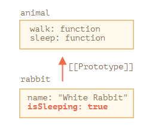

> rabbit调用了sleep方法后，sleep里面有this.isSleeping属性，rabbit里没有，它将自己写入这个属性。

如果我们还有从 `animal` 继承的其他对象，像 `bird` 和 `snake` 等，它们也将可以访问 `animal` 的方法。但是，每个方法调用中的 `this` 都是在调用时（点符号前）评估的**对应的对象**，而不是 `animal`。因此，当我们**将数据写入** `this` 时，**会将其存储到这些对象中**。

所以，方法是共享的，但对象状态不是。

#### for…in 循环

当一个对象用for..in 循环出属性名，也会包括继承的原型中的属性

`for..in` 循环也会迭代继承的属性。

例如：

```javascript
let animal = {
  eats: true,
  sleep(){
    this.isSleeping = true,
  }
};

let rabbit = {
  jumps: true,
  __proto__: animal
};
rabbit.sleep();

// Object.keys 只返回自己的 key
alert(Object.keys(rabbit)); // jumps isSleeping 

// for..in 会遍历自己以及继承的键
for(let prop in rabbit) alert(prop); // jumps isSleeping  eats sleep 依次显示
```

如果这不是我们想要的，并且我们想排除继承的属性，那么这儿有一个内建方法 **obj.hasOwnProperty(key)**：如果 `obj` 具有自己的（非继承的）名为 `key` 的属性，则返回 `true`。

因此，我们可以过滤掉继承的属性（或对它们进行其他操作）：

```javascript
let animal = {
  eats: true
};

let rabbit = {
  jumps: true,
  __proto__: animal
};

for(let prop in rabbit) {
  let isOwn = rabbit.hasOwnProperty(prop);

  if (isOwn) {
    alert(`Our: ${prop}`); // Our: jumps
  } else {
    alert(`Inherited: ${prop}`); // Inherited: eats
  }
}
```

这里我们有以下继承链：`rabbit` 从 `animal` 中继承，`animal` 从 `Object.prototype` 中继承（因为 `animal` 是对象字面量 `{...}`，所以这是默认的继承），然后再向上是 `null`

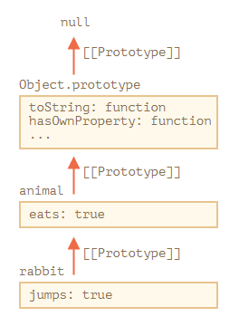

注意，这有一件很有趣的事儿。方法 `rabbit.hasOwnProperty` 来自哪儿？我们并没有定义它。从上图中的原型链我们可以看到，该方法是 `Object.prototype.hasOwnProperty` 提供的。换句话说，它是继承的。

……如果 `for..in` 循环会列出继承的属性，那为什么 `hasOwnProperty` 没有像 `eats` 和 `jumps` 那样出现在 `for..in` 循环中？

答案很简单：它是不可枚举的。就像 `Object.prototype` 的其他属性，`hasOwnProperty` 有 `enumerable:false` 标志。并且 `for..in` 只会列出可枚举的属性。这就是为什么它和其余的 `Object.prototype` 属性都未被列出。

**几乎所有其他键/值获取方法都忽略继承的属性**

> 可以在5.9中看到对象获取键/值的方法。与5.8 的map 相似

几乎所有其他键/值获取方法，例如 `Object.keys` 和 `Object.values` 等，都会忽略继承的属性。

它们只会对对象自身进行操作。**不考虑** 继承自原型的属性。

#### 总结

- 在JavaScript中，所有的对象都有一个隐藏的`[[Prototype]]` 属性，它要么是另一个对象，要么就是`null`.
- 我们可以使用`obj._proto_`访问它，（历史遗留下来的getter/setter，这儿还有其他方法）
- 通过`[[Prototype]]` 引用的 对象被称为“原型”
- 如果我们想要读取`obj`的一个属性或者调用一个方法，并且它不存在，那么JavaScript就会尝试在原型中查找它
- 写/删除操作直接在对象上进行，它们不使用原型（假设它是数据属性，不是setter）
- 如果我们调用`obj.method()`，而且`method`是从原型中获取的，`this` 仍然会引用`obj`，因此，方法始终与当前对象一起使用，即使方法是继承的
- `for..in`循环在其自身和继承的属性上进行迭代。所有其他的键/值获取方法仅对对象本身起作用

### 8.2 F.prototype

【 **构造函数的原型对象**

每个对象都有个隐藏的属性[[prototype]]，构造函数是函数 => 函数是对象，所有构造函数也有原型对象，构造函数的prototype属性指向的就是原型对象。原型对象里有个默认的属性`constructor`（构造函数）指向的是构造函数。

当new 一个构造函数后，实例化对象后，就会有`[[prototype]]`属性，这个属性是指向原型对象的】

```js
alert(obj.__proto__ === Object.prototype); // true，obj 是实例化对象，Object是构造函数
```

`new F()` 这样的构造函数来创建一个新对象。

如果 `F.prototype` 是一个对象，那么 `new` 操作符会使用它为新对象设置 `[[Prototype]]`。

请注意，这里的 `F.prototype` 指的是 `F` 的一个名为 `"prototype"` 的常规属性。这听起来与“原型”这个术语很类似，但这里我们实际上指的是具有该名字的常规属性。

- F.prototype 和 新对象的[[prototype]]的关系

  下面是一个例子：

```javascript
let animal = {
  eats: true
};

function Rabbit(name) {
  this.name = name;
}

Rabbit.prototype = animal;

let rabbit = new Rabbit("White Rabbit"); //  rabbit.__proto__ == animal

alert( rabbit.eats ); // true
```

​	设置 `Rabbit.prototype = animal` 的字面意思是：“当创建了一个 `new Rabbit` 时，把它的 `[[Prototype]]` 赋值为 `animal`”。

​	这是结果示意图：

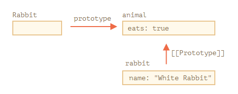

​	在上图中，`"prototype"` 是一个水平箭头，表示一个常规属性，`[[Prototype]]` 是垂直的，表示 `rabbit` 继承自 `animal`。

**`F.prototype` 仅用在 `new F` 时**

（之前的`_proto_`是普通对象设置原型对象，这个prototype是构造函数指向原型对象的属性）

`F.prototype` 属性仅在 `new F` 被调用时使用，它为新对象的 `[[Prototype]]` 赋值。

如果在创建之后，`F.prototype` 属性有了变化（`F.prototype = `），那么通过 `new F` 创建的新对象也将随之拥有新的对象作为 `[[Prototype]]`，但已经存在的对象将保持旧有的值。

（这段可以参考红宝书的p157 创建新对象后，重写原型对象，导致新对象的原型对象还是指向原来的。）

#### 默认的 F.prototype，构造器属性

每个函数都有 `"prototype"` 属性，即使我们没有提供它。（每个构造函数都有原型对象）

默认的 `"prototype"` 是一个只有属性 `constructor` 的对象，属性 `constructor` 指向函数自身。

像这样：

```javascript
function Rabbit() {}

/* default prototype
Rabbit.prototype = { constructor: Rabbit };
*/
```

我们可以使用 `constructor` 属性来创建一个新对象，该对象使用与现有对象相同的构造器。

像这样：

```javascript
function Rabbit(name) {
  this.name = name;
  alert(name);
}

let rabbit = new Rabbit("White Rabbit");

let rabbit2 = new rabbit.constructor("Black Rabbit");//因为新对象的constructor从原型对象获取，而这个属性的value 是构造函数。所以可以这样new 新对象
```

但是，关于 `"constructor"` 最重要的是……

**……JavaScript 自身并不能确保正确的 `"constructor"` 函数值。**

是的，它存在于函数的默认 `"prototype"` 中，但仅此而已。之后会发生什么 —— 完全取决于我们。

特别是，如果我们将整个默认 prototype 替换掉，那么其中就不会有 `"constructor"` 了。

例如：

```javascript
function Rabbit() {}
Rabbit.prototype = { //重写原型对象，导致默认的constructor构造函数属性没有了
  jumps: true
};

let rabbit = new Rabbit();
alert(rabbit.constructor === Rabbit); // false
```

（为了保证 constructor构造函数的指针存在，在重写原型对象时，加上constructor的属性，或者不重写，直接添加删除）

因此，为了确保正确的 `"constructor"`，我们可以选择添加/删除属性到默认 `"prototype"`，而不是将其整个覆盖：

```javascript
function Rabbit() {}

// 不要将 Rabbit.prototype 整个覆盖
// 可以向其中添加内容
Rabbit.prototype.jumps = true
// 默认的 Rabbit.prototype.constructor 被保留了下来
```

或者，也可以手动重新创建 `constructor` 属性：

```javascript
Rabbit.prototype = {
  jumps: true,
  constructor: Rabbit
};

// 这样的 constructor 也是正确的，因为我们手动添加了它
```

#### 总结

我们简要介绍了为通过构造函数**创建的对象**设置 `[[Prototype]]` 的方法。稍后我们将看到更多依赖于此的高级编程模式。

一切都很简单，只需要记住几条重点就可以清晰地掌握了：

- `F.prototype` 属性（不要把它与 `[[Prototype]]` 弄混了）在 `new F` 被调用时为**新对象**的 `[[Prototype]]` 赋值。
- `F.prototype` 的值要么是一个对象，要么就是 `null`：其他值都不起作用。
- `"prototype"` 属性仅在设置了一个**构造函数**（constructor function），并通过 `new` 调用时，才具有这种特殊的影响。

（只有构造函数的prototype属性才会指向新的对象，这个对象就是原型对象。普通对象的prototype属性就是属性，不是原型对象）

在**常规对象**上，`prototype` 没什么特别的：

```javascript
let user = {
  name: "John",
  prototype: "Bla-bla" // 这里没有魔法了
};
```

默认情况下，所有函数都有 `F.prototype = {constructor：F}`，所以我们可以通过访问它的 `"constructor"` 属性来获取一个对象的构造器。

### 8.3 原生的原型

`"prototype"` 属性在 JavaScript 自身的核心部分中被广泛地应用。所有的内置构造函数都用到了它。

首先，我们将看看原生原型的详细信息，然后学习如何使用它为**内建对象**添加新功能。

#### Object.prototype

假如我们输出一个空对象：

```javascript
let obj = {};
alert( obj ); // "[object Object]" ?
```

生成字符串 `"[object Object]"` 的代码在哪里？那就是一个内建的 `toString` 方法，但是它在哪里呢？`obj` 是空的！

……然而简短的表达式 `obj = {}` 和 `obj = new Object()` 是一个意思，其中 `Object` 就是一个内建的对象构造函数，其自身的 `prototype` 指向一个带有 `toString` 和其他方法的一个巨大的对象。

就像这样：

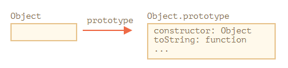

当 `new Object()` 被调用（或一个字面量对象 `{...}` 被创建），按照前面章节中我们学习过的规则，这个对象的 `[[Prototype]]` 属性被设置为 `Object.prototype`：

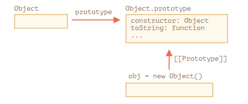

所以，之后当 `obj.toString()` 被调用时，这个方法是从 `Object.prototype` 中获取的。

#### 其他内建原型

其他内建对象，像 `Array`、`Date`、`Function` 及其他，都在 prototype 上挂载了方法。

例如，当我们创建一个数组 `[1, 2, 3]`，在内部会默认使用 `new Array()` 构造器。因此 `Array.prototype` 变成了这个数组的 prototype，并为这个数组提供数组的操作方法。这样内存的存储效率是很高的。

按照规范，所有的内建原型顶端都是 `Object.prototype`。这就是为什么有人说“一切都从对象继承而来”。

下面是完整的示意图（3 个内建对象）：

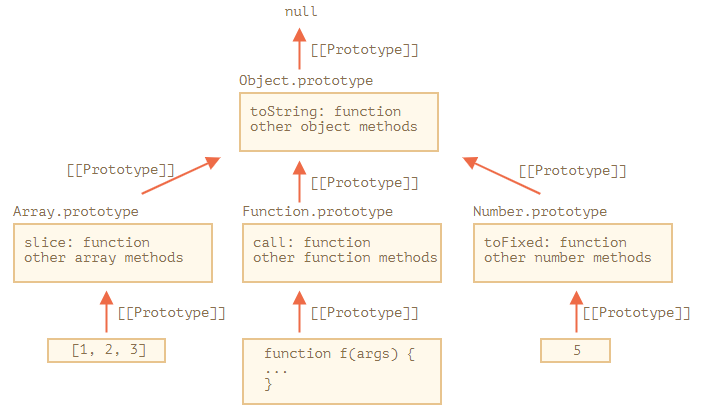

#### 基本数据类型

(5.1中基本数据类型数字 字符串那些不是对象，但是在调用它们方法时，会有一个”对象包装器“，使用后即可被销毁)

正如我们记忆中的那样，它们并不是对象。但是如果我们试图访问它们的属性，那么临时包装器对象将会通过内建的构造器 `String`、`Number` 和 `Boolean` 被创建。它们提供给我们操作字符串、数字和布尔值的方法然后消失。

这些对象对我们来说是无形地创建出来的。大多数引擎都会对其进行优化，但是规范中描述的就是通过这种方式。这些对象的方法也驻留在它们的 prototype 中，可以通过 `String.prototype`、`Number.prototype` 和 `Boolean.prototype` 进行获取。

**值 `null` 和 `undefined` 没有对象包装器**

特殊值 `null` 和 `undefined` 比较特殊。它们没有对象包装器，所以它们没有方法和属性。并且它们也没有相应的原型。

#### 更改原生原型

（原生的原型对象可以被修改，但最好不要修改。只有polyfilling可以被修改）

原生的原型是可以被修改的。例如，我们向 `String.prototype` 中添加一个方法，这个方法将对所有的字符串都是可用的：

**重要：**

原型是全局的，所以很容易造成冲突。如果有两个库都添加了 `String.prototype.show` 方法，那么其中的一个方法将被另一个覆盖。

所以，通常来说，修改原生原型被认为是一个很不好的想法。

**在现代编程中，只有一种情况下允许修改原生原型。那就是 polyfilling。**

Polyfilling 是一个术语，表示某个方法在 JavaScript 规范中已存在，但是特定的 JavaScript 引擎尚不支持该方法，那么我们可以通过手动实现它，并用以填充内建原型。

#### 总结

- 所有的内建对象都遵循相同的模式（pattern）：
  - 方法都存储在 prototype 中（`Array.prototype`、`Object.prototype`、`Date.prototype` 等）。
  - 对象本身只存储数据（数组元素、对象属性、日期）。
- 原始数据类型也将方法存储在包装器对象的 prototype 中：`Number.prototype`、`String.prototype` 和 `Boolean.prototype`。只有 `undefined` 和 `null` 没有包装器对象。
- 内建原型可以被修改或被用新的方法填充。但是不建议更改它们。唯一允许的情况可能是，当我们添加一个还没有被 JavaScript 引擎支持，但已经被加入 JavaScript 规范的新标准时，才可能允许这样做。

### 8.4 原型方法，没有\_proto\_的对象

（`_proto`设置对象的原型对象 是过时的方法，现在用别的方法）

在这部分内容的第一章中，我们提到了设置原型的现代方法。

`__proto__` 被认为是过时且不推荐使用的（deprecated），这里的不推荐使用是指 JavaScript 规范中规定，**proto** 必须仅在浏览器环境下才能得到支持。

现代的方法有：

- Object.create(proto, [descriptors\]) —— 利用给定的 `proto` 作为 `[[Prototype]]` 和可选的属性描述来创建一个空对象。
- Object.getPrototypeOf(obj) —— 返回对象 `obj` 的 `[[Prototype]]`。
- Object.setPrototypeOf(obj, proto)—— 将对象 `obj` 的 `[[Prototype]]` 设置为 `proto`。

应该使用这些方法来代替 `__proto__`。

例如：

```javascript
let animal = {
  eats: true
};

// 创建一个以 animal 为原型的新对象
let rabbit = Object.create(animal); // （普通对象创建原型对象）

alert(rabbit.eats); // true

alert(Object.getPrototypeOf(rabbit) === animal); // true

Object.setPrototypeOf(rabbit, {}); // 将 rabbit 的原型修改为 {}
```

`Object.create` 有一个可选的第二参数：**属性描述器**。我们可以在此处为新对象提供额外的属性，就像这样：

```javascript
let animal = {
  eats: true
};

let rabbit = Object.create(animal, {
  jumps: {
    value: true
  }
});

alert(rabbit.jumps); // true
```

描述器的格式与 属性标志和属性描述符 一章中所讲的一样。

（这个方法的对象克隆，是连原型对象都克隆下来）

我们可以使用 `Object.create` 来实现比复制 `for..in` 循环中的属性更强大的对象克隆方式：

```javascript
let clone = Object.create(Object.getPrototypeOf(obj), Object.getOwnPropertyDescriptors(obj));
```

此调用可以对 `obj` 进行真正准确地拷贝，包括所有的属性：可枚举和不可枚举的，数据属性和 setters/getters —— 包括所有内容，并带有正确的 `[[Prototype]]`。

#### 总结

设置和直接访问原型的现代方法有：

- [Object.create(proto, [descriptors\])](https://developer.mozilla.org/zh/docs/Web/JavaScript/Reference/Global_Objects/Object/create) —— 利用给定的 `proto` 作为 `[[Prototype]]`（可以是 `null`）和可选的属性描述来创建一个空对象。
- [Object.getPrototypeOf(obj)](https://developer.mozilla.org/zh/docs/Web/JavaScript/Reference/Global_Objects/Object/getPrototypeOf) —— 返回对象 `obj` 的 `[[Prototype]]`（与 `__proto__` 的 getter 相同）。
- [Object.setPrototypeOf(obj, proto)](https://developer.mozilla.org/zh/docs/Web/JavaScript/Reference/Global_Objects/Object/setPrototypeOf) —— 将对象 `obj` 的 `[[Prototype]]` 设置为 `proto`（与 `__proto__` 的 setter 相同）。

其他方法：

- [Object.keys(obj)](https://developer.mozilla.org/zh/docs/Web/JavaScript/Reference/Global_Objects/Object/keys) / [Object.values(obj)](https://developer.mozilla.org/zh/docs/Web/JavaScript/Reference/Global_Objects/Object/values) / [Object.entries(obj)](https://developer.mozilla.org/zh/docs/Web/JavaScript/Reference/Global_Objects/Object/entries) —— 返回一个可枚举的由自身的字符串属性名/值/键值对组成的数组。
- [Object.getOwnPropertySymbols(obj)](https://developer.mozilla.org/zh/docs/Web/JavaScript/Reference/Global_Objects/Object/getOwnPropertySymbols) —— 返回一个由自身所有的 symbol 类型的键组成的数组。
- [Object.getOwnPropertyNames(obj)](https://developer.mozilla.org/zh/docs/Web/JavaScript/Reference/Global_Objects/Object/getOwnPropertyNames) —— 返回一个由自身所有的字符串键组成的数组。
- [Reflect.ownKeys(obj)](https://developer.mozilla.org/zh/docs/Web/JavaScript/Reference/Global_Objects/Reflect/ownKeys) —— 返回一个由自身所有键组成的数组。
- [obj.hasOwnProperty(key)](https://developer.mozilla.org/zh/docs/Web/JavaScript/Reference/Global_Objects/Object/hasOwnProperty)：如果 `obj` 拥有名为 `key` 的自身的属性（非继承而来的），则返回 `true`。

所有返回对象属性的方法（如 `Object.keys` 及其他）—— 都返回“自身”的属性。如果我们想继承它们，我们可以使用 `for...in`。

# 浏览器：文档，事件，接口

学习如何管理浏览器页面：添加元素，操作元素的大小和位置，动态创建接口并与访问者互动

## 1. Document

### 1.1 浏览器环境，规格

JavaScript 语言最初是为 Web 浏览器创建的。此后，它已经发展成为一种具有多种用途和平台的语言。

平台可以是一个浏览器，一个 Web 服务器，或其他 **主机（host）**，甚至可以是一个“智能”咖啡机，如果它能运行 JavaScript 的话。它们每个都提供了特定于平台的功能。JavaScript 规范将其称为 **主机环境**。

主机环境提供了自己的对象和语言核心以外的函数。Web 浏览器提供了一种控制网页的方法。Node.JS 提供了服务器端功能，等等。

下面是 JavaScript 在浏览器中运行时的鸟瞰示意图：

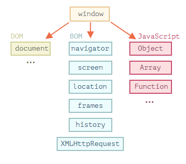

有一个叫做 `window` 的“根”对象。它有两个角色：

1. 首先，它是 JavaScript 代码的全局对象，如 全局对象一章所述。
2. 其次，它代表“浏览器窗口”，并提供了控制它的方法。

#### 文档对象模型（DOM）

（DOM是对象，对象名是document）

文档对象模型（Document Object Model），简称 DOM，将所有页面内容表示为可以修改的对象。

`document` 对象是页面的主要“入口点”。我们可以使用它来更改或创建页面上的任何内容。

例如：

```javascript
// 将背景颜色修改为红色
document.body.style.background = "red";

// 在 1 秒后将其修改回来
setTimeout(() => document.body.style.background = "", 1000);
```

在这里，我们使用了 `document.body.style`，但还有很多很多其他的东西。规范中有属性和方法的详细描述：[DOM Living Standard](https://dom.spec.whatwg.org/)。

**DOM 不仅仅用于浏览器**

DOM 规范解释了文档的结构，并提供了操作文档的对象。有的非浏览器设备也使用 DOM。

例如，下载 HTML 文件并对其进行处理的服务器端脚本也可以使用 DOM。但他们可能仅支持部分规范中的内容。

#### 浏览器对象模型（BOM）

（BOM是多个对象，这些对象的作用是处理文档之外的所有内容）

浏览器对象模型（Browser Object Model），简称 BOM，表示由浏览器（主机环境）提供的用于处理文档（document）之外的所有内容的其他对象。

例如：

- [navigator](https://developer.mozilla.org/zh/docs/Web/API/Window/navigator) 对象提供了有关浏览器和操作系统的背景信息。navigator 有许多属性，但是最广为人知的两个属性是：`navigator.userAgent` — 关于当前浏览器，`navigator.platform` — 关于平台（可以帮助区分 Windows/Linux/Mac 等）。
- [location](https://developer.mozilla.org/zh/docs/Web/API/Window/navigator) 对象允许我们读取当前 URL，并且可以将浏览器重定向到新的 URL。

这是我们可以如何使用 `location` 对象的方法：

```javascript
alert(location.href); // 显示当前 URL
if (confirm("Go to Wikipedia?")) {
  location.href = "https://wikipedia.org"; // 将浏览器重定向到另一个 URL
}
```

函数 `alert/confirm/prompt` 也是 BOM 的一部分：它们与文档（document）没有直接关系，但它代表了与用户通信的纯浏览器方法。

#### 总结

说到标准，我们有：

- DOM 规范

  描述文档的结构、操作和事件，详见 [https://dom.spec.whatwg.org](https://dom.spec.whatwg.org/)。

- CSSOM 规范

  描述样式表和样式规则，对它们进行的操作，以及它们与文档的绑定，详见 https://www.w3.org/TR/cssom-1/。

- HTML 规范

  描述 HTML 语言（例如标签）以及 BOM（浏览器对象模型）— 各种浏览器函数：`setTimeout`，`alert`，`location` 等，详见 [https://html.spec.whatwg.org](https://html.spec.whatwg.org/)。它采用了 DOM 规范，并使用了许多其他属性和方法对其进行了扩展。

### 1.2 DOM树

HTML 文档的主干是**标签**（tag）。

根据文档对象模型（DOM），每个 HTML 标签都是一个对象。嵌套的标签是闭合标签的“子标签（children）”。标签内的文本也是一个对象。

所有这些对象都可以通过 JavaScript 来访问，我们可以使用它们来修改页面。

例如，`document.body` 是表示 `body` 标签的对象。

#### DOM 的例子

让我们从下面这个简单的文档（document）开始：

```html
<!DOCTYPE HTML>
<html>
<head>
  <title>About elk</title>
</head>
<body>
  The truth about elk.
</body>
</html>
```

DOM 将 HTML 表示为标签的树形结构。它看起来如下所示：

<svg width="690" height="320"><g transform="translate(20,30)"><path class="link" d="M7,0L7,30L40.333333333333336,30" style="fill: none; stroke: rgb(190, 195, 199); stroke-width: 1px;"></path><path class="link" d="M7,0L7,180L40.333333333333336,180" style="fill: none; stroke: rgb(190, 195, 199); stroke-width: 1px;"></path><path class="link" d="M7,0L7,210L40.333333333333336,210" style="fill: none; stroke: rgb(190, 195, 199); stroke-width: 1px;"></path><path class="link" d="M40.333333333333336,30L40.333333333333336,60L73.66666666666667,60" style="fill: none; stroke: rgb(190, 195, 199); stroke-width: 1px;"></path><path class="link" d="M40.333333333333336,30L40.333333333333336,90L73.66666666666667,90" style="fill: none; stroke: rgb(190, 195, 199); stroke-width: 1px;"></path><path class="link" d="M40.333333333333336,30L40.333333333333336,150L73.66666666666667,150" style="fill: none; stroke: rgb(190, 195, 199); stroke-width: 1px;"></path><path class="link" d="M73.66666666666667,90L73.66666666666667,120L107,120" style="fill: none; stroke: rgb(190, 195, 199); stroke-width: 1px;"></path><path class="link" d="M40.333333333333336,210L40.333333333333336,240L73.66666666666667,240" style="fill: none; stroke: rgb(190, 195, 199); stroke-width: 1px;"></path><g class="node" transform="translate(0,0)" style="opacity: 1;"><rect y="-12.5" x="-5" rx="4" ry="4" height="25" width="250" style="fill: rgb(206, 224, 244); cursor: pointer;"></rect><text dy="4.5" dx="3.5" style="fill: black; pointer-events: none;">▾ </text><text dy="4.5" dx="16.5" style="font: 14px Consolas, &quot;Lucida Console&quot;, Menlo, Monaco, monospace; fill: rgb(51, 51, 51); pointer-events: none;">HTML</text></g><g class="node" transform="translate(33.33333206176758,30)" style="opacity: 1;"><rect y="-12.5" x="-5" rx="4" ry="4" height="25" width="250" style="fill: rgb(206, 224, 244); cursor: pointer;"></rect><text dy="4.5" dx="3.5" style="fill: black; pointer-events: none;">▾ </text><text dy="4.5" dx="16.5" style="font: 14px Consolas, &quot;Lucida Console&quot;, Menlo, Monaco, monospace; fill: rgb(51, 51, 51); pointer-events: none;">HEAD</text></g><g class="node" transform="translate(66.66666412353516,60)" style="opacity: 1;"><rect y="-12.5" x="-5" rx="4" ry="4" height="25" width="250" style="fill: rgb(255, 222, 153); cursor: pointer;"></rect><text dy="4.5" dx="3.5" style="fill: black; pointer-events: none;"></text><text dy="4.5" dx="5.5" style="font: 14px Consolas, &quot;Lucida Console&quot;, Menlo, Monaco, monospace; fill: rgb(51, 51, 51); pointer-events: none;">#text ↵␣␣␣␣</text></g><g class="node" transform="translate(66.66666412353516,90)" style="opacity: 1;"><rect y="-12.5" x="-5" rx="4" ry="4" height="25" width="250" style="fill: rgb(206, 224, 244); cursor: pointer;"></rect><text dy="4.5" dx="3.5" style="fill: black; pointer-events: none;">▾ </text><text dy="4.5" dx="16.5" style="font: 14px Consolas, &quot;Lucida Console&quot;, Menlo, Monaco, monospace; fill: rgb(51, 51, 51); pointer-events: none;">TITLE</text></g><g class="node" transform="translate(100,120)" style="opacity: 1;"><rect y="-12.5" x="-5" rx="4" ry="4" height="25" width="250" style="fill: rgb(255, 222, 153); cursor: pointer;"></rect><text dy="4.5" dx="3.5" style="fill: black; pointer-events: none;"></text><text dy="4.5" dx="5.5" style="font: 14px Consolas, &quot;Lucida Console&quot;, Menlo, Monaco, monospace; fill: rgb(51, 51, 51); pointer-events: none;">#text About elk</text></g><g class="node" transform="translate(66.66666412353516,150)" style="opacity: 1;"><rect y="-12.5" x="-5" rx="4" ry="4" height="25" width="250" style="fill: rgb(255, 222, 153); cursor: pointer;"></rect><text dy="4.5" dx="3.5" style="fill: black; pointer-events: none;"></text><text dy="4.5" dx="5.5" style="font: 14px Consolas, &quot;Lucida Console&quot;, Menlo, Monaco, monospace; fill: rgb(51, 51, 51); pointer-events: none;">#text ↵␣␣</text></g><g class="node" transform="translate(33.33333206176758,180)" style="opacity: 1;"><rect y="-12.5" x="-5" rx="4" ry="4" height="25" width="250" style="fill: rgb(255, 222, 153); cursor: pointer;"></rect><text dy="4.5" dx="3.5" style="fill: black; pointer-events: none;"></text><text dy="4.5" dx="5.5" style="font: 14px Consolas, &quot;Lucida Console&quot;, Menlo, Monaco, monospace; fill: rgb(51, 51, 51); pointer-events: none;">#text ↵␣␣</text></g><g class="node" transform="translate(33.33333206176758,210)" style="opacity: 1;"><rect y="-12.5" x="-5" rx="4" ry="4" height="25" width="250" style="fill: rgb(206, 224, 244); cursor: pointer;"></rect><text dy="4.5" dx="3.5" style="fill: black; pointer-events: none;">▾ </text><text dy="4.5" dx="16.5" style="font: 14px Consolas, &quot;Lucida Console&quot;, Menlo, Monaco, monospace; fill: rgb(51, 51, 51); pointer-events: none;">BODY</text></g><g class="node" transform="translate(66.66666412353516,240)" style="opacity: 1;"><rect y="-12.5" x="-5" rx="4" ry="4" height="25" width="250" style="fill: rgb(255, 222, 153); cursor: pointer;"></rect><text dy="4.5" dx="3.5" style="fill: black; pointer-events: none;"></text><text dy="4.5" dx="5.5" style="font: 14px Consolas, &quot;Lucida Console&quot;, Menlo, Monaco, monospace; fill: rgb(51, 51, 51); pointer-events: none;">#text 
  The truth about elk.</text></g></g></svg>

(文本节点是DOM树的叶子)

每个树的节点都是一个对象。

标签被称为 **元素节点**（或者仅仅是元素），并形成了树状结构：HTML 在根节点 ，head和 body 是其子项，等。

元素内的文本形成 **文本节点**，被标记为 `＃text`。一个文本节点只包含一个字符串。它没有子项，并且总是树的叶子。

例如，`title` 标签里面有文本 `"About elk"`。

请注意文本节点中的特殊字符：

- 换行符：`↵`（在 JavaScript 中为 `\n`）
- 空格：`␣`

空格和换行符都是完全有效的字符，就像字母和数字。它们形成文本节点并成为 DOM 的一部分。所以，例如，在上面的示例中，`` 标签中的 `` 标签前面包含了一些空格，并且该文本变成了一个 `#text` 节点（它只包含一个换行符和一些空格）。

只有两个顶级排除项：

1. 由于历史原因，head 之前的空格和换行符均被忽略。
2. 如果我们在 `/body` 之后放置一些东西，那么它会被自动移动到 `body` 内，并处于 `body` 中的最下方，因为 HTML 规范要求所有内容必须位于 `` 内。所以 `` 之后不能有空格。

在其他情况下，一切都很简单 — 如果文档中有空格（就像任何字符一样），那么它们将成为 DOM 中的文本节点，而如果我们删除它们，则不会有任何空格。

#### 自动修正

如果浏览器遇到格式不正确的 HTML，它会在形成 DOM 时自动更正它。

在生成 DOM 时，浏览器会自动处理文档中的错误，关闭标签等。

**表格永远有** \<**tbody**\>

表格是一个有趣的“特殊的例子”。按照 DOM 规范，它们必须具有 ，但 HTML 文本却（官方的）忽略了它。然后浏览器在创建 DOM 时，自动地创建了 。

对于 HTML：

```markup
<table id="table"><tr><td>1</td></tr></table>
```

DOM 结构会变成：

<svg width="690" height="360"><g transform="translate(20,30)"><path class="link" d="M7,0L7,30L40.333333333333336,30" style="fill: none; stroke: rgb(190, 195, 199); stroke-width: 1px;"></path><path class="link" d="M7,0L7,60L40.333333333333336,60" style="fill: none; stroke: rgb(190, 195, 199); stroke-width: 1px;"></path><path class="link" d="M40.333333333333336,60L40.333333333333336,90L73.66666666666667,90" style="fill: none; stroke: rgb(190, 195, 199); stroke-width: 1px;"></path><path class="link" d="M40.333333333333336,60L40.333333333333336,150L73.66666666666667,150" style="fill: none; stroke: rgb(190, 195, 199); stroke-width: 1px;"></path><path class="link" d="M40.333333333333336,60L40.333333333333336,210L73.66666666666667,210" style="fill: none; stroke: rgb(190, 195, 199); stroke-width: 1px;"></path><path class="link" d="M40.333333333333336,60L40.333333333333336,270L73.66666666666667,270" style="fill: none; stroke: rgb(190, 195, 199); stroke-width: 1px;"></path><path class="link" d="M73.66666666666667,90L73.66666666666667,120L107,120" style="fill: none; stroke: rgb(190, 195, 199); stroke-width: 1px;"></path><path class="link" d="M73.66666666666667,150L73.66666666666667,180L107,180" style="fill: none; stroke: rgb(190, 195, 199); stroke-width: 1px;"></path><path class="link" d="M73.66666666666667,270L73.66666666666667,300L107,300" style="fill: none; stroke: rgb(190, 195, 199); stroke-width: 1px;"></path><path class="link" d="M73.66666666666667,210L73.66666666666667,240L107,240" style="fill: none; stroke: rgb(190, 195, 199); stroke-width: 1px;"></path><g class="node" transform="translate(0,0)" style="opacity: 1;"><rect y="-12.5" x="-5" rx="4" ry="4" height="25" width="250" style="fill: rgb(206, 224, 244); cursor: pointer;"></rect><text dy="4.5" dx="3.5" style="fill: black; pointer-events: none;">▾ </text><text dy="4.5" dx="16.5" style="font: 14px Consolas, &quot;Lucida Console&quot;, Menlo, Monaco, monospace; fill: rgb(51, 51, 51); pointer-events: none;">HTML</text></g><g class="node" transform="translate(33.33333206176758,30)" style="opacity: 1;"><rect y="-12.5" x="-5" rx="4" ry="4" height="25" width="250" style="fill: rgb(206, 224, 244); cursor: pointer;"></rect><text dy="4.5" dx="3.5" style="fill: black; pointer-events: none;">▾ </text><text dy="4.5" dx="16.5" style="font: 14px Consolas, &quot;Lucida Console&quot;, Menlo, Monaco, monospace; fill: rgb(51, 51, 51); pointer-events: none;">HEAD</text></g><g class="node" transform="translate(33.33333206176758,60)" style="opacity: 1;"><rect y="-12.5" x="-5" rx="4" ry="4" height="25" width="250" style="fill: rgb(206, 224, 244); cursor: pointer;"></rect><text dy="4.5" dx="3.5" style="fill: black; pointer-events: none;">▾ </text><text dy="4.5" dx="16.5" style="font: 14px Consolas, &quot;Lucida Console&quot;, Menlo, Monaco, monospace; fill: rgb(51, 51, 51); pointer-events: none;">BODY</text></g><g class="node" transform="translate(66.66666412353516,90)" style="opacity: 1;"><rect y="-12.5" x="-5" rx="4" ry="4" height="25" width="250" style="fill: rgb(206, 224, 244); cursor: pointer;"></rect><text dy="4.5" dx="3.5" style="fill: black; pointer-events: none;">▾ </text><text dy="4.5" dx="16.5" style="font: 14px Consolas, &quot;Lucida Console&quot;, Menlo, Monaco, monospace; fill: rgb(51, 51, 51); pointer-events: none;">P</text></g><g class="node" transform="translate(100,120)" style="opacity: 1;"><rect y="-12.5" x="-5" rx="4" ry="4" height="25" width="250" style="fill: rgb(255, 222, 153); cursor: pointer;"></rect><text dy="4.5" dx="3.5" style="fill: black; pointer-events: none;"></text><text dy="4.5" dx="5.5" style="font: 14px Consolas, &quot;Lucida Console&quot;, Menlo, Monaco, monospace; fill: rgb(51, 51, 51); pointer-events: none;">#text Hello</text></g><g class="node" transform="translate(66.66666412353516,150)" style="opacity: 1;"><rect y="-12.5" x="-5" rx="4" ry="4" height="25" width="250" style="fill: rgb(206, 224, 244); cursor: pointer;"></rect><text dy="4.5" dx="3.5" style="fill: black; pointer-events: none;">▾ </text><text dy="4.5" dx="16.5" style="font: 14px Consolas, &quot;Lucida Console&quot;, Menlo, Monaco, monospace; fill: rgb(51, 51, 51); pointer-events: none;">LI</text></g><g class="node" transform="translate(100,180)" style="opacity: 1;"><rect y="-12.5" x="-5" rx="4" ry="4" height="25" width="250" style="fill: rgb(255, 222, 153); cursor: pointer;"></rect><text dy="4.5" dx="3.5" style="fill: black; pointer-events: none;"></text><text dy="4.5" dx="5.5" style="font: 14px Consolas, &quot;Lucida Console&quot;, Menlo, Monaco, monospace; fill: rgb(51, 51, 51); pointer-events: none;">#text Mom</text></g><g class="node" transform="translate(66.66666412353516,210)" style="opacity: 1;"><rect y="-12.5" x="-5" rx="4" ry="4" height="25" width="250" style="fill: rgb(206, 224, 244); cursor: pointer;"></rect><text dy="4.5" dx="3.5" style="fill: black; pointer-events: none;">▾ </text><text dy="4.5" dx="16.5" style="font: 14px Consolas, &quot;Lucida Console&quot;, Menlo, Monaco, monospace; fill: rgb(51, 51, 51); pointer-events: none;">LI</text></g><g class="node" transform="translate(66.66666412353516,270)" style="opacity: 1;"><rect y="-12.5" x="-5" rx="4" ry="4" height="25" width="250" style="fill: rgb(206, 224, 244); cursor: pointer;"></rect><text dy="4.5" dx="3.5" style="fill: black; pointer-events: none;">▾ </text><text dy="4.5" dx="16.5" style="font: 14px Consolas, &quot;Lucida Console&quot;, Menlo, Monaco, monospace; fill: rgb(51, 51, 51); pointer-events: none;">LI</text></g><g class="node" transform="translate(100,300)" style="opacity: 1;"><rect y="-12.5" x="-5" rx="4" ry="4" height="25" width="250" style="fill: rgb(255, 222, 153); cursor: pointer;"></rect><text dy="4.5" dx="3.5" style="fill: black; pointer-events: none;"></text><text dy="4.5" dx="5.5" style="font: 14px Consolas, &quot;Lucida Console&quot;, Menlo, Monaco, monospace; fill: rgb(51, 51, 51); pointer-events: none;">#text Dad</text></g><g class="node" transform="translate(100,240)" style="opacity: 1;"><rect y="-12.5" x="-5" rx="4" ry="4" height="25" width="250" style="fill: rgb(255, 222, 153); cursor: pointer;"></rect><text dy="4.5" dx="3.5" style="fill: black; pointer-events: none;"></text><text dy="4.5" dx="5.5" style="font: 14px Consolas, &quot;Lucida Console&quot;, Menlo, Monaco, monospace; fill: rgb(51, 51, 51); pointer-events: none;">#text and</text></g></g></svg>

看到了吗？ 出现了。你应该记住这一点，以免在使用表格时，对这种情况感到惊讶。

#### 其他节点类型

除了元素和文本节点外，还有一些其他的节点类型。

新的树节点类型 — *comment node*，被标记为 `#comment`

**HTML 中的所有内容，甚至注释，都会成为 DOM 的一部分。**

一共有 [12 种节点类型](https://dom.spec.whatwg.org/#node)。实际上，我们通常用到的是其中的 4 种：

1. `document` — DOM 的“入口点”。
2. 元素节点 — HTML 标签，树构建块。
3. 文本节点 — 包含文本。
4. 注释 — 有时我们可以将一些信息放入其中，它不会显示，但 JS 可以从 DOM 中读取它。

#### 总结

HTML/XML 文档在浏览器内均被表示为 DOM 树。

- 标签（tag）成为元素节点，并形成文档结构。
- 文本（text）成为文本节点。
- ……等，HTML 中的所有东西在 DOM 中都有它的位置，甚至对注释也是如此。

我们可以使用开发者工具来检查（inspect）DOM 并手动修改它。

### 1.3 遍历DOM

DOM 让我们可以对元素和它们中的内容做任何事，但是首先我们需要获取到对应的 DOM 对象。

对 DOM 的所有操作都是以 `document` 对象开始。它是 DOM 的主“入口点”。从它我们可以访问任何节点。

这里是一张描述对象间链接的图片，通过这些链接我们可以在 DOM 节点之间移动。

（这个DOM节点包括文本 节点，注释节点，元素节点等）


#### 在最顶层：documentElement 和 body

对于&lt;html&gt; 和&lt;head&gt;\<body\> document有直接的访问的属性

最顶层的树节点可以直接作为`document`的属性来使用：

- `<html>` = `document.documentElement`
- `<body> ` = `document.body`
- `<head>` = `document.head`

#### 子节点：childNodes，firstChild，lastChild

- **子节点（或者叫作子）** — 对应的是**直系的子元素**。换句话说，它们被完全嵌套在给定的元素中。例如，`<head>` 和 `<body>` 就是 `<html>` 元素的子元素。
- **子孙元素** — 嵌套在给定元素中的**所有元素**，包括子元素，以及子元素的子元素等。

**`childNodes` 集合列出了所有子节点，包括文本节点。**

**`firstChild` 和 `lastChild` 属性是访问第一个和最后一个子元素的快捷方式。**

它们只是简写。如果元素存在子节点，那么下面的脚本运行结果将是 true：

```javascript
elem.childNodes[0] === elem.firstChild
elem.childNodes[elem.childNodes.length - 1] === elem.lastChild
```

这里还有一个特别的函数 `elem.hasChildNodes()` 用于检查节点是否有子节点。

**DOM 集合**

正如我们看到的那样，`childNodes` 看起来就像一个数组。但实际上它并不是一个数组，而是一个 **集合** — 一个类数组的可迭代对象。

这个性质会导致两个重要的结果：

1. 我们可以使用 `for..of` 来迭代它：

```javascript
for (let node of document.body.childNodes) {
  alert(node); // 显示集合中的所有节点
}
```

这是因为集合是可迭代的（提供了所需要的 `Symbol.iterator` 属性）。

2. 无法使用数组的方法，因为它不是一个数组：

```javascript
alert(document.body.childNodes.filter); // undefined（这里没有 filter 方法！）
```

**DOM 集合是只读的**

DOM 集合，甚至可以说本章中列出的 **所有** 导航（navigation）属性都是只读的。

我们不能通过类似 `childNodes[i] = ...` 的操作来替换一个子节点。

修改子节点需要使用其它方法。我们将会在下一章中看到它们。

**DOM 集合是实时的**

除小部分例外，几乎所有的 DOM 集合都是 **实时** 的。换句话说，它们反映了 DOM 的当前状态。

如果我们保留一个对 `elem.childNodes` 的引用，然后向 DOM 中添加/移除节点，那么这些节点的更新会自动出现在集合中。

**不要使用 `for..in` 来遍历集合**

可以使用 `for..of` 对集合进行迭代。但有时候人们会尝试使用 `for..in` 来迭代集合。

请不要这么做。`for..in` 循环遍历的是所有可枚举的（enumerable）属性。集合还有一些“额外的”很少被用到的属性，通常这些属性也是我们不期望得到的

#### 兄弟节点和父节点

**兄弟节点（Sibling）** 是指有同一个父节点的节点。

下一个兄弟节点在 `nextSibling` 属性中，上一个是在 `previousSibling` 属性中。

可以通过 `parentNode` 来访问父节点。

例如：

```javascript
// <body> 的父节点是 <html>
alert( document.body.parentNode === document.documentElement ); // true

// <head> 的后一个是 <body>
alert( document.head.nextSibling ); // HTMLBodyElement

// <body> 的前一个是 <head>
alert( document.body.previousSibling ); // HTMLHeadElement
```

#### 纯元素导航

(原来的图是所有的节点的DOM，这个是只有元素，不包含文本节点，注释节点等)

但是对于很多任务来说，我们并不想要文本节点或注释节点。我们希望操纵的是代表标签的和形成页面结构的元素节点。

所以，让我们看看更多只考虑 **元素节点** 的导航链接（navigation link）：


这些链接和我们在上面提到过的类似，只是在词中间加了 `Element`：

- `children` — 仅那些作为元素节点的子代的节点。
- `firstElementChild`，`lastElementChild` — 第一个和最后一个子元素。
- `previousElementSibling`，`nextElementSibling` — 兄弟元素。
- `parentElement` — 父元素。

**为什么是 `parentElement`? 父节点可以不是一个元素吗？**

`parentElement` 属性返回的是“元素类型”的父节点，而 `parentNode` 返回的是“任何类型”的父节点。这些属性通常来说是一样的：它们都是用于获取父节点。

唯一的例外就是 `document.documentElement`：

```javascript
alert( document.documentElement.parentNode ); // document
alert( document.documentElement.parentElement ); // null
```

#### 总结

给定一个 DOM 节点，我们可以使用导航（navigation）属性访问其直接的邻居。

这些属性主要分为两组：

- 对于所有节点：`parentNode`，`childNodes`，`firstChild`，`lastChild`，`previousSibling`，`nextSibling`。
- 仅对于元素节点：`parentElement`，`children`，`firstElementChild`，`lastElementChild`，`previousElementSibling`，`nextElementSibling`。

某些类型的 DOM 元素，例如 table，提供了用于访问其内容的其他属性和集合。

### 1.4 搜索：getElement，querySelector

(用来搜索DOM树中的节点，来做一些操作)

#### document.getElementById 或者只使用 id

如果一个元素有 `id` 特性（attribute），那我们就可以使用 `document.getElementById(id)` 方法获取该元素，无论它在哪里。

例如：

```html
<div id="elem">
  <div id="elem-content">Element</div>
</div>

<script>
  // 获取该元素
  let elem = document.getElementById('elem');

  // 将该元素背景改为红色
  elem.style.background = 'red';
</script>
```

**请不要使用以 id 命名的全局变量来访问元素**

在本教程中，我们只会在元素来源非常明显时，为了简洁起见，才会使用 `id` 直接引用对应的元素。

在实际开发中，`document.getElementById` 是首选方法。

**`id` 必须是唯一的**

`id` 必须是唯一的。在文档中，只能有一个元素带有给定的 `id`。

如果有多个元素都带有同一个 `id`，那么使用它的方法的行为是不可预测的，例如 `document.getElementById` 可能会随机返回其中一个元素。因此，请遵守规则，保持 `id` 的唯一性。

**只有 `document.getElementById`，没有 `anyElem.getElementById`**

`getElementById` 方法只能被在 `document` 对象上调用。它会在整个文档中查找给定的 `id`。

#### querySelectorAll

（这个是通过选择器来选择节点）

到目前为止，最通用的方法是 `elem.querySelectorAll(css)`，它返回 `elem` 中与给定 CSS 选择器匹配的所有元素。

在这里，我们查找所有为最后一个子元素的 `` 元素：

```HTML
<ul>
  <li>The</li>
  <li>test</li>
</ul>
<ul>
  <li>has</li>
  <li>passed</li>
</ul>
<script>
  let elements = document.querySelectorAll('ul > li:last-child');

  for (let elem of elements) {
    alert(elem.innerHTML); // "test", "passed"
  }
</script>
```

这个方法确实功能强大，因为可以使用任何 CSS 选择器。

**也可以使用伪类**

CSS 选择器的伪类，例如 `:hover` 和 `:active` 也都是被支持的。例如，`document.querySelectorAll(':hover')` 将会返回鼠标指针现在已经结束的元素的集合（按嵌套顺序：从最外层 `<html>` 到嵌套最多的元素）。

#### querySelector

`elem.querySelector(css)` 调用会返回给定 CSS 选择器的**第一个元素**。

换句话说，结果与 `elem.querySelectorAll(css)[0]` 相同，但是后者会查找 **所有** 元素，并从中选取一个，而 `elem.querySelector` 只会查找一个。因此它在速度上更快，并且写起来更短。

#### matches

之前的方法是搜索 DOM。

[elem.matches(css)](http://dom.spec.whatwg.org/#dom-element-matches) 不会查找任何内容，它只会检查 `elem` 是否与给定的 CSS 选择器匹配。它返回 `true` 或 `false`。

当我们遍历元素（例如数组或其他内容）并试图过滤那些我们感兴趣的元素时，这个方法会很有用。

#### closest

元素的祖先（ancestor）是：父级，父级的父级，它的父级等。祖先们一起组成了从元素到顶端的父级链。

`elem.closest(css)` 方法会查找与 CSS 选择器匹配的**最近的祖先**。`elem` 自己也会被搜索。

换句话说，方法 `closest` 在元素中得到了提升，并检查每个父级。如果它与选择器匹配，则停止搜索并返回该祖先。

#### getElementsBy*

(这些方法成为历史了，用的更多是选择器查看)

还有其他通过标签，类等查找节点的方法。

如今，它们大多已经成为了历史，因为 `querySelector` 功能更强大，写起来更短。

因此，这里我们介绍它们只是为了完整起见，而你仍然可以在就脚本中找到这些方法。

- `elem.getElementsByTagName(tag)` 查找具有给定标签的元素，并返回它们的集合。`tag` 参数也可以是对于“任何标签”的星号 `"*"`。
- `elem.getElementsByClassName(className)` 返回具有给定CSS类的元素。
- `document.getElementsByName(name)` 返回在文档范围内具有给定 `name` 特性的元素。很少使用。

**不要忘记字母 `"s"`！**

新手开发者有时会忘记字符 `"s"`。也就是说，他们会调用 `getElementByTagName` 而不是 `getElement**s**ByTagName`。

`getElementById` 中没有字母 `"s"`，是因为它只返回单个元素。但是 `getElementsByTagName` 返回的是元素的集合，所以里面有 `"s"`。

**它返回的是一个集合，不是一个元素！**

新手的另一个普遍的错误是写：

```javascript
// 行不通
document.getElementsByTagName('input').value = 5;
```

这是行不通的，因为它需要的是一个 input 的 **集合**，并将值赋（assign）给它，而不是赋值给其中的一个元素。

我们应该遍历集合或通过对应的索引来获取元素，然后赋值，如下所示：

```javascript
// 应该可以运行（如果有 input）
document.getElementsByTagName('input')[0].value = 5;
```

#### 总结

有 6 种主要的方法，可以在 DOM 中搜素节点：

| Method                   | Searches by... | Can call on an element? | Live? |
| ------------------------ | -------------- | ----------------------- | ----- |
| `querySelector`          | CSS-selector   | ✔                       | -     |
| `querySelectorAll`       | CSS-selector   | ✔                       | -     |
| `getElementById`         | `id`           | -                       | -     |
| `getElementsByName`      | `name`         | -                       | ✔     |
| `getElementsByTagName`   | tag or `'*'`   | ✔                       | ✔     |
| `getElementsByClassName` | class          | ✔                       | ✔     |

目前为止，最常用的是 `querySelector` 和 `querySelectorAll`，但是 `getElementBy*` 可能会偶尔有用，或者可以在旧脚本中找到。

此外：

- `elem.matches(css)` 用于检查 `elem` 与给定的 CSS 选择器是否匹配。
- `elem.closest(css)` 用于查找与给定 CSS 选择器相匹配的最近的祖先。`elem` 本身也会被检查。

让我们在这里提一下另一种用来检查子级与父级之间关系的方法，因为它有时很有用：

- 如果 `elemB` 在 `elemA` 内（`elemA` 的后代）或者 `elemA==elemB`，`elemA.contains(elemB)` 将返回 true。

### 1.5 节点属性: type, tag 和 content

#### DOM 节点类

(从前面直到,DOM节点有12类,但常用的就是 元素节点,文本节点,注释节点.元素节点 相对应有 相关属性)

不同的 DOM 节点可能有不同的属性。例如，标签 `<a>` 相对应的元素节点具有链接相关的（link-related）属性，标签 `<input>` 相对应的元素节点具有与输入相关的属性，等。文本节点与元素节点不同。但是所有这些标签对应的 DOM 节点之间也存在共有的属性和方法，因为所有类型的 DOM 节点都形成了一个单一层次的结构（single hierarchy）。

每个 DOM 节点都属于相应的内建类。

层次结构（hierarchy）的根节点是 [EventTarget](https://dom.spec.whatwg.org/#eventtarget)，[Node](http://dom.spec.whatwg.org/#interface-node) 继承自它，其他 DOM 节点继承自 Node。

下图做了进一步说明：

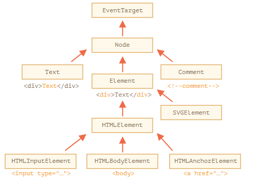
  类如下所示：

- EventTarget — 是根的“抽象（abstract）”类。该类的对象从未被创建。它作为一个基础，以便让所有 DOM 节点都支持所谓的“事件（event）”，我们会在之后学习它。
- Node — 也是一个“抽象”类，充当 DOM 节点的基础。它提供了树的核心功能：parentNode，nextSibling，childNodes 等（它们都是 getter）。Node 类的对象从未被创建。但是有一些继承自它的具体的节点类，例如：文本节点的 Text，元素节点的 Element，以及更多异域（exotic）类，例如注释节点的 Comment。
- Element — 是 DOM 元素的基本类。它提供了元素级的导航（navigation），例如 nextElementSibling，children，以及像 getElementsByTagName 和 querySelector 这样的搜索方法。浏览器中不仅有 HTML，还会有 XML 和 SVG。Element 类充当更多特定类的基本类：SVGElement，XMLElement 和 HTMLElement。
- HTMLElement — 最终是所有 HTML 元素的基本类。各种 HTML 元素均继承自它：
  - HTMLInputElement — \<input\> 元素的类，
  - HTMLBodyElement —\<body\> 元素的类，
  - HTMLAnchorElement —\<a\> 元素的类，
    ……等，每个标签都有自己的类，这些类可以提供特定的属性和方法。

因此，给定节点的全部属性和方法都是继承的结果。

#### “nodeType” 属性

(可以获得节点的类型)

`nodeType` 属性提供了另一种“过时的”用来获取 **DOM 节点类型**的方法。

它有一个数值型值（numeric value）：

- 对于元素节点 `elem.nodeType == 1`，
- 对于文本节点 `elem.nodeType == 3`，
- 对于 document 对象 `elem.nodeType == 9`，
- 在 规范中还有一些其他值。

例如：

```html
<body>
  <script>
  let elem = document.body;

  // 让我们检查一下它是什么？
  alert(elem.nodeType); // 1 => element

  // 第一个子节点是
  alert(elem.firstChild.nodeType); // 3 => text

  // 对于 document 对象，类型是 9
  alert( document.nodeType ); // 9
  </script>
</body>
```

在现代脚本中，我们可以使用 `instanceof` 和其他基于类的检查方法来查看节点类型，但有时 `nodeType` 可能更简单。我们只能读取 `nodeType` 而不能修改它。

#### 标签：nodeName 和 tagName

给定一个 DOM 节点，我们可以从 `nodeName` 或者 `tagName` 属性中读取它的标签名：

例如：

```javascript
alert( document.body.nodeName ); // BODY  (注意是大写)
alert( document.body.tagName ); // BODY
```

tagName 和 nodeName 之间有什么不同吗？

当然，差异就体现在它们的名字上，但确实有些微妙。

- `tagName` 属性仅适用于 `Element` 节点。
- `nodeName` 是为任意 `Node` 定义的：
  - 对于元素，它的意义与 `tagName` 相同。
  - 对于其他节点类型（text，comment 等），它拥有一个对应节点类型的字符串。

换句话说，`tagName` 仅受元素节点支持（因为它起源于 `Element` 类），而 `nodeName` 则可以说明其他节点类型。

**标签名称始终是大写的，除非是在 XML 模式下**

浏览器有两种处理文档（document）的模式：HTML 和 XML。通常，HTML 模式用于网页。只有在浏览器接收到带有 header `Content-Type: application/xml+xhtml` 的 XML-document 时，XML 模式才会被启用。

在 HTML 模式下，`tagName/nodeName` 始终是大写的：它是 `BODY`，而不是 `<body>` 或 `<BoDy>`。

在 XML 模式中，大小写保持为“原样”。如今，XML 模式很少被使用。

#### innerHTML：内容

**innerHTML** 属性允许将元素中的 HTML 获取为字符串形式。

我们也可以修改它。因此，它是更改页面最有效的方法之一。

下面这个示例显示了 `document.body` 中的内容，然后将其完全替换：

(注意是内容,不包含两边的标签.不包含body,outerHTML是包含body的)

```html
<body>
  <p>A paragraph</p>
  <div>A div</div>

  <script>
    alert( document.body.innerHTML ); // 读取当前内容
    document.body.innerHTML = 'The new BODY!'; // 替换它
  </script>

</body>
```

**小心：“innerHTML+=” 会进行完全重写**

换句话说，`innerHTML+=` 做了以下工作：

1. 移除旧的内容。
2. 然后写入新的 `innerHTML`（新旧结合）。

**因为内容已“归零”并从头开始重写，因此所有的图片和其他资源都将重写加载。**

#### outerHTML：元素的完整 HTML

`outerHTML` 属性包含了元素的完整 HTML。就像 `innerHTML` 加上元素本身一样。

- outerHTML 和 innerHTML 区别 参考文章:<https://www.cnblogs.com/hy96/p/11402072.html>

**注意：与 innerHTML 不同，写入 outerHTML 不会改变元素。而是在 DOM 中替换它。**

考虑下面这个示例：

```html
<div>Hello, world!</div>

<script>
  let div = document.querySelector('div');

  // 使用 <p>...</p> 替换 div.outerHTML
  div.outerHTML = '<p>A new element</p>'; // (*)

  // 蛤！'div' 还是原来那样！
  alert(div.outerHTML); // <div>Hello, world!</div> (**)
</script>
```

在 `(*)` 行，我们使用 `<p>A new element</p>` 替换 `div`。在外部文档（DOM）中我们可以看到的是新内容而不是 `<div>`。但是正如我们在 `(**)` 行所看到的，旧的 `div` 变量并没有被改变。

`outerHTML` 赋值不会修改 DOM 元素（在这个例子中是被 ‘div’ 引用的对象），而是将其从 DOM 中删除并在其位置插入新的 HTML。

所以，在 `div.outerHTML=...` 中发生的事情是：

- `div` 被从文档（document）中移除。
- 另一个 HTML 片段 `<p>A new element</p>` 被插入到其位置上。
- `div` 仍拥有其旧的值。新的 HTML 没有被赋值给任何变量。

在这儿很容易出错：修改 `div.outerHTML` 然后继续使用 `div`，就好像它包含的是新内容一样。但事实并非如此。这样的东西对于 `innerHTML` 是正确的，但是对于 `outerHTML` 却不正确。

我们可以向 `elem.outerHTML` 写入内容，但是要记住，它不会改变我们所写的元素（‘elem’）。而是将新的 HTML 放在其位置上。我们可以通过查询 DOM 来获取对新元素的引用。

#### nodeValue/data：文本节点内容

(元素节点的话,可以用innerHTML获得元素节点的内容.其他节点可以用nodeValue/data获得)

`innerHTML` 属性仅对元素节点有效。

其他节点类型，例如文本节点，具有它们的对应项：`nodeValue` 和 `data` 属性。这两者在实际使用中几乎相同，只有细微规范上的差异。因此，我们将使用 `data`，因为它更短。

读取文本节点和注释节点的内容的示例：

```html
<body>
  Hello
  <!-- Comment -->
  <script>
    let text = document.body.firstChild;
    alert(text.data); // Hello

    let comment = text.nextSibling;
    alert(comment.data); // Comment
  </script>
</body>
```

#### textContent：纯文本

`textContent` 提供了对元素内的 **文本** 的访问权限：仅文本，去掉所有 `<tags>`。

例如：

```html
<div id="news">
  <h1>Headline!</h1>
  <p>Martians attack people!</p>
</div>

<script>
  // Headline! Martians attack people!
  alert(news.textContent);
</script>
```

正如我们所看到，只返回文本，就像所有 `<tags>` 都被剪掉了一样，但实际上其中的文本仍然存在。

在实际开发中，用到这样的文本读取的场景非常少。

**写入 textContent 要有用得多，因为它允许以“安全方式”写入文本。**

假设我们有一个用户输入的任意字符串，我们希望将其显示出来。

- 使用 `innerHTML`，我们将其“作为 HTML”插入，带有所有 **HTML 标签**。
- 使用 `textContent`，我们将其“作为文本”插入，所有符号（symbol）均按字面意义处理。

#### “hidden” 属性

“hidden” 特性（attribute）和 DOM 属性（property）指定元素是否可见。

我们可以在 HTML 中使用它，或者使用 JavaScript 进行赋值，如下所示：

```html
<div>Both divs below are hidden</div>

<div hidden>With the attribute "hidden"</div>

<div id="elem">JavaScript assigned the property "hidden"</div>

<script>
  elem.hidden = true;
</script>
```

从技术上来说，`hidden` 与 `style="display:none"` 做的是相同的事。但 `hidden` 写法更简洁。

#### 更多属性

DOM 元素还有其他属性，特别是那些依赖于 class 的属性：

- `value` — `<input>`，`<select>` 和 `<textarea>`（`HTMLInputElement`，`HTMLSelectElement`……）的 value。
- `href` — `<a href="...">`（`HTMLAnchorElement`）的 href。
- `id` — 所有元素（`HTMLElement`）的 “id” 特性（attribute）的值。
- ……以及更多其他内容……

#### 总结

每个 DOM 节点都属于一个特定的类。这些类形成层次结构（hierarchy）。完整的属性和方法集是继承的结果。

主要的 DOM 节点属性有：

- `nodeType`

  我们可以使用它来查看节点是文本节点还是元素节点。它具有一个数值型值（numeric value）：`1` 表示元素，`3`表示文本节点，其他一些则代表其他节点类型。只读。

- `nodeName/tagName`

  用于元素名，标签名（除了 XML 模式，都要大写）。对于非元素节点，`nodeName` 描述了它是什么。只读。

- `innerHTML`

  元素的 HTML 内容。可以被修改。

- `outerHTML`

  元素的完整 HTML。对 `elem.outerHTML` 的写入操作不会触及 `elem` 本身。而是在外部上下文中将其替换为新的 HTML。

- `nodeValue/data`

  非元素节点（文本、注释）的内容。两者几乎一样，我们通常使用 `data`。可以被修改。

- `textContent`

  元素内的文本：HTML 减去所有 `<tags>`。写入文本会将文本放入元素内，所有特殊字符和标签均被视为文本。可以安全地插入用户生成的文本，并防止不必要的 HTML 插入。

- `hidden`

  当被设置为 `true` 时，执行与 CSS `display:none` 相同的事。

DOM 节点还具有其他属性，具体有哪些属性则取决于它们的类。例如，`<input>` 元素（`HTMLInputElement`）支持 `value`，`type`，而 `<a>` 元素（`HTMLAnchorElement`）则支持 `href` 等。大多数标准 HTML 特性（attribute）都具有相应的 DOM 属性。

然而，但是 HTML 特性（attribute）和 DOM 属性（property）并不总是相同的

# js补充

## 闭包

开发者通常应该都知道“闭包”这个通用的编程术语。

[闭包](https://en.wikipedia.org/wiki/Closure_(computer_programming)) 是指内部函数总是可以访问其所在的外部函数中声明的变量和参数，即使在其外部函数被返回（寿命终结）了之后。在某些编程语言中，这是不可能的，或者应该以特殊的方式编写函数来实现。但是如上所述，在 JavaScript 中，所有函数都是天生闭包的（只有一个例外，将在 ["new Function" 语法](https://zh.javascript.info/new-function) 中讲到）。

也就是说：JavaScript 中的函数会自动通过隐藏的 `[[Environment]]` 属性记住创建它们的位置，所以它们都可以访问外部变量。

在面试时，前端开发者通常会被问到“**什么是闭包**？”,从三方面回答

1. 闭包的定义
2. 解释为什么JavaScript的所有函数都是闭包,词法环境
3. 可能的关于[[Environment]] 属性和词法环境原理的技术细节

- 闭包是指内部函数能访问到其所在的外部函数中的参数和变量

- 所有的JavaScript函数都是闭包的,因为函数在创建时,会有个隐藏的environment属性,该属性保存了 对创建该函数的词法环境的引用.也就是说,函数会通过environment属性记住创建它们的位置.在函数调用时,会创建一个新的词法环境,包含该函数的内部变量和参数,它的外部词法环境的引用是获取于该函数的 environment属性.因此所有的函数都可以访问到**外部变量**.所以说所有的JavaScript的函数都是闭包

  (能引用外部变量,就是闭包函数)

## this,call/apply/bind

### 参考文章

- 函数调用的方式和this的丢失:<https://www.jianshu.com/p/a3af18991e82>
  - 写的很清楚,普通函数,构造函数,方法,call/apply
- call/apply/bind的区别:<https://www.cnblogs.com/starry-skys/p/11901677.html>
  - call和apply是理解调用该函数,bind是返回一个新函数,需要额外调用
  - call携带的参数是列表,可以用spread语句,可迭代的对象
  - apply携带的参数 是类数组对象

###  函数调用以及this指向

**函数的几种调用方式以及他们的this指向**

1. 普通函数调用  内部的`this` 指向全局对象 window(浏览器是window)
2. 构造函数调用  内部的`this ` 指向新创建的对象
3. 对象的方法调用 内部的`this`指向调用的对象本身
4. 通过call 或者 apply 方式调用(函数上下文), `this` 指向的是当前的上下文对象

**普通函数的调用**

```js
// 1.普通函数的this 指向全局
function getThis(){
  console.log(this);
}
getThis() //Object [global] {..} (node环境)
```

**对象方法调用**

```js
// 2.对象方法的this
let obj = {
  name:"lily",
  sayHi(){
    console.log(this.name);
  }
}
// 2.1 调用对象里的方法
obj.sayHi(); //lily
// 2.2 将方法赋给函数,sayhello就是普通函数,这就会导致this的丢失
let sayhello = obj.sayHi;
sayhello(); //undefined(name是undefined)
```

**`this` 的丢失:**

注意,当把对象方法 赋给 一个值后,类似于函数表达式,这个时候就丢失this了,再调用,就相当于调用的是全局对象

```js
// 2.3 对象方法的使用方法
var obj = {
  foo: function () { 
    console.log(this.bar) 
  },
  bar: 1
};

var foo = obj.foo;
var bar = 2;

obj.foo() // 1
foo() // 2 (node环境下是undefined,浏览器中是2)
```


**构造函数调用**

```js
// 3.构造函数的this
function GetThis(name,age){
  this.name = name;
  this.age = age
  console.log("构造函数",this); 
}

let newGetThis = new GetThis('lily',13);
console.log(newGetThis);//GetThis { name: 'lily', age: 13 }
let test1= new GetThis('Ming',11);
console.log(test1);//GetThis { name: 'Ming', age: 11 }

/**这是构造函数的打印结果
 * 每个对象的构造函数在new的时候就把this指向了新对象 
构造函数 GetThis { name: 'lily', age: 13 }
GetThis { name: 'lily', age: 13 }
构造函数 GetThis { name: 'Ming', age: 11 }
GetThis { name: 'Ming', age: 11 }
*/
```

**call/apply/bind**

```js
// 1 普通函数 call 上下文环境
function testThis(){
  console.log(this.name);
}
let user = {
  name:"lily"
}
testThis.call(user);//lily

// 2.普通函数 bind 绑定环境
function testThis(){
  console.log(this.name);
}
let user = {
  name:"lily"
}
let newFunc = testThis.bind(user);//返回的是一个新函数
newFunc();//lily
```

### this的指向

在函数执行时，this 总是指向调用该函数的对象。要判断 this 的指向，其实就是判断 this 所在的函数属于谁。

遇到this,一定要记得这句: **函数执行时,this总是指向调用该函数的对象** (即: 判断this所在的函数属于谁)

1. 函数有所属对象,则指向所属对象 . 就是对象中的方法
2. 函数没有所属对象,则指向全局对象(window或global). 就是 普通函数
3. 使用构造器new一个对象时,this就指向新对象. 就是构造函数
4. apply, call, bind 改变了 this 的指向

除了上述四种外,还有原型继承,箭头函数也会有this指向

箭头函数没有this,它是借用外部词法环境中的this

## 全局对象

### 参考文章

- JavaScript关于全局对象: <https://www.cnblogs.com/echo-dauntless/p/9737451.html>

### 理解全局对象

全局对象(global object)在javascript中有着重要的用途：全局对象的属性是全局定义的符号。什么意思呢？意思就是全局对象预定义了全局的属性、函数、对象、构造函数以便你开发使用。

比如说：

1.全局属性：比如undefined、Infinity以及NaN。
2.全局对象：比如Math、JSON和Number
3.全局函数：比如isNaN()、isFinite()、parseInt()和eval()等。
4.全局构造器(constructor)，也即全局类。比如Date()、RegExp()、String()、Object()和Array()等。

js运行时内置了一个Global对象

这个Global对象跟运行环境有关。在浏览器运行环境中。Global就是window对象。
在nodejs中。Global对象是global对象。

当你在浏览器环境中，直接使用一个未经定义的变量，
例如foo=123;那么foo这个变量自动声明为全局变量。变量引用自动挂载到了Global对象，即window对象上。

全局对象提供可在任何地方使用的变量和函数,在浏览器中,是window,nodejs中是global

### **全局变量**

任何函数之外声明的变量,都被称为 **全局** 变量

全局变量在任意函数都是可见的(除非被局部变量覆盖)

减少全局变量的使用是一种很好的做法,现代的代码几乎甚至没有全局变量.大多数变量存在于它们的函数中.

### 问题

- 问题一 : 函数声明的时候,创建它的词法环境是全局对象吗.
  - 要看在哪个作用域,如果是全局作用域,就是的
  - 函数声明的初始化会被立即完成,当创建了一个词法环境时,函数声明会立即变为即用型函数