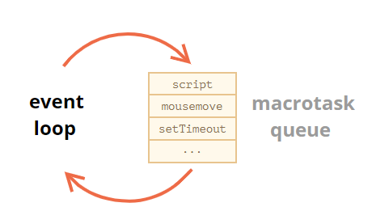
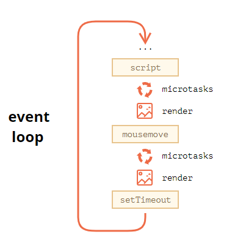

# 5. 加载文档和其他资源

## 5.1 页面生命周期：DOMContentLoaded，load，beforeunload，unload

HTML 页面的生命周期包含三个重要事件：

- `DOMContentLoaded` —— 浏览器**已完全加载 HTML**，并构建了 **DOM 树**，但像 `` 和样式表之类的外部资源可能尚未加载完成。
- `load` —— 浏览器不仅加载完成了 HTML，还**加载完成了**所有外部资源：图片，样式等。
- `beforeunload/unload` —— 当用户正在离开页面时。

每个事件都是有用的：

- `DOMContentLoaded` 事件 —— DOM 已经就绪，因此处理程序可以查找 DOM 节点，并初始化接口。
- `load` 事件 —— 外部资源已加载完成，样式已被应用，图片大小也已知了。
- `beforeunload` 事件 —— 用户正在离开：我们可以检查用户是否保存了更改，并询问他是否真的要离开。
- `unload` 事件 —— 用户几乎已经离开了，但是我们仍然可以启动一些操作，例如发送统计数据。

### DOMContentLoaded

`DOMContentLoaded` 事件发生在 `document` 对象上。

我们必须使用 `addEventListener` 来捕获它：

```javascript
document.addEventListener("DOMContentLoaded", ready);
// 不是 "document.onDOMContentLoaded = ..."
```

乍一看，`DOMContentLoaded` 事件非常简单。DOM 树准备就绪 —— 这是它的触发条件。它并没有什么特别之处。

**DOMContentLoaded 和脚本**

当浏览器处理一个 HTML 文档，并在文档中遇到 `<script>` 标签时，就会在继续**构建 DOM 之前**运行它。这是一种防范措施，因为**脚本可能想要修改 DOM**，甚至对其执行 `document.write` 操作，所以 `DOMContentLoaded`必须等待**脚本执行结束**。

**DOMContentLoaded 和样式**

外部样式表不会影响 DOM，因此 `DOMContentLoaded` 不会等待它们。

但这里有一个陷阱。如果在样式后面有一个脚本，那么该脚本必须等待样式表加载完成：

```html
<link type="text/css" rel="stylesheet" href="style.css">
<script>
  // 在样式表加载完成之前，脚本都不会执行
  alert(getComputedStyle(document.body).marginTop);
</script>
```

原因是，脚本可能想要获取元素的坐标和其他与样式相关的属性，如上例所示。因此，它必须等待样式加载完成。

当 `DOMContentLoaded` 等待脚本时，它现在也在等待脚本前面的样式。

### window.onload

当整个页面，包括样式、图片和其他资源被加载完成时，会触发 `window` 对象上的 `load` 事件。可以通过 `onload` 属性获取此事件。

下面的这个示例正确显示了图片大小，因为 `window.onload` 会等待所有图片加载完毕：

```html
<script>
  window.onload = function() { // 与此相同 window.addEventListener('load', (event) => {
    alert('Page loaded');

    // 此时图片已经加载完成
    alert(`Image size: ${img.offsetWidth}x${img.offsetHeight}`);
  };
</script>


```

### window.onunload

当访问者离开页面时，`window` 对象上的 `unload` 事件就会被触发。我们可以在那里做一些不涉及延迟的操作，例如关闭相关的弹出窗口。

有一个值得注意的特殊情况是发送分析数据。

假设我们收集有关页面使用情况的数据：鼠标点击，滚动，被查看的页面区域等。

自然地，当用户要离开的时候，我们希望通过 `unload` 事件将数据保存到我们的服务器上。

有一个特殊的 `navigator.sendBeacon(url, data)` 方法可以满足这种需求，详见规范 <https://w3c.github.io/beacon/>。

它在后台发送数据，转换到另外一个页面不会有延迟：浏览器离开页面，但仍然在执行 `sendBeacon`。

使用方式如下：

```javascript
let analyticsData = { /* 带有收集的数据的对象 */ };

window.addEventListener("unload", function() {
  navigator.sendBeacon("/analytics", JSON.stringify(analyticsData));
};
```

- 请求以 POST 方式发送。
- 我们不仅能发送字符串，还能发送表单以及其他格式的数据，在 [Fetch](https://zh.javascript.info/fetch) 一章有详细讲解，但通常它是一个字符串化的对象。
- 数据大小限制在 64kb。

### window.onbeforeunload

如果访问者触发了离开页面的导航（navigation）或试图关闭窗口，`beforeunload` 处理程序将要求进行更多确认。

如果我们要取消事件，浏览器会询问用户是否确定。

你可以通过运行下面这段代码，然后重新加载页面来进行尝试：

```javascript
window.onbeforeunload = function() {
  return false;
};
```

### readyState

在某些情况下，我们不确定文档是否已经准备就绪。我们希望我们的**函数**在 **DOM 加载完成时执行**，无论现在还是以后。

`document.readyState` 属性可以为我们提供当前加载状态的信息。

它有 3 个可能值：

- `loading` —— 文档正在被加载。
- `interactive` —— 文档被全部读取。
- `complete` —— 文档被全部读取，并且所有资源（例如图片等）都已加载完成。

所以，我们可以检查 `document.readyState` 并设置一个处理程序，或在代码准备就绪时立即执行它。

像这样：

```javascript
function work() { /*...*/ }

if (document.readyState == 'loading') {
  // 仍在加载，等待事件
  document.addEventListener('DOMContentLoaded', work);
} else {
  // DOM 已就绪！
  work();
}
```

还有一个 `readystatechange` 事件，会在**状态发生改变时触发**，因此我们可以打印所有这些状态，就像这样：

```javascript
// 当前状态
console.log(document.readyState);

// 状态改变时打印它
document.addEventListener('readystatechange', () => console.log(document.readyState))
```

`readystatechange` 事件是跟踪文档加载状态的另一种机制，它很早就存在了。现在则很少被使用。

### 总结

页面生命周期事件：

- 当 DOM 准备就绪时，`document` 上的 `DOMContentLoaded` 事件就会被触发。在这个阶段，我们可以将 JavaScript 应用于元素.

  - 诸如 `<script>...</script>` 或 `<script src="..."></script>` 之类的脚本会阻塞`DOMContentLoaded`，浏览器将等待它们执行结束。
  - 图片和其他资源仍然可以继续被加载。

- 当页面和所有资源都加载完成时，`window` 上的 `load` 事件就会被触发。我们很少使用它，因为通常无需等待那么长时间。

- 当用户想要离开页面时，`window` 上的 `beforeunload` 事件就会被触发。如果我们取消这个事件，浏览器就会询问我们是否真的要离开（例如，我们有未保存的更改）。

- 当用户最终离开时，`window` 上的 `unload` 事件就会被触发。在处理程序中，我们只能执行不涉及延迟或询问用户的简单操作。正是由于这个限制，它很少被使用。我们可以使用 `navigator.sendBeacon` 来发送网络请求。

- `document.readyState` 是文档的当前状态，可以在 `readystatechange` 事件中跟踪状态更改：

  - `loading` —— 文档正在被加载。
  - `interactive` —— 文档已被解析完成，与 `DOMContentLoaded` 几乎同时发生，但是在 `DOMContentLoaded` 之前发生。
  - `complete` —— 文档和资源均已加载完成，与 `window.onload` 几乎同时发生，但是在 `window.onload`之前发生。

  

## 5.2 脚本：async，defer

现代的网站中，脚本往往比 HTML 更“重”：它们的大小通常更大，处理时间也更长。

(在解析HTML时,碰到script脚本 会理解加载执行script脚本)

当浏览器加载 HTML 时遇到 `<script>...</script>` 标签，浏览器就不能继续构建 DOM。它必须立刻执行此脚本。对于外部脚本 `<script src="..."></script>` 也是一样的：浏览器必须等脚本下载完，并执行结束，之后才能继续处理剩余的页面。

这会导致两个重要的**问题**：

1. 脚本**不能**访问到位于它们**下面的 DOM** 元素，因此，脚本无法给它们**添加处理程序**等。
2. 如果页面顶部有一个**笨重的脚本**，它会“阻塞页面”。在该脚本**下载并执行结束前**，**用户都不能看到页面内容**：

这里有一些解决办法。例如，我们可以把脚本放在页面底部。此时，它可以访问到它上面的元素，并且不会阻塞页面显示内容：

```html
<body>
  ...all content is above the script...

  <script src="https://javascript.info/article/script-async-defer/long.js?speed=1"></script>
</body>
```

但是这种解决方案远非完美。例如，浏览器只有在下载了完整的 HTML 文档之后才会注意到该脚本（并且可以开始下载它）。对于长的 HTML 文档来说，这样可能会造成明显的延迟。

幸运的是，这里有两个 `<script>` 特性（attribute）可以为我们解决这个问题：`defer` 和 `async`。

### defer 

`defer` 特性告诉浏览器它应该继续处理页面，并“在后台”下载脚本，然后等页面加载完成后，再执行此脚本。

这是与上面那个相同的示例，但是带有 `defer` 特性：

```html
<p>...content before script...</p>

<script defer src="https://javascript.info/article/script-async-defer/long.js?speed=1"></script>

<!-- 立即可见 -->
<p>...content after script...</p>
```

- 具有 `defer` 特性的脚本不会阻塞页面。
- 具有 `defer` 特性的脚本总是要等到 DOM 解析完毕，但在 `DOMContentLoaded` 事件之前执行。

具有 `defer` 特性的脚本保持其相对顺序，就像常规脚本一样。

因此，如果我们有一个长脚本在前，一个短脚本在后，那么后者就会等待前者。

**`defer` 特性仅适用于外部脚本**

如果 `<script>` 脚本没有 `src`，则会忽略 `defer` 特性。

### async

`async` 特性意味着脚本是完全独立的：

- 页面不会等待异步脚本，它会继续处理并显示页面内容。
- `DOMContentLoaded` 和异步脚本不会彼此等待：
  - `DOMContentLoaded` 可能会发生在异步脚本之前（如果异步脚本在页面完成后才加载完成）
  - `DOMContentLoaded` 也可能发生在异步脚本之后（如果异步脚本很短，或者是从 HTTP 缓存中加载的）
- 其他脚本不会等待 `async` 脚本加载完成，同样，`async` 脚本也不会等待其他脚本。

因此，如果我们有几个 `async` 脚本，它们可能按任意次序执行。总之是先加载完成的就先执行：

```html
<p>...content before scripts...</p>

<script>
  document.addEventListener('DOMContentLoaded', () => alert("DOM ready!"));
</script>

<script async src="https://javascript.info/article/script-async-defer/long.js"></script>
<script async src="https://javascript.info/article/script-async-defer/small.js"></script>

<p>...content after scripts...</p>
```

1. 页面内容立刻显示出来：加载写有 `async` 的脚本不会阻塞页面渲染。
2. `DOMContentLoaded` 可能在 `async` 之前或之后触发，不能保证谁先谁后。
3. 异步脚本不会等待彼此。较小的脚本 `small.js` 排在第二位，但可能会比 `long.js` 这个长脚本先加载完成，所以 `small.js` 会先执行。这被称为“加载优先”顺序。

### 动态脚本

我们也可以使用 JavaScript 动态地添加脚本：

```javascript
let script = document.createElement('script');
script.src = "/article/script-async-defer/long.js";
document.body.append(script); // (*)
```

当脚本被附加到文档 `(*)` 时，脚本就会立即开始加载。

**默认情况下，动态脚本的行为是“异步”的。**

也就是说：

- 它们不会等待任何东西，也没有什么东西会等它们。
- 先加载完成的脚本先执行（“加载优先”顺序）。

### 总结

`async` 和 `defer` 有一个共同点：加载这样的脚本都**不会阻塞页面的渲染**。因此，用户可以立即阅读并了解页面内容。

但是，它们之间也存在一些本质的区别：

|         | 顺序                                                         | `DOMContentLoaded`                                           |
| :------ | :----------------------------------------------------------- | :----------------------------------------------------------- |
| `async` | **加载优先顺序**。脚本在文档中的顺序不重要 —— 先加载完成先执行 | 不相关。可能在文档加载完成前加载并执行完毕。如果脚本很小或者来自于缓存，同时文档足够长，就会发生这种情况。 |
| `defer` | **文档顺序**（它们在文档中的顺序）                           | 在文档加载和解析完成之后（如果需要，则会等待），即在 `DOMContentLoaded` 之前执行。 |

在实际开发中，`defer` 用于需要整个 DOM 的脚本，和/或脚本的相对执行顺序很重要的时候。`async` 用于独立脚本，例如计数器或广告，这些脚本的相对执行顺序无关紧要。

## 5.3 资源加载：onload，onerror

浏览器允许我们跟踪外部资源的加载 —— 脚本，iframe，图片等。

这里有两个事件：

- `onload` —— 成功加载，
- `onerror` —— 出现 error。

### 加载脚本

假设我们需要加载第三方脚本，并调用其中的函数。

我们可以像这样动态加载它：

```javascript
let script = document.createElement('script');
script.src = "my.js";

document.head.append(script);
```

……但如何运行在该脚本中声明的函数？我们需要等到该脚本加载完成，之后才能调用它。

**script.onload**

(它会告诉我们 外部脚本已经加载并执行完成)

我们的得力助手是 `load` 事件。它会在**脚本加载并执行完成**时触发。

例如：

```javascript
let script = document.createElement('script');

// 可以从任意域（domain），加载任意脚本
script.src = "https://cdnjs.cloudflare.com/ajax/libs/lodash.js/4.3.0/lodash.js"
document.head.append(script);

script.onload = function() {
  // 该脚本创建了一个辅助函数 "_"
  alert(_); // 该函数可用
};
```

因此，在 `onload` 中我们可以使用脚本中的变量，运行函数等。

……如果加载失败怎么办？例如，这里没有这样的脚本（error 404）或者服务器宕机（不可用）。

**script.onerror**

发生在脚本加载期间的 error 会被 `error` 事件跟踪到。

例如，我们请求一个不存在的脚本：

```javascript
let script = document.createElement('script');
script.src = "https://example.com/404.js"; // 没有这个脚本
document.head.append(script);

script.onerror = function() {
  alert("Error loading " + this.src); // Error loading https://example.com/404.js
};
```

请注意，在这里我们无法获取更多 HTTP error 的详细信息。我们不知道 error 是 404 还是 500 或者其他情况。只知道是加载失败了。

`onload`/`onerror` 事件**仅跟踪加载本身**。

在脚本处理和执行期间可能发生的 error 超出了这些事件跟踪的范围。也就是说：如果脚本成功加载，则即使脚本中有编程 error，也会触发 `onload` 事件。如果要跟踪脚本 error，可以使用 `window.onerror`全局处理程序。

### 其他资源

`load` 和 `error` 事件也适用于其他资源，基本上（basically）适用于具有外部 `src` 的任何资源。

但是有一些注意事项：

- 大多数资源在被添加到文档中后，便开始加载。但是 `` 是个例外。它要等到获得 src `(*)` 后才开始加载。
- 对于 `<iframe>` 来说，iframe 加载完成时会触发 `iframe.onload` 事件，无论是成功加载还是出现 error。

### 跨源策略

(**浏览器的同源策略**)

这里有一条规则：来自一个网站的脚本无法访问其他网站的内容。例如，位于 `https://facebook.com` 的脚本无法读取位于 `https://gmail.com` 的用户邮箱。

或者，更确切地说，一个源（域/端口/协议三者）无法获取另一个源（origin）的内容。因此，即使我们有一个子域，或者仅仅是另一个端口，这都是不同的源，彼此无法相互访问。

这个规则还影响其他域的资源。

如果我们使用的是来自其他域的脚本，并且该脚本中存在 error，那么我们无法获取 error 的详细信息。

### 总结

图片 ``，外部样式，脚本和其他资源都提供了 `load` 和 `error` 事件以跟踪它们的加载：

- `load` 在成功加载时被触发。
- `error` 在加载失败时被触发。

唯一的例外是 `<iframe>`：出于历史原因，不管加载成功还是失败，即使页面没有被找到，它都会触发 `load` 事件。

`readystatechange` 事件也适用于资源，但很少被使用，因为 `load/error` 事件更简单。

# 6. 杂项

## 6.3 事件循环：微任务和宏任务

浏览器中 JavaScript 的执行流程和 Node.js 中的流程都是基于 **事件循环** 的。

### 事件循环

**事件循环** 的概念非常简单。它是一个在 JavaScript 引擎等待任务，执行任务和进入休眠状态等待更多任务这几个状态之间转换的无限循环。

引擎的一般算法：

1. 当有任务时：
   - 从最先进入的任务开始执行。
2. 休眠直到出现任务，然后转到第 1 步。

当我们浏览一个网页时就是上述这种形式。JavaScript 引擎大多数时候不执行任何操作，仅在脚本/处理程序/事件激活时执行。

任务示例：

- 当外部脚本 `<script src="...">` 加载完成时，任务就是执行它。

- 当用户移动鼠标时，任务就是派生出 `mousemove` 事件和执行处理程序。
- 当安排的（scheduled）`setTimeout` 时间到达时，任务就是执行其回调。
- ……诸如此类。

设置任务 —— 引擎处理它们 —— 然后等待更多任务（即休眠，几乎不消耗 CPU 资源）。

一个任务到来时，引擎可能正处于繁忙状态，那么这个任务就会被排入队列。

多个任务组成了一个队列，即所谓的“宏任务队列”（v8 术语）：



例如，当引擎正在忙于执行一段 `script` 时，用户可能会移动鼠标而产生 `mousemove` 事件，`setTimeout` 或许也刚好到期，以及其他任务，这些任务组成了一个队列，如上图所示。

队列中的任务基于“先进先出”的原则执行。当浏览器引擎执行完 `script` 后，它会处理 `mousemove` 事件，然后处理 `setTimeout` 处理程序，依此类推。

### 宏任务和微任务

微任务仅来自于我们的代码。它们通常是由 promise 创建的：对 `.then/catch/finally` 处理程序的执行会成为微任务。微任务也被用于 `await` 的“幕后”，因为它是 promise 处理的另一种形式。

还有一个特殊的函数 `queueMicrotask(func)`，它对 `func` 进行排队，以在微任务队列中执行。

**每个宏任务之后，引擎会立即执行微任务队列中的所有任务，然后再执行其他的宏任务，或渲染，或进行其他任何操作。**

(微任务是指.then/catch/finally里任务. 微任务一般是promise创建的,新建new Promise对象,这个不是异步任务)

例如，看看下面这个示例：

```javascript
setTimeout(() => alert("timeout"));

Promise.resolve()
  .then(() => alert("promise"));

alert("code");
```

这里的执行顺序是怎样的？

1. `code` 首先显示，因为它是常规的同步调用。
2. `promise` 第二个出现，因为 `then` 会通过微任务队列，并在当前代码之后执行。
3. `timeout` 最后显示，因为它是一个宏任务。

更详细的事件循环图示如下（顺序是从上到下，即：首先是脚本，然后是微任务，渲染等）：  

微任务会在执行任何其他事件处理，或渲染，或执行任何其他宏任务之前完成。

这很重要，因为它确保了微任务之间的应用程序环境基本相同（没有鼠标坐标更改，没有新的网络数据等）。

如果我们想要异步执行（在当前代码之后）一个函数，但是要在更改被渲染或新事件被处理之前执行，那么我们可以使用 `queueMicrotask` 来对其进行安排（schedule）。


### 总结

事件循环的更详细的算法（尽管与 [规范](https://html.spec.whatwg.org/multipage/webappapis.html#event-loop-processing-model) 相比仍然是简化过的）：

1. 从 **宏任务** 队列（例如 “script”）中出队（dequeue）并执行最早的任务。
2. 执行所有 **微任务**：
   - 当微任务队列非空时：
     - 出队（dequeue）并执行最早的微任务。

3. 执行渲染，如果有。
4. 如果宏任务队列为空，则休眠直到出现宏任务。
5. 转到步骤 1。

安排（schedule）一个新的 **宏任务**：

- 使用零延迟的 `setTimeout(f)`。

它可被用于将繁重的计算任务拆分成多个部分，以使浏览器能够对用户事件作出反应，并在任务的各部分之间显示任务进度。

此外，也被用于在事件处理程序中，将一个行为（action）安排（schedule）在事件被完全处理（冒泡完成）后。

安排一个新的 **微任务**：

- 使用 `queueMicrotask(f)`。
- promise 处理程序也会通过微任务队列。

在微任务之间没有 UI 或网络事件的处理：它们一个立即接一个地执行。

所以，我们可以使用 `queueMicrotask` 来在保持环境状态一致的情况下，异步地执行一个函数。


