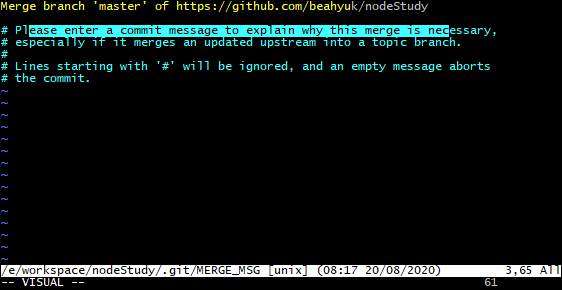

# node.js 学习
## code文件
 code文件夹里是关于node学习时的代码
 手敲代码

## node学习.md
node学习.md是关于node的上课笔记

## git语句

### 1. git创建分支

1）切换到基础分支，如主干

```
git checkout master
```

2）创建并切换到新分支

```
git checkout -b panda
```

git branch 可以看到已经在panda分支上

3）更新分支代码并提交

```
git add *
git commit -m "init panda"
git push origin panda
```

4）在git代码管理界面就可以看到panda分支了，成功

### 2. git合并分支

1）从panda分支切换到master下

```
git checkout master
```

2）因为是合作开发项目，这时远程仓库中的内容有可能已经发生了变化，所以我们需要将远程仓库中的内容和本地分支中的内容进行合并

```
git pull origin master
```

3）接下来要做的是将panda分支合并到master上

```
git merge panda
```

4）查看分支中内容提交的状态

```
git status
```

5）有冲突的话，通过IDE解决冲突；

6）解决冲突后，将冲突文件提交暂存区

```
git add 冲突文件 或
git add .  //提交所有文件
```

7）提交merge之后的结果

```
git commit -m "注释"
```

5）最后一步，我们把修改的内容提交到主分支上

```
git push origin master
```

如果你感觉合并后的内容有问题，可以通过撤销合并恢复到以前状态

```
git reset --hard HEAD
```

代码已经提交，撤销的方法是

```
git reset --hard ORIG_HEAD
```

### 3. gitlab迁移远程仓库

参考地址:<https://www.cnblogs.com/kdx-2/p/8916295.html>

1) 到工程目录下 (例如: cd xx-app/),可以在目录下打开git bash

2) 查看当前远程仓库地址

```
git remote -v
```

(例如得到: git@11.11.11.22:app/xx-app.git)

3) 移除当前地址

````
git remote remove origin
````

4) 添加新地址

```
git remote add origin<新的远程仓库地址>
```

(例如得到: git remote add origin git@22.22.22.11:app/xx-app.git) 就是主页的地址,不要进入tree,从浏览器复制地址,后面自己加git

再次查看 当前地址 git remote -v,确认是修改后的ip服务器地址.

5) 将本地分支上的代码push到远程相对应的分支

```
git push --set-upstream origin master
```

或者 执行到4)后 ,直接 git push .它会提醒你 要上传到相对应的分支, 直接复制 提醒的代码就可以了

6) 设置当前分支(本地分支对应的远程仓库分支)

```
git branch --set-upstream-to=origin/<branch><本地分支>
```

例如: git branch --set-upstream-to = origin/Dev_20180808 Dev_20180808

### 4. git pull 或合并分支遇到问题

**Please enter a commit message to explain why this merge is necessary.**

请输入提交消息来解释为什么这种合并是必要的



**解决方案**

1. 按键盘字母 i 进入insert模式
2. 修改最上面那行黄色合并信息,可以不修改
3. 按键盘左上角"Esc"
4. 输入":wq",注意是冒号+wq,按回车键即可

### 5. 撤销本地commit

参考文章: 

**Git撤销本地commit**

<https://blog.csdn.net/weixin_44722978/article/details/94438640>

```shell
git reset HEAD~
```

HEAD表示: 上一次提交

### 6. 隐藏本地修改 pull远程

参考文章：

**git本地修改，远程库也修改了如何提交代码**

<https://blog.csdn.net/qiang123___/article/details/97264666>

1. 查看本地修改

   ```shell
   git status
   ```

2. 隐藏掉本地修改

   ```
   git stash
   ```

3. 从代码库拉取更新

   ```shell
   git pull
   ```

4. 恢复最新的进度到工作区

   ```shell
   git stash pop
   ```

   参考文章：使用git stash命令保存和恢复进度 <https://www.cnblogs.com/chen-cheng/p/9764651.html>

5. 上传代码

   ```shell
   git add .
   git commit -m ""
   git push
   ```

## svn操作

### 下载项目到本地

右键 svn checkout

参照：<https://www.cnblogs.com/yangzailu/p/6698142.html>

## 算法刷题

[剑指offer-JavaScript版本](https://github.com/piggerCoder/nowcoder-sword-offer)

[算法面试大全](https://github.com/14glwu/FEInterviewBox)

[刷题总结](<https://www.cnblogs.com/wuguanglin/p/SummaryOfJSDoAlgorithmProblem.html>)

[算法题目+解析](<https://www.cnblogs.com/wuguanglin/p/2dArrayFind.html>)

## vue组件

- 构建大屏（**全屏**）数据展示页面即**数据可视化**

   <http://datav.jiaminghi.com/guide/>

## 项目演练

- 后台管理

  <https://github.com/PanJiaChen/vue-element-admin>

- 学习CSDN博主(包含很多前端的帖子,值得看)

  <https://blog.csdn.net/qq_40028324>

