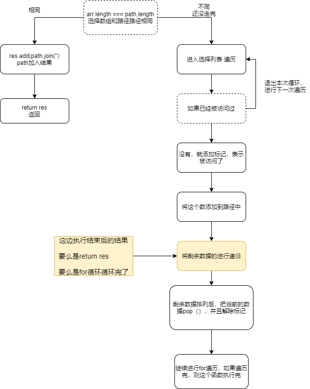

# 剑指offer（JavaScript版本）

## 0. 算法题目&解析

算法解析：<https://www.cnblogs.com/wuguanglin/category/1178569.html>

LeetCode网址：<https://leetcode-cn.com/>

LeetCod剑指offer题库：https://leetcode-cn.com/problemset/lcof/

牛客网剑指offer题库：https://www.nowcoder.com/ta/coding-interviews

## 1. 数组查找

### 题目描述

在一个二维数组中，每一行都按照从左到右递增的顺序排序，每一列都按照从上到下递增的顺序排序。请完成一个函数，输入这样的一个二维数组和一个整数，判断数组中是否含有该整数

### 解析

因为数组是行递增，列递增，找到数组最左下角的数a进行判断，如果大于a，就往右走，col++。如果小于a，就往上找，row--

### 代码

```javascript
let array = [
    [1, 2, 3, 4, 5],
    [11, 12, 13, 14, 15],
    [21, 22, 23, 24, 25],
    [31, 32, 33, 34, 35]
];

function find(array, target) {
    let rowlen = array.length,
        collen = array[0].length;
    let row = rowlen - 1,
        col = 0;
    if (rowlen === 0 && collen === 0) {
        return -1
    }
    while (row >= 0 && col <= collen - 1) {
        if (target > array[row][col]) {
            col++;
        } else if (target < array[row][col]) {
            row--;
        } else return [row, col, array[row][col]]
    }
    return false
}

console.log(find(array, 23))
```


### 二分法查找数据

```javascript
let array = [1,3,2,7,4]; //乱序
//递增排序，二分法只适合递增数组
array.sort((a,b)=>a-b);
let end= array.length-1,
    start = 0;
let result = fn(array,2,start,end)
console.log(result);

function fn(array,target,start,end){
    if (start>end){
        return -1
    };
    let mid = parseInt((start+end)/2);
    if(target < array[mid]){
        end = mid-1;
        return fn(array,target,start,end);
    }else if(target > array[mid]){
        start = mid+1;
        return fn(array,target,start,end);
    }else{
        return mid
    };
};

```

## 2. 替换空格（简单）

### 题目描述

请实现一个函数，将一个字符串中的空格替换成“%20”。例如，当字符串为We Are Happy.则经过替换之后的字符串为We%20Are%20Happy。

### 解析

利用正则表达式 将空格转成%20

### 代码

```javascript
var replaceSpace = function(s) {
    return s.replace(/ /g, "%20");
    // \s 是匹配任何空白字符，包括空格，制表符，换页符等等
    // return s.replace(/\s/g, "%20");

};

let str = "we are happy";
console.log(replaceSpace(str))
```

## 3. 从尾到头打印链表（简单）

### 题目描述

输入一个链表的头节点，从尾到头反过来返回每个节点的值（用数组返回）。

### 解析

逆序输出链表，可以利用数组的unshift方法，输出放在数组头部

然后让指针指向下一个

### 代码

```javascript
function reverPrint(head1) {
    let res = [];
    let pNode = head1;
    while (pNode !== null) {
        res.unshift(pNode.val);
        pNode = pNode.next;
    }
    return res
}
```

## 4.重建二叉树(不懂)

### 题目描述

输入某二叉树的前序遍历和中序遍历的结果，请重建出该二叉树。假设输入的前序遍历和中序遍历的结果中都不含重复的数字。例如输入前序遍历序列{1,2,4,7,3,5,6,8}和中序遍历序列{4,7,2,1,5,3,8,6}，则重建二叉树并返回

### 解析

先根据前序的第一个是根节点，然后在中序中 以根节点为中心，一分为二，再对左右分别进行递归查找

### 代码

```javascript
    /**
     * Definition for a binary tree node.
     * function TreeNode(val) {
     *     this.val = val;
     *     this.left = this.right = null;
     * }
     */
    // preorder:前序，中左右
    // inorder：中序，左中右
    /**
     * @param {number[]} preorder
     * @param {number[]} inorder
     * @return {TreeNode}
     */
    var buildTree = function(preorder, inorder) {
        if (preorder.length == 0 || inorder.length == 0) {
            return null
        }

        // 找到根位置，（0，根位置）是左边树，（根位置，末尾）是右边树
        const index = inorder.indexOf(preorder[0]);
        let left = inorder.slice(0, index),
            right = inorder.slice(index + 1);
        return {
            val: preorder[0],
            left: buildTree(preorder.slice(1, index + 1), left);
            right: buildTree(preorder.slice(index + 1), right)
        }
    };
```

### 3和4 链表不懂的点

3和4 在本地运行的时候，不懂构造函数TreeNode，this.val = val,this.right =right 指向

## 5.用两个栈实现队列

### 题目描述

用两个栈实现一个队列。队列的声明如下，请实现它的两个函数 appendTail 和 deleteHead ，分别完成在队列尾部插入整数和在队列头部删除整数的功能。(若队列中没有元素，deleteHead 操作返回 -1 )

### 解析

栈的特性是：后入先出。根据题目提示，使用 2 个栈即可。一个栈inStack用来存储插入队列的数据，一个栈outStack用来从队列中取出数据。

算法分为入队和出队过程。

入队过程：将元素放入 inStack 中。

出队过程：

outStack 不为空：弹出元素
outStack 为空：将 inStack 元素依次弹出，放入到 outStack 中（在数据转移过程中，顺序已经从后入先出变成了先入先出）
时间复杂度是 O(N)，空间复杂度是 O(N)。

### 代码

```javascript
var CQueue = function() {
    this.instack = [];
    this.outstack = []
};

CQueue.prototype.appendTail = function(value) {
    this.instack.push(value)
};

CQueue.prototype.deleteHead = function() {
    const { instack, outstack } = this;
    if (outstack.length) {
        return outstack.pop()
    } else {
        while (!instack.length) {
            outstack.push(instack.pop())
        }
        return outstack.pop() || -1
    }
}
```

## 6.旋转数组中的最小数字

### 题目描述

把一个数组最开始的若干个元素搬到数组的末尾，我们称之为数组的旋转。输入一个递增排序的数组的一个旋转，输入旋转数组的最小元素。例如，数组[3,4,5,1,2]为[1,2,3,4,5]的一个旋转，该数组的最小值为1

### 解析

原数组递增排序，那么该数组的所有片段都是递增排列，第一个不符合递增排列的元素就是旋转截断点，也就是最小值点，如果没有，就返回第一个元素

对数组进行遍历，因为原数组是递增的，所以如果找到比数组的第一个元素小的，返回这个小的数，否则就返回第一个元素

### 代码

```javascript
let arr = [3, 4, 5, 1, 2];
/**
 * @param {number[]} numbers
 * @return {number}
 */
var minArray = function(numbers) {
    if (numbers.length === 0) return 0
    for (let i = 0; i < numbers.length; i++) {
        if (numbers[i] < numbers[0]) {
            return numbers[i]
        }
    }
    return numbers[0]
}
console.log(minArray(arr))
```

## 7.斐波那契数 - 7.22

### 题目描述

斐波那契数，通常用 F(n) 表示，形成的序列称为斐波那契数列。该数列由 0 和 1 开始，后面的每一项数字都是前面两项数字的和。也就是：F(0) = 0,   F(1) = 1
F(N) = F(N - 1) + F(N - 2), 其中 N > 1.
给定 N，计算 F(N)。

首几个斐波那契数是：（从第二个开始是前两个数的和）

0,1,1,2,3,5,13,21,34

### 解析

由于斐波那契数，从第二个开始是前两个数的和，除了第0个和 第一个。

第一反应是用递归，但是递归算法时间复杂度大

采用动态规划，把每一个值都存储起来，最后返回最后一个值，就是F（N）

### 代码

```javascript
var fn = function(N){
    let arr = [0,1,1]; //现规定前三个数
    for(let i = 3; i <= N; i++){
        arr[i]=arr[i-1]+arr[i-2]
    };
    return arr[N]  // 返回最后一个值
}
console.log(fn(5))
```

## 8.跳台阶 - 7.23

### 题目描述

一只青蛙一次可以跳上1级台阶，也可以跳上2级。求该青蛙跳上一个n级的台阶总共有多少种跳法

### 解析

- n=1时，有1种跳法
- n=2时，有2种跳法
- n=3时，有3种跳法
- n=4时，有5种跳法
- n=5时，有8种跳法
- ……

因为青蛙只能跳1阶或2阶台阶，假设一共有n级台阶，第一阶有两种跳法

- 第一个跳了1阶，剩下的是f（n-1）种跳法
- 第一个跳了2阶，剩下的是f（n-2）种跳法

那n级台阶一共有 f(n)=f(n-1)+f(n-2) 种跳法。类似于斐波那契数列

### 代码

```javascript
/**
 * @param {number} N
 * @return {number}
 */
var fib = function(N) {
    let arr = [0, 1,2]; // 这里和斐波那契数列不同
    for (let i = 3; i <= N; i++) {
        arr[i] = arr[i - 1] + arr[i - 2]
    }
    return arr[N];
};
console.log(fib(7))
```

## 9.变态跳台阶 - 7.24

### 题目描述

一只青蛙一次可以跳上1级台阶，也可以跳上2级……它也可以跳上n级。求该青蛙跳上一个n级的台阶总共有多少种跳法。

### 解析

由第八题知道，f(n) = f(n-1)+f(n-2)

这次青蛙可以一次跳上n级，则

① f(n)=f(n-1)+f(n-2)+...+f(1)

② f(n-1) = f(n-2)+f(n-3)+...+f(1)

①-②得出 f(n) = 2*f(n-1)的推导公式

### 代码

```javascript
/**
 * @param {number} N
 * @return {number}
 */
var fib = function(N) {
    let arr = [0, 1, 2]; // 这里和斐波那契数列不同
    for (let i = 3; i <= N; i++) {
        arr[i] = 2 * arr[i - 1]  //这里和第八题不一样
    }
    return arr[N];
};
console.log(fib(7))
```

## 10.矩形覆盖 - 7.25

### 题目描述

我们可以用2\*1的小矩形横着或者竖着去覆盖更大的矩形。请问用n个2\*1的小矩形无重叠地覆盖一个2*n的大矩形，总共有多少种方法？

### 解析

- n=0 时，有0种方法

- n=1 时，有1种方法
- n=2 时，有2种方法
- n=3 时，有3种方法
- ……类似于斐波那契数列

当有2*n的时候，第一种是竖着排，那剩下的是f(n-1),第一种是横着排，那剩下的是f(n-2).那么一共有f(n)=f(n-1)+f(n-2)

当横着排的时候，第一行占据了两列，第二行前两列没有被排，但是排的方法其实已经被固定了，也是横着排。如果还不清楚的话，看博客园的图解

### 代码

```javascript
/**
 * @param {number} N
 * @return {number}
 */
var fib = function(N) {
    let arr = [0, 1, 2]; // 这里和斐波那契数列不同
    for (let i = 3; i <= N; i++) {
        arr[i] = arr[i - 2] + arr[i - 1]
    }
    return arr[N];
};
console.log(fib(7))
```

## 11.二进制中1的个数 - 7.26

### 题目描述

请实现一个函数，输入一个整数，输出该数二进制表示中 1 的个数。例如，把 9 表示成二进制是 1001，有 2 位是 1。因此，如果输入 9，则该函数输出 2。

### 解析

要求是输出该数二进制中1的个数，就先把整数转成二进制数，然后看有几个1

- 利用toString（2）的方法转为二进制
- 用正则表达式，str.match(/1/g),匹配出所有1的字符串的数组
- 返回的是数组的长度或者0

### 代码

````javascript
var hammingWeight = function(n){
    let str = n.toString(2).match(/1/g);
    return str?str.length:0
}
let res = hammingWeight(9);
console.log(res);
// 2
//法二：法一通不过牛客网
function NumberOf1(n)
{
    let res=0;
    while(n){
      n=n&(n-1);
      res ++
    }
    return res
} 
````

### 补充：toString()用法

**toString(base)**

方法`num.toString(base) ` 返回在给定`base`进制数字系统中`num`的字符串表示形式

举个例子：

```javascript
let num = 255;

console.log(num.toString(16));//ff
console.log(num.toString(2)); // 11111111
```

`base`的范围可以从`2`到`36`。默认情况下是10。

常见的用例如下：

- **base = 16** 用于十六进制颜色，字符编码等，数字可以是`0..9`或`A..F`
- **base = 2** 主要用于调试按位操作，数字可以是`0`或`1`
- **base = 36** 是最大进制，数字可以是`0..9`或`A..Z`。所有拉丁字母都被用于了表示数字，对于`36`进制来说，一个有趣且有用的例子是，当我们需要将一个较长的数字标识符转换成较短的时候，例如做一个短的URL。可以简单地使用基数为`36`的数字系统表示

## 12.数值的整数次方 - 7.27

### 题目描述

给定一个double类型的浮点数base和int类型的整数exponent。求base的exponent次方。

保证base和exponent不同时为0

### 解析

用js库自带的Math方法，Math.pow(n,power)

### 代码

```javascript
function power(base, exponent) {
    let res = Math.pow(base, exponent);
    return res;
}
let result = power(2, 2);
console.log(result)
```

### 补充：Math.pow(n,power)

**Math.pow(n,power)**

返回`n`的给定（power）次幂

```javascript
console.log(Math.pow(2,10)); // 2 的 10 次幂 = 1024
```

## 13.调整数组顺序使奇数位于偶数前面 - 7.27

### 题目描述

输入一个整数数组，实现一个函数来调整该数组中数字的顺序，使得所有奇数位于数组的前半部分，所有偶数位于数组的后半部分。

```
输入：nums = [1,2,3,4]
输出：[1,3,2,4] 
// 保持相对位置不变，例如1在3之前，奇数放前面后也是1在3之前
```

### 解析

首先判断奇数是` i%2 !==0`

先定义两个数组，奇数数组和偶数数组，然后把它们拼接

对数组进行遍历，如果`i%2 !==0`则是奇数，push给奇数数组，否则给偶数数组

### 代码

```javascript
const exchange = function (nums){
    const odd = []; // 奇数数组
    const arr = []; // 偶数数组
    nums.forEach(item => {
        item%2 ? odd.push(item) : arr.push(item);
    })
    return  odd.concat(arr)
}
```

## 14.链表中倒数第k个节点 - 7.28

### 题目描述

输入一个链表，输出该链表中倒数第k个节点。为了符合大多数人的习惯，本题从1开始计数，即链表的尾节点是倒数第1个节点。例如，一个链表有6个节点，从头节点开始，它们的值依次是1、2、3、4、5、6。这个链表的倒数第3个节点是值为4的节点。

**示例：**

```
给定一个链表: 1->2->3->4->5, 和 k = 2.

返回链表 4->5.
```

### 解析

看到要求输出倒数第k个节点，而且是链表，想办法转成 **栈** 储存的空间

- 用指针head一个一个push到定义的空栈中，这样倒数第k个节点变成正数第k个
- 如果k不为0，则栈一个个pop弹出，直到k为0，进不去循环，返回k=1的时候弹出的值

该算法无法运行，因为是链表，不知道怎么传参head 。而且head.next也不会

8.2补充：看了coderwhy老师的数据结构，知道了怎么做

### 代码

```javascript
var getKthFromEnd = function (head,k){
    const stack =[];
    const res = [];
    // 如果head不为空，就push到栈
    while(head){
        stack.push(head);
        head = head.next;
    };
    whie(k>0){
        res = stack.pop();
        k--
    };
    return res
}
```

## 15.翻转链表 - 7.28

### 题目描述

定义一个函数，输入一个链表的头节点，反转该链表并输出反转后链表的头节点。

### 解析

不懂，终究还是不懂链表。考试的时候最讨厌反转链表了

至少需要三个指针pPre（指向前一个结点）、pCurrent（指向当前的结点，在代码中就是pHead）、pNext（指向后一个结点）。

--8.2：其实不用想的把节点移到前面，就把箭头都改方向就好了。

- 先定义一个temp指针 存current.next的节点，不然会找不到current.next节点，会丢失
- 将current.next 指向pre，若是第一个，则pre=null
- pre=current，将pre往后移一个
- current = temp 相当于 current也往后移一个

遇到链表 问题 想到画图

### 代码

```javascript
var reverseList = function(head) {
    let pre = null;
    let temp = null;
    let current = head
    while (current !== null) {
        temp = current.next;
        current.next = pre; // 完成current当前指针的反转
        pre = current;
        current = temp;
    }
    return pre
};
```

## 16.合并两个排序的链表 - 7.29 

### 题目描述

输入两个递增排序的链表，合并这两个链表并使新链表中的节点仍然是递增排序的。

### 解析

有两种方法：

- 方法一：新建一个链表c，然后AB 分别比较，谁小放到c中，然后c.next = merge(小的next，大的) 进行递归。直到A或B为空
- 方法二：不新建链表，直接在A或B中进行比较排序

这里使用的是方法一

### 代码

```javascript
var merge = function(pHead1, pHead2) {
    let pHead3 = null;
    if (pHead1 === null) { return pHead2 };
    if (pHead2 === null) { return pHead1 };
    if (pHead1.val < pHead2.val) {
        pHead3 = pHead1;
        pHead3.next = merge(pHead1.next, pHead2);
    } else {
        pHead3 = pHead2;
        pHead3.next = merge(pHead1, pHead2.next);
    }
    return pHead3
}
```

## 17.树的子结构 - 7.29 （不懂）

### 题目描述

输入两棵二叉树A和B，判断B是不是A的子结构。(约定空树不是任意一个树的子结构)

B是A的子结构， 即 A中有出现和B相同的结构和节点值。

**示例 1：**

```
输入：A = [1,2,3], B = [3,1]
输出：false
```

### 解析

看到树想到递归，先找A中是否有B的跟节点，然后递归

设计两个函数：

isSubStructure 的职能：判断 B 是否是 A 的子结构。是，返回 true；否则，尝试 A 的左右子树
isSubTree 的职能：封装“判断 B 是否是 A 的子结构”的具体逻辑。

### 代码

```javascript
/**
 * Definition for a binary tree node.
 * function TreeNode(val) {
 *     this.val = val;
 *     this.left = this.right = null;
 * }
 */
/**
 * @param {TreeNode} A
 * @param {TreeNode} B
 * @return {boolean}
 */
var isSubStructure = function(A, B) {
    if (!A || !B) {
        return false
    };
    return (
        isSubTree(A, B) || isSubStructure(A.left, B) || isSubStructure(A.right, B)
    )
};

var isSubTree = function(pRoot1, pRoot2) {
     if (!pRoot2) {
        return true
    }
    if (!pRoot1) {
        return false
    }
   
    if (pRoot1.val !== pRoot2.val) {
        return false
    }
    return  isSubTree(pRoot1.left, pRoot2.left) && isSubTree(pRoot1.right, pRoot2.right)
    
}
```

## 18.二叉树的镜像 - 7.30(不懂)

### 题目描述

请完成一个函数，输入一个二叉树，该函数输出它的镜像。

**示例 1：**

```
输入：root = [4,2,7,1,3,6,9]
输出：[4,7,2,9,6,3,1]
```

### 解析

用递归，

虽然简单，但不懂递归 递归了什么

也不知道这个函数返回了什么 

### 代码

```javascript
/* function TreeNode(x) {
    this.val = x;
    this.left = null;
    this.right = null;
} */
function Mirror(root) {
    // write code here
    if (root) return false;
    Mirror(root.left);
    Mirror(root.right);
    [root.left, root.right] = [root.right, root.left];
    return root
}
```

### 补充

看来树和链表都不太行，都需要理解

## 19. 顺时针打印矩阵 - 7.30

### 题目描述

输入一个矩阵，按照从外向里以顺时针的顺序依次打印出每一个数字。

**示例 1：**

```
输入：matrix = [[1,2,3],[4,5,6],[7,8,9]]
输出：[1,2,3,6,9,8,7,4,5]
```

### 解析

自己在纸上画画，先考虑外围走一圈的情况。

总结下来 还挺简单的，就是自己思考比较久，而且没考虑pop和shift方法

### 代码

```javascript
/**
 * @param {number[][]} matrix
 * @return {number[]}
 */
var spiralOrder = function(matrix) {
    let newArr = [];
    let flag = true;

    while (matrix.length) {
        // 从左到右
        if (flag) {
            // 第一层
            newArr = newArr.concat(matrix.shift());
            // matrix.length-1 这里是个坑，注意
            // "现在"的第一层到最后第一层的末尾
            for (let i = 0; i < matrix.length - 1; i++) {
                matrix[i].length && newArr.push(matrix[i].pop());
            }
        } else {
            // 从右到左
            // 最后一层
            newArr = newArr.concat(matrix.pop().reverse());
            // 现在matrix.length-1 这里也是坑
            // 现在的最后一层到第一层的开端
            for (let i = matrix.length - 1; i > 0; i--) {
                matrix[i].length && newArr.push(matrix[i].shift());
            }
        }
        flag = !flag;
    }
    return newArr;
};
matrix = [
    [1, 2, 3],
    [4, 5, 6],
    [7, 8, 9]
]
console.log(spiralOrder(matrix));
```

### 注意点：坑

一开始const = matrix.length，想方便一点定义行数，但由于原数组在不断地pop和shift 第一行和最后一行被拿出去，所以length是不断变化的，就算用let也不可以

当把第一层shift后，注意 原数组的第二行是现在的第一行，matrix.length也减一了

同理 最后一层pop后，原来的倒数第二层成为倒数第一层

自己想的思路一样，但是弹出第一层和最后一层没想到用pop和shift方法，还傻傻的用arr[0] 和a[lentg-1]

## 20. 包含min函数的栈 - 7.31

### 题目描述

定义栈的数据结构，请在该类型中实现一个能够得到栈的最小元素的 min 函数在该栈中，调用 min、push 及 pop 的时间复杂度都是 O(1)。

### 解析

其实这个题并不难，只不过 是第一次写数据结构。

push方法，stack是直接push，minStack是要比较一下的，minStack最顶上的值和要插入的数据x对比，如果data >= x，则push（x）。这里有个坑，之前我是data > x没有等于情况，报错了

top方法，是取栈的最上面的数据。

### 代码

```javascript
var Minstack = function() {
    this.dataStack = [];
    this.minStack = []; //辅助栈
}
Minstack.prototype.push = function(x) {
    const length = this.minStack.length;
    this.dataStack.push(x);
    if (length) {
        this.minStack[length - 1] >= x && this.minStack.push(x);
    } else {
        this.minStack.push(x);
    }
}
Minstack.prototype.pop = function() {
    if (this.minStack[this.minStack.length - 1] === this.dataStack[this.dataStack.length - 1]) {
        this.minStack.pop();
    }
    this.dataStack.pop();
}
Minstack.prototype.top = function() {
    const length = this.dataStack.length;
    if (length) return this.dataStack[length - 1];
    else return null
}
Minstack.prototype.min = function() {
    const length = this.minStack.length
    if (length) return this.minStack[length - 1];
    else return null;
}
```

### 补充：stack[stack.length - 1]

JavaScript是根据数组来实现堆和栈的，在数组末端添加数据push 

调用`stack.push(data)` 和`stack[length] = data`是一样的

访问栈的最顶端，也可以像数组一样 `top = stack[length-1]`

但是由于栈是后进先出 LIFO 特点，所以数据只能在 **栈的顶端** 添加或者删除

## 21. 栈的压入、弹出序列 - 8.2

### 题目描述

输入两个整数序列，第一个序列表示栈的压入顺序，请判断第二个序列是否为该栈的弹出顺序。假设压入栈的所有数字均不相等。例如，序列 {1,2,3,4,5} 是某栈的压栈序列，序列 {4,5,3,2,1} 是该压栈序列对应的一个弹出序列，但 {4,3,5,1,2} 就不可能是该压栈序列的弹出序列。

```
输入：pushed = [1,2,3,4,5], popped = [4,3,5,1,2]
输出：false
解释：1 不能在 2 之前弹出。
```

### 解析

​    辅助栈，每入栈一个，栈顶和poped对比，相等则出栈，判断最后辅助栈是否为空 

例子：[1,2,3,4,5] [4,5,3,2,1]

| 必须操作 | 临时栈    | 可选操作                    | 原因                               |
| -------- | --------- | --------------------------- | ---------------------------------- |
| push(1)  | [1]       | 不执行                      | 4 != 1                             |
| push(2)  | [1,2]     | 不执行                      | 4 !=2                              |
| push(3)  | [1,2,3]   | 不执行                      | 4 !=3                              |
| push(4)  | [1,2,3,4] | pop(4)                      | 4 == 4 5!=3                        |
| push(5)  | [1,2,3,5] | pop(5),pop(3),pop(2),pop(1) | 最后了，依次弹出临时栈中剩余的元素 |

### 代码

```javascript
/**
 * @param {number[]} pushed
 * @param {number[]} popped
 * @return {boolean}
 */
var validateStackSequences = function(pushed, popped) {
   const stack = [];
    let index = 0;
    // 如果出栈序列和进栈序列长度为0，返回true；长度不同，返回false
    if (pushed.length === 0 && popped.length === 0) return true
    if (pushed.length !== popped.length) return false
    for (let i = 0; i < pushed.length; i++) {
        stack.push(pushed[i])
        while (stack.length !== 0 && stack[stack.length - 1] === popped[index]) {
            stack.pop();
            index += 1;
        }
    }
    return stack.length === 0;
};
```

### 补充

由于今天和外国人吵了一架，吃了哑巴亏，心里难受，没有脑子琢磨这道算法题了

8.2：早上补了，也看懂了

## 22.从上到下打印二叉树 - 8.2 （不懂）

### 题目描述

从上到下打印出二叉树的每个节点，同一层的节点按照从左到右的顺序打印。

例如:
给定二叉树: [3,9,20,null,null,15,7],

```
    3
   / \
  9  20
    /  \
   15   7返回：
```

```
[3,9,20,15,7]
```

### 解析

从上到下打印二叉树,首先想到层次遍历

层次遍历需要使用一个队列来存储有用的节点,算法思路

- 将root放入队列
- 取出队首元素,将val放入返回的数组中
- 检查队首元素的子节点,若不为空,则将子节点放入队列
- 检查队列是否为空,为空,结束并返回数组;不为空,回到第二步

时间复杂度和空间复杂度是O(N)

### 代码

```javascript
/**
 * Definition for a binary tree node.
 * function TreeNode(val) {
 *     this.val = val;
 *     this.left = this.right = null;
 * }
 */
/**
 * @param {TreeNode} root
 * @return {number[]}
 */
var levelOrder = function(root) {
    const queue = [];
    const res = [];
    if (root === null) {
        return res;
    }

    queue.push(root);
    while (queue.length) {
        const pRoot = queue.shift();
        if (pRoot.left !== null) {
            queue.push(pRoot.left);
        }
        if (pRoot.right !== null) {
            queue.push(pRoot.right);
        }
        res.push(pRoot.val);
    }
    return res;
};
```

### 补充

又是树，还是有点晕

## 23. 二叉搜索树的后序遍历序列 -8.3

### 题目描述

输入一个整数数组，判断该数组是不是某二叉搜索树的后序遍历结果。如果是则返回 true，否则返回 false。假设输入的数组的任意两个数字都互不相同。

```
     5
    / \
   2   6
  / \
 1   3
```

```
输入: [1,3,2,6,5]
输出: true
```

```
输入: [1,6,3,2,5]
输出: false
```

### 解析

后序遍历是：左右中

二叉搜索树的特点是：左 < 中 < 右 值

根据这一特点，数组的最后一个是根节点root

然后在数组中对数组进行遍历 找到比root大的 第一个值index，从index到length-1-1 都是右子树

对右子树进行遍历，查看是否存在比root小的值，若 存在 return false

返回左右子树的遍历，左子树：postorder.slice(0, index)   右子树：postorder.slice(index, length - 1)

### 代码

```javascript
var VerifySquenceOfBST = function(sequence) {
    if (sequence.length == 0) return false;

    return sequenceVerfiy(sequence, 0, sequence.length - 1);
}

function sequenceVerfiy(sequence, start, end) {
    // 1.边界判断，若数组中只有一个，或没有，返回true
    if (start >= end) return true;
    let flag = start;
    let root = sequence[end];
    // 2. 找左右节点的分界点，比根节点大的第一个数就是右子树的开始
    while (flag <= end && sequence[flag] < root) {
        flag++;
    }
    // 3.右子树进行判断，若小于根节点返回false
    for (let i = flag; i < end; i++) {
        if (sequence[i] < root) {
            return false
        }
    }
    // 4.对左右字树分别进行判断
    let left = sequenceVerfiy(sequence, start, flag - 1);
    let right = sequenceVerfiy(sequence, flag, end - 1);
    // 5.如果都为true 返回true
    return left && right
}
```

### 补充

牛客网不通过

[4,8,6,12,16,14,10] 不通过，我返回的是true，牛客网是false

## 24. 二叉树中和为某一值的路径 - 8.10

### 题目描述

输入一棵二叉树和一个整数，打印出二叉树中节点值的和为输入整数的所有路径。从树的根节点开始往下一直到叶节点所经过的节点形成一条路径。

给定如下二叉树，以及目标和 `sum = 22`，

         			5
             / \
            4   8
           /   / \
          11  13  4
         /  \    / \
        7    2  5   1
返回
```
[
   [5,4,11,2],
   [5,8,4,5]
]
```

### 解析

看到这个题目,首先要知道是要遍历二叉树的,然后将遍历结果加起来,与 sum比较,到了叶子节点还不满足的话,回溯pop().

算法思路:

- 第一步:每次来到新节点,将节点 放入当前保存的路径
- 第二步:检查节点是否是叶节点:
  - 是:将路径list 放入到listAll里
  - 不是:继续遍历左子树和右子树

上面整个过程就是先序遍历,但在遍历的过程中,动态地维护了当前路径与总和的信息

### 代码

```javascript
/**
 * @param {TreeNode} root
 * @param {number} sum
 * @return {number[][]}
 */
var pathSum = function(root, sum) {
    let list = [];
    let listAll = [];
    return findPathNode(root, sum, list, listAll);
};

function findPathNode(root, sum, list, listAll) {
    if (root) {
        let diff = sum - root.val;
        // 单个节点要做的事
        list.push(root.val);
        if (root.left == null && root.right == null && diff == 0) {
            listAll.push(Array.of(...list));
        }
        // 左右子节点递归调用
        findPathNode(root.left, diff, list, listAll);
        findPathNode(root.right, diff, list, listAll);
        list.pop(); // 回溯先序遍历一条路径结束，不符合条件时，将最后一个数弹出如5,4,4,7-->5,4,4
    }
    return listAll
}

var getNode = function() {
    function TreeNode(val) {
        this.val = val;
        this.left = this.right = null;
    }
    let node = new TreeNode(5);
    let node1 = new TreeNode(4);
    let node2 = new TreeNode(8);
    let node3 = new TreeNode(11);
    let node4 = new TreeNode(13);
    let node5 = new TreeNode(4);
    let node6 = new TreeNode(7);
    let node7 = new TreeNode(2);
    let node8 = new TreeNode(5);
    let node9 = new TreeNode(1);
    node.left = node1;
    node.right = node2;
    node1.left = node3;
    node2.left = node4;
    node2.right = node5;
    node3.left = node6;
    node3.right = node7;
    node5.left = node8;
    node5.right = node9;
    return node
}
let node = getNode()
let targetSum = 22;
let res = pathSum(node, targetSum);
console.log(res);
```


## 25. 复杂链表的复制 - 8.4

### 题目描述

输入一个复杂链表（每个节点中有节点值，以及两个指针，一个指向下一个节点，另一个特殊指针指向任意一个节点），返回结果为复制后复杂链表的head。（注意，输出结果中请不要返回参数中的节点引用，否则判题程序会直接返回空）


```
输入：head = [[7,null],[13,0],[11,4],[10,2],[1,0]]
输出：[[7,null],[13,0],[11,4],[10,2],[1,0]]
```

### 解析

看到特殊指针，想到 用哈希 存储

用一个哈希表表示映射关系：键是原节点，值是复制的节点。

整体算法流程是：

第一次遍历，复制每个节点和 next 指针，并且保存“原节点-复制节点”的映射关系
第二次遍历，通过哈希表获得节点对应的复制节点，更新 random 指针

### 代码

```javascript
/*function RandomListNode(x){
    this.label = x;
    this.next = null;
    this.random = null;
}*/
function RandomListNode(x) {
  this.label = x;
  this.next = null;
  this.random = null;
}
function Clone(pHead)
{
    // write code here
    if(!pHead){
        return null
    }
  
    const map = new Map();
   // 1.定义新的头结点，并且保持原节点-复制节点的映射关系
    let node = pHead;
    let  newHead = new RandomListNode(pHead.label);
    let newNode = newHead;
    map.set(node,newNode);
    
  // 2.第一次遍历：复制每个节点和next指针，并且保存“原节点-复制节点”的映射关系
    while(node.next){
        // 这里每一个都new Node 是深拷贝，单独开辟内存空间
        newNode.next = new RandomListNode(node.next.label);
        node = node.next;
        newNode=newNode.next;
        map.set(node,newNode)
    }
  
	// 3. 第二次遍历：通过哈希表获得节点对应的复制节点，更新random指针
    newNode = newHead;
    node = pHead;
    while(newNode){
        newNode.random = map.get(node.random);
        newNode = newNode.next;
        node = node.next
    }
    return newHead
}
```

## 26.  二叉搜索树与双向链表 - 8.10

### 题目描述

输入一棵二叉搜索树，将该二叉搜索树转换成一个排序的循环双向链表。要求不能创建任何新的节点，只能调整树中节点指针的指向。

### 解析

要把树变成链表,还是有序链表,因为是二叉搜索树,所以用中序遍历

- 定义pLast,指向当前链表的最后一个
- 中序遍历:左子树遍历,当前节点的处理,右子树遍历.最后返回pLast
- phead 是靠phead=pLast 一直往左找,找到pHead.left ==null,则该节点就是头结点
- 返回头结点

### 代码

```javascript
var treeToDoublyList = function(root) {
  if(!root) return null;
  let pLast = null;
  pLast = inOrder(root,pLast);
  let phead = pLast;
  while(phead && phead.left){
    phead = phead.left;
  }
  // 形成环状
  phead.left = pLast;
  pLast.right = phead;
  return phead;
}

function inOrder(node,pLast){
  if(!node) return null;
  // 左子树遍历
  if(node.left){
    pLast = inOrder(node.left,pLast);
  }
  
  // 当前节点处理
  node.left = pLast; //先让新节点指向最后一个节点.不然就坑了
  if(pLast){
    pLast.right = node
  }
  pLast = node;
  
  // 右子树遍历
  if(node.right){
    pLast = inOrder(node.right,pLast);
  }
  return pLast;
}
```


## 27. 字符串的排列 -8.4 

### 题目描述

输入一个字符串，打印出该字符串中字符的所有排列。

你可以以任意顺序返回这个字符串数组，但里面不能有重复元素。

```
输入：s = "abc"
输出：["abc","acb","bac","bca","cab","cba"]
```

### 解析

使用回溯法，回溯法用法：<https://cloud.tencent.com/developer/article/1589839>

用一个额外数组记录元素是否被使用过了

画了流程图，要记住关键点：就是不断嵌套嵌套，不断返回上一层，然后执行上一层没做完的操作。



### 代码

```javascript
/**
 * @param {string} s
 * @return {string[]}
 */
var permutation = function(s) {
    var res = new Set();
    var path = [];
    var visited = [];
    let arr = s.split('')
    dfsHelper(arr, path, res, visited);
    return Array.from(res);
};

function dfsHelper(arr, path, res, visited) {
    if (arr.length === path.length) {
        res.add(path.join(''));
        return;
    }
    for (let i = 0; i < arr.length; i++) {
        if (visited[i]) {
            continue
        }
        visited[i] = true;
        path.push(arr[i]);
        dfsHelper(arr, path, res, visited);
        path.pop();
        visited[i] = false;
    }
}
```

### 补充

回溯算法的套路：

```javascript
result = [];
function backtrack(路径，选择列表){
  if(满足条件){
    result.add(路径)；
    return result;
  }
  
  for 选择 in 选择列表:
  	做选择
    backtrack(路径，选择列表)
  	撤销选择
}
```

要理解 中间递归 的return后，会去进行上次还没执行的 撤销选择 操作

## 28. 数组中出现次数超过一半的数 - 8.5

### 题目描述

数组中有一个数字出现的次数超过数组长度的一半，请找出这个数字。

你可以假设数组是非空的，并且给定的数组总是存在多数元素。

示例 1:

```
输入: [1, 2, 3, 2, 2, 2, 5, 4, 2]
输出: 2
```

### 解析

看到要求查看出现的次数，应该想到新增一个对象，或者数组，存储每个数出现的次数。综合来说，对象更适合，数组没法带数，只能带次数，不方便

新增一个对象，key-value值，key是数组中的数字，value是出现的次数，然后如果数是第一次出现，让它的value值为1，` countObj[v] = 1`,第二次出现的时候，判断value是否为空，不为空就value值++

然后用let..in遍历，查看value值超过长度的一半时，返回该key值

### 代码

```javascript
function MoreThanHalfNum_Solution(numbers) {
    // write code here
    if (numbers.length == null) return 0;
    let countObj = {};
    for (let i = 0; i < numbers.length; i++) {
        let v = numbers[i];
        if (countObj[v]) {
            countObj[v]++;
        } else {
            countObj[v] = 1;
        }
    }

    for (let key in countObj) {
        if (countObj[key] > numbers.length / 2) {
            return key;
        }
    }
    return 0
}
let arr = [1, 2, 3, 2, 2, 2, 5, 4, 2];
let res = MoreThanHalfNum_Solution(arr)
console.log(res);
```

### 补充

**判断一个数组中的数字出现多少次**

也可以用该算法

## 29. 最小的K个数 - 8.5

### 题目描述

设计一个算法，找出数组中最小的k个数。以任意顺序返回这k个数均可

```
输入： arr = [1,3,5,7,2,4,6,8], k = 4
输出： [1,2,3,4]
```

### 解析

最小的k个数 说明得先给数组排序，然后输出前k个值

排序有多种，今天花了一个多小时研究快速排序都没成功。

先直接简单的sort吧。

### 代码

```javascript
/**
 * @param {number[]} arr
 * @param {number} k
 * @return {number[]}
 */
var smallestK = function(arr, k) {
       arr.sort(function(a,b){return a - b});
        if(k > arr.length){
            return []
        }else{
            return arr.splice(0,k)
        }
};
```

### 补充

改进算法，使用快速排序完成数组的排序

## 30. 连续子数组的最大和 - 8.6

### 题目描述

输入一个整型数组，数组中的一个或连续多个整数组成一个子数组。求所有子数组的和的最大值。

要求时间复杂度为O(n)。

```
输入: nums = [-2,1,-3,4,-1,2,1,-5,4]
输出: 6
解释: 连续子数组 [4,-1,2,1] 的和最大，为 6。
```

### 解析

这种要求连续的，想到到动态规划，存储当前的max 以及 最后的sumMax

### 代码

```javascript
/**
 * @param {number[]} nums
 * @return {number}
 */
var maxSubArray = function(nums) {
    if (!nums.length) return 0;
    let sum = nums[0];
    let maxSum = nums[0];
    // 因为sum和maxSum都是取第一个数，所以循环从1开始
    for (let i = 1; i < nums.length; i++) {
        let cur = nums[i]
        sum = Math.max(sum + cur, cur);
        maxSum = Math.max(sum, maxSum);
    }
    return maxSum;
};
```

### 补充

如果能输出这个序列就更好了

-已解决,通过列举 得到了规律

定义四个指针，两个指向sum，两个指向maxSum，初始四个指针都是0，因为sum和maxSum的初始也都是arr[0]

**sum** = Math.max（max+cur,cur）

- 如果sum = max+cur ,则sum的end指针往前走一步，end++
- 如果sum = cur，则sum的两个指针重新赋值，都等于i，start=end=i

**maxSum** = Math.max（max，maxSum）

- 如果maxSum = max，则 maxSum的两个指针 都等于 sum的指针，套用sum的指针
- 如果maxSum = maxSum，则不变。

```javascript
var maxSubStr = function(nums) {
    if (!nums.length) return 0;
    let sum = nums[0];
    let maxSum = nums[0];
    let start = 0,
        end = 0;
    let first = 0,
        last = 0;

    // 因为sum和maxSum都是取第一个数，所以循环从1开始
    for (let i = 1; i < nums.length; i++) {
        let cur = nums[i]
        if (sum + cur >= cur) {
            sum = sum + cur
            end++
        } else {
            sum = cur
            start = i;
            end = i;
        };
        if (sum >= maxSum) {
            maxSum = sum
            first = start;
            last = end;
        }
    }
    return { maxSum: maxSum, subArr: nums.slice(first, last + 1) };
};
let arr = [-2, 1, -3, 4, -1, 2, 1, -5, 4]
let res = maxSubStr(arr);
console.log(res);
```

## 31. 1~n整数中1出现的次数 - 8.6（不太懂）

### 题目描述

输入一个整数 n ，求1～n这n个整数的十进制表示中1出现的次数。

例如，输入12，1～12这些整数中包含1 的数字有1、10、11和12，1一共出现了5次。

```
输入：n = 13
输出：6
```

### 解析

因为题目描述中写到要求时间复杂度为O(n)，所以想到能否遍历输入数字的每一位来得到答案。按照这个思路进行思考，发现了每一位可能为1的个数是有一定的规律，按照规律遍历所有数位上的数，将每一位上能取到的1的个数相加，即可得到最终结果。

所发现的规律如下：
每一位上的数字有三种可能：大于1，等于1，小于1。

1.当给出的n中某一位上的数字大于1时
如果倒数第x位上的数字大于1，则该位置上的数为1的情况有(preNum+1)·(10^(x-1))种，比如n=32514,正数第2位，也就是倒数第4位的数字为2，大于1，此时该位置为1的情况有4·1000种，即(01000~01999) + (11000~11999) + (21000~21999) + (31000~31999)。再如正数第1位，也就是倒数第5位的数字为3，大于1，此时该位置上为1的情况有(0+1)·10000种,即10000~19999。
总结该规律，即当给出的n中某一位(倒数第x位)上的数字为大于1时，该位置上为1的情况有(preNum+1)·(10^(x-1))种，其中preNum为该位数字前面的所有数字组成的数字。根据此规律，倒数第三位上的数字为5，大于1，其前面的数字为32，因此该位置上为1的可能情况有(32+1)·100种。
2.当给出的n中某一位上的数字等于1时
如果倒数第x位上的数字等于1，则该位置上的数为1的情况有preNum·(10^(x-1))+postNum+1种，其中postNum为该位数字之后的所有数字所组成的数字。比如n=31567，正数第2位，也就是倒数第4位的数字为1，此时该位置为1的情况有3·1000+568种，即(01000~01999) + (11000~11999) + (21000~21999) + (31000~31567)。再比如14，第一位上的数字等于1，该位上数字为1的可能的情况有5种，即10，11，12，13，14。
3.当给出的n中某一位上的数字小于1时
如果倒数第x位上的数字小于1，则该位置上的数为1的情况有preNum·(10^(x-1))种。比如n=30567，正数第2位，也就是倒数第4位的数字为0，此时该位置为1的情况有3·1000种，即(01000~01999) + (11000~11999) + (21000~21999)。

找到上述规律，遍历数字n中每一位数字，将每个数位上的可以为1的个数相加，即可得到最终结果。

### 代码

```javascript
/**
 * @param {number} n
 * @return {number}
 */
function countDigitOne(n) {
    //处理输入数字n，将其每一位按照从高位到低位放入数组arr
    let arr = String(n).split('');
    let len = arr.length
        //初始化参数
    let sumOfOne = 0; //记录1的个数
    let preNum = 0; //记录当前处理数位的之前的数字
    let postNum = 0; //记录当前处理数位之后的数字
    //初始化postNum
    for (let i = 1; i < len; i++) {
        postNum = postNum * 10 + arr[i] * 1;
    }
    //遍历所有数位
    for (let i = 0; i < len; i++) {
        if (arr[i] > 1) { //当前数位上的数字大于1的情况
            sumOfOne = sumOfOne + (preNum + 1) * Math.pow(10, len - 1 - i);
        } else if (arr[i] == 1) { //当前数位上的数字等于1的情况
            sumOfOne = sumOfOne + preNum * Math.pow(10, len - 1 - i) + postNum + 1;
        } else { //当前数位上的数字小于1的情况
            sumOfOne = sumOfOne + preNum * Math.pow(10, len - 1 - i);
        }
        if (i < len - 1) { //更新preNum和postNum，用于下一位数字的遍历
            preNum = preNum * 10 + arr[i] * 1;
            postNum = postNum - arr[i + 1] * Math.pow(10, len - 2 - i);
        }
    }
    return sumOfOne;
}
let result = countDigitOne(13);
console.log(result);
```

### 补充

还要再缕缕思路

## 32. 把数组排成最小的数 - 8.7

### 题目描述

输入一个非负整数数组，把数组里所有数字拼接起来排成一个数，打印能拼接出的所有数字中最小的一个。

```
输入: [3,30,34,5,9]
输出: "3033459"
```

### 解析

这个题看了别人的解析后才明白

主要是定义新的排序规则，也就是把前一个数和后一个数拼接起来的数A，然后再与后一个数和前一个数拼接起来的数B比较字典序。A大放前面，否则B大放前面

解题思路：

- 用a+b 与b+a 来比较大小排序
- 将数组转换成字符串
- 完成

### 代码

```javascript
/**
 * @param {number[]} nums
 * @return {string}
 */
var minNumber = function(nums) {
    let res = nums.sort((a, b) => ('' + a + b) - ('' + b + a)).join('')
    return res
};
let arr = [3, 32, 321];
let result = minNumber(arr);
console.log(result);
```

### 补充 - sort(fn)

**sort方法使用**

arr.sort方法对数组进行 **原位（in-place）** 排序，更改元素的顺序。（原位是指 在 此数组内，而非生成一个新数组）

它还返回排序后的数组，但是返回值通常会被忽略，因为修改了`arr`本身

语法：直接使用sort(),一般来说排的不符合要求，因为它按照字典序排序，例如：

```javascript
let arr = [1,2,15];
// 该方法重新排列arr的内容
arr.sort();

console.log(arr) //1,15,2
```

因为 **这些元素默认情况下被按字符串进行排序**

就是所有元素都被转换为字符串，然后比较。对于字符串，按照词典顺序进行排序。字符编码排序

所以要使用我们自己的排序顺序，需要提供一个函数作为`arr.sort()` 的参数

用法：`arr.sort(fn)`

`arr.sort(fn)` 方法实现了通用的排序算法。内部的工作原理大多情况下胫骨快速排序算法优化的。它将遍历数组，使用提供的函数比较其元素对其重新排序，我们所需要的就是提供执行比较的函数`fn`

**比较函数可以返回任何数字**

实际上，比较函数只需要返回一个正数表示“大于”，一个负数表示“小于”。

**实现原理**

- 每一次拿出数组中的当前项和后一项，每一次这样的操作都会让传递的匿名函数执行一次，不仅执行，而且还给这个匿名函数传递了两个实参：
  - a    -> 本次拿出的当前项
  - b   ->  本次拿出的后一项
- 在匿名函数中，如果我return的结果 
  - 结果 > 0，让a和b交换位置
  - 结果<=0    a和b的位置不变

通过这个原理我们可以编写更短的函数

```javascript
// 从小到大
let arr = [1, 23, 14];
arr.sort(function(a, b) {
    return a - b;
})
console.log(arr);

// 从大到小
let arr = [1, 23, 14];
arr.sort(function(a, b) {
    return b - a;
})
console.log(arr); //[ 23, 14, 1 ]
```

箭头函数：

```javascript
arr.sort((a,b)=>  a-b);
```

**面试题**：把一个数组随机打乱

```javascript
arr.sort(function(){
  // 每一次返回一个随机创建的大于零或小于零的数即可
  return Math.round(Math.random() * (10) - 5);
})
```

- Math.round() 是四舍五入函数
- Math.random() 是生成随机数，这个数在 0-1 之间

## 33. 丑数 - 8.7(不太理解)

### 题目描述

我们把只包含质因子 2、3 和 5 的数称作丑数（Ugly Number）。求按从小到大的顺序的第 n 个丑数。

```
输入: n = 10
输出: 12
解释: 1, 2, 3, 4, 5, 6, 8, 9, 10, 12 是前 10 个丑数。
```

### 解析

使用动态规划

因为丑数只包含质因数2,3,5，所以对于下一个丑数来说，一定是前面某个丑数乘3，乘4,或乘5所得

准备三个指针p2，p3，p5，它们指向的数只能乘2,3和5。在循环过程中，每次选取`2*res[p2]`,`3*res[p3]`,`5*res[p5]` 这三个数中结果最小的数，并且将对应的指针向前移动。有效循环是n次，当循环结束后，res数组中就按从小到大的顺序保存了丑数

--不太理解，怎么想到 选取最小的数

### 代码

```javascript
/**
 * @param {number} n
 * @return {number}
 */
var nthUglyNumber = function(n) {
    let res = [];
    let p2 = 0,
        p3 = 0,
        p5 = 0;
    res[0] = 1;
    for (let i = 1; i < n; i++) {
        res[i] = Math.min(res[p2] * 2, res[p3] * 3, res[p5] * 5);
        if (res[i] === res[p2] * 2) p2++;
        if (res[i] === res[p3] * 3) p3++;
        if (res[i] === res[p5] * 5) p5++;

    }
    return res.pop()
};
```

## 34. 第一个只出现一次的字符 - 8.8

### 题目描述

在一个字符串(0<=字符串长度<=10000，全部由字母组成)中找到第一个只出现一次的字符,并返回它的位置, 如果没有则返回 -1（需要区分大小写）.（从0开始计数）

```
s = "abaccdeff"
返回 "1"

s = "" 
返回 -1
```

### 解析

这个题目有点像之前28，求数组中出现次数超过一半的数。

同理，建立一个对象，然后把每个字符出现的次数给记录下来，像这样

```shell
let str = "google"
{ g: 2, o: 2, l: 1, e: 1 }
```

- 因为题目给的是字符串，所以要用split给转成数组
- 而且最后返回的是位置，需要用`str.indexOf()` 的方法

### 代码

```javascript
function FirstNotRepeatingChar(str) {
    // write code here
    const countObj = {};
    if (str.length === 0) return -1; //-1 表示没找到。不能使用0,0也是下标之一
    const arr = str.split('');
    for (let i = 0; i < arr.length; i++) {
        let v = arr[i];
        if (countObj[v]) {
            countObj[v]++;
        } else {
            countObj[v] = 1;
        }
    }
    console.log(countObj);
    for (let key in countObj) {
        if (countObj[key] === 1) {
            let firstChar = str.indexOf(key)
            return firstChar;
        }
    }
    return -1;
}
let str = "google";
let res = FirstNotRepeatingChar(str);
console.log(res);
```

### 补充 - str.indexOf()

**查找子字符串**

在字符串中查找子字符串有很多方法

**str.indexOf(substr,pos)**  它从给定位置`pos`开始，在`str`中查找`substr`，如果没有找到，则返回`-1`，否则返回匹配成功的位置。一般来说 找到第一个满足条件的就返回，如果想找全部，用循环，详细见下面

```javascript
let str = "google";
console.log(str.indexOf("l")); // 4
console.log(str.indexOf("g")); // 0,虽然后面也出现了"g",但是优先找到返回第一个
```

可选的第二个参数允许我们从 给定的起始位置开始检索

例如`"g"` 第一次出现的是`0` 查询下一个存在位置时，我们从`1`开始检索

```javascript
let str = "google";
console.log(str.indexOf("g",1)); //3
```

如果我们要找出同一个字符的所有位置，可以在一个循环中使用`indexOf`。每一次新的调用都发生在上一次匹配位置之后

```javascript
let str ="google google";
let target = "g";
let pos =0;
while(true){
  let foundPos = str.indexOf(target,pos);
  if(foundPos == -1) break; //字符串中没有该字符了，退出循环
  
  console.log(`found at ${foundPos}`); 
  pos = foundPos +1; //继续从下一个位置查找
}
//[ 0, 3, 7, 10 ]

```

`str.indexOf()` 是从头到尾查找的。如果我们想要从尾到头的查找，可以使用`str.lastIndexOf()`

`str.lastIndexOf(substr,pos)` 它是从字符串的末尾开始搜索到开头

它会以相反的顺序列出这些事件

## 35. 数组中的逆序对 - 8.8

### 题目描述

在数组中的两个数字，如果前面一个数字大于后面的数字，则这两个数字组成一个逆序对。输入一个数组，求出这个数组中的逆序对的总数。

```
输入: [7,5,6,4]
输出: 5
```

### 解析

首先想到是暴力搜索方法,但是超时了

看LeetCode的解析,发现用归并排序做,在每一次的归并中比较大小,顺便加逆序对数

以[7,5,6,4]来说,先分解,然后合并的时候,添加逆序对数


### 代码

```javascript
/**
 * @param {number[]} nums
 * @return {number}
 */
var reversePairs = function(nums) {

    let res = { count: 0 }
    mergeSort(nums, res);
    return res.count
};

function mergeSort(arr, res) {
    if (arr.length < 2) return arr;
    let len = arr.length;
    let mid = Math.floor(len / 2);
    let left = arr.slice(0, mid);
    let right = arr.slice(mid, len);
    return merge(mergeSort(left, res), mergeSort(right, res), res);
}

function merge(left, right, res) {
    let arrSort = [];
    while (left.length && right.length) {
        if (left[0] <= right[0]) {
            arrSort.push(left.shift()) // 一定要记住:第二次遍历的时候,left[0]是原来第二个数和右边第一个比
        } else {
            // 归并排序唯一添加的一行代码
            // 如果是添加右边数组的元素,证明左边剩余元素都能和(右边添加的数)组成逆序对
            // 例如[3,5,7] ,[1,2] 遍历到1的时候,左边的[3,5,7]都能和1组成逆序对
            res.count += left.length;
            arrSort.push(right.shift()) // 第二次遍历的时候,右边第二个1再和3比较,则再加左边的长度
        }
    }
    // 循环结束后,left为空,则把剩余的right加入.或者 right为空,把left加入
    // console.log(arrSort);
    return arrSort.concat(left, right)
}

let arrTest = [7, 5, 6, 4];
let result = reversePairs(arrTest);
console.log(result);
```

## 36. 两个链表中的第一个公共节点 - 8.2

### 题目描述

输入两个链表，找出它们的第一个公共节点。

如下面的两个链表**：**

[](https://assets.leetcode-cn.com/aliyun-lc-upload/uploads/2018/12/14/160_statement.png)

在节点 c1 开始相交。

**示例 2：**

[](https://assets.leetcode.com/uploads/2018/12/13/160_example_2.png)


### 解析

看到两个不一样的链表求 共同节点，先想到使用 双指针，一起next 找第一个节点

- 遍历得到两个链表的长度，以及长度差 diff
- 将长指针 plong指向较长链表，短指针 pshort指向较短链表
- plong向前移动 diff 个距离
- plong 和 pshort同时向前移动，每次移动一个距离。若存在公共节点，那么它们一定会遇上。

### 代码

```javascript
var getIntersectionNode = function(headA, headB) {
    const lengthA = getLength(headA);
    const lengthB = getLength(headB);
    // 创建快慢指针
    let plong = null;
    let pshort = null;
    let diff = 0;
    if (lengthA > lengthB) {
        diff = lengthA - lengthB;
        plong = headA;
        pshort = headB;
    } else {
        diff = lengthB - lengthA;
        plong = headB;
        pshort = headA;
    }
    // 1.让长的指针走到 和短的一样位置
    while (diff) {
        plong = plong.next;
        diff--;
    }
    // 2.让长链表的指针和短链表指针一起走，直到遇到第一个公共节点
    while (plong) {
        if (plong === pshort) {
            return plong;
        }
        plong = plong.next;
        pshort = pshort.next
    }
    return null;
};
// 获得链表的长度
var getLength = function(head) {
    let cur = head;
    let length = 0;
    while (cur) {
        cur = cur.next;
        length += 1;
    }
    return length
}
```

### 补充

其实不太明白 为什么要先 走到 长链表 diff的位置

如果长链表和短链表从头就开始相等了呢

long = [1,2,3,4,5,6,7]  short = [1,2,3,4,5]

这种情况下 怎么办呢？

## 37. 数字在排序数组中出现的次数 - 8.10

### 题目描述

统计一个数字在排序数组中出现的次数。

```
输入: nums = [5,7,7,8,8,10], target = 8
输出: 2
```

```
输入: nums = [5,7,7,8,8,10], target = 6
输出: 0
```

### 解析

一开始想用正则来匹配出现的次数,但是相当于循环了,时间复杂度高.放弃

因为数组是有序的,利用有序这点来查找数字就容易了.可以想到二分查找

关键的点是 找到该数字后,怎么二分查找,因为数字的次数相当于 数组

- 找到该数字的起始点start
- 找到该数字的终点end
- 最后再返回start - end +1

### 代码

```javascript
/**
 * @param {number[]} nums
 * @param {number} target
 * @return {number}
 */
var search = function(nums, target) {
    if (!nums.length) return 0;
    let start = getStart(nums, target);
    let end = getEnd(nums, target);
    return start <= end && start != -1 ? end - start + 1 : 0;
};

function getStart(nums, target) {
    let [left, right] = [0, nums.length - 1];
    let start = -1;
    while (left <= right) {
        let mid = Math.floor((left + right) / 2);
        if (nums[mid] === target) {
            start = mid;
            right = mid - 1; // 向左二分查找
        } else if (nums[mid] > target) {
            right = mid - 1;
        } else {
            left = mid + 1;
        }
    }
    return start
}

function getEnd(nums, target) {
    let [left, right] = [0, nums.length - 1];
    let end = -1;
    while (left <= right) {
        let mid = Math.floor((left + right) / 2);
        if (nums[mid] === target) {
            end = mid;
            left = mid + 1; //向右二分查找
        } else if (nums[mid] > target) {
            right = mid - 1;
        } else {
            left = mid + 1;
        }
    }
    return end;
}

let arr = [1, 2, 3, 3, 3, 3, 4, 5]
let target = 3;
let res = search(arr, target);
console.log(res);
```

### 补充 - 正则变量

```javascript
let v = "bl";
// 使用正则构造函数 来添加变量
let reg = new RegExp("^\\d+"+v+"$","g"); // reg为 /^\d+bl$/g
```

## 38. 二叉树的深度 - 8.10

### 题目描述

输入一棵二叉树的根节点，求该树的深度。从根节点到叶节点依次经过的节点（含根、叶节点）形成树的一条路径，最长路径的长度为树的深度。

### 解析

求树的深度, 比较左右子树哪个深,最后加上自己的深度

求左右子树的深度,用递归

一开始没理解叶子节点返回的数是多少.--已理解,叶子节点左遍历返回的是0,右遍历返回的是0.最后返回的是0+1=1;

### 代码

```javascript
/**
 * Definition for a binary tree node.
 * function TreeNode(val) {
 *     this.val = val;
 *     this.left = this.right = null;
 * }
 */
/**
 * @param {TreeNode} root
 * @return {number}
 */
var maxDepth = function(root) {
    if(!root) return 0;
    const leftDepth = maxDepth(root.left);
    const rightDepth = maxDepth(root.right);
    return Math.max(leftDepth,rightDepth)+1;
};
```

## 39. 平衡二叉树 - 8.10

### 题目描述

输入一棵二叉树，判断该二叉树是否是平衡二叉树。

### 解析

正常想法是,跟上一题一样,求出左右子树高度后,比较高度差,高度差<1就是平衡二叉树,否则false

但是每一次都要进行比较,从下比较,下面如果不满足条件的,就没必要再去上面比较

改进方法:可以在比高度差的时候,如果高度差>1 就返回-1,否则返回树的高度

并且当左子树高度为-1时,就没必要去求右子树的高度了,直接return,一路返回到最上层了

### 代码

```javascript
/**
 * Definition for a binary tree node.
 * function TreeNode(val) {
 *     this.val = val;
 *     this.left = this.right = null;
 * }
 */
/**
 * @param {TreeNode} root
 * @return {boolean}
 */
var isBalanced = function(root) {
    return treeDepth(root) !== -1;
};
function treeDepth(root){
    if(!root) return 0;
    const leftDepth = treeDepth(root.left);
    if(leftDepth == -1) return -1;
    const rightDepth = treeDepth(root.right);
    if(rightDepth == -1) return -1;
    return Math.abs(leftDepth-rightDepth)>1 ? -1:Math.max(leftDepth,rightDepth)+1
}

```


## 55. 链表中环的入口节点 - 8.3

### 题目描述

给一个链表，若其中包含环，请找出该链表的环的入口结点，否则，输出null。

### 解析

1. 判断链表中是否有环，使用快慢指针，如果有环的话，则快指针一定会追上慢指针,快指针一定等于慢指针

   ```javascript
      let pSlow = pSlow.next;
     let  pFast = pFast.next.next;
   ```

2. 找到连接点

   有定理：碰撞点p到连接点的距离=头节点到连接点的距离，因此，分别从碰撞点、头节点相同速度开始走，相遇的那个点就是连接点。

画图一步一步做，就能清楚看到这个定理是真的

记得刚开始的fast 和slow 都是指向head

判定条件是 fast !==  null && fast.next !==null，否则会出现越界错误

### 代码

```javascript
/*function ListNode(x){
    this.val = x;
    this.next = null;
}*/
function EntryNodeOfLoop(pHead)
{
    // write code here
  let pFast= pHead;
    let pSlow = pHead;
    while(pFast !==null&&pFast.next!==null){
        pSlow = pSlow.next;
        pFast = pFast.next.next;
        if(pFast === pSlow){
            let p = pHead;
            while(p!==pSlow){
                p = p.next;
                pSlow = pSlow.next;
            }
            return p
        }
    }
    return null
    
}
```

