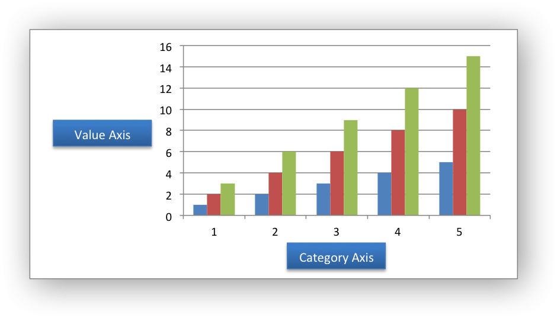

# node-Python生成excel报表

## python-shell运行

**原理:** node.js和python通过**终端**来交互

node 通过开启子进程,传送数据,数据是sys.stdout.python通过sys.stdin读取数据

`Node`提供了 `child_process` 模块来创建子进程，方法有：

- `spawn`-`child_process.spawn`使用指定的命令行参数创建进程。

### 运行py文件,无数据传输

- 运行test.js文件,就会看到有txt文件生成, 说明运行了helloword.py文件

- js引用py文件时,注意文件引用的位置.即使在同一目录下,也要写全python与库的相对路径

   

```python
# helloword.py
def text_create(name, msg):
    desktop_path = "./runPy_withoutData/"  # 新创建的txt文件的存放路径
    full_path = desktop_path + name + '.txt'  # 也可以创建一个.doc的word文档
    file = open(full_path, 'w+')
 file.write(msg)   #msg也就是下面的Hello world!
    # file.close()
 
text_create('txtFile', 'Hello world!')
print('hello word')
```

```js
// test.js
const {PythonShell} = require('python-shell')

PythonShell.run('./runPy_withoutData/helloword.py', null, function (err) {
  if (err) throw err;
  console.log('finished');
});
```

### 运行py文件,传入text数据

- 运行test.js,生成test.txt文件

   - shell输入的数据是字符串形式,数组的第一个是文件位置,第二个才开始数组数据
   
   ```python
   print(sys.argv) 
   # "['runPy_withData\\\\test.py', 'value1', 'value2', 'value3']"
   # 系统输入数据为 字符串形式
   ```

```python
# test.py
import sys

def text_create(name, msg):
    desktop_path = "./runPy_withData/"  # 新创建的txt文件的存放路径
    full_path = desktop_path + name + '.txt'  # 也可以创建一个.doc的word文档
    file = open(full_path, 'a')
    file.write(msg+"\n")   #msg输入文档的值
    file.close()
 
text_create('test', sys.argv[1])
text_create('test', sys.argv[2])
text_create('test', sys.argv[3])
print(sys.argv[1])
print(sys.argv[2])
print(sys.argv[3])
```

```js
//test.js
const {PythonShell} = require('python-shell')

let options = {
  mode: 'text',  // 数据格式:text/json/binary
  pythonPath: 'python', // python.exe地址 默认: "python"
  pythonOptions: ['-u'], // 实时获取打印结果
  args: ['value1', 'value2', 'value3']
};

PythonShell.run('./runPy_withData/test.py', options, function (err, results) {
  if (err) throw err;
  console.log('results: %j', results);  // results数组是python文件中多个print结果
});
```

### node与python互相传值

- **send**: 通过stdin向Python脚本发送消息

-  **on** : 监听, 收到了从Python脚本发送的消息（一个简单的“ print”语句）

-  **end** : 结束输入流并允许进程退出

demo示例:

```js
// test.js
const {PythonShell} = require('python-shell');

// python文件位置
const pythonFolder = __dirname+'/python';

PythonShell.defaultOptions={
  scriptPath:pythonFolder
}
function sendText(){
    let pyshell = new PythonShell('echo_text.py',{
      mode:'text'
    });
    // send发送数据
    pyshell.send('hello').send("word");
    // on 监听返回数据
    pyshell.on('message', function (message) {
      console.log(message);   // python的print结果
    });
    // end 结束 不可缺少
    pyshell.end(function (err,code,signal) {
      if (err) throw err;
      console.log('The exit code was: ' + code);
      console.log('The exit signal was: ' + signal);
      console.log('finished');
    });
}
sendText();
```

```python
# echo_text.py
import sys

for line in sys.stdin:
  print(line[:-1])

```

test.js运行结果:


## XlsxWriter文档阅读

**官方图表示例Chart Examples** :<https://xlsxwriter.readthedocs.io/chart_examples.html#chart-examples>

### 起步

Chart模块是在XlsxWriter中实现图表的模块的基类。 本节中的信息适用于所有可用的图表子类，例如“面积”，“条形”，“列”，“甜甜圈”，“线”，“饼图”，“散点图”，“库存”和“雷达”。

图表对象是通过Workbook add_chart（）方法创建的，其中指定了图表类型：

```python
chart = workbook.add_chart({'type': 'column'})
```

然后使用insert_chart（）Worksheet方法将其作为嵌入式图表插入到工作表中：

```python
worksheet.insert_chart('A7', chart)
```

或者可以使用set_chart（）Chartsheet方法在图表中设置它：

```python
chartsheet = workbook.add_chartsheet()
# ...
chartsheet.set_chart(chart)
```

以下是一个小型工作示例添加嵌入式图表：

```python
import xlsxwriter

workbook = xlsxwriter.Workbook('chart.xlsx')
worksheet = workbook.add_worksheet()

# Create a new Chart object.
chart = workbook.add_chart({'type': 'column'})

# Write some data to add to plot on the chart.
data = [
    [1, 2, 3, 4, 5],
    [2, 4, 6, 8, 10],
    [3, 6, 9, 12, 15],
]

worksheet.write_column('A1', data[0])
worksheet.write_column('B1', data[1])
worksheet.write_column('C1', data[2])

# Configure the chart. In simplest case we add one or more data series.
chart.add_series({'values': '=Sheet1!$A$1:$A$5'})
chart.add_series({'values': '=Sheet1!$B$1:$B$5'})
chart.add_series({'values': '=Sheet1!$C$1:$C$5'})

# Insert the chart into the worksheet.
worksheet.insert_chart('A7', chart)

workbook.close()
```

效果:


支持的图表类型为：

- area：创建一个Area（实线）样式表。
- bar：创建一个条形（转置直方图）图表。
- column：创建一个列样式（直方图）图表。
- line：创建线型图表。
- pie：创建一个饼图图表。
- 甜甜圈：创建一个甜甜圈样式图。
- 散点图：创建散点图样式表。
- stock：创建一个股票样式图。
- 雷达：创建雷达样式表。

某些图表类型也支持图表子类型：

```python
workbook.add_chart({'type': 'bar', 'subtype': 'stacked'})
```

### chart.add_series()

add_series（选项）
将数据系列添加到图表。

参数：options（dict）–图表系列选项的字典。

在Excel中，图表系列是一组信息，这些信息定义了要绘制哪些数据，例如值，轴标签和格式。

对于XlsxWriter图表对象，add_series（）方法用于设置系列的属性：

```python
chart.add_series({
    'categories': '=Sheet1!$A$1:$A$5',
    'values':     '=Sheet1!$B$1:$B$5',
    'line':       {'color': 'red'},
})

# 或使用值列表代替类别/值公式：
#     [sheetname, first_row, first_col, last_row, last_col]
chart.add_series({
    'categories': ['Sheet1', 0, 0, 4, 0],
    'values':     ['Sheet1', 0, 1, 4, 1],
    'line':       {'color': 'red'},
})
```

如上所示，类别和值可以采用诸如= Sheet1！$ A $ 2：$ A $ 7之类的范围公式，或者以编程方式生成范围时更有用的是具有零索引行/列值的列表。

### chart.set_x_axis()

```python
chart.set_title({'name':'results of sample analysis'})
chart.set_x_axis({'name':'test number'})  #设置x轴名称
chart.set_y_axis({'name':'Sample length(mm)'})
```

### values和categories

在大多数Excel图表中，X轴是类别轴，并且每个值都是均匀间隔和连续的。 Y轴是值轴，并且根据其值显示点：



这样，可以为值轴设置一些XlsxWriter轴属性，可以为类别轴设置一些属性，并且可以为两个轴都设置一些属性。 例如，可以为类别轴或值轴设置反向，而只能为值轴（和日期轴）设置最小值和最大值属性。 该文档指出了属性所适用的轴的类型。

对于**条形图**，类别和值轴是相反的：


**散点图**（而不是折线图）具有2个值轴：


### pie饼图示例

数据使用对象，然后用json序列化，传给python

 **pie.js**

```js
"use strict"
const {PythonShell} = require('python-shell');

// python文件位置
const pythonFolder = __dirname;

PythonShell.defaultOptions={
  scriptPath:pythonFolder
}
let data = {
  "headings":["category","values","Batch2"],
  "type":'pie',
  "title":'水果种类明细',
  "X_axis_name":"水果种类",
  "Y_axis_name":"水果占百分比",
  "categories":["apple", "banana", "pear"],
  "value1":[2, 4, 6],
  "value2": [3, 6, 9],
  "pos":['A1','A16']
  
};
let jsonData = JSON.stringify(data); // 序列化
function sendJson(){
    let pyshell = new PythonShell('pie.py',{
      mode:'text'
    });
    
    // send发送数据
    pyshell.send(jsonData);

    // on 监听返回数据
    pyshell.on('message', function (message) {
      console.log(message);   // python的print结果
    });
    // end 结束 不可缺少
    pyshell.end(function (err) {
      if (err) throw err;
      console.log('finished');
    });
}

sendJson()
```

**pie.py**

```python
# 簇状条形图
import sys,xlsxwriter,json

def createXls(data):
  workbook = xlsxwriter.Workbook('pie_chart.xlsx')
  worksheet = workbook.add_worksheet()
  bold = workbook.add_format({"bold":1})
  # 定义表头
  headings = data["headings"]

  # 写入数据
  worksheet.write_row(data["pos"][1],headings,bold)
  worksheet.write_column('A17',data["categories"]),
  worksheet.write_column('B17',data["value1"]),
  worksheet.write_column('C17',data["value2"]),

  # 创建图
  chart = workbook.add_chart({'type':data["type"]})

  # 配置第一个系列
  dataLen = len(data["value1"]) 
  chart.add_series({
    'name':'=Sheet1!$B$16',
    'categories':'=Sheet1!$A$17:$A$%s'%(dataLen+17-1),
    'values':'=Sheet1!$B$17:$B$%s,'%(dataLen+17-1)
  })

  # 添加标题和坐标题目
  chart.set_title({'name': data["title"]})  #中文标题会乱码
  chart.set_x_axis({'name':data["X_axis_name"]}) 
  chart.set_y_axis({'name':data["Y_axis_name"]})

  # # 将图插入表中
  worksheet.insert_chart(data["pos"][0],chart)

  workbook.close()
if __name__ == "__main__":
  data = sys.stdin.readline()[:-1]
  data = json.loads(data)
  print(data) #dict 字典
  createXls(data)
```


## node-python数据转换

因为python写excel 的数据Data是列表数据格式,它类似于多维数组

```js
let data = [
  [1, 2, 3, 4, 5],
  [2, 4, 6, 8, 10],
  [3, 6, 9, 12, 15],
]
```

1. **js文件**中,先将多维数组转为字符串,

2. 在py文件中通过`eval()`函数将字符串转为多维数组


node可以用对象类型的数据，对他进行json.stringify(obj)序列化，以字符串的形式传给py文件。然后python用json.loads还原成字典

## 传递数据的限制

stream 流,分为readable,writeable

管道是指流传输的机制,相当于水管

buff缓冲区相当于水池,充满水

传递数据的限制 一般 看buff缓冲区还是管道?

###  **缓冲(highWaterMark)**

`maxBuffer` 选项指定了 `stdout` 或 `stderr` 上允许的最大字节数。 如果超过这个值，则子进程会被终止。 这会影响多字节字符编码的输出，如 UTF-8 或 UTF-16。

**Writable**和 **Readable**流都会将数据存储到**内部的缓冲器（buffer）**中。这些缓冲器可以 通过相应的 writable._writableState.getBuffer() 或 readable._readableState.buffer 来获取。

缓冲器的大小取决于传递给流构造函数的 highWaterMark 选项。 对于普通的流， highWaterMark 选项指定了总共的字节数。对于工作在对象模式的流， highWaterMark 指定了对象的总数。


当可读流的实现调用 [stream.push(chunk)](https://www.cnblogs.com/#stream_readable_push_chunk_encoding) 方法时，数据被放到缓冲器中。如果流的消费者 没有调用 [stream.read()](https://www.cnblogs.com/#stream_readable_read_size) 方法， 这些数据会始终存在于内部队列中，直到被消费。

当内部可读缓冲器的大小达到 highWaterMark 指定的阈值时，流会暂停从底层资源读取数据，直到当前 缓冲器的数据被消费 (也就是说， 流会在内部停止调用 readable._read() 来填充可读缓冲器)。

可写流readable方法的特点[1]

1. 当我们创建了一个流时,会先读取highWaterMark的数据到当前流的缓存区中,等待着你去消费
2. 如果缓存区的数据被清空,会再次触发readable事件
3. readable事件每次触发时,都会对比一下你消费后剩下的数据是否小于highWaterMark,小于时,readable事件中会再次添加highWaterMark这么多的数据到缓存区中,等待你去消费

### 管道流

#### 读取写入流管道pipe

管道提供了一个输出流到输入流的机制。通常我们用于从一个流中获取数据并将数据传递到另外一个流中。

如上面的图片所示，我们把文件比作装水的桶，而水就是文件里的内容，我们用一根管子(pipe)连接两个桶使得水从一个桶流入另一个桶，这样就慢慢的实现了大文件的复制过程。

以下实例我们通过读取一个文件内容并将内容写入到另外一个文件中。

```js
ar fs = require("fs");
// 创建一个可读流
var readerStream = fs.createReadStream('input.txt');
// 创建一个可写流
var writerStream = fs.createWriteStream('output.txt');
// 管道读写操作
// 读取 input.txt 文件内容，并将内容写入到 output.txt 文件中
readerStream.pipe(writerStream);

console.log("程序执行完毕");
```
### node子进程性能

nodejs的子进程有一个属性：[3]

```js
// stdout、stderr 允许的最大输出大小（以 byte 为单位），如果超过了，子进程将被 kill 掉（发送 killSignal 值）。

'maxBuffer': 200 * 1024,//200k
```

因为子进程一直工作就会一直有log，当log输出达到这个配置的大小，就会被杀掉

### 子进程的流 [2]

每个子进程都具有标准的stdio流，开发者可以通过child.stdin、child.stdout和child.stderr操作stdio流。

在子进程中的stdio流关闭时，子进程会触发close事件。close事件并不完全等同于exist事件，主要在于子进程可以共享相同的stdio流，当一个子进程并不会导致流关闭。

由于流是事件的触发者，开发者可以监听子进程stdio流中的事件。
 与普通进程不同，在子进程中，stdout/stderr是可读流、stdin是可写流。从根本上讲，这些流在子进程与主进程的属性是相反的。最为重要的，通过监听data事件，程序可以获得命令的输出或执行命令时产生的异常信息。

由于子进程的stdin是可写流，开发者可以通过它向子进程写入数据。就像其它的可写流一样，pipe方法是使用可写流最简单的方式，程序可以将可读流写入到可写流中。由于主进程的stdin是可读流，因此可以实现主进程向子进程传数据。

开发者将进程的输出作为另一个进程的输入数据源，实现像linux命令那样的管道命令。例如开发者将find命令的stdout流，做为wc命令的输入数据源，实现计量文件夹中的文件数量

如果你需要使用shell句法，并且期望命令操作的文件比较小，使用shell句法是一项不错的选择。**注意，exec函数先将所要返回的数据缓存在内存中，然后返回。**

如果执行命令后得到的数据太大，spawn函数将是很不错的选择，因为使用spawn函数会标准的IO对象转换为流。

然而上面代码的性能受限于程序可以通过fork函数衍生的进程数量。但是当通过http请求时，主进程并不会阻塞。


### 参考文章 

[1] **node 中的可读 可写流**:

<https://blog.csdn.net/qq_40867137/article/details/80062548>

[2] **你应该知道的Node.js子进程**(清楚的介绍三个子进程,以及pipe管道)

<https://www.jianshu.com/p/f4995c8971a0>

- **nodejs子进程突然莫名其妙关闭**(因为maxBuffer有限制,200k) 

  <https://www.cnblogs.com/codedoge/p/9875580.html>

- **nodejs的stream模块**(流,包括输入和输出流):

   <https://www.jianshu.com/p/74b0821b70d6>

- **Node.js--Stream**:

    <https://cloud.tencent.com/developer/article/1385860>

- **nodejs 计算内存使用率:**(代码 计算内存使用率)

   <https://www.cnblogs.com/zh33gl/p/4886746.html>

- **Nodejs进阶：如何玩转子进程（child_process)**(说明子进程参数的maxBuffer):

  <https://segmentfault.com/a/1190000007735211>

- **Nodejs流学习系列之二: Writable Stream** (用子进程的实例,清楚的说明最高水位 和buffer 的区别)

  <https://zhuanlan.zhihu.com/p/91893338>

- **理解nodejs的stream和pipe机制**(解释stream流通过pipe方法控制流向)

   <https://blog.csdn.net/vieri_32/article/details/48376547/>
   
- **Node.js（stream流和buffer缓冲区）**

  <https://blog.csdn.net/weixin_45368324/article/details/105409219>


## 性能指标

要看开多少子进程

## 问题

- 调用Python-shell报错

  ```shell
  events.js:174
        throw er; // Unhandled 'error' event
        ^
  Error: spawn py ENOENT
  ```

  - -- 已解决,Python环境没装

  - 参考文章:python安装以及手动配置环境变量

    <https://blog.csdn.net/hpu_yly_bj/article/details/78918526>

- cmd输入python跳出应用程序

  - -- 已解决,关掉python应用,都说删除文件,但是文件显示无法删除,只能选择第二种方法

    

  - 参考文章:<https://blog.csdn.net/u013214212/article/details/102784937>
  
- python的数据类型?

  - dict(词典) 类似于js的对象

  - List（列表）列表是写在方括号 **[]** 之间、用逗号分隔开的元素列表。

  - 元组（tuple）与列表类似，不同之处在于元组的元素不能修改。元组写在小括号 **()** 里，元素之间用逗号隔开。

    ```python
    tuple = ( 'abcd', 786 , 2.23, 'runoob', 70.2  ) # 元祖
    list = [ 'abcd', 786 , 2.23, 'runoob', 70.2 ] #列表
    ```

- 查看python的数据类型

  - --已解决,使用type

    

    

- python 字符串变量替换

  - -- 已解决 通过字符串的拼接**str(age)** 或者%
  - 参考文章: <https://www.cnblogs.com/hyl2018/p/8970769.html>

- node多维数组转字符串

  - 需求:便于传送data text模式
  - 多维数组转字符串,需要写一个函数,不可以直接转. 字符串转多维数组,可以用eval解析
  - 参考文章:<https://blog.csdn.net/Hreticent/article/details/94391974>

- python 字符串转多维数组

  - 利用eval函数解析
  - eval: 解析字符串表达式,返回表达式的值
  - 参考文章: eval函数<https://www.runoob.com/python/python-func-eval.html>
  
- node调用python文件,输出中文乱码

  - 参考文章:<https://www.jianshu.com/p/aafc3cfdac2a>
  
- python 文件之间传数据

  - --暂时解决,想到方法是,保存文件来进行读取数据
  - 但是这个项目目前想用的是 将py作为模块导入
  - 参考文章 **Python模块化编程** :  <https://blog.csdn.net/qq_36119192/article/details/83619919>

- python 数字1,2,3转字符A,B,C

  - python-字母与ascii码的转换-利用数字转字母-利用字母转数字<https://blog.csdn.net/ifubing/article/details/94281187>

    ```python
    >>> chr(65)
    A
    >>> ord("A")
    65
    ```

  - 遍历成数组

    ```python
    >>> a=[i for i in range(1,16)]
    >>> a
    [1, 2, 3, 4, 5, 6, 7, 8, 9, 10, 11, 12, 13, 14, 15]
    >>>
    ```

    参考文章:【Python】如何向Python的列表里添加多个有顺序的数

    <https://zhidao.baidu.com/question/690336253114783484.html>

## 参考文章

- node与python数据交换child_process.exec

  <https://blog.csdn.net/qq_23057645/article/details/80967657>

- 在node中执行python脚本(子进程三个方法调用,代码很清楚)

  <https://www.jianshu.com/p/b1dc42c152ab>

- node获取当前路径的三种方法

  <https://www.cnblogs.com/founderswitch/p/10310203.html>

- python3 sys.stdout 方法，sys.exit方法，sys.stdin 方法

  <https://blog.csdn.net/CityzenOldwang/article/details/78384412?utm_source=blogxgwz0>


