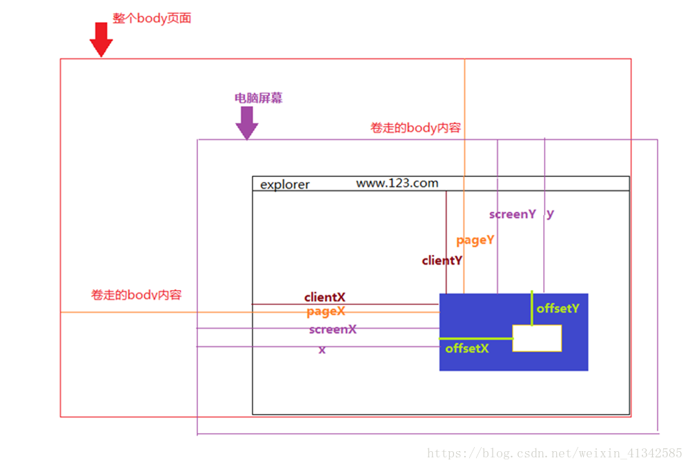

# 图片对比查看器

## 组件选择

**vue轮播插件vue-awesome-swiper**

官方效果展示:<https://github.surmon.me/vue-awesome-swiper/>

项目中使用 **:**< <https://www.cnblogs.com/instelly/p/12674612.html>>  示例如何使用,包括属性说明

​					<https://www.jianshu.com/p/c4925ef55eaa?utm_source=oschina-app> 结合项目

swiper的api官方说明:<https://www.swiper.com.cn/api/index.html> 可以搜索查看各种属性


**vue的PPT样式**

官方效果展示:<https://rockyxia.github.io/vue-superslide/#/demo/txtMarqueeTop>


**vue类似淘宝放大**： **vue-piczoom**

官方效果展示：<https://826327700.github.io/vue-piczoom/dist/>

官网github：<https://github.com/826327700/vue-piczoom>


## 遇到问题

- 安装了vue-awesome-swiper,报错,需要安装swiper
  
  - --已解决, `npm install swiper`
  
- `import 'swiper/css/swiper.css'` 在node_modules中引入失败
  
  - --已解决,因为版本不同,可以使用`  import 'swiper/swiper-bundle.css'` 引入swiper的样式
  
- swiper 分页器不起作用

  - --已解决,因为swiper的版本太高,有6开头了.所以按照GitHub上的package.json,按照版本安装了

- swiper的上下页失效,不能按,只能滑动

  - --已解决,同上,版本的问题

- swiper图片放数组无法显示,但是单个图片能显示

  

  - --已解决，因为src的动态路径错误，参考地址：<https://www.cnblogs.com/shirliey/p/9680820.html>
  - 在src中加入require表达式，并且下面的url数组直接的asset/

  

  
  
- 图片过大,让图片等比例缩小

  - 参照官网: <https://blog.csdn.net/qq_27628085/article/details/89852877>
  - 先让img的父元素 设定高度,然后让img 设置max-height 和max-width 为100%,height和width都为auto

  


- modal组件无法像图片一样放大,宽度100%,无法透明
  - --已解决,放弃了透明,该做成 像原来的软件一样
  - 用第二种方式做
  
- modal组件和swiper组件结合后，缩略图和图片无法联动
  - --已解决,将swiper单独抽出来,做baseSwiper
  - 因为nextClick 是在mouted的时候定义的,而这个混合组件刚开始的时候,swiper还没有DOM,只有点击modal后才会有dom生成
  
- 轮播图 无法放大

- 遮罩图 无法按Esc 退出 遮罩

  - -- 已解决,参照文章:<https://www.cnblogs.com/bbplayer/p/11933336.html>

  - 在mouted方法中,添加nextClick时间

    ```js
    mounted(){
      // 添加键盘Esc事件
      this.$nextTick(()=>{
        document.addEventListener('keyup',(e)=>{
          if(e.keyCode == 27){
            this.close(); // close是关闭遮罩的事件名
          }
        })
      })
    },
    ```

## 鼠标

vue中的鼠标事件,

```js
@click="click"     ////单击
@mousedown="down"       ////按下
@mouseup="up"          ////抬起

@dblclick="dblclick"      ////双击


@mousemove="move"     ////移动


@mouseleave="out"        ////离开
@mouseout ="out"         ////移出

@mouseenter="enter"     ////进入
@mouseover="enter"        ////在
```


## 参考文章

1. js实现图片在一个div中点击按钮放大缩小效果:

<https://blog.csdn.net/q383965374/article/details/100105950?utm_medium=distribute.pc_relevant.none-task-blog-BlogCommendFromMachineLearnPai2-2.channel_param&depth_1-utm_source=distribute.pc_relevant.none-task-blog-BlogCommendFromMachineLearnPai2-2.channel_param>

2. 鼠标事件以及clientX、offsetX、screenX、pageX、x的区别

<https://blog.csdn.net/weixin_41342585/article/details/80659736>



3. 一个基于vue的类似于图片拖放 鼠标为中心点缩放的单文件组件（背景图片，不是img标签）

   <https://blog.csdn.net/qq_36681092/article/details/82987869>

4. Vue中鼠标事件

   <https://www.jianshu.com/p/2975566c2c32>

5. 基于vue实现图片的放大，缩小，旋转，拖拽功能(图片，按钮放大缩小，可以拖拽)

   <https://blog.csdn.net/qq1246877006/article/details/103485439>