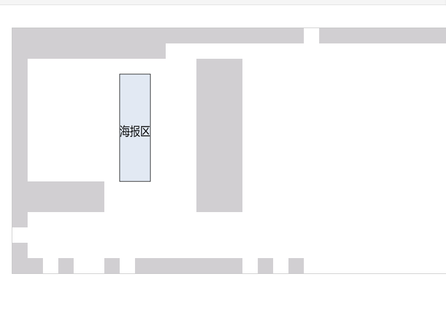

# 数据可视化

## 参考文章

- GitHub获奖作品,实时模拟部分.开翼

  <https://github.com/Kaiyiwing/Chinavis2019>

- 另一位大佬作品

  <https://github.com/seriousAA/ChinaVis2019-Challenge1>

- Canvas的API

  <https://developer.mozilla.org/zh-CN/docs/Web/API/CanvasRenderingContext2D/beginPath>

- AntV-蚂蚁数据可视化(类似于 Echarts)

  <https://antv.vision/zh>
  
- https://juejin.im/entry/6844903438174666760

## 问题

- canvas为什么设置宽高后，还要内联设置宽度和高度

  - -- 已解决，因为外面的宽高相当于一块画布，你对这个画布大小不满意，可以用内联样式进行缩放

  - 参考文章：

    Canvas设置width和height问题：<https://www.cnblogs.com/liuyuemozhu/p/7486361.html>

## 思路

### 背景图

- 先在canvas上画上灰色的部分

- 根据区域的划分,给不同的区域上色

尝试读取开翼大佬的代码思路.大佬GitHub地址 :<https://github.com/Kaiyiwing/Chinavis2019>

画布在index.html的设置

```html
<div>
  <canvas id="canvas" width="1800" height="960" 
          style="border: 3px solid rgb(170, 170, 170);width:900px;height:480px">         </canvas>
  <canvas id="canvas2" width="1800" height="960"
          style="border: 3px solid rgb(170, 170, 170);width:900px;height:480px">        </canvas>
 </div>
```


>  文件: draw_canvas.js

1. **系统开始**

- window.onload 

  当整个页面，包括样式、图片和其他资源被加载完成时，会触发 `window` 对象上的 `load` 事件。可以通过 `onload` 属性获取此事件。

- 获取到页面上的canvas画布

  ```jsx
   canvas = document.getElementById('canvas');
   ctx = canvas.getContext('2d');
  ```

  ```js
  window.onload = function () {
      canvas = document.getElementById('canvas');
      ctx = canvas.getContext('2d');
      canvas2 = document.getElementById('canvas2');
      ctx2 = canvas2.getContext('2d');
      以下代码省略 ...
  }
  ```

2. **画背景图**

- **CanvasRenderingContext2D.globalAlpha**

   是 Canvas 2D API 用来描述在canvas上绘图之前，设置图形和图片透明度的属性。 数值的范围从 0.0 （完全透明）到1.0 （完全不透明）。

- **CanvasRenderingContext2D.lineWidth** 

  设置线段厚度的属性（即线段的宽度）

- **ctx.strokeStyle**(下面都用ctx代替CanvasRenderingContext2D)

  描述画笔（绘制图形）颜色或者样式的属性。默认值是 `#000` (black)。

  边框的颜色

- **ctx.beginPath()**

  通过清空子路径列表开始一个新路径的方法。 当你想创建一个新的路径时，调用此方法。

- **ctx. fillStyle** 

  使用内部方式描述颜色和样式的属性。默认值是 `#000` （黑色）。

- **ctx.fillRect(x, y, width, height)**

   绘制填充矩形的方法。矩形的起点在 *(x, y)* 位置，矩形的尺寸是 *width* 和 *height* ，`fillStyle` 属性决定矩形的样式。

- 可以在菜鸟教程在线编辑,查看画图效果. 注意canvas的命名,菜鸟是c= document.getElementById('canvas');

  地址: <https://www.runoob.com/try/try.php?filename=tryhtml5_canvas_first>

  总之每次想画新的图后 都要设定自己想要的fillstyle画笔颜色,然后fillRect填充画框.看到不知道的API就去官网MDN找

- 36-48行画图运行效果

  

- 56-68 画方框 运行效果

  

- 60-65 添加文字和边框效果

  

```js
function drawmap1() {
    let pre_alpha = ctx.globalAlpha; // 设置背景图的透明度
    // ctx.globalAlpha = 0.3;

    let grid_cols=30; // x的总数,总列数
    let grid_rows=16;// y的总数,总行数
    let cell_height=canvas.height/grid_rows;//格子高度
    let cell_width=canvas.width/grid_cols; //格子宽度
    let cell_pix=cell_height;

    // ctx.fillStyle = '#F5F5F5';
    // ctx.fillRect(0, 0, cwidth, cheight);

    ctx.lineWidth=1; // 设置线段的宽度
    ctx.strokeStyle="#a0a0a0";// 画笔的颜色为灰色
    ctx.font = "36pt Arial";//画笔的字体
    //结束边框描绘
    ctx.beginPath();
    //准备画横线
    for(let col=0;col<=grid_cols;col++)
    {
        let x=col*cell_width;
        ctx.moveTo(x,0);
        ctx.lineTo(x,canvas.height);
    }
    //准备画竖线
    for(let row=0;row<=grid_rows;row++)
    {
        let y=row*cell_height;
        ctx.moveTo(0,y);
        ctx.lineTo(canvas.width,y);
    }

    ctx.fillStyle = "#d1cfd2";  //填充颜色 灰色
   // 下面画实体方框都是画灰色部分
    ctx.fillRect(0*cell_pix,0*cell_pix,30*cell_pix,1*cell_pix);
    ctx.fillRect(0*cell_pix,2*cell_pix,1*cell_pix,10*cell_pix);
    ctx.fillRect(29*cell_pix,1*cell_pix,1*cell_pix,15*cell_pix);
    ctx.fillRect(0*cell_pix*cell_pix,15*cell_pix,2*cell_pix,1*cell_pix);
    ctx.fillRect(3*cell_pix,15*cell_pix,1*cell_pix,1*cell_pix);
    ctx.fillRect(6*cell_pix,15*cell_pix,1*cell_pix,1*cell_pix);
    ctx.fillRect(8*cell_pix,15*cell_pix,7*cell_pix,1*cell_pix);
    ctx.fillRect(16*cell_pix,15*cell_pix,1*cell_pix,1*cell_pix);
    ctx.fillRect(18*cell_pix,15*cell_pix,1*cell_pix,1*cell_pix);
    ctx.fillRect(0*cell_pix,12*cell_pix,1*cell_pix,1*cell_pix);
    ctx.fillRect(0*cell_pix,14*cell_pix,1*cell_pix,1*cell_pix);
    ctx.fillRect(12*cell_pix,2*cell_pix,3*cell_pix,10*cell_pix);
    ctx.fillRect(1*cell_pix,10*cell_pix,5*cell_pix,2*cell_pix);
    ctx.fillRect(0*cell_pix,1*cell_pix,10*cell_pix,1*cell_pix);
		// 开VIP通道,颜色为透明
    ctx.fillStyle = "rgb(255,255,255)";
    ctx.fillRect(19*cell_pix,0*cell_pix,1*cell_pix,1*cell_pix);

   //海报区
  // 设置海报区内容透明度,填充颜色,填充方位
    ctx.globalAlpha = 0.3;
    ctx.fillStyle = "rgb(158,183,214)";
    ctx.fillRect(7*cell_pix,3*cell_pix,2*cell_pix,7*cell_pix);
  // 重设画笔的透明度,否则边框的透明度和上面0.3一样
    ctx.globalAlpha = pre_alpha;
    ctx.lineWidth=2;
    ctx.strokeStyle="rgb(0,0,0)";
    ctx.strokeRect(7*cell_pix,3*cell_pix,2*cell_pix,7*cell_pix);
    ctx.fillStyle = "rgb(1,1,1)";
    ctx.fillText("海报区",7*cell_pix,7*cell_pix,2*cell_pix);

    以下代码省略 ...
}
```

3. **调用drawmap1函数**

   画完背景后,记得调用该函数,进行绘图

### 单个人路径

一开始想要贪吃蛇的想法,但是读完贪吃蛇的代码,发现它的原理是蛇头的x,y和食物的x,y是否相等,相等,食物数组减掉这个,蛇头在结尾加一节,并又随机生成食物,所以无法采纳

采用画时钟的方法,调用官方API的方法

- moveTo(x,y)

  将绘图游标移动到（x,y），不画线

- lineTo(x,y)

  从上一点开始绘制一条直线，到(x,y)为止。

- stroke()

  使用 `stroke` 方法绘制一条路径,根据当前的画线样式，绘制当前或已经存在的路径的方法。

参考文章

- 贪吃蛇js实现

  <https://www.cnblogs.com/renyuqianxing/p/10439213.html>

- JavaScript基础——使用Canvas画图(代码很清晰,时钟)

  <https://blog.csdn.net/bboyjoe/article/details/50381006>

- 使用Canvas绘图（2）--绘制路径(单独讲时钟,代码感官不好)

  <https://blog.csdn.net/qq_39178993/article/details/81700001>

- canvas轨迹运动, 利用向量实现点匀速运动(人员运动轨迹)

  <https://blog.csdn.net/qq_38145702/article/details/91043520>

- canvas-绘制轨迹(简单的运动轨迹,不是动态完成的)

  <https://blog.csdn.net/xiaoyuyully/article/details/81346537>

### 进度条

参考文章

- js setTimeout和for循环搭配使用时变量的问题

  <https://blog.csdn.net/i_recluse/article/details/80632321>